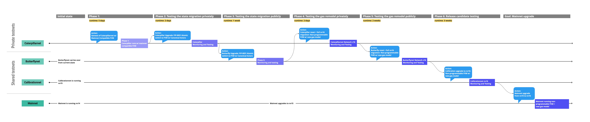

# Atomic switch to non-programmable FVM

<!-- START doctoc generated TOC please keep comment here to allow auto update -->
<!-- DON'T EDIT THIS SECTION, INSTEAD RE-RUN doctoc TO UPDATE -->


- [Simple Summary](#simple-summary)
- [Abstract](#abstract)
- [Change Motivation](#change-motivation)
- [Specification](#specification)
  - [Canonicalization of built-in actors](#canonicalization-of-built-in-actors)
  - [Adoption of content-addressed Code CIDs](#adoption-of-content-addressed-code-cids)
  - [Sourcing built-in actors Wasm bytecode](#sourcing-built-in-actors-wasm-bytecode)
  - [Upgrade procedure](#upgrade-procedure)
    - [State migration](#state-migration)
    - [VM atomic switch](#vm-atomic-switch)
    - [Message replacements](#message-replacements)
  - [Optional: Legacy VM removal](#optional-legacy-vm-removal)
- [Design Rationale](#design-rationale)
- [Backwards Compatibility](#backwards-compatibility)
  - [Structure of Code CIDs](#structure-of-code-cids)
  - [Actor evolution](#actor-evolution)
- [Test Plan](#test-plan)
- [Coordinated testnets](#coordinated-testnets)
  - [Per-implementation private testnets](#per-implementation-private-testnets)
  - [Cross-implementation shared testnets](#cross-implementation-shared-testnets)
- [Security Considerations](#security-considerations)
- [Incentive Considerations](#incentive-considerations)
- [Product Considerations](#product-considerations)
- [Implementation](#implementation)
- [Credits](#credits)
- [Footnotes](#footnotes)
- [Copyright](#copyright)

<!-- END doctoc generated TOC please keep comment here to allow auto update -->

## Simple Summary

This FIP proposes the atomic activation of a non-programmable version of the FVM
in Filecoin mainnet (and consequent deprecation of the legacy VM), along with a
state migration and the introduction of a state object for the system actor
(`f00`). It also establishes
[filecoin-project/builtin-actors](https://github.com/filecoin-project/builtin-actors)
as the canonical actor implemenetation for all clients to use.

## Abstract

This FIP proposes an **atomic switch** from the legacy VM to a
**non-programmable version of the Filecoin Virtual Machine**. A baseline
specification of the Filecoin Virtual Machine is provided in
[FIP-0030](https://github.com/filecoin-project/FIPs/blob/master/FIPS/fip-0030.md).

The switch involves a state tree migration to replace synthetic actor Code CIDs
with genuine content-addressed CID, computed over the respective Wasm bytecode.

We also introduce a state object for the system actor (up until now, stateless)
to hold static network configuration, starting with the registry of built-in
actor CodeCIDs.

Furthermore, we propose to canonicalize
[filecoin-project/builtin-actors](https://github.com/filecoin-project/builtin-actors)
as the standard built-in actor implementation.

This FIP introduces no functional actor behaviour changes; however, some exit
codes have been adjusted.

## Change Motivation

This step represents an important preparatory step in the trajectory towards
full on-chain user-programmability. As a side effect, it improves overall
network security by sandboxing execution and making it deterministic.

## Specification

### Canonicalization of built-in actors

We establish
[`filecoin-project/builtin-actors`](https://github.com/filecoin-project/builtin-actors)
[^1] as the canonical implementation of Filecoin built-in actors (aka as System
Actors in the [Filecoin
Spec](https://spec.filecoin.io/#section-systems.filecoin_vm.sysactors)), for all
client implementations to use.

This FIP introduces actors v8, a version fundamentally equivalent to actors v7
(nv15), but reliant on the FVM as its execution environment.

### Adoption of content-addressed Code CIDs

Every actor in the state tree specifies the CID of the executable code that
backs it (`CodeCID`), doubling as an actor type designator.

Prior to the Wasm-based FVM, there was no universal, portable execution bytecode
for the network to agree on. Therefore, the network used synthetic CIDs of the
following form:

```
CodeCid = Cid(IPLD_RAW_CODEC, Mh(IDENTITY, bytes('fil/$actor_version/$actor_type')))
```

Where:

- `IPLD_RAW_CODEC=0x55`
- `IDENTITY=0x00`

This FIP transitions to true content-addressed CIDs for every actor, computed
over their Wasm bytecode, in the following way:

```
CodeCid = Cid(IPLD_RAW_CODEC, Mh(BLAKE2B-256, $wasm_bytecode))
```

### Sourcing built-in actors Wasm bytecode

The build process of
[`filecoin-project/builtin-actors`](https://github.com/filecoin-project/builtin-actors)
produces a CARv1 archive that bundles all Wasm bytecode for all actors. It has
the following characteristics:

- The CARv1 header is single-rooted.
- The root CID resolves to a data structure that acts like a _Manifest_.
- The _Manifest_ type is a versioned struct, encoded as a CBOR tuple, defined as following:

  ```rust
  struct Manifest {
    version: u32
    data: CID
  }
  ```

  The _Manifest_ `data` for version 1 (the only version currently defined) is a CID linking
  to an IPLD `Vector<(String, CID)>`, ordered by explicit position, specified below.

  Each entry represents a built-in actor.

- Keys (`String`) range over an enum that identifies the actor type. These strings match parts
  of the current synthetic Code CIDs, and therefore can eventually facilitate translations if
  necessary.
    - `system` (index 0)
    - `init` (index 1)
    - `cron` (index 2)
    - `account` (index 3)
    - `storagepower` (index 4)
    - `storageminer` (index 5)
    - `storagemarket` (index 6)
    - `paymentchannel` (index 7)
    - `multisig` (index 8)
    - `reward` (index 9)
    - `verifiedregistry` (index 10)
- Values (`CID`) point to the Wasm bytecode of an actor as a single block.

Clients are free to ship the bundle as they see fit. The simplest approach is to
embed the CARv1 into the client binary, but downloading it on-demand is also an
option.

On node startup, the client is expected to:

1. Import the CARv1 contents into its state blockstore, and retain the
   _Manifest_ data link CID in memory.
2. Instruct the FVM to preload all built-in actors and precompile Wasm modules, by
   supplying the manifest data Cid.

Point (2) is critical to avoid Wasm compilation costs at the upgrade epoch. If
using [`filecoin-project/ref-fvm`], simply instantiating the `Machine` suppying
the CID of the _Manifest_ will trigger precompilation.

At this point, it is worthy to note that these block will be orphan, so
garbage-collecting mechanisms may prune them, and walking the tree will not
discover them (e.g. during snapshotting).

### Upgrade procedure

At the upgrade epoch `N`, clients should do the following:

1. Re-import the CARv1 bundle, to restore any bytecode blocks that may have been
   pruned.
2. Perform a state migration.
3. Atomically switch execution to the non-programmable FVM.
4. Perform any message replacements needed to adjust gas limits on pending
   messages.

Points 2-4 are developed further in the next sections.

#### State migration

At epoch `N`, prior to executing the tipset assembled at epoch `N-1`, clients
will run a migration over the state tree. The migration will perform two tasks:

1. Patch the CodeCID of every actor will be by their corresponding
   content-addressed CIDs, according to this lookup table:

  | Old value (synthetic CID)         | New value (content-addressed CID)                     |
  | --------------------------------- | ----------------------------------------------------- |
  | `fil/7/system`                    | TBD                                                   |
  | `fil/7/init`                      | TBD                                                   |
  | `fil/7/cron`                      | TBD                                                   |
  | `fil/7/account`                   | TBD                                                   |
  | `fil/7/storagepower`              | TBD                                                   |
  | `fil/7/storageminer`              | TBD                                                   |
  | `fil/7/storagemarket`             | TBD                                                   |
  | `fil/7/paymentchannel`            | TBD                                                   |
  | `fil/7/multisig`                  | TBD                                                   |
  | `fil/7/reward`                    | TBD                                                   |
  | `fil/7/verifiedregistry`          | TBD                                                   |


2. Create and initialize a new state object for the System Actor (`f00`), and
   link it from the actor's entry in the state tree:

  ```rust
  struct State {
    builtin_actor_registry: Cid, // Map<String, Cid>
  }
  ```

  The value of `builtin_actor_registry` is the CID of the _Manifest_ imported
  from the bundle.

#### VM atomic switch

Exactly at the upgrade epoch `N`, message execution will switch from the legacy
VM to the non-programmable FVM, for all system processes. That includes block
validation, block production, gas estimation, and message publishing. JSON-RPC
calls (like `StateComputeTipset` in the case of Lotus) will also begin using the
new VM runtime.

In practice, this implies that blocks assembled by producers in epoch `N-1` with
the ***outgoing VM*** will be executed with the ***incoming VM*** at epoch `N`.

Following one finality (900 epochs), the decommissioning of the legacy VM will
be considered final.

#### Message replacements

This FIP is likely to be bundled with FIP-0032 within the same network upgrade.
FIP-0032 introduces gas changes by revising the gas model to accurately account
for the execution costs under the FVM environment.

Pending messages awaiting in the mempool (whose gas limit was estimated with the
legacy VM) are unlikely to be included with the FVM, since gas usage rules will
have been altered.

To avoid disruption, clients must re-estimate gas for pending messages they are
tracking, and re-submit them through the message replacement mechanism.

### Optional: Legacy VM removal

After the upgrade epoch is over and one finality is attained, Filecoin clients
may choose to complete erase the current VM from their respective codebases.

Because the canonical actors codebase supports only actors v6+, in doing so they
will lose the ability to sync past portions of the chain. This may be an
undesirable loss of functionality depending on the desired UX of every client,
hence why this is entirely optional.

Alternatively, Filecoin clients may provide historical chain support by
preserving the legacy VM in their codebases but activating it only through
optional compilation (e.g. using Go build flags, or Rust Cargo features).

## Design Rationale

Design rationale was integrated in the specification section.

## Backwards Compatibility

### Structure of Code CIDs

Altering the structure of the Code CID of built-in actors may have visible
consequences for users:

1. When constructing user-instantiable actors directly though the Init Actor
   (i.e. multisig or payment channel actors), users will have to specify
   unpredictable content-addressed Code CIDs instead of predictable synthetic
   CIDs.
2. When querying an actor in the state tree (e.g. via the `StateGetActor`
   JSON-RPC API in Lotus), the `Code` field will no longer follow a structured
   pattern. This may break applications that parse Code CIDs.

A possible solution is to implement a JSON-RPC operation to query the CodeCID of
a built-in actor. However, the Filecoin community [was
polled](https://github.com/filecoin-project/FIPs/discussions/310) on this topic,
and no concerns were raised. Thus, no action is proposed at this time.

### Actor evolution

Pre-FVM, actor logic could change without its version being affected and,
therefore, without the associated Code CIDs changing in the state tree. This is
because the actor version (e.g. actors v6) represented the version of the ABI,
not of the actor's logic.

However, with truly content-addressed CIDs, _any_ and _every_ change in actor
logic will result in different bytecode. In practice this implies that state
tree migrations will be more frequent.

There is no action to take in this FIP, but it is worth noting the difference in
change management dynamics that this FIP will bring on.

## Test Plan

This section offers a comprehensive test plan for this FIP. It harnesses
multiple testing techniques to attain high confidence on this FIP across various
facets. Some test efforts actually target the prerequisite [FIP-0030 -
Introducing the Filecoin Virtual
Machine](https://github.com/filecoin-project/FIPs/blob/master/FIPS/fip-0030.md)
(which this FIP activates), and not direct aspects of this FIP.

- Test vectors for mainnet equivalence up until nv15, inclusive
  - FVM-level conformance: FVM implementations should directly pass the test
    vector corpus in
    [filecoin-project/fvm-test-vectors](https://github.com/filecoin-project/fvm-test-vectors),
    when vectors are fed at the Machine level.
  - Client-level conformance: Clients integrating the FVM should pass the test
    vector corpus in
    [filecoin-project/fvm-test-vectors](https://github.com/filecoin-project/fvm-test-vectors),
    when vectors are fed at the client level.

- Back-testing mainnet
  - Client implementations adopting the FVM should be capable of syncing mainnet
    the following mainnet chain range:
    - Start: epoch `1231620` (Chocolate upgrade, with activation of nv14 and
      actors v6)
    - End: most recent epoch following the OhSnap upgrade (nv15 / actors v7).
  - _Implementers’ note:_ This test can be performed by:
      1. Obtaining the minimal snapshot for epoch `1233360`, which includes the
         state trees and chain objects from 1802 epochs back (this number is the
         equivalent of 2 finalities + 2 epochs for buffer), thus covering the
         Chocolate upgrade at `1231620`. [Link to
         snapshot.](https://fil-chain-snapshots-fallback.s3.amazonaws.com/mainnet/minimal_finality_stateroots_1233360_2021-10-27_04-00-00.car)
      2. Loading it into the client.
      3. Rewinding the client’s chain head to the cited start epoch.

- Boosting Rust actors unit/integration test coverage
  - Compared to the outgoing canonical actors (Go specs-actors), Rust actors
    have poorer test coverage.
  - In order to not deteriorate the quality of software and enable the rapid
    development of changes, we must strengthen the test coverage of Rust actors
    to be on par with Go actors (at least), prior to appointing them as the
    canonical actors.

- Live syncing mainnet as validators (mainnet shadow tests)
  - Client implementations adopting the FVM should have no problem keeping up
    with the live chain as it advances. Validation times should be within
    pre-FVM orders of magnitude.
  - _Implementers’ note:_ this test can only be performed with a version of the
    FVM that does not implement this FIP, and therefore is equivalent to
    mainnet.

- Servicing block producers
  - Client implementations adopting the FVM should have no problems servicing
    block producers. This entails serving the_correct_ mining base upon winning
    a round.
  - _Implementers’ note:_ Verification may be performed in mainnet shadow tests,
    and/or in testnets (e.g. Calibrationnet).

- Mainnet upgrade drills
  - Client implementations should perform the upgrade against live mainnet
    state. The migration must not disrupt block production at the upgrade epoch.
  - _Implementers’ note:_ The
    [filecoin-project/ent](https://github.com/filecoin-project/ent) tool may
    come in handy.

- Coordinated testnets
  - Client implementations wishing to join the network upgrade deploying this
    FIP should join the coordinated testnets plan outlined below.

## Coordinated testnets

Testnets are a critical instrument to test and verify the behavior of
implementations under different network conditions, some of which mimic mainnet.

Below is a tentative testnet deployment plan proposed by the maintainers of the
reference implementation (Lotus). We encourage all implementations who have
confirmed their ability to join the mainnet upgrade that activates this FIP to
also join the testnet efforts.



### Per-implementation private testnets

All implementations should carry out private testing prior to joining the shared
testnets below.

For illustrative purposes, here is the test plan of the reference implementation
(Lotus + ref-fvm). Implementations may adopt a similar blueprint. This plan
relies on the creation of a private network for rapid iteration named
"Caterpillarnet", born with Lotus + mainnet-compatible FVM.

**Test Phase 1 (runtime: 5 days) => Caterpillarnet with mainnet-compatible FVM:**
- Objective: rapid continuous sampling of FVM behavior in a brand new network.
- Network parameters:
  - Block time: 5s.
  - Sector sizes: 512MiB, 32GiB, 64GiB.
  - Minimum number of reference implementation (Lotus) block producers/storage
    providers: 6.
  - Consensus: Expected Consensus with fake winning PoSt (in order to speed up
    block production).
- Butterflynet keeps running, accumulating state in preparation for the Test
  Phase 2 migration.

**Test Phase 2 (runtime: 2 days) => Caterpillarnet with FIP-0031 (this FIP):**
- Objective: validation of FIP-0031 upgrade procedure and basic migration.
- Caterpillarnet goes through the FIP-0031 upgrade (switching to canonical
  actors and adopting content-addressed CodeCIDs).

### Cross-implementation shared testnets

From here onwards, the test plan specifies collaborative testing phases.

**Test Phase 3 (runtime: 1 week) => Butterflynet with FIP-0031 (this FIP):**
- Objective: validation of FIP-0031 upgrade procedure, collecting observations
  such as time taken, physical state growth, IO workload, and more.
- Butterflynet goes through the FIP-0031 upgrade (switching to canonical actors
  and adopting content-addressed CodeCIDs).
- Community members are encouraged to join Butterflynet prior to the network
  upgrade happening.

**Test Phase 4 (runtime: 1 week) => Butterflynet with FIP-0031 and FIP-nnnn (gas
remodel):**
- Objective: validate gas model changes.
- Caterpillarnet and Butterflynet are reset and warped into the cited state.

**Test Phase 5 (runtime: 2 weeks) => Release candidate stabilization.**
- Butterflynet drills as we stabilize release candidates and release the final
  RC (1.16.0-rcN) for deployment on Calibrationnet.

**Test Phase 6 (runtime: 3 weeks) => Calibrationnet upgraded to final RC.**
- Ongoing testing and monitoring.

## Security Considerations

With the adoption of common codebases across all clients (ref-fvm and canonical
actors), any bugs in them will threaten the stability of the entire network.
These codebases also carry a novelty factor that should be mitigated via a
collection of hardening and auditing actions.

## Incentive Considerations

N/A.

## Product Considerations

Besides the change in Code CIDs explained in previous sections, there are no
other product considerations emerging from this FIP alone.

## Implementation

This FIP will be implemented in the reference Filecoin client implementation:
Lotus.

## Credits

Thanks to @jennijuju for graphic work.

## Copyright

Copyright and related rights waived via [CC0](https://creativecommons.org/publicdomain/zero/1.0/).

<!-- Footnotes -->

[^1]: Originally forked from the [Forest](https://github.com/ChainSafe/forest/)
client implementation.
