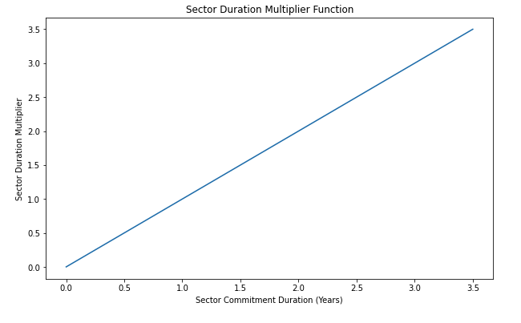

## Introduction 
The proposal below reflect the work of [CryptoEconLab (CEL)](https://cryptoeconlab.io) and its network of contributors to propose community-centered protocol improvements, while also supporting the health, stability, and prosperity of the Filecoin network's economy and its participants. The macroeconomic commentary [here](https://github.com/filecoin-project/FIPs/discussions/421#discussioncomment-3516156) can help provide some shared context for us amidst navigating this FIP, its potential inclusion in upcoming network upgrades, and, why many believe in strong net benefits to inclusion in the nv17 upgrade, pending community support and acceptance. 


## Simple Summary
- A Sector Duration Multiplier is introduced for all sectors, including Committed Capacity (CC) sectors and sectors containing storage deals.
- A longer sector will have a higher Quality Adjusted Power than a shorter sector, all things equal.
- The Duration Multiplier is multiplicative on the existing Quality Multiplier incentive ([Filecoin Plus](https://github.com/filecoin-project/FIPs/blob/master/FIPS/fip-0003.md) incentive). Filecoin Plus already offers up to a 10x multiplier for proving storage of data from verified clients. FIP-0036 introduces an independent Duration Multiplier up to 3.5x. Thus, the *maximum* multiplier available to any sector will increase from 10x to 35x. 
- Sectors with higher Quality Adjusted Power as a result of the Sector Duration Multiplier and Quality Multiplier will require higher initial pledge collateral.
- The minimum sector duration time will increase from 6 months to 1 year and the maximum sector duration will increase from 1.5 years to 3.5 years. This change to maximum sector expiration duration **will be implemented gradually**: we propose increasing the maximum duration by 6 months every week for 4 weeks, until the maximum duration of 3.5 years is available. The upper bound of [Deal Duration Bounds](https://github.com/filecoin-project/builtin-actors/blob/b5c101ab94f562ba43c1eca31bd1e73c6fc35794/actors/market/src/policy.rs#L33-L35) will increase accordingly as well, with the maximum deal duration increasing by 6 months every week for 4 weeks, until the maximum duration of 3.5 years is available. 
- CEL and the community will monitor the network and look to increase the maximum sector duration in a future FIP if network conditions merit, pending community-driven support for such measures.  
- The SectorInitialConsensusPledge multiplier will increase from 30% to 50%.
- This policy will apply at Sector Upgrade and Extension.

### Evolution of FIP-0036
This FIP seeks to improve the stability of storage commitments underlying the network and strengthen the Filecoin Economy amidst an uncertain macroeconomic climate, ultimately improving the stability and predictability of Storage Provider (SP) returns. 

Protocol Labs (PL) and CEL researchers investigated potential protocol improvements in April/May, and, began the [initial FIP discussion](https://github.com/filecoin-project/FIPs/discussions/386) in June. Initial parameter recommendations followed in the first [FIP Draft](https://github.com/filecoin-project/FIPs/commit/861601f7f607617d06bf9dc714d96ea2cb19344e?short_path=2026700#diff-2026700082539835fb781f31b11f9316c352b4f85501e43c2f114079abee5b5e), supported by [CEL modeling](https://www.notion.so/Duration-Changes-FIP-discussion-Analysis-Summary-735ce6685b7946f0a03fc13c3fe271fa). Following SP, core devs and community feedback, several parameters were adjusted, investigated, and discussed. Over the course of many months in which the community continuously supplied feedback, questions, and identified points of disagreement/concern, FIP-0036 now exists in its current form, supported by analysis and modeling from both CEL and its broader network.

## Problem Motivation
Currently, Storage Providers do not receive any additional compensation or incentive for committing longer term sectors (whether that be CC or storage deals) to the network. The protocol places equal value on 180 to 540 day sectors in terms of storage mining rewards. However, in making an upfront commitment to longer term sectors, Storage Providers take on additional operational risks (more can go wrong in a longer time period), and lock rewards for longer. Furthermore, in committing longer term sectors/deals, Storage Providers demonstrate their long-term commitment to the mission and growth of the Filecoin Network, and are more aligned with client preference for persistent storage. Therefore, the added value of longer-term sector commitments, coupled with the compounded operational/liquidity risks Storage Providers incur for committing longer term sectors should be compensated for in the form of increased rewards. 

From a macroeconomic perspective, incentives to seal for longer durations affect the circulating supply dynamics of the network, since collateral is locked for longer. As the network exists in its current state, the percentage of FIL locked on the network is more likely to decline. FIP-0036 introduces more favorable percentage locked value dynamics, while simultaneously ensuring that this increase in locking contributes to network utility, stable circulating supply dynamics, and SP profitability and optionality. 

Per the economic preference to increase the percentage value locked, we also propose adjusting the [Initial Consensus Pledge Mutliplier](https://spec.filecoin.io/systems/filecoin_mining/miner_collaterals/) to 50%. The intention is to create long-term aligned total value locked (TVL) dynamics to support stable and predictable conditions for Storage Provider (SP) returns. We further discuss the problem/change motivation, and explore impacts on SP profitability and network macroeconomics in the CEL analysis brief [here](https://pl-strflt.notion.site/Duration-Changes-FIP-discussion-Analysis-Summary-735ce6685b7946f0a03fc13c3fe271fa). 

The motivation to increase the minimum and maximum sector durations is decreased sector turnover and improved network stability. Given that the network expects to grow, having sectors that expire every 6 months means that the network potentially needs to find new sealing throughput to compensate for the loss of power from expiration. This hinders the network as it continues to scale. 

Another perspective is that block rewards are high now but exponentially decreasing, and these high early rewards should be used to incentivize participation that’s long-term aligned with the network. 6 months is not long-term. In particular it's short over the scale we need stability in the supply dynamics. Increasing the minimum duration from 6 months to 1 year doubles the minimum level of commitment, and smooths out locking dynamics by stretching inflow-outflow over a longer time period, all while impacting relatively few Storage Providers as sector durations for CC and FIL+ are both substantially above the minimum on average. 

Finally, the new maximum limit of 3.5 years gives SPs the option to express a long-term commitment and bullish view on the network which was previously not possible with the maximum sector expiration length of 540 days, and also receive commensurate rewards. 

## Specification

### Sector Duration Multiplier
The current sector quality multiplier follows from the spec [here](https://github.com/filecoin-project/specs/blob/ad8af4cd3d56890504cbfd23e5766a279cbfa014/content/systems/filecoin_mining/sector/sector-quality/_index.md). The notion of Sector Quality currently distinguishes between sectors with heuristics indicating the presence of valuable data.

Sector Quality Adjusted Power is a weighted average of the quality of its space and it is based on the size, duration and quality of its deals.

 Name                                | Description                                           |
| ----------------------------------- | ----------------------------------------------------- |
| QualityBaseMultiplier (QBM)         | Multiplier for power for storage without deals.       |
| DealWeightMultiplier (DWM)          | Multiplier for power for storage with deals.          |
| VerifiedDealWeightMultiplier (VDWM) | Multiplier for power for storage with verified deals. |

The formula for calculating Sector Quality Adjusted Power (or QAP, often referred to as power) makes use of the following factors:

- `dealSpaceTime`: sum of the `duration*size` of each deal
- `verifiedSpaceTime`: sum of the `duration*size` of each verified deal
- `baseSpaceTime` (spacetime without deals): `sectorSize*sectorDuration - dealSpaceTime - verifiedSpaceTime`

Based on these the average quality of a sector is:

$$avgQuality = \frac{baseSpaceTime \cdot QBM + dealSpaceTime \cdot DWM + verifiedSpaceTime \cdot VDWM}{sectorSize \cdot sectorDuration \cdot QBM}$$

The _Sector Quality Adjusted Power_ is:

$sectorQuality = avgQuality \cdot sectorSize$

**Proposed Protocol Change**: 

Introduce a multiplier based on sector duration
 Name                                | Description                                           |
| ----------------------------------- | ----------------------------------------------------- |
| QualityBaseMultiplier (QBM)         | Multiplier for power for storage without deals.       |
| DealWeightMultiplier (DWM)          | Multiplier for power for storage with deals.          |
| VerifiedDealWeightMultiplier (VDWM) | Multiplier for power for storage with verified deals. |
| **SectorDurationMultiplier (SDM)** | **Multiplier for power for storage based on promised sector duration** |

**This SectorDurationMultiplier function proposed is linear with slope 1**. See below for the function proposed. 


The rationale to select this linear slope 1 function is based on a principle that the selected parameters should maximize the effectiveness of the duration incentive, subject to SP’s collateral availability constraints, while taking into account micro and macroeconomic consequences with minimal added implementation complexity. Further analysis/simulation is shown in the analysis brief CEL prepared linked [here](https://pl-strflt.notion.site/Duration-FIP-revisions-7426f344685940409ac513a0ffcccc86) and above. 

Therefore, the new suggested *Sector Quality Adjusted Power* is: 

$sectorQuality = (avgQuality \cdot sectorSize) \cdot SDM$

### Change to Minimum Sector Commitment
We propose a minimum sector commitment of 1 year. This is a ~180-day increase from the current minimum of 6 months. This will not change the mechanics of sector pre-commit and proving; it will just adjust the minimum sector commitment lifetime to 1-year.

### Change to Maximum Sector Commitment
We propose a maximum sector commitment of 3.5 years. This is an increase from the current maximum sector commitment of 540 days. Note, the protocol currently sets a maximum sector lifetime to 5 years (i.e sectors can be extended up to 5 years). This FIP would not adjust that. CryptoEconLab had originally suggested increasing the maximum sector commitment duration to 5-years, in line with the maximum lifetime for a sector. The community (particularly many Storage Providers) expressed a desire that these changes roll out more gradually, be monitored, and then adjusted accordingly in subsequent network upgrades. Indeed, this desire for gradual/softer rollout informs the change to gradually increase the maximum sector duration over the course of one month. Further, if this policy were to enter the network, robust monitoring is in place to investigate storage onboarding, sectors/deal durations, Circulating Supply dynamics, and other key network health indicators. 

### Change to PreCommitDeposit 
With this FIP, sectors can get higher quality multipliers and receive higher expected rewards than currently possible. This has an impact on the value of the PreCommit Deposit (PCD). From the security point of view, PCD has to be large enough in order to consume the expected gain of a provider that is able to pass the PoRep phase with an invalid replica (i.e. gaining block rewards without storing). The recent FIP-0034 sets the PCD to 20 days of expected reward for a sector of quality 10 (max sector quality currently possible via FIL+ incentives). We now need to increase this to 20 days of expected reward for a sector of quality 35 (the new max quality) to maintain the status quo about PoRep security.

### Initial Pledge Calculation
The change we propose to status quo Initial Pledge Calculations is the change to the SectorInitialConsensusPledge calculation as detailed below. 

The protocol defines Sector Initial Pledge as:

$SectorInitialPledge = SectorInitialStoragePledge + SectorInitialConsensusPledge$

Currently, 

$SectorInitialConsensusPledge = 0.3 \cdot FILCirculatingSupply \cdot \frac{SectorQAP}{max(BaselineTarget, NetworkQAP)}$

We propose changing the calculation to a multiplier of 50%: 

$SectorInitialConsensusPledge = 0.5 \cdot FILCirculatingSupply \cdot \frac{SectorQAP}{max(BaselineTarget, NetworkQAP)}$

### Impact on Fault and Termination Fees
We currently propose no change to status quo Fault and Termination Fee calculations. Fees continue to be based on expected daily block rewards. In the future it may be valuable to re-examine the 90 day duration for the maximum termination fee. 

## Design Rationale

### Supporting Longer-Term Commitments
The current maximum commitment of 1.5 years limits the ability for SPs to make a long-term commitment to the network (or get rewarded for it). We expect that increasing the maximum allowable commitment to 3.5 years, while also introducing incentives to seal sectors for longer, can increase the stability of storage and predictability of rewards for SP’s. This is further discussed in the sections below.

### Incentivizing Longer Term Commitments 
Longer term commitments are incentivized by a rewards multiplier. The multiplier increases the amount of FIL expected to be won per sector per unit time based on the duration the sector is committed for. 

The proposed rewards multiplier is linear in duration. This means sectors recieve rewards at a rate linearly proportional to duration. 

Example:
- **Storage Provider A** commits sectors for 1 year that generate on aggregate **2 FIL/day** on average. By the end of the commitment, Storage Provider A expects to have received **730 FIL**.
- **Storage Provider B** agrees to store the same data, but makes a commitment to store it for 3 years. Since their commitment is three times as long, they receive **6 FIL/day** on average. At the end of the first year of their three year commitment they are expected to have received **2,190 FIL**.

The rationale is that operational burden and risk to Storage Providers increases with duration, and it is fair that they’re commensurately rewarded for this.

To maintain protocol incentives that are robust to consistent storage, the amount of collateral temporarily locked for the duration of the sector must also increase. Sector sealing gas costs do not increase with the multiplier. This means longer durations have higher capital efficiency, which further incentives longer commitments.

The form of the duration incentive multiplier is linear with slope 1. The factors behind this specific design choice to incentivize longer commitments are:
- **Simplicity**. Rewards proportionate to risk, with an understandable incentive mechanism that’s easy to reason about.
- **Sufficiency**. Sublinear may be inadequate to incentivize Storage Providers to accept the burden of risk longer commitments entail. 
- **Supply**. In terms of percentage of available supply, a slope of 1 is identified in simulations as the lowest level that sustains circa 50% percentage available supply locked (two-thirds higher than current value) with concurrent changes to the Initial Pledge calculation. This is important to incentivize long-term commitments as it supports a stable business environment..
- **Capital**. A more aggressive slope and longer maximum sector commitment was not chosen per community/Storage Provider feedback on the basis of initially limited capital availability, and long sector durations with high rewards multipliers, which require increased collateral, should be widely accessible.

### Refusing Shorter-Term Commitments 

Currently the minimum sector duration is six months. A new minimum duration of one year is proposed. The rationale is based on three factors: 
- **Stability**. A one year minimum smooths out locking dynamics by stretching inflow-outflow over a longer time period. 
- **Efficiency**. Waves of expiration on a six month basis have the potential to waste resources resealing sectors at twice the rate of one year minimum sectors.
- **Long-Term Mission Alignment**. Filecoin has an exponential rewards emission schedule, with high rewards that have been useful to bootstrap the network. As the network matures this perspective should be refined to better incentivize Storage Providers who are aligned with the long-term goals of the network. One year is only six months longer than the current minimum duration, but it shows much stronger commitment to the long-term principles and long-term success of the network. 

Furthermore, there is empirical evidence from the duration of sectors sealed that most Storage Providers support sectors greater than one year. Increasing the minimum from six months to one year will discourage only the most short-term-aligned Storage Providers.

### Improving Stability of Rewards 
A stable investing environment is needed to support long-term storage businesses. A high double-digit percentage return on pledge locked is not sufficient alone. To this end a sustained and substantial amount of locked supply is also needed. 

In reality, the percentage of available supply locked has been decreasing since September 2021. While current token emission rate is exponentially decreasing with time, the percentage of available supply locked is expected to continue to decline, at least until the linear vesting schedule completes, based on current locking inflow-outflows and network transaction fees.

This environment can be improved however. The first way to improve it is by increasing the 30% multiplier in the InitialConsensusPledge to 50%. This is a moderate increase that provides a solid long-term improvement in percentage of available supply locked. The second way is a corollary of the duration multiplier incentive. Longer sectors mean collateral is locked for longer. All else equal, at equilibrium this means the total amount of locked collateral is consistently higher. Simulations confirm both effects together can target a percentage of available supply locked that is sufficiently high and sustained to substantially improve the long-term storage business environment. See [Supplementary Information](https://www.notion.so/pl-strflt/Duration-Changes-FIP-discussion-Analysis-Summary-735ce6685b7946f0a03fc13c3fe271fa?d=711694bed594481eb26c1aa46a8e51ec#4c47f8071e7c4d35bfd242580b43efbe) for a detailed summary of the supporting simulation analysis, along with the open-sourced [Starboard ROI Calculator](https://observablehq.com/@starboard/sproi-fip-duration-v2) designed to aid Storage Providers in examining their risk/return profile under this FIP.

### Rebalancing SP Profitability 
Return on investment from pledged collateral provided by the storage rewards are currently substantial, with Filecoin-denominated returns in high double digits. Yet Filecoin-denominated returns are only part of what is needed to support successful long-term storage. 

Simulations indicate a better balance between current and future rewards can be achieved through the proposed changes. The proposals adjust the Filecoin-denominated minting-based returns to a more sustainable level in the immediate term, while the long-term trajectory is unchanged. This enables improving the percentage locked supply to stabilize the business environment for long-term network success. See [Supplementary Information](https://www.notion.so/pl-strflt/Duration-Changes-FIP-discussion-Analysis-Summary-735ce6685b7946f0a03fc13c3fe271fa?d=711694bed594481eb26c1aa46a8e51ec#4c47f8071e7c4d35bfd242580b43efbe) and the open-sourced [Starboard ROI Calculator](https://observablehq.com/@starboard/sproi-fip-duration-v2) for further details for percentage return on invested collaterals from mining reward.

### Impact on Initial Pledge 
The initial pledge per raw byte power will increase. This is by design. It intends to increase the percentage of available supply locked. 

The initial pledge per quality adjusted power, which is the relevant measure for Storage Provider’s return on pledge invested, may be marginally higher than current to begin with, but will decrease with time. See [Supplementary Information](https://www.notion.so/pl-strflt/Duration-Changes-FIP-discussion-Analysis-Summary-735ce6685b7946f0a03fc13c3fe271fa?d=711694bed594481eb26c1aa46a8e51ec#4c47f8071e7c4d35bfd242580b43efbe) for plausible trajectories across different new average duration scenarios.

### Impact on Pre-Commit Deposit 
FIP-0034 sets the pre-commit deposit to a fixed value regardless of sector content. From a security point of view, PCD has to be large enough in order to cover the expected gain of a provider that is able to pass the PoRep phase with an invalid replica (i.e. gaining block rewards without storing). The recent FIP-0034 sets the PCD to 20 days of expected reward for a sector of quality 10 (max quality). We now need to increase this to 20 days of expected reward for a sector of quality 35 (the new max quality) to maintain the status quo about PoRep security.

As of end of August 2022, the calculations are approximately: 

```
EpochReward := 20.53 * 5 = 101.2 FIL
NetworkPower := 18.28 * 2^60 Bytes
CirculatingSupply := 348.8 * 10^6 FIL

// Sector quality = 1
StoragePledge := 0.0095 FIL
ConsensusPledge := 0.2843 FIL
PreCommitDeposit := 35 * StoragePledge = 0.3325 FIL
InitialPledge := StoragePledge + ConsensusPledge = 0.2938 FIL

// Sector quality = 35 (values are approx 35x greater than a sector of quality 1)
StoragePledge := 0.3325 FIL
ConsensusPledge := 9.9504 FIL
PreCommitDeposit := StoragePledge = 0.3325 FIL
InitialPledge := StoragePledge + ConsensusPledge = 10.2828 FIL 
```
Per the change proposed by the FIP, the ConsensusPledge is calculated as:
- $SectorInitialConsensusPledge = 0.5 \cdot FILCirculatingSupply \cdot \frac{SectorQAP}{max(BaselineTarget, NetworkQAP)}$

Given that this FIP **caps max sector duration at 3.5 years**, and, therefore, caps the maximum QAP multiplier to **35x**, in most cases, we expect PCD to be less than or equal to the initial pledge for a sector, which means that Storage Providers will have to lock at least this much anyway by the time the sector is proven. We expect this relationship to continue to hold, as FIL supply expands over time with long-term vesting and emissions, and (2) the expected reward per sector falls over time with growth in network capacity and decaying block reward. CEL has produced an accompanying [tool](https://docs.google.com/spreadsheets/d/1mia7LyDSOh3lwAGhz7gTPUc65DQJbhHPyh013QpM4v4/edit#gid=0) with supporting documentation, allowing Storage Providers to estimate their expected FIL-on-FIL return given their projected failure rate to proveCommit sectors. 

## Backwards Compatibility
This policy would apply at Sector Extension and Upgrade for existing sectors. 

### Extensions for FIL+ and CC Sectors 
A point raised by the community concerns the relative ability for Committed Capacity (CC) sectors and sectors with Fil+ deals(verified storage deals) to extend their sectors upon this policy's implementation. In particular, many of these concerns centered on the ability for CC sectors to instantly extend to gain a potential maximum multiplier on their QAP. FIP-0036 now introduces a softer version of the policy, **capping the max sector duration commitment to 3.5 years** instead of the previously proposed 5-year time-span, and **gradually phasing in the increase to maximum commitment.**

This difference in the ability for sectors with Fil+ storage deals and CC sectors to extend was primarily a concern because of potential drops in block reward shares for specific SP profiles. An important note here: drops in block reward shares can always happen. Other SPs can always increase onboarding causing another group’s proportion to drop. The difference then primarily arises from the comparative difficulty in terms of time and effort of onboarding Fil+ compared to CC onboarding or extension. This is concretely mitigated by pledge per QAP dynamics. Though committing soon is good, waiting longer means entering when the pledge per QAP is lower.

To make it clear that the inequality of access is not what’s limiting the network, consider an example:
- Two SPs, A and B, each have 1PiB QAP today, 20TiB/day sealing throughput, and 10PiB worth of collateral. 
- SP A can extend CC sectors, and take 3y extension with 3x multiplier. They can quickly gain 3PiB QAP through extension, and a further 7PiB through onboarding over 350 days. 
- SP B has Fil+ deals. They can’t extend. But they can onboard new 3y deals at a rate of up to 3 * 10 * 20TiB/day = 600TiB of QAP/day.
- FIL+ ability to gain a multiplier on extending is not the limiting factor.

Differences between Fil+ and CC sectors are marginal from an equity of opportunity standpoint, especially given the phasing in of the policy, the cap on the maximum duration of 3.5 years, and the multiplicative nature of the Duration incentive on Fil+ ones. The primary limiting factor is new onboarding which is limited by the availability of capital flowing into the network. This is a limitation that extending sectors and onboarding new ones both share in common. Therefore, we shouldn’t strongly weigh differences in capacity to extend to be a sufficient source of inequality to reject the proposal. It is more important to promote a stable, long-term oriented network capable of attracting new capital investment. 

## Test Cases
N/A

## Security Considerations

### Risks of Faulty Proof-of-Replication (PoRep)
The existing 1.5 year sector duration limit in effect provides a built-in rotation mechanism that can be used to turn over power in the event we discover a flaw in PoRep. Increasing the maximum commitment to 3.5 years weakens this mechanism. [FIP-0047](https://github.com/filecoin-project/FIPs/blob/e498934732765161bbfbafad2a6303dbb7152592/FIPS/fip-0047.md) sets forth a policy to be adopted in case a flaw is discovered in the theory or implementation of proof-of-replication (note, that at this time we are **not** aware of any PoRep issues - FIP-0047 is purely proactive in nature) The policy is that, in case of a PoRep flaw, the RefreshProofExpiration method is disallowed for sectors sealed with the vulnerable code. In order to maintain power, a provider must seal a new replacement sector before each existing sector’s ProofExpriration epoch is reached. If not replaced, a sector with a proof expiration before its commitment expiration will incur a termination fee (for example, the current sector early-termination penalty).

### Risks to Consensus
The proposed rewards multiplier increases potential risk to consensus. The main consideration is how long it would take for a colluding consortium of Storage Providers to exceed threshold values of consensus power.

Analysis indicates a malicious consortium would need consistent access to high levels of FIL+, and near-exclusive access to the maximum rewards multiplier, for a substantial period of time, for a viable attack. It is worth noting therefore, that this is the scenario outlined below is an improbable "worst-case" scenario, relying on several unlikely "worst-case" events over sustained periods of time. 

*Example:*
The network currently has 18 EiB of quality adjusted power.  
Consider the scenario of 50 PiB/day onboarding, with 5% attributed to FIL+, and that this is sustained for several months. 

Now if the malicious consortium can acquire 50% of Fil+ deals and commit sectors for 3.5 years to gain the maximum duration multiplier, and all other storage power maintains the lowest possible duration sectors of 1 year, then in a single day, the adversarial colluding group is expected to gain 0.3% of consensus power. This follows from:

```
1. advPower = advFILplusPct * FILplusMultiplier * durationMultiplier * powerOnboarding * FILplusPct
2. advPower =  0.5 * 10 * (1 * 3.5) * 50 * 0.05 = 43.75
```
where `advFILplusPct` is the fraction of FILplus deals available that are acquired by the adversary, `FILplusMultiplier` is the 10x FIL+ power multiplier, `durationMultiplier` is the maximum 5 year duration multiplier (5 * 1), `powerOnboarding` is the byte power onboarded, and `FILplusPct` is the fraction of the power that is FIL+.

```
3. honestPower = 0.5 * 10 * (1 * 1) * 50 * 0.05 + 1 * (1 * 1) * 50 * 0.95 = 60
4. advPowerDailyPctGain = advPower/(18*1024 + honestPower) 
5. advPowerDailyPctGain = 0.2%
```
If this scenario is maintained, the adversarial group is expected to exceed 33% of consensus power within 140 days. 

Factors that mitigate this risk are that it’s unlikely a single group could achieve 50% of FIL+ power consistently, and unlikely that the adversarial group exclusively takes up the longer duration sectors with enhanced power multipliers. 

A limitation is that the above calculation assumes the malicious party is starting from 0% of consensus power. If they already control 10%, time to 33% is reduced to approximately 100 days.  

### Rollout Shock
Initial iterations of this FIP suggested a potential maximum 10x multiplier on CC sectors of maximum duration. This could create a rollout shock if SPs race to extend their commitments and gain a further 10x multiplier. The new proposed iteration of the policy **gradually phases in a maximum CC multiplier of 3.5x** This is, in part, due to the preference to *gradually* introduce changes to the network, monitor the impacts, and then strengthen/adjust policy in subsequent upgrades, mitigating risks of immediate network changes.

## Product & Incentive Considerations
As discussed in the problem motivation section, this FIP introduces incentives to further align the cryptoeconomic schema of the Filecoin Network with intended goals of the network to provide useful and reliable storage. We introduce the idea that longer term sectors represent a long-term investment and commitment to the Filecoin ecosystem, and therefore should be rewarded proportionally with greater block reward shares.

Note, we also introduce the possibility for Storage Providers to receive additional multipliers from committing CC for longer. Even this has added value insofar as it represents a commitment to the ecosystem long term that should be rewarded. 

From a product perspective, we see strong support for a network more aligned with longer-term stable storage. From a recent (< 3 week old) snapshot of all LDN applications, the responses fall into the buckets below. Almost half (47%) of all applicants want long-term or "permanent" storage.

| Period | Count | Percentage |
| :---: | :---: | :---: |
| 1 to 1.5+ years | 56 | 22% |
| 2+ years | 22 | 9% |
| 3+ years | 40 | 16% |
| 5+ years | 15 | 6% |
| Long-term/Permanent | 120 | 47% |

We recognize that this proposal may not align with a small fraction of SP’s who exclusively prefer shorter commitments to the network, but contend that from an ecosystem perspective, this policy on aggregate makes most participants better off. Note, regular deals can still be accepted for less than sector duration, so there should be minimal loss to flexibility for onboarding clients. 

For smaller SP’s, introducing this policy could help improve their competitiveness and ability to capture network block rewards, Under this proposal, returns on tokens put up as collateral scale linearly for all SP’s (regardless of size), whereas only larger ones are able to take advantage of economies of scale for hardware. This proposal, if anything, should benefit smaller SP’s because they can still get rewards boost/multipliers without prohibitively expensive hardware costs, and termination risks associated with FIL+ data.

## Implementation
TBD 
