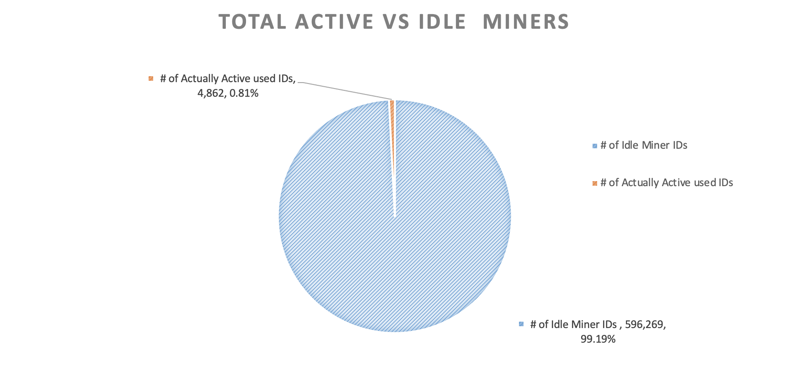
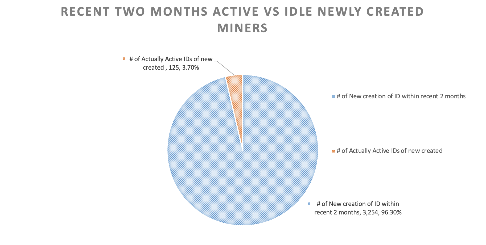

# FIP-0077: Add Cost Opportunity For New Miner Creation

## Simple Summary

This proposal implements a deposit requirement for creating new miner actors to prevent unnecessary miner ID creation and potential network spam attacks.

## Abstract

By requiring a deposit when creating a new miner actor, this proposal addresses three key issues:

1. Reduces the network chain storage burden caused by inactive miner actors
2. Decreases resource waste and potential gas cost increases resulting from unused miner actors
3. Mitigates the risk of network congestion attacks where an attacker creates numerous low-cost miner actors

The deposit is calculated based on 10% of the initial pledge required for 10 TiB of storage capacity, and is vested over 180 days. This introduces an opportunity cost that discourages frivolous miner creation while allowing legitimate storage providers to recover their deposit over time.

## Change Motivation

In March 2021, the Filecoin network a [experienced spam attack](https://github.com/filecoin-project/FIPs/discussions/780#discussioncomment-6787043) where thousands of `CreateMiner` messages were sent at minimal cost. This resulted in increased base fees, congestion in the message pool, and reduced chain performance.

As of August 2023, statistics from FilScan showed that out of 601,131 total miner IDs, only 4,862 (0.8%) were actively being used. The trend of creating but not using miner IDs has continued, with only 3.7% of newly created miner IDs being activated in the two months prior to that analysis.

Many users create multiple miner IDs to secure preferred IDs or favorable deadline schedules, consuming network resources without contributing value. Moreover, the absence of creation costs exposes the network to potential spam attacks that could cause congestion and disrupt important messages like WindowPoSt submissions from landing on-chain.

## Specification

The proposal requires a deposit when creating a new miner actor:

1. **Deposit Amount Calculation:**
   - The deposit is based on 10% of the initial pledge required for storing 10 TiB (defined by `MINIMUM_CONSENSUS_POWER` constant)
   - This amount is calculated using `StateMinerInitialPledgeCollateral`, which considers the current network economics
   - As of March 2024, this amounts to approximately 6 FIL (10 TiB * 0.1958 FIL/32 GiB * 10%)

2. **Vesting Schedule:**
   - The deposited funds are locked in the miner actor's vesting table
   - The funds vest linearly over 180 days, similar to block rewards
   - This creates an opportunity cost while ensuring the funds are eventually returned to the storage provider

3. **Implementation Behavior:**
   - If insufficient funds are provided, the CreateMiner operation fails with an "insufficient funds" error
   - If excess funds are provided, the required amount is locked and the remainder is available in the miner's balance
   - The deposit is processed using the existing vesting mechanism rather than creating a new mechanism

## Design Rationale

The design leverages the existing vesting mechanisms to minimize implementation complexity while creating sufficient economic friction to prevent abuse. By requiring a deposit that vests over time:

1. Users must evaluate whether a new miner ID justifies the opportunity cost of having funds locked for 180 days
2. The more miner actors a user creates, the more funds they need to lock, increasing the opportunity cost
3. The deposit is high enough to prevent spam attacks but low enough not to be prohibitive for legitimate storage providers
4. Using the vesting mechanism rather than burning funds ensures that legitimate providers eventually recover their deposit

This approach aligns incentives by encouraging the creation of miner actors only when they will be actively used, while not permanently removing capital from storage providers.

## Backwards Compatibility

This change is not backwards compatible as it introduces a new requirement for creating miner actors. However, it does not affect existing miner actors or their operations.

The deposit requirement applies to all new miner creations, including those for committed capacity (CC) sectors. While this creates an additional barrier to entry, the cost is relatively moderate compared to the hardware and operational investments needed to run a storage provider. Since the funds eventually vest back to the provider, this represents an opportunity cost rather than a capital cost.

## Test Cases

Test cases have been implemented to verify:
- Miner creation succeeds when sufficient balance is provided
- Miner creation fails with insufficient balance
- The deposit is correctly added to the vesting table
- The deposit vests over the correct period
- Tests have been updated to accommodate the new parameter in MinerConstructorParams

## Implementation

This proposal has been implemented in the following pull request to builtin-actors: https://github.com/filecoin-project/builtin-actors/pull/1398

The implementation:
1. Adds a `network_qap` parameter to MinerConstructorParams to calculate the deposit
2. Creates a new `calculate_create_miner_deposit` function that determines the required deposit
3. Locks the deposit in the miner's vesting table during construction
4. Updates tests to accommodate the new behavior

## Security Considerations

This proposal improves network security by preventing spam attacks that could congest the network through mass miner creation. The implementation uses existing, well-tested mechanisms for handling vesting funds, minimizing the risk of introducing new vulnerabilities.

## Incentive Considerations

The proposal creates incentive alignment by:
1. Discouraging the creation of miner actors that won't be used
2. Creating an economic cost for potential attackers
3. Encouraging storage providers to reuse existing miner IDs rather than creating new ones
4. Not permanently removing capital from legitimate providers, as the deposit eventually vests

The deposit amount is calibrated to be significant enough to deter spam but modest enough that it won't prevent legitimate storage providers from joining the network.

## Product Considerations

From a product perspective, this change:
1. Reduces the creation of unused miner IDs, leading to a cleaner and more efficient network
2. Makes the network more resistant to spam attacks
3. Encourages on-demand account creation, where new miner actors are created only when needed
4. Discourages practices like creating multiple miners to get preferred IDs or deadline schedules

While this creates an additional step for new storage providers, the deposit eventually returns to them through the vesting mechanism, making it an opportunity cost rather than a permanent expense.

## Copyright

Copyright and related rights waived via [CC0](https://creativecommons.org/publicdomain/zero/1.0/).
