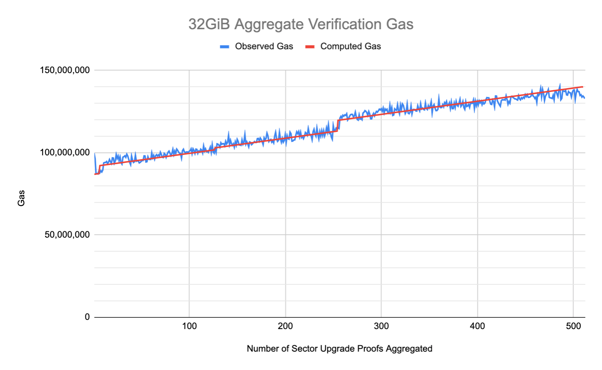
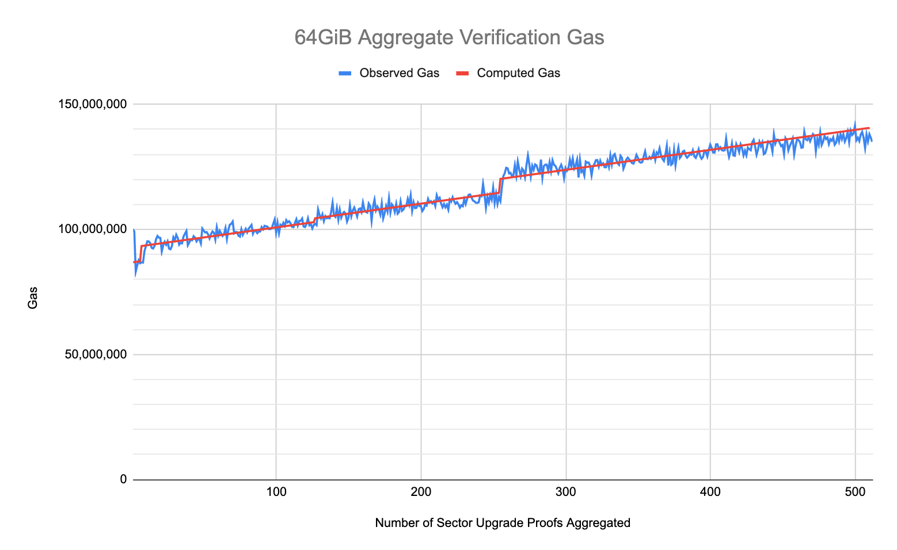

## Simple Summary

This FIP proposes adding functionality for submitting several sector update proofs (as a
single Groth16 aggregate proof) using a single message, thus allowing many sectors to have
data updates in them activated simultaneously when the message is posted to the chain.

## Abstract

This proposal adds a way for miners to post multiple `ProveReplicaUpdates`s at once, in the form of
an aggregate Groth16 proof, using the `ProveReplicaUpdates2` method described in
[FIP-0076](https://github.com/filecoin-project/FIPs/blob/master/FIPS/fip-0076.md). The miner actor
method `ProveReplicaUpdates2` currently provisions an interface for, but does not implement, aggregate
sector update proof verification. This FIP proposes `ProveReplicaUpdates2` be modified to handle aggregate
proof verification.

## Change Motivation

Adding aggregate proof verification to the method `ProveReplicaUpdates2` amortizes some of the costs associated with
multiple sector updates, in the same way that [FIP-0013](https://github.com/filecoin-project/FIPs/blob/master/FIPS/fip-0013.md)'s
`ProveCommitAggregate` method has done for sealing proofs. While `ProveReplicaUpdate` is not one of the most frequent message
on chain, it is believed to be too expensive to use in its current form.

Aggregate proof verification allows for more sector update commitments to be proven in
less time which will reduce the processing time, and thus the gas cost, per proven
sector update. Verification time and size of an aggregated proof scales logarithmically
with the number of proofs included in the aggregate proof.

## Specification

### Actor changes

This change reuses the miner actor method `ProveReplicaUpdates2` (method 34) introduced in
[FIP-0076](https://github.com/filecoin-project/FIPs/blob/master/FIPS/fip-0076.md) and the method's
existing call parameters `ProveReplicaUpdates2Params`. The `ProveReplicaUpdates2` method and parameters already
provision for aggregate proof handling, however the method currently
[returns an error](https://github.com/filecoin-project/builtin-actors/blob/5b2e99b1bb355e73082d80ce5e25a86725d34363/actors/miner/src/lib.rs#L1116-L1122)
when an aggregate replica update proof is provided for verification. This FIP proposes replacing the
method's current aggregate proof handling (i.e. an error) with proper aggregate proof verification
functionality.

The following shows how the method's existing call parameters `ProveReplicaUpdates2Params`
accommodate for aggregate proof verification.

```rust
pub struct ProveReplicaUpdates2Params {
    // A list of identifiers for the sector's updated in the aggregate proof.
    pub sector_updates: Vec<SectorUpdateManifest>,
    // An empty vector.
    pub sector_proofs: Vec<RawBytes>,
    // A non-empty vector of bytes representing the aggregate replica update proof (for all updated sectors).
    pub aggregate_proof: RawBytes,
    // The replica update proof type; this is the same for all sector updates included in the aggregate proof.
    pub update_proofs_type: RegisteredUpdateProof,
    // The aggregate proof type.
    pub aggregate_proof_type: RegisteredAggregateProof,
    // Whether to abort if any sector update activation fails.
    pub require_activation_success: bool,
    // Whether to abort if any notification returns a non-zero exit code.
    pub require_notification_success: bool,
}
```

#### Scale and limits

The minimum of number of Sector Update proofs that may be aggregated is 3, and the maximum is 512.

#### Gas calculations

Similar to existing PoRep gas charges, gas values are determined from empirical measurements of aggregate proof validation on representative hardware.

Aggregate proofs must be generated for a power of two number of Groth16 proofs; because each Sector Update proof contains sixteen Groth16 proofs, aggregated Sector Update proofs are padded to contain the nearest power of two number of Groth16 proofs. See the "Proof scheme changes" section in [FIP-0013](https://github.com/filecoin-project/FIPs/blob/master/FIPS/fip-0013.md#proof-scheme-changes) for a discussion on aggregate proof padding.

The gas cost of aggregate proof verification grows both linearly and step-wise in the number of Sector Update proofs aggregated (counted prior to proof padding). The linear growth occurring for each Sector Update proof aggregated and the step-wise growth occurs when the number of Groth16 proofs aggregated exceeds a power of two.

The gas table below associates ranges of aggregated Sector Update proofs with their total step-wise gas cost. The total gas cost for verifying an aggregate proof of `n` Sector Update proofs is the sum of `n`'s linear and step-wise gas costs: `n * gas_per_proof + gas_table(n)`.

##### 32 GiB Gas Cost

Gas cost per Sector Update proof aggregated: 80,000 gas

Total step-wise gas cost for ranges of Sector Update proofs aggregated:

| SnapDeals Proofs | Groth16 Proofs |    Gas     |
|:----------------:|:--------------:|:----------:|
|        3-8       |     48-128     | 86,500,000 |
|       11-128     |    144-2048    | 91,300,000 |
|      129-256     |   2064-4096    | 92,500,000 |
|      257-512     |   4112-8192    | 99,000,000 |



##### 64 GiB Gas Cost

Gas cost per Sector Update proof aggregated: 80,000 gas

Total step-wise gas cost for ranges of Sector Update proofs aggregated:

| SnapDeals Proofs | Groth16 Proofs |    Gas     |
|:----------------:|:--------------:|:----------:|
|       3-8        |     48-128     | 86,500,000 |
|       9-128      |    144-2048    | 92,500,000 |
|     129-256      |   2064-4096    | 94,000,000 |
|     257-512      |   4112-8192    | 99,500,000 |



#### Batch Gas Charge

Currently, **GasUsed * BaseFee** is burned for every message. We can achieve the requirements described in [Incentive Considerations](https://github.com/filecoin-project/FIPs/blob/master/FIPS/fip-0013.md#incentive-considerations) by charging an additional proportional fee to an aggregated batch of proofs, and by balancing their gas costs with a minimum fee. The additional charge for each aggregate replica update proof (an aggregate Groth16 proof) is computed in the same manner as that for aggregate seal proofs; see FIP-0013's [Batch Gas Charge](https://github.com/filecoin-project/FIPs/blob/master/FIPS/fip-0013.md#batch-gas-charge) for further discussion.

```rust
func PayBatchGasCharge(numProofsBatched, BaseFee) {
    // Cryptoecon Params (need to be updated if verification benchmarks change)
    BatchDiscount = 1/20 unitless
    BatchBalancer = 5 nanoFIL
    SingleProofGasUsage = 36316136

    // Calculating BatchGasCharge
    numProofsBatched = <# of proofs in this batched operation>
    BatchGasFee = Max(BatchBalancer, BaseFee)
    BatchGasCharge = BatchGasFee * SingleProofGasUsage * numProofsBatched * BatchDiscount

    // Pay for the batch
    PayNetFee(BatchGasCharge) // this can be a msg.Send to f99. Does not affect BaseFee
    // normal gas for the verification computation is paid as usual (using & affecting BaseFee)
}
```

Implications and rough estimates for this function are described in [Batch Incentive Alignment](https://github.com/filecoin-project/FIPs/blob/master/FIPS/fip-0013.md#batch-incentive-alignment).

The `SingleProofGasUsage` estimate above is based on FVM's (value)[https://github.com/filecoin-project/ref-fvm/blob/4f2c73e96346cfa7364a51e133ffa906807df7c1/fvm/src/gas/price_list.rs#L193] for verifying a single replica update proof.

#### State Migrations

Neither changes to the state schema of any actors nor changes to the fields of existing actors are required to make this change. Therefore a state migration is not needed.


### Proof scheme changes

This FIP does not introduce new proof scheme changes, but utilizes those changes introduced in [FIP-0013](https://github.com/filecoin-project/FIPs/blob/master/FIPS/fip-0013.md#proof-scheme-changes) for aggregate seal proofs.

#### Proofs API


##### Aggregation

The proofs aggregation procedure expects the following inputs:

```rust
pub fn aggregate_empty_sector_update_proofs(
    registered_proof: RegisteredEmptySectorUpdateProof,
    registered_aggregation: RegisteredAggregationProof,
    sector_update_proofs: &[EmptySectorUpdateProof],
    sector_update_inputs: &[SectorUpdateProofInputs],
) -> Result<AggregateSnarkProof>;
```

The `registered_aggregation` inputs is required to be
`RegisteredAggregationProof::SnarkPackV2` at this time, as
`RegisteredAggregationProof::SnarkPackV1` is not supported for this
method.

The `sector_update_inputs` are a slice of `struct`s logically appearing
like this in the rust language.

```rust
pub struct SectorUpdateProofInputs {
    pub comm_r_old: Commitment,
    pub comm_r_new: Commitment,
    pub comm_d_new: Commitment,
}
```

The fields within `struct SectorUpdateProofInputs` are:

The `comm_r_old` is the commitment to the sector's previous replica.
The `comm_r_new` is the commitment to the sector's current replica.
The `comm_d_new` is the commitment to the sector's current data.

Since the `sector_update_inputs` are a slice, they are ordered to
match the order of the `sector_update_proofs` slice provided.  However,
this does NOT mean that they are required to be vectors of the same
length.  For test sector sizes, they may end up being the same length
because they are proven in a single partition -- but for production
sector sizes, the partition count will not be one.  Instead, the
number of elements in the `sector_update_inputs` vector will be the
`partitions per sector update * the number of sector update proofs aggregated`.

**Requirements**: The scheme can only aggregate a power of two number of proofs
currently. Although there might be some ways to alleviate that requirement, we
currently pad the number of input proofs to match a power of two. Thanks to the
logarithmic nature of the scheme, performance is still very much acceptable.

Padding is currently _naive_ in the sense that if the passed in count
of Sector Update proofs aggregated is not a power of 2 (greater than 1), we pad the Sector Update proofs to the nearest power of two using a duplicate of the last Sector Update proof provided. The minimum number of Groth16 proofs that can be aggregated is 2, thus in the case where a single Groth16 proof is provided for aggregation, the single proof is duplicated in order to pad the number of Groth16 proofs to 2.

##### Verification

The proofs verification procedure expects the following inputs:

```rust
pub fn verify_aggregate_sector_update_proofs(
    registered_proof: RegisteredEmptySectorUpdateProof,
    registered_aggregation: RegisteredAggregationProof,
    aggregate_proof_bytes: AggregateSnarkProof,
    inputs: &[SectorUpdateProofInputs],
    sector_update_inputs: Vec<Vec<Fr>>,
    aggregate_version: groth16::aggregate::AggregateVersion,
) -> Result<bool>;
```

The `registered_aggregation` inputs is required to be
`RegisteredAggregationProof::SnarkPackV2` at this time, as
`RegisteredAggregationProof::SnarkPackV1` is not supported for this
method.

The `inputs` are an ordered list of `SectorUpdateProofInputs` (as
described above).

The `sector_update_inputs` are an ordered list of inputs which *must*
match the order of the `sector_update_inputs` passed into
`aggregate_empty_sector_update_proofs`, but in a flattened manner.
First, to retrieve the `sector_update_inputs` for a single sector, you
can call this:

```rust
pub fn get_sector_update_inputs(
    registered_proof: RegisteredEmptySectorUpdateProof,
    registered_aggregation: RegisteredAggregationProof,
    comm_r_old: Commitment,
    comm_r_new: Commitment,
    comm_d_new: Commitment,
) -> Result<Vec<Vec<Fr>>> {
```

As an example, if `aggregate_empty_sector_update_proofs` is called
with the `sector_update_inputs` of Sector 1 and Sector 2 (where that
order is important), we would want to compile the
`sector_update_inputs` for verification as follows (pseudo-code for
readability):

```rust
let sector_update_inputs: Vec<Vec<Fr>> = Vec::new();
sector_update_inputs.extend(get_sector_update_inputs(..., comm_r_old_sector_one, ...));
sector_update_inputs.extend(get_sector_update_inputs(..., comm_r_old_sector_two, ...));
```

What this example code does is flattens all of the individual proof
sector update inputs into a single list, while properly maintaining
the exact ordering matching the `sector_update_inputs` order going
into `aggregate_empty_sector_update_proofs`.  When compiled like this,
the `sector_update_inputs` will be in the exact format required for
the `verify_aggregate_sector_update_proofs` API call.

Similar to aggregation, padding for verification is currently also
_naive_. If the passed in count of proof input sets (while noting that
the inputs are a linear list of equally sized input sets) is not a
power of 2, we arbitrarily take the last set of inputs and duplicate
it until the count is the next power of 2.  Again, the single
exception is when the input count is 1.  In this case, we duplicate it
since the verification algorithm cannot work with a single proof or
input.


#### Proofs format 

This FIP uses the same aggregate proof format introduced in FIP-0013's [Proofs Format](https://github.com/filecoin-project/FIPs/blob/master/FIPS/fip-0013.md#proofs-format).

## Design Rationale

The existing `ProveReplicaUpdates` method (method 27) will not become redundant,
since aggregation of smaller batches may not be efficient in terms of
gas cost (proofs may be too big or too expensive to verify).  The method is
left intact to support smooth operation through the upgrade period.

### Failure handling

Aborting on any precondition failure is chosen for simplicity.

### Scale and limits

Each aggregated proof is bounded at 512 sector updates. The motivation
for the bound on aggregation size is as follows:

- to limit the impact of potentially mistaken or malicious behaviour.  
- to gradually increase the scalability, to have time to observe how the network
  is growing with this new method.
- to ensure the gas savings are equally accessible to small miners with a sealing rate as low as 1TB/day

A miner may submit multiple batches in a single epoch to grow faster.

## Backwards Compatibility

This FIP reuses the miner actor interface proposed and accepted in
[FIP-0076](https://github.com/filecoin-project/FIPs/blob/master/FIPS/fip-0076.md), however this FIP
does change the actor's currently implemented behavior (from erroring on aggregate proof
verification to proper handling of an aggregate proof), thus will require a network upgrade.

This proposal retains the existing non-batch `ProveReplicaUpdates` (method 27)
method, so mining operations need not change workflows due to this
proposal (but _should_ in order to enjoy the reduced gas costs).

## Test Cases

Test cases will accompany implementation. Suggested scenarios include:

TBD

## Security Considerations

All significant implementation changes carry risk.

The core cryptographic techniques come from the [Bunz et
al.](https://eprint.iacr.org/2019/1177.pdf) paper from 2019 with strong security
proofs.  Our protocol is a derivation of this paper that is able to use the
already existing powers of tau and with increased performance. The paper is also
accompanied by formal security proofs in the same framework as the original
paper. The trusted setup used is the Filecoin Powers of Tau and the ZCash Powers
of Tau: the full key is generated thanks to this
[tool](https://github.com/nikkolasg/taupipp). The cryptographic implementation
is being audited and a report will be made available soon.

It should be noted that all use of SnarkPack aggregation referenced is
limited to [SnarkPack
V2](https://github.com/filecoin-project/core-devs/blob/master/Network%20Upgrades/v16.md)
and not the initial implementation of SnarkPack.  SnarkPack V2 is the
only version of SnarkPack still used in the protocol today.

## Incentive Considerations

The cryptoeconomics of this FIP are similar to that of [FIP-0013](https://github.com/filecoin-project/FIPs/blob/master/FIPS/fip-0013.md#incentive-considerations).

 
## Implementation

* The cryptographic implementation for aggregate proving/verifying (i.e. SnarkPack) is currently located in the [`bellperson`](https://github.com/filecoin-project/bellperson/tree/feat-ipp2/src/groth16/aggregate) Rust crate.
* Integration between Lotus and crypto-land can be found in [rust-fil-proofs](https://github.com/filecoin-project/rust-fil-proofs/tree/supersnaps) and the FFI [here](TBD).
* Actors changes are in progress [here](https://github.com/filecoin-project/builtin-actors/blob/5b2e99b1bb355e73082d80ce5e25a86725d34363/actors/miner/src/lib.rs#L1116-L1122)
* Lotus integration putting everything together is in progress here: TBD

## Copyright

Copyright and related rights waived via [CC0](https://creativecommons.org/publicdomain/zero/1.0/).
