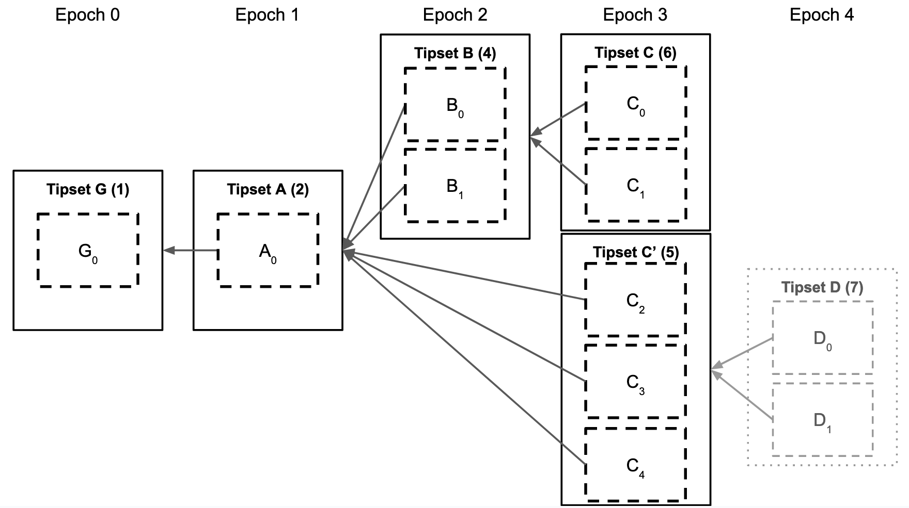
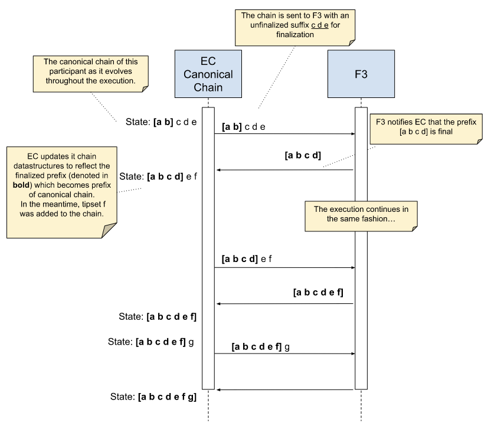
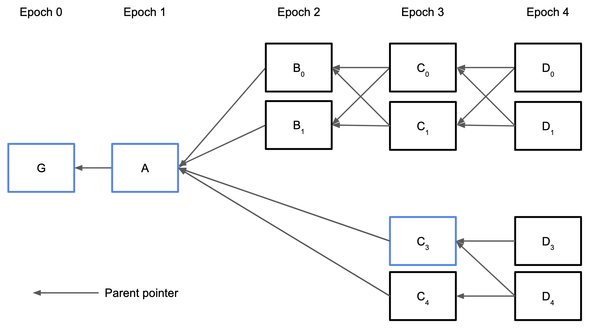

# Fast Finality in Filecoin (F3)

## Simple Summary

Filecoin clients currently consider blocks irreversible after 900 epochs, hindering applications requiring low latency. This FIP specifies Fast Finality in Filecoin (F3), extending the protocol with a new component that reduces finalization time from 7.5 hours to tens of seconds.


## Abstract

The current Filecoin consensus mechanism only provides probabilistic finality. To simplify client implementations and provide some form of determinism, the protocol also includes a soft finality threshold, whereby miners at round $N$ reject all blocks that fork off before $N-900$. This finalization delay of 900 epochs (7.5 hours) hinders user experience and limits applications built on Filecoin.

This proposal provides a mechanism for fast finality with the F3 component. F3 is expected to finalize tipsets within tens of seconds during regular network operation, compared to the current 900-epoch finalization delay. It does so by leveraging GossiPBFT, an optimally resilient partially synchronous BFT consensus protocol, which runs in parallel with the current protocol, taking EC tipsets as input and providing finalized prefixes as output. The fork choice rule of EC is modified to ensure it never selects a chain other than the F3-finalized chain.


## Change Motivation

* The long time to finality on Filecoin mainnet restricts or severely affects applications built on Filecoin (e.g., IPC, Axelar, Wormhole, Glif, …).
* Even though applications on Filecoin can set a lower finalization time than the built-in 900 epochs, delayed finalization for important transactions will require multiple epochs with Filecoin's Expected Consensus (EC).
* Long finalization times also affect exchanges, by imposing a long confirmation period (often more than 1 hour) for users managing their FIL assets, and bridges, which face extended wait times for asset transfers.
* Bridging to other systems is not currently fast, safe, and verifiable.


## Specification


### Background

[Expected Consensus (EC)](https://spec.filecoin.io/algorithms/expected_consensus/) is the current mechanism by which participants in the Filecoin network reach an agreement on tipsets. A tipset is a set of blocks with the same epoch and the same set of parents. EC is a longest-chain protocol (more accurately, a heaviest-chain protocol) in which each participant independently builds the chain as it receives blocks from the network. Time is divided into slots of 30 seconds, called _epochs_. In each epoch, the protocol elects a set of network participants (i.e., storage providers) to become block proposers. Each proposer can construct a new block and broadcast it to the network. On reception, each participant appends the block to its local view of the blockchain. Each tipset has a _weight_ corresponding to the total number of blocks in the path between the genesis and the tipset (the actual weight function is slightly more complex in reality, but this approximation is sufficient for this document). An example blockchain data structure is shown below, indicating the weight of each tipset in parentheses.



Two or more tipsets of the same epoch with different ancestor tipsets (like tipsets $C$ and $C'$ above) form a _fork_ in the chain. Forks are resolved using a _fork choice rule_, a deterministic algorithm that, given a blockchain data structure, returns the heaviest tipset, called the _head_. The path from genesis to the head is termed the _canonical chain_. Participants may have different views of the blockchain, resulting in other canonical chains. For example, if a participant $p_1$ is not (yet) aware of tipset $D$, it would consider $C$ the heaviest tipset with the canonical chain $[G A B C]$. Another participant $p_2$ aware of tipset $D$ will consider $[G A C' D]$ to be the canonical chain. Once $p_1$ becomes aware of tipset $D$, it will update its canonical chain to $[G A C' D]$ - this is called _reorganization_. A tipset is _finalized_ when a reorganization involving that tipset is impossible, i.e., when a different path that does not contain the tipset cannot become the canonical chain.

In EC and, generally, longest-chain protocols, the probability of a path from some tipset $h$ to the genesis tipset becoming finalized increases with the number of descendant tipsets of $h$. This happens because the weight of the heaviest chain increases the fastest, as the tipsets with the most new blocks are appended to it (assuming that honest participants form a majority). In the particular case of EC, in each epoch, most created blocks are expected to come from honest participants and thus extend the heaviest chain. Consequently, it becomes progressively harder for a different path to overcome that weight. Over time, the probability of a tipset never undergoing a reorganization becomes high enough that the tipset is considered final for all practical purposes. In the Filecoin network, a tipset that is part of the heaviest chain is considered final after 900 epochs (or, equivalently, 7.5 hours) from its proposal.


### F3 Overview and Interaction with EC

This proposal introduces an F3 component, which works alongside EC in Filecoin client nodes.

The participants in F3 are the storage providers (SPs) of the Filecoin network. The participation of each SP is weighted according to its quality-adjusted power (QAP), which is a function of the storage power that the SP has committed to the network. This information is maintained in a built-in actor called the _power actor_ (f04). Only SPs that hold more than the threshold of power to participate in EC can participate in F3.

In short, each participant $p$ in the Filecoin network runs F3 in a loop and feeds its input from EC. F3 returns a finalized prefix chain to EC, which updates the canonical chain to extend this F3-finalized prefix. More precisely, in each loop iteration $i$ (corresponding to the i-th instance of F3):

- **EC/F3 interface:** Participant $p$ feeds its current canonical chain $canonical$ and its previously F3-finalized chain, called the $baseChain$, to F3. The $baseChain$ (with some lookback parameter) fixes the power table used by F3 and randomness seed used to configure the F3 instance, while $p$'s current canonical chain is the chain $p$ proposes to be finalized.
- **F3 consensus:** F3 establishes network-wide consensus on finalized tipsets and produces a _certificate of finality_ for a tipset finalized in instance $i$, $t_i$. Every certificate output by F3 is signed by ≥ ⅔ of the total QAP, i.e., a super-majority of the power table. This vouches that honest participants with more than ⅓ QAP consider tipset $t_i$ final (assuming up to ⅓ QAP may be dishonest).
- **EC:** Participant $p$ updates its local EC chain and commits not to reorganize the finalized tipset $t_i$, i.e., the tipset must stay in $p$'s EC canonical chain for good. Apart from this change, EC continues operating as it currently does. In particular, EC still does a 900-epoch lookback for its power table (which can therefore differ from the one used by F3) and continues operating “normally” if F3 assumptions are violated and F3 halts, with the combined EC/F3 protocol favoring availability over consistency (in CAP theorem parlance).
- **F3 synchronization:** Participants disseminate information about each finalized tipset and associated certificate to all other participants, light clients, and smart contracts. The main goal of F3 synchronization is to allow an external party (or a lagging F3 participant) to fetch a sequence of messages that prove the finality of some recent final tipset. The sequence demonstrates a chain of eligible participants deciding on a final tipset and, thus, the eligible power table for the next round. Verifying the finality of a tipset from genesis does not require access to the EC chain.



### F3 Adversarial Model

Honest participants follow the protocol at all times. Byzantine participants deviate arbitrarily from the protocol. Rational participants deviate from the protocol to pursue a greater (expected) pay-off according to their utility function. A Byzantine adversary is able to control and orchestrate up to less than ⅓ QAP.

The actions of honest and rational participants are aligned by ensuring that rational participants never contribute to finalizing a chain they do not locally possess. Without this, If a participant $p$ were to finalize a chain it didn't have, then $p$ would not be able to mine in EC until it retrieved the required blocks and thus, in the meantime, could not obtain the cryptoeconomic rewards that EC offers. To this end, F3 provides _EC compatibility_.

F3 and its implementation GossiPBFT provide additional robustness for strong adversaries that control more than ⅓ QAP, such as:

* Censorship resistance against a coalition of rational participants trying to leak power, without providing firm guarantees.
* Resilience to long-range attacks by an adversary controlling up to less than ⅔ QAP of any old power table.


### Best-effort Broadcast and Gossipsub

F3 uses Gossipsub (like Filecoin EC) to disseminate protocol messages, implementing a broadcast channel among participants. Gossipsub is assumed to satisfy the following properties of the _best-effort broadcast primitive_ (denoted _BEBroadcast_ hereafter):

* _No creation_: No message with sender $p$ is delivered unless it was previously broadcast by $p$.
* _Validity_: If $p$ and $p'$ are honest, then every message broadcast by $p$ is eventually delivered by $p'$.

Note that "honest" carries assumptions that both parties and the link are reliable. Messages may be lost if the sender, receiver, or link fail, but will be delivered if they don't.

The _no duplication_ property of a traditional best-effort broadcast primitive is not needed; indeed F3 explicitly rebroadcasts messages to overcome loss. 

### Partially Synchronous Model and Δ-Synchrony

A system is $\Delta$-_synchronous_ if the combined computation and communication delay between any two honest participants is smaller than $\Delta$. Under $\Delta$-synchrony, any message broadcast by an honest participant is delivered by every honest participant within a time bound of $\Delta$.

In practice, if Gossipsub is used for _BEBroadcast_, $\Delta$ is an assumed upper bound on Gossipsub latency.

For termination, a classical partially synchronous model is assumed, with an unknown bound on communication delays among non-Byzantine participants.

### Power Table and Consensus Committee

The EC chain state maintains a table of the quality-adjusted power of each SP, as well as their signing key. Each tipset $t$ in the chain commits to a particular state that results from executing all messages in the chain from genesis to $t$. The committee of participants for an instance of GossiPBFT is determined by the chain state resulting from the tipset finalized by a previous instance: the input parameter $committee$ of instance $i$ is defined by the tipset output by instance $i-PowerTableLookback$. If $i$ is less than $PowerTableLookback$, $committee$ is drawn from the chain state committed by the genesis.

Given an EC chain state at some epoch, the corresponding F3 committee comprises all miner actors with:
- at least 10TiB of quality-adjusted power;
- zero fee debt; and
- no active consensus fault.

The F3 consensus power of each eligible F3 participant is the corresponding miner actor's EC quality-adjusted power, scaled such that the total power of all participants fits in a 16-bit unsigned integer.

```
ParticipantPower ← truncate(0xffff * MinerQAP / TotalQAP)
```

The total F3 consensus weight is the sum of all eligible participants' consensus weight (note this differs from EC leader election). An F3 participant's signing key is the associated miner actor's worker key (always a BLS key).

The parameter $PowerTableLookback$ takes the value 10.

### Properties of F3

F3 is not identical to classical consensus, however similar to it. In a nutshell, the reasons why EC and Filecoin should not rely on classical consensus properties (implemented by existing off-the-shelf BFT consensus protocol) for fast finality are twofold: EC compatibility and resilience to Filecoin power leakage attacks in case of a strong adversary. 

With this in mind, the F3 component interface and properties are given below.

> **Interface and properties of F3 at participant p:**
>
> `F3.invoke (int i, chain canonical, chain baseChain)` **returns** ("finalizes") `(int i, chain h, finality_certificate fc)`
>
> **Properties:**
>
> **Agreement.** If two honest participants finalize $(i,h,\ast)$ and $(i,h',\ast)$, then $h = h'$.
>
> **Validity.** If an honest participant finalizes $(i,h,\ast)$, then $h$ is a prefix of the canonical input chain of some honest participant $p'$ in instance $i$.
>
> **Proof of Finality.** If an honest participant finalizes $(i,h,certificate)$, then $certificate$ is signed by ⅔ QAP majority corresponding to the committee input to instance $i$ of some honest participant $p'$.
>
> **Progress.** If the system is $\Delta$-synchronous, i.e.,
> * All honest participants can communicate within a known time bound $\Delta$, and
> * All honest participants invoke $\texttt{F3}(i, \ast, \ast)$ at most $\Delta$ apart from each other,
>
> Let c be the longest common prefix of the inputs of all honest participants in instance $i$. Then, if an honest participant finalizes $(i,c',\ast)$, $c$ is a prefix of $c'$ with probability equal to the proportion of honest participants.
> 
> **Termination.** Every call to F3 eventually returns with probability 1.
>
> **EC compatibility.** An honest participant never contributes to gathering ⅔ QAP (super-majority) of votes for a chain $c$ which its local EC instance did not already deliver unless it already observes evidence of such a super-majority for chain $c$.

### Consensus Interface

The GossiPBFT consensus protocol is detailed [below](#GossiPBFT-Consensus). It is a Byzantine fault-tolerant consensus protocol that provides the typical properties of (1) agreement (no two honest participants decide differently), (2) validity (the decided value must pass a validity predicate), and (3) termination (every honest participant eventually decides).

Invocation of a consensus instance from a participant is denoted:

```
GossiPBFT(i, proposal, baseChain, committee) → decision, certificate
```

A participant that invokes the $\texttt{GossiPBFT()}$ function starts a consensus instance identified by the sequence number $i$ and with an input value $proposal$. The $baseChain$ parameter represents the default value (agreement on not finalizing any new tipset). The $committee$ parameter is composed of the SPs that participate in this instance along with their respective individual weights (i.e., quality-adjusted power) and signing keys. The invocation eventually returns a $decision$ value and a certificate that proves $decision$ is indeed the output of this consensus instance. In any invocation from F3, $decision$ is a finalized chain prefix in the form of a tipset. Certificates can be verified by using the $\texttt{Verify}()$ function:

```
Verify(certificate, decision, committee) → boolean
```

This function uses the certificate to verify that $decision$ was the output of some instance of consensus executed among the $committee$.


### F3 Pseudocode

The F3 algorithm is specified by pseudocode:

```
// A list of all finalized tipsets with their respective certificates.
// One entry per consensus instance.
// Initialized with a genesis which needs no proof.
finalizedTipsets[0] ← {tipset: genesis, certificate: nil}

// The number of epochs by which instance start is delayed relative to 
// epoch of last finalized chain head.
startBackoffEpochs ← 0

// The number of times instance start is retried due to empty tipsets.
startRetryAttempts ← 0

// The first instance number after genesis is 1.
i ← 1
while True:
  // Delay start until EC is ahead of last finalized chain plus instance start backoff.
  wait until EC.CurrentEpoch() >= finalizedTipsets[i-1].Head().epoch + startBackoffEpochs
  // Delay start until EC is 2 epochs ahead of last finalized chain.
  wait until EC.CurrentEpoch() >= finalizedTipsets[i-1].Head().epoch + 2 
  // Fetch tipsets from locally-observed EC chain from (inclusive) the last finalized tipset.
  proposal ← EC.HeaviestUnfinalizedChain()
  if proposal.Head().epoch = EC.CurrentEpoch()
    // Remove current epoch tipset, as pre-agreement is unlikely
    proposal ← proposal[:-1]
  if proposal.Head() = finalizedTipsets[i-1].Head()
    // EC has produced empty tipsets. Increase backoff parameters, and retry.
    startBackoffEpochs ← startBackoffEpochs + nextStartBackoffIncrement(startRetryAttempts)
    startRetryAttempts ← startRetryAttempts + 1
    continue // Skip to the next iteration.
  else
    // Reset backoff parameters. 
    startBackoffEpochs ← 0
    startRetryAttempts ← 0
  // Get the power table from previously-finalized tipset from lookback instances ago.
  // Use genesis power for initial instances.
  lookback ← min(i, PowerTableLookback)
  committee ← MakeCommittee(finalizedTipsets[i-lookback].tipset)
  // Execute GPBFT instance i.
  finalizedTipset, certificate ← GossiPBFT(i, proposal, finalizedTipsets[i-1], committee)
  // Record decision and prepare for next instance.
  finalizedTipsets[i] ← {tipset: finalizedTipset, certificate: certificate}
  i ← i + 1
```

A participant considers a tipset _final_ if it is included in, or is an ancestor of, any finalized tipset.

Note that if EC produces empty tipsets, EC epochs progress regardless. Therefore, delaying start of the next instance based on EC epoch alone can cause F3 to repeatedly propose and finalize the same base chain until a non-empty tipset is produced. The `startBackoffEpochs` mitigates this issue by introducing a backoff mechanism to slow down F3 instantiation, allowing EC to catch up and preventing continuous termination and re-initiation of instances. This controlled delay maintains the stability and efficiency of the F3 component by preventing unnecessary rapid cycling through instances.

The function `nextStartBackoffIncrement(int)` returns the number of epochs by which `startBackoffEpochs` should be increased based on the number of attempts, referred to as `startRetryAttempts`. Implementers may choose any increment function at their discretion, but for each instance number `i` the increment amount relative to the number of attempts must be consistent across all participants.

### Changes to EC: Fork Choice Rule

The current EC fork-choice rule selects, from all the known tipsets, the tipset backed by the most weight.
This fork choice rule is modified to accommodate the finalization of tipsets by F3. **This is the only change to EC this FIP introduces.**

The fork choice rule is modified in the presence of a finalized prefix:
* the fork choice rule selects the heaviest chain out of all chains with a prefix that **includes all tipsets finalized by F3**.

A competing tipset $t'$ that is a superset of finalized tipset $t$ at the same epoch is not heavier than $t$ itself, despite it being backed by more EC power.

This redefinition of the fork choice rule is consistent with the abstract notion of the heaviest chain being backed by the most power because a finalized tipset has been backed by a super-majority of the committee in GossiPBFT. In contrast, any non-finalized block in the same epoch is only backed in that epoch by its proposer.

The updated rule is illustrated in the following figure, where blocks in blue are finalized blocks, and all blocks are assumed to be proposed by a proposer holding only one EC ticket (the weight of a chain is the number of blocks):



The current EC fork-choice rule would select the tipset $\lbrace D_0, D_1\rbrace$ as the head of the heaviest chain. However, the heaviest finalized tipset is $\lbrace C_3\rbrace$, which is not an ancestor of $\lbrace D_0, D_1\rbrace$. Therefore, the new fork choice rule selects $\lbrace D_3\rbrace$ as the head of the heaviest chain. The reason why $D_4$ is not selected is that its parent tipset does not exactly match the finalized tipset $\lbrace C_3\rbrace$, but a superset of it, i.e. $\lbrace C_3, C_4\rbrace$.

In the event that F3 halts, the fork choice rule allows EC to continue to progress, building a chain of unbounded length, per the current rules, on the last F3-finalized prefix.


### Bootstrapping

Integrating F3 into Filecoin follows the usual path for Filecoin upgrades. One epoch, $upgradeEpoch$, will be defined as the target epoch upon which participants upgrade Filecoin. Then, every participant starts the first instance of F3 with the tipset at the $upgradeEpoch$ minus the 900-epoch lookback as the head tipset of the first $baseChain$, which is assumed by design to be common to all participants.


### GossiPBFT Consensus

This section provides the specification of GossiPBFT, the consensus protocol that is iteratively instantiated by the F3 loop and returns a decision (in the form of an F3-finalized chain) and a certificate per instance.

GossiPBFT is a Byzantine fault-tolerant consensus protocol that is resilient-optimal, i.e., it tolerates up to less than ⅓ QAP being controlled by a Byzantine adversary. The committee for each instance of the protocol is known. Each participant inputs a proposal value, and the protocol outputs one of the input values as the final decision value. Unlike a longest-chain protocol, the output of GossiPBFT is permanent.

GossiPBFT was designed with the Filecoin network in mind and presents a set of features that make it desirable in that context:

* Participants can have different weights, which aligns with how storage providers have different amounts of power in the network. A participant's weight in executing the protocol is proportional to their share of QAP.
* The protocol has optimal resilience, i.e., it tolerates a Byzantine adversary controlling up to less than ⅓ QAP.
* GossiPBFT is a leaderless protocol. This property makes it resistant to denial of service attacks because no designated participant represents the weakest link.
* During periods of synchrony and honest proposers, GossiPBFT will finish in three communication steps (within tens of seconds).
* GossiPBFT has been tailored with Filecoin and open blockchains in mind, with strong resilience against censorship attacks and EC compatibility for rational participants.
* GossiPBFT is tailored to using a broadcast communication primitive, Gossipsub, which Filecoin already uses.
* GossipPBFT internal invariants, on which the protocol correctness is based, are very similar to those of the seminal PBFT protocol, making protocol correctness easier to establish.


#### Message format, signatures, and equivocation

The schema for messages exchanged in the GPBFT protocol is defined below.
The same message structure is used for all rounds and phases.

Note that the message is self-attesting so no separate envelope or signature is needed:
- The signature field fixes the included sender ID via the implied public key;
- The signature payload includes all fields a sender can freely choose;
- The ticket field is a signature of the same public key, so also self-attesting.

```go
type GossiPBFTMessage struct {
  // ID of the sender/signer of this message (a miner actor ID).
  Sender ActorID
  // The payload that is signed by the signature.
  Vote Payload
  // Signature by the sender's public key over serialized vote payload.
  Signature []byte
  // VRF ticket for CONVERGE messages (otherwise empty byte array).
  Ticket []byte
  // Evidence that justifies this message, or nil.
  Evidence *Evidence
}

type Evidence struct {
  // Vote is the payload that is signed by the signature.
  Vote Payload
  // RLE+ serialization of the indexes in the base power table of the signers.
  Signers []byte
  // BLS aggregate signature of signers over the vote.
  Signature []byte
}

// Additional per-instance data that all participants must agree on a priori before
// starting an instance.
type SupplementalData struct {
  // Merkle tree of instance-specific commitments. Currently empty (0) but this will
  // eventually include things like snark-friendly power-table commitments.
  Commitments [32]byte
  // The DagCBOR-blake2b256 CID of the power table / committee to be used to validate the *next*
  // instance, taking lookback into account.
  PowerTable CID
}

// Fields of the message that make up the signature payload.
type Payload struct {
  // GossiPBFT instance number.
  Instance uint64
  // GossiPBFT round number.
  Round uint64
  // GossiPBFT step number.
  Step uint8
  // Common data all nodes are expected to commit to in the given instance.
  SupplementalData SupplementalData
  // Chain of ECTipset objects proposed/voted for finalisation.
  // Always non-empty; the first entry is the base tipset finalized in the previous instance.
  Value []ECTipset
}

type ECTipset struct {
  Epoch uint64         // The Filecoin epoch
  TipsetKey []byte     // A canonical concatenation of the block-header CIDs in a tipset.
  PowerTable CID       // A blake2b-256 CID of the cbor-encoded power-table.
  Commitments [32]byte // Root of a Merkle tree containing additional commitments.
}

// Table of nodes eligible for the committee, with their weights and public keys.
// This is expected to be calculated from the EC chain state and provided to GossiPBFT.
// Ordered by (power descending, participant ascending).
type PowerTable = []PowerTableEntry

type PowerTableEntry struct {
  ParticipantID ActorID
  Power BigInt
  Key BLSPublicKey
}
```

Values for step numbers are:

| Step name | Value |
|-----------|-------|
| QUALITY   | 1     |
| CONVERGE  | 2     |
| PREPARE   | 3     |
| COMMIT    | 4     |
| DECIDE    | 5     |

All messages broadcast by a participant have their participant ID in the sender field and contain a digital signature by that participant $(m.Signature)$ over `"GPBFT:filecoin:":15 || Step:1 || Round:8 || Instance:8 || SupplementalData.Commitments:32 || MerkelizeValue(Value):32 || SupplementalData.PowerTable` (where `Round` and `Instance` are big-endian encoded). The protocol assumes aggregatable signatures (e.g., BLS, Schnorr), resilient to [rogue public key attacks](https://crypto.stanford.edu/~dabo/pubs/papers/BLSmultisig.html) (see [Boneh, Drijvers, and Neven](https://eprint.iacr.org/2018/483.pdf) construction).

The receiver of a message only considers messages with matching supplemental data and valid signatures, and discards all other messages as invalid. The sender ID and signatures are omitted in further descriptions for better readability.

Two (or more) messages $m1$ and $m2$ are called _equivocating messages_ if they have the same type, sender, instance, round, but different value. The sender is called an _equivocating sender_.

A set of messages $M$ that does not contain equivocating messages is called _clean_. Participants discard all equivocating messages when forming clean sets.

##### `MerkelizeValue`

Instead of encoding `Payload.Value` as CBOR and signing the result, it is converted into a Merkle tree and format the individual `ECTipset` objects in a way that's easy to parse within both snarks and EVM-based blockchains.

Specifically, each `ECTipset` is encoded by concatenating:

1. The `Epoch`, encoded as a big-endian 64bit value (8 bytes).
2. The `Commitements` hash as-is (32 bytes).
3. The tipset _CID_, a blake2b CID of the `TipsetKey` encoded as a CBOR byte array (38 bytes). The resulting CID is the "tipset CID". Importantly, it's hash digest is the digest returned by the `BLOCKHASH` instruction in Filecoin's EVM implementation.
4. The `PowerTable` CID .

A [merkle tree](#merkle-tree-format) is built from these encoded `ECTipset` values. Only the final merkle tree root gets signed.

#### Predicates and functions used in the protocol

* `Power(p | P) ∈ [0x0000, 0xffff]`
    * Returns the relative QAP of participant $p$ in EC as an integer in the range `[0x0000, 0xffff]`, defined by the power table for $committee$.
    * If $p$ is a set of participants, the returned value is $\sum_{p\prime \in p} \texttt{Power}(p\prime | P)$. That is, the sum of the $\texttt{Power}$ of the participants in the set.
    * Otherwise, the returned value is a fraction of the total QAP of all participants in the power table scaled to an integer in the range $[0, 2^{16})$, rounded down ($\lfloor (2^{16}-1) \times \texttt{QAP}(p) / \texttt{QAP}(P) \rfloor$).
* `IsStrongQuorum(p | P)`
   * Returns $True$ if $\texttt{Power}(p) \ge \lceil ⅔\texttt{Power}(P) \rceil$ where $p$ is a subset of the participants and $P$ is the set of all members in the power table.
   * $\texttt{Power}(P)$ will likely be less than $\mathrm{0xffff}$ due to compounded rounding errors.
* `IsPrefix(a,b)`
    * Returns $True$ if chain $a$ is a prefix of chain $b$. (Each chain is also a prefix of itself.)
* `HasStrongQuorum(prefix,M)`
    * Where $M$ is a clean set of messages of the same type and the same round.
    * Let $P$ be the set of participants who are senders of messages in $M$ such that their message contains a value with $prefix$ as a prefix. More precisely:
      ```
      Let P={p : ∃ m∈ M: m.sender=p AND IsPrefix(prefix,m.value)}
      ```
      then the predicate returns $True$ iff $\texttt{IsStrongQuorum}(P)$.
* `HasStrongQuorumValue(M)`
    * Where $M$ is a clean set of messages of the same type and the same round
    * The predicate returns $True$ iff there is a value $v$, such that there is a set $P$ of participants who are senders of messages in $M$ such that their message value is exactly $v$ and $IsStrongQuorum(P)$. More precisely:
      ```
      HasStrongQuorumValue(M) = ∃ v: IsStrongQuorum({p : ∃ m∈ M: m.sender=p AND m.value=v})
      ```
* `StrongQuorumValue(M)`
    * Returns $v$ if $\texttt{HasStrongQuorumValue}(M)$ holds, $nil$ otherwise.
* `BestTicketProposal(M)`
    * Let $M$ be a clean set of CONVERGE messages for the same round.
    * If $M = ∅$, the predicate returns $baseChain$.
    * If $M \ne ∅$, the predicate returns $m.value$ and $m.evidence$, such that $m$ is the message in $M$ with the smallest ticket after adjusting for the power of the sender ($\frac{-log(t)}{m.sender.power}$). M will never be empty as the participant must at least deliver its own CONVERGE message.
    * The power adjustment is performed in exponentially distributed ticket space. The ticket is first hashed with Blake2b-256, truncated to 16 bytes which are then interpreted as big-endian fixed-point number with 128bits of precision. The resulting fixed-point number $t$ is in range $[0, 1)$. The $t' = \frac{-log(t)}{m.sender.power}$ provides exponentially distributed $t'$. The logarithm can be approximate, but should provide at least 32bits of precision. After this transformation, the $t'_m$ are compared and the smallest one is picked.

* `Aggregate(M)`
    * Where $M$ is a clean set of messages of the same type $T$, round $r$, and instance $i$, with $v=\texttt{StrongQuorumValue}(M)≠nil$.
      ```
      Let M' ← {m ∈ M : m.value = StrongQuorumValue(M)}
      ```
    * Returns a tuple $\langle participants, aggSig \rangle$ where $participants$ are all participants such that $m.sender ∈ M'$ (in some compact/compressed representation, i.e. a bitmask with optional run-length encoding) and $aggSig$ is an aggregate signature (BLS) across all of those participants on $(m.i||m.T||m.r||m.v)$ for some $m ∈ M'$.


#### GossiPBFT pseudocode (main algorithm)

The GossiPBFT algorithm is specified by pseudocode below. It consists of 3 steps per round (QUALITY/CONVERGE, PREPARE, COMMIT) and an additional step outside the round loop (DECIDE). Message fields that are constant for the instance are omitted for readability. 

Messages are delivered to the participant in some order, whereupon a predicate over the set of received messages is evaluated, depending on the algorithm's current round and step.

```
GossiPBFT(instance, inputChain, baseChain, committee) → decision, certificate:
// Committee is implicitly used to calculate quora.

01:  round ← 0
03:  proposal ← inputChain  // CHain that the participant locally believes should be decided.
04:  timeout ← 2*Δ
05:  timeout_rebroadcast ← timeout + 1 // Any value larger than timeout, at implementation discretion.
06:  value ← proposal // Used to communicate the voted value to others (proposal or 丄)
07:  evidence ← nil   // Used to communicate evidence for the voted value
08:  C ← {baseChain}
09:  step ← nil
10:  own_msgs ← {} // Set of msgs sent by this participant

11:  while (step != DECIDE)  {
       // QUALTIY
12:    if (round = 0)
13:      BEBroadcast <QUALITY, value>; trigger (timeout)
14:      step ← QUALITY
15:      collect a clean set M of valid QUALITY messages from this instance 
           until HasStrongQuorum(proposal, M) OR timeout expires
17:      C ← C ∪ {prefix : IsPrefix(prefix,proposal) and HasStrongQuorum(prefix,M)}
18:      proposal ← longest prefix ∈ C  // At least baseChain, or something longer
19:      value ← proposal

       // CONVERGE
20:    if (round > 0)
21:      ticket ← VRF(Randomness(baseChain) || instance || round)
22:      value ← proposal  // set local proposal as value
23:      reBroadcast <CONVERGE, value, round, evidence, ticket>; trigger(timeout)
25:      collect a clean set M of valid CONVERGE msgs from this round and instance
           until timeout expires
26:      value, justification ← BestTicketProposal(M)  // Leader election
27:      if (justification step is PREPARE AND mayHaveStrongQuorum(value, r-1, COMMIT, 1/3))
28:        C ← C ∪ {value}
29:      if (value ∈ C)
30:        proposal ← value // Sway proposal if the value is EC compatible (i.e., in C)
31:        evidence ← justification //  Otherwise keep existing proposal and evidence

       // PREPARE
       // Note that evidence is nil in round 0.
32:    reBroadcast <PREPARE, value, round, evidence>; trigger(timeout) 
33:    collect a clean set M of valid PREPARE messages from this round and instance 
         until (HasStrongQuorumValue(M) AND StrongQuorumValue(M) = proposal)
           OR (NOT mayHaveStrongQuorum(proposal, round, PREPARE, 0))
           OR (timeout expires AND isStrongQuorum(M))
34:    if (HasStrongQuorumValue AND StrongQuorumValue(M) = proposal) 
         // Strong quorum of PREPAREs for local proposal
35:      value ← proposal  // Vote for deciding this proposal
36:      evidence ← Aggregate(M)  // strong quorum of PREPAREs is evidence
37:    else
38:      value ← 丄  // Vote for not deciding in this round
39:      evidence ← nil

40:    reBroadcast <COMMIT, value, round, evidence>; trigger(timeout)
41:    collect a clean set M of valid COMMIT messages from this round and instance
         until HasStrongQuorumValue(M) OR (timeout expires AND IsStrongQuorum(M))
42:    if (HasStrongQuorumValue(M))
43:      if (StrongQuorumValue(M) ≠ 丄)  // Decide
           // This broadcast sets step = DECIDE which will break the outer loop
44:        evidence ← Aggregate(M)
45:        reBroadcast <DECIDE, StrongQuorumValue(M), evidence>  
46:      else  
           // No participant decided in this round, carry forward existing proposal
47:        evidence ← Aggregate(M)  // Strong quorum of COMMITs for 丄 is evidence
48:    if (∃ m ∈ M: m.value ≠ 丄)  // Value was possibly decided by others
49:      C ← C ∪ {m.value}  // Add to candidate values if not there
50:      proposal ← m.value  // Sway local proposal to possibly decided value
51:      evidence ← m.evidence  // Strong PREPARE quorum is inherited evidence
52:    round ← round + 1
53:    timeout ← 2 * Δ * pow(BackOffExponent, round)
54:    timeout_rebroadcast ← timeout + 1  // Arbitrary increment
55:  }

56:  collect a clean set M of valid DECIDE messages from this instance
       until (HasStrongQuorumValue(M)) // Collect a strong quorum of DECIDE outside the round loop
57:  return (StrongQuorumValue(M), Aggregate(M)) // Terminate with a decision
```

A participant jumps immediately to the DECIDE step upon receiving a DECIDE message from another participant. That message will carry evidence of a strong quorum of the committee COMMITting to that value.

```
     // Decide anytime
58:  upon reception of a valid <DECIDE, v, evidence>, if step != DECIDE
59:    reBroadcast <DECIDE, v, evidence>
60:    go to line 56
```

The helper function mayHaveStrongQuorum returns whether, given the already delivered messages and assuming the presence of an equivocating adversary, some correct participant could have observed strong quorum for a value at some round and step. The parameter advPower can be set to 0 in order to consider the possibility of the participant locally observing strong quorum, or ⅓ to consider the possibility of any participant doing so. Note that where only two values are possible, a false return for one of them does not imply that the other has necessarily reached strong quorum (e.g. an exact ⅔ to ⅓ split).

```
61:  mayHaveStrongQuorum(value, round, step, advPower): 
62:    M  ← { m | m.step = step AND m.round = round AND m is valid} // Clean set of messages
63:    M' ← { m | m ∈ M AND m.value = value } 
64:    return Power(M') + (1-Power(M)) + advPower >= ⅔ 
```

The reBroadcast function broadcasts and remembers a message. It then sets a timeout to rebroadcast a subset of the messages in the current and previous round if the participant cannot terminate the step in which it is.

```
67:  reBroadcast(msg):
68:    own_msgs = own_msgs ∪ {msg}
69:    BEBroadcast(msg)
70:    trigger(timeout_rebroadcast)
71:    step ← msg.step
72:    upon timeout_rebroadcast expires:
73:      if step = msg.step AND msg.round = round AND msg.instance = instance 
           // Stuck, need to rebroadcast
74:        switch (msg.step) {
75:          case DECIDE:
76:            BEBroadcast(m ∈ own_msgs: m.round=0 AND m.type=DECIDE) // only rebroadcast DECIDE
77:            break  // Exit, no cascading
78:          case COMMIT:
79:            BEBroadcast(m ∈ own_msgs: m.round=msg.round AND m.type=COMMIT) 
               // Cascade to broadcast PREPARE, CONVERGE
80:          case PREPARE:
81:            BEBroadcast(m ∈ own_msgs: m.round=msg.round AND m.type=PREPARE) 
               // Cascade to broadcast CONVERGE
82:          default: // CONVERGE
83:            if msg.round > 0:
84:              BEBroadcast(m ∈ own_msgs: m.round=msg.round AND m.type=CONVERGE)
85:              BEBroadcast(m ∈ own_msgs: m.round=msg.round-1 AND m.type=COMMIT)
86:              BEBroadcast(m ∈ own_msgs: m.round=msg.round-1 AND m.type=PREPARE)
87:              break
88:        }
           // Increase and trigger timeout_rebroadcast again.
           // The amount to increase is at the discretion of the participant.
89:        timeout_rebroadcast = timeout_rebroadcast + 1
90:        trigger(timeout_rebroadcast) 
```

A participant may skip to a subsequent round upon receiving sufficient messages to demonstrate that a strong quorum of other participants have reached that round.

In order to avoid unbounded accumulation of state, some messages from some future rounds are immediately dropped.

```
100:  upon reception of a valid msg for this instance: 
101:    if (msg.round > round + max_lookahead_rounds) AND msg.step = COMMIT AND msg.value = 丄  
102:      return  // Drop message
103:    deliver(msg)  // Otherwise make the message available to the main algorithm
104:    if (msg' ← shouldJump(round, step) s.t. msg' != nil)
          // The msg' is a CONVERGE for round
105:      round ← msg'.round
106:      timeout ← 2 * Δ * pow(BackOffExponent, round)
107:      timeout_rebroadcast ← timeout + 1 // Arbitrary increment
108:      if msg'.evidence.step = PREPARE: // Evidence is strong quorum of either PREPAREs of COMMITs for 丄
109:        C ← C ∪ {msg'.value}       // Add to candidate values if not there
110:        proposal ← msg'.value     // Sway local proposal to possibly decided value
          // Inherit evidence for the value from CONVERGE message 
111:      evidence ← msg'.evidence   
112:      go to line 21  // Start new round>0 by jumping forward

113:  shouldJump(round, step): 
114:    if step = DECIDE:
115:      return nil
116:    if (∃ msg' st. msg'.step = CONVERGE // There must be a CONVERGE for the new round
            AND msg'.round > round          // Round must be greater
            AND ∃ M s.t. M is clean and valid and contains a weak quorum of PREPAREs for msg'.round)
117:      return msg'
118:    return nil
```

The parameter `max_lookahead_rounds` may be set at the discretion of an implementation. 

Note that the selection of the longest prefix in line 18 does not need access to the tipsets' EC weights, as only prefixes that extend each other can gather a strong quorum in QUALITY. In other words: if there are two tipsets $t_1, t_2$ that gather a strong quorum of QUALITY, then either the corresponding chain that has $t_1$ as head tipset is a prefix of the analogous chain that has $t_2$ as head, or vice-versa (since the adversary controls < ⅓ of the QAP). As a result, selecting the longest prefix is as simple as selecting the longest chain, while ensuring all proposed prefixes that gather a strong quorum in QUALITY extend each other as a sanity check.

Implementations may optimise this algorithm to treat the reception of an aggregated signature over some (MsgType, Instance, Round, Value) as evidence of a message as if it had received the same tuple of values directly from each participant in the aggregate. This may be used to effectively skip a partially-complete step. In the particular case of a DECIDE message, which carries evidence of a strong quorum of COMMITs for the same round and value, a participant immediately sends its own DECIDE for the same value (copying the evidence) and exits the loop at line 11.

Also, the set C of candidate values that the participant contributes to deciding is restricted to only values that either (i) pass the QUALITY step or (ii) may have been decided by other participants.

When a participant is in receipt of multiple messages at once (such as when starting an instance with queued messages), a decision to jump ahead rounds should be taken only after processing all available messages. This will enable the participant to contribute to a decision other than the base chain.

#### Valid messages and evidence

The $\texttt{Valid}()$ predicate (referred to in lines 15, 25, 33, 41, 56, 58, 62, 100 and 116) is defined below.
```
Valid(m):                                    | For a message m to be valid,
  if m.signature does not verify             |   m must be properly signed.
    return False                             | 
  if m.instance != instance                  |   m must match the instance ID.
    return False                             | 
  if m.sender has zero power or is unknown:  |   The sender must have power and be known.
    return False                             | 
  if NOT (m.value = 丄 OR                    |   m's value must extend baseChain
          IsPrefix(baseChain, m.value))      |    or be 丄
    return False                             | 
  if m.step != CONVERGE AND m.ticket != nil  |   ticket must be nil if not CONVERGE
    return False                             | 
  if m.step = QUALITY AND                    |   A QUALITY message must
     (m.round != 0 OR m.value = 丄)          |   have round 0 and non-丄 value.
    return False                             | 
  if m.step = CONVERGE AND                   |   A CONVERGE message must
    (m.round = 0 OR m.value = 丄 OR          |   have non-zero round, non-丄 value,
     m.ticket does not pass VRF validation)  |   and a valid ticket.
    return False                             | 
  if m.step = DECIDE AND                     |   A DECIDE message must
    (m.round != 0 OR m.value = 丄)           |   have round 0 and non-丄 value.
    return False                             |  
  if m.step = QUALITY                        |   If the step never requires evidence
    if m.evidence != nil:                    |   (QUALITY), evidence should not be present.
      return False                           |
    if len(m.value) > 100:                   |   Proposal's head must be at most 99 tipsets
      return False                           |   ahead of baseChain's head.
  else                                       | 
    return ValidEvidence(m)                  | 
  return True                                |   No evidence for QUALITY
```

The $\texttt{ValidEvidence}()$ predicate is defined below. Note that QUALITY messages do not need evidence.

```
ValidEvidence(m= <step, value, instance, round, evidence, ticket>):

if (step = PREPARE AND round = 0) AND                      | in the first round, for PREPARE
   (evidence = nil)                                        | evidence is nil
  return True                                            

if (step = COMMIT and value = 丄) AND                      | a COMMIT for 丄 
   (evidence = nil)                                        | carries no evidence
  return True                    

if (evidence.instance != instance)                         | the instance of the evidence must be the
  return False                                             | same as that of the message

                                                           | valid evidences for
return  (step = CONVERGE OR (step = PREPARE AND round>0)   | CONVERGE and PREPARE in 
  AND (∃ M: IsStrongQuorum(M) AND evidence=Aggregate(M)    | round>0 is strong quorum 
    AND ((∀ m’ ∈ M: m’.step = COMMIT AND m’.value = 丄)    | of COMMIT msgs for 丄
      OR (∀ m’ ∈ M: m’.step = PREPARE AND                  | or PREPARE msgs for 
            m’.value = value))                             | CONVERGE     value     
      AND (∀ m’ ∈ M: m’.round = round-1)))                 | from previous round 

     
OR (step=COMMIT                                            | valid COMMIT evidence 
  AND (∃ M: IsStrongQuorum(M) AND evidence=Aggregate(M)    | is a strong quorum 
      AND ∀ m’ ∈ M: m’.step = PREPARE                      | of PREPARE messages
      AND ∀ m’ ∈ M: m’.round = round                       | from the same round 
      AND ∀ m’ ∈ M: m’.value = value))                     | for the same value, or

OR (step = DECIDE                                          | valid DECIDE evidence
      AND (∃ M: IsStrongQuorum(M) AND evidence=Aggregate(M)| is a strong quorum 
        AND ∀ m’ ∈ M: m’.step = COMMIT                     | of COMMIT messages
        AND ∀ m’,m’’ ∈ M: m’.round = m’’.round             | from the same (any) round as each other
        AND ∀ m’ ∈ M: m’.value = value))                   | for the same value 
```

### Evidence verification complexity
Note that during the validation of each CONVERGE, COMMIT, and DECIDE message, two signatures need to be verified: (1) the signature of the message contents, produced by the sender of the message (first check above) and (2) the aggregate signature in $m.evidence$ ($\texttt{ValidEvidence}(m)$ above). The former can be verified using the sender's public key (stored in the power table). The latter, being an aggregated signature, requires aggregating public keys of all the participants whose signatures it combines. Notice that the evidence of each message can be signed by a different set of participants, which requires aggregating a linear number of BLS public keys (in system size) per evidence verification. However, a participant only needs to verify the evidence once for each *unique* message (in terms of (step, round, value)) received.

#### Randomness

An instance of GossiPBFT requires a seed that must be common among all participants due to the dependency on a VRF in the CONVERGE step. As only one random seed is required per GossiPBFT instance, and there is only one GossiPBFT instance per epoch (see below), the random seed for GossiPBFT is be sourced from drand's output for the EC epoch from which the committee is formed.


### Synchronization of Participants in the Current Instance

GossiPBFT ensures termination provided that (i) all participants start the instance at most $\Delta$ apart, and (ii) the estimate on Δ is large enough for $\Delta$-synchrony in some round (either because of the real network delay recovering from asynchrony or because of the estimate increasing).

[Given prior tests performed on Gossipsub](https://research.protocol.ai/publications/gossipsub-v1.1-evaluation-report/vyzovitis2020.pdf) (see also [here](https://gist.github.com/jsoares/9ce4c0ba6ebcfd2afa8f8993890e2d98)), sent messages are expected to reach almost all participants within 3 seconds, with a majority receiving them even after 2 seconds. However, if several participants start the instance $Δ + ε$ after some other participants, termination is not guaranteed for the selected timeouts of $2*Δ$. Thus, the protocol does not rely on an explicit synchrony bound for correctness. Instead, the estimate of Δ is increased locally within an instance as rounds progress without decision.

The synchronization of participants within an instance is achieved with a timeout exponentially increasing each round. Participants start each instance with `Δ=3s` and for each round, set the step timeout to `2 * Δ * BackOffExponent^{round}`.

As an optimization, participants may finish a step once its execution is determined by the received messages, without waiting for the timeout. For example, if a participant receives QUALITY messages from all participants, it can proceed to the next step without waiting for the timeout. More generally, if the remaining valid messages to be received cannot change the execution of the step, regardless of the values contained in the messages, then a participant may continue to the next step.


### Synchronization of Participants across Instances

The $finalizedTipsets$ data structure is disseminated among the participants and other observers of the Filecoin network in the same manner as the chain itself. In particular, newly joined and temporarily disconnected participants and observers wishing to download and verify the chain can obtain the $finalizedTipsets$ data from other participants or observers.

To verify a finality decision, assuming prior knowledge of an already-final base, a client needs:

* The power table entries from the base
* A set of signed DECIDE messages for that base that agree on the same value, from distinct senders comprising more than ⅔ QAP in the base
* The public keys for those signers

A finality certificate brings them together.

```
type FinalityCertificate struct {
  // Payload.Instance from a justified DECIDE message.
  GPBFTInstance int
  // Payload.Value from a justified DECIDE message.
  ECChain []ECTipset
  // Payload.SupplementalData from a justified DECIDE message.
  // the power table used in the next instance.
  SupplementalData gpbft.SupplementalData
  // Indexes in the base power table of the certifiers (bitset)
  Signers []bytes
  // Aggregated signature of the certifiers
  Signature []bytes
  // Changes to the base power table implied by the certified tipset
  PowerTableDelta []PowerTableDelta
}

type PowerTableDelta struct {
  // Participant with changed power
  ParticipantID ActorID
  // Change in power from base (signed)
  PowerDelta BigInt
  // New signing key if relevant (else empty)
  SigningKey Key
}
```

Certificates for the same instance and decision may vary across participants in which signatures are aggregated to provide the strong quorum.

#### Exchange protocol

A finality certificate is analogous to a full block in the EC block exchange protocol.
Like with EC block exchange, participants follow a simple request/response protocol to provide a contiguous sequence of finality certificates. Note that the sequence of certificates is traversed backward, matching block exchange. 

```
type Request struct {
  // Highest GossiPBFT instance number, to fetch first.
  LastInstance int
  // Number of certificates to fetch backward from LastInstance, inclusive.
  Length int
}

type Response struct {
  // OK, or some error code
  Status int
  // Sequence of certificates, in reverse order, beginning last requested.
  Certificates []FinalityCertificate
}
```


#### Certificate verification

The client's algorithm to verify a finality certificate is roughly:

* Check that the instance number and base tipset follow from the previous certificate
* Load the power and public key for each sender from the base power table
* Verify that the sum of the power of signers exceeds ⅔ of the total power in the table
* Compute the _GossiPBFTMessage_ corresponding to a DECIDE by each sender
* Verify the BLS aggregate signature against the list of messages and keys

Further, a client prepares to verify the next finality certificate by:

* Recoding the decided tipset as the new base
* Applying power table deltas to the base power table

Certificate verification must bottom out in some genesis certificate, which is assumed to be trusted and does not need to be verified. The introduction of the F3 protocol will require such genesis to bootstrap the protocol, and this genesis state is also needed to root a certificate chain.


#### Power table deltas

**A verifier needs each signer's power and public key** (GossiPBFT also needs these for its execution). These are provided by the power table associated with each finalized tipset.

Assuming some genesis tipset with a known power table, a _GossiPBFTMessage_ can provide a commitment to (CID of) the resulting power table but doesn't provide the actual entries. A finality certificate includes these as a delta from the previous power table. A verifier can compute the power table for the subsequent certificate by applying these deltas to its base power table.

Note the power table deltas don't need to be signed. All DECIDE messages include a commitment to the CID of the resulting power table. Hence, a verifier only needs to confirm that the power table CID as a result of their computation matches that committed to by the signed messages. A finality certificate with incorrect power table deltas cannot be used as a base to verify subsequent instances.


#### Verification by Filecoin node (“fast catch-up”)

A new Filecoin validating node can listen to GossiPBFT gossip to learn about the current instance number. They can then issue exchange requests to other nodes to fetch (in parallel) the complete sequence of finality certificates back to their genesis. **These certificates can be verified without reference to the EC chain.**

At the same time, the node can sync the headers (and only the headers) of the EC chain and fetch a snapshot of the state at or before the last finalized epoch. They can then verify that:

* The EC block headers are correctly computed from their ancestors (except for the state root).
* The snapshot state root CID matches that in the block headers.
* The block headers are final.

This produces a fully trusted chain sync without revalidating the EC chain (which takes days) or fetching the message history. Today, many nodes simply trust that the snapshot they obtain is on the “right” chain; **this fast catch-up is, therefore, both faster and more secure (no eclipse) than revalidating the EC chain.**

#### Verification by light client

A light client can also verify the most recent finalized tipset without validating the EC chain execution. They can fetch just one epoch of block headers and a subset of the state tree to verify some specific state or produce a valid transaction against that state.


#### Verification by smart contract

The finality certificates can be submitted (in order) to a smart contract. The smart contract must maintain the power table of the last finalized tipset in its state.

A smart contract will never accept a finality certificate earlier than those it has already validated. It will be safe from long-range attacks as long as it is kept reasonably up-to-date with finality decisions as F3 progresses. Like a new client, a new smart contract must be carefully initialized to ensure it follows the right certificate chain.

Only one such smart contract is needed on a single blockchain execution environment, which can provide the resulting final tipset information to others.

### Merkle Tree Format

This protocol uses merkle trees as vector commitments to commit to both (a) the tipsets in an instance and (b) the values committed to in each tipset. It uses a single, balanced binary merkle tree format in both cases, where:

1. The hash function is `keccak256` (same as Ethereum) for maximum EVM compatibility.
2. Each internal node is prefixed with a single `0x0` byte before hashing (`keccak256([0] + left + right)`).
3. Each leaf is prefixed with a single `0x1` byte before hashing (`keccak256([1] + value)`).
4. Missing values and empty subtrees hash to `[32]byte{}` (32 `0x0` bytes).

In this tree, a proof that some value `v` is committed to at index `i` in the merkle tree rooted at `r` comprises the "uncles" (the branches not taken) of the merkle path from `v` to `r` (bottom to top). This algorithm is best described in [code](../resources/fip-0086/merkletree.go).

### Signatures and Signature Aggregation

This protocol uses the BLS for signatures. Specifically, it uses the BLS12-381 curve where G2 is used for signatures and G1 is used for public keys.

For aggregation, it uses the [BDN][bdn] signature aggregation scheme with a blake2x XOF as the hash function to generate the coefficients. Implementations should use [go.dedis.ch/kyber/v4](https://pkg.go.dev/go.dedis.ch/kyber/v4/sign/bdn) for reference.

Signatures and public keys are aggregated by:

1. Collecting all public keys from the committee for the current instance, ordered by power descending.
2. Computing the coefficients given this set of public keys. The aggregation coefficients depend on all public keys, not just the public keys involved in a particular signature.
3. Finally, aggregating according to the [BDN][bdn] aggregation scheme.

Implementations should pre-compute the aggregation coefficients and the public key terms at the beginning of each instance as they can be reused for the duration of the instance and are expensive to compute.

[bdn]: https://crypto.stanford.edu/~dabo/pubs/papers/BLSmultisig.html

## Design Rationale

Many possibilities were considered for faster finality. Other options considered include:

* _Improvements to Filecoin's EC_: Longest chain protocols rely on the increasing probability over time that some state is consistent across all participants. In all existing implementations of longest-chain protocols, finalization thus incurs at least tens of minutes.
* _Best-effort finality gadgets_: Ethereum's approach to faster finality involves the introduction of a novel finality gadget. However, this finality gadget requires at least two epochs for finalization, translating to at least more than 30 seconds in Filecoin. In contrast, GossiPBFT can achieve sub-epoch finalization and is only limited by the network speed. Moreover, Ethereum's protocol is yet to be proven correct. In fact, multiple attacks have been described in the literature that show how an adversary can keep the system from ever finalizing blocks, even after fixes.
* _Sub-sample voting_: Avalanche's sub-sample voting copes with arbitrarily large groups of participants by repeatedly sub-sampling constant-size subsets. Unfortunately, Avalanche's strong network assumptions make the protocol vulnerable to an adversary exploiting network delays. Moreover, Avalanche ensures correctness against an adversary controlling at most ⅕ of participants, versus ⅓ targeted by GossiPBFT. Even when GossiPBFT becomes amenable to committees, for reasonable committees of 600 participants, GossiPBFT already tolerates Avalanche's ⅕ of total participants with significantly weaker network assumptions.
* _Replacing EC with BFT_: Replacing EC with a BFT protocol (like GossiPBFT) would imply a huge code refactoring, leading to more bugs and significantly more time to develop and productionize the Filecoin upgrade. Furthermore, the combination of EC and F3 is more redundant, ensuring that the system continues operating in the unlikely case that F3 halts.

### Smart Contract Validation

Several design choices were made to reduce the cost of smart-contract validation, although further improvements are required before it's practical.

#### `ECTipset` Contents

The `ECTipset` contains 4 values:

1. The epoch.
2. The tipset key itself.
3. A CID of the power table.
4. The root of the commitements merkle tree.

The epoch is included directly in the `ECTipset` object itself to support proofs of the form "event X happened before/after/at epoch Y", common in cross-chain interactions.

The tipset key is required as this is the main value F3 is finalizing. While off-chain light-clients will use the tipset key, cross-chain bridges likely won't. Thus, the tipset key is _hashed_ before signing (so the full tipset key need not be sent to bridge contracts, saving gas).

A blake2b hash of the power table is included to aid in syncing the F3 chain. In theory, it could be added to the commitment merkle tree and left out of the root `ECTipset` object, but being able to validate a chain of finality certificates without any additional merkle-proofs is convenient and the extra 32 bytes is not an unreasonable cost (512 gas on Ethereum) .

Finally, the structure includes the root hash of a commitments Merkle tree. This tree is _empty_ at the moment but will eventually include:

1. Commitements to snark-friendly representations of the power table.
2. Events, likely indexed by emitter (useful for cross-chain messaging).

And probably more. Importantly, the network can easily commit to additional values here without altering the `ECTipset` structure (and potentially breaking bridges).

#### Wire Format v. Signing Format

Both the `Payload` and the `ECTIpset`s themselves are encoded one way for signing and another when sending them over the network.

1. Even though the root of a Merkle tree of the tipsets is signed, the full list of tipsets must be sent over the network as the protocol needs a way to find common prefixes.
2. Even though a CID of the tipset key is signed, the full tipset key must be sent over the wire because the Filecoin chainsync protocol names tipsets by tipset key, not tipset CID/hash. By sending the full key, a client can learn about _new_ tipsets from F3 if it doesn't hear about them from its peers.

On the other hand, hashes and Merkle trees are signed so unnecessary data may be easily omitted from proofs sent across bridges.

##### Certificate/Decision Signing Format

Decision payloads are designed to be easy to work with in the EVM (32-byte alignment) and within zkSNARKs (small with fixed-length fields). Instead of naively signing a CBOR-encoded value, `Payload` objects are encoded as follows:


|             | 0 | 1 | 2 | 3 | 4 | 5 | 6 | 7 | 8 | 9 | 10 | 11 | 12 | 13 | 14 | 15  | 16 | 17 | 18 | 19 | 20 | 21 | 22 | 23 | 24 | 25 | 26 | 27 | 28 | 29 | 30 | 31 |
|-------------|---|---|---|---|---|---|---|---|---|---|----|----|----|----|----|-----|----|----|----|----|----|----|----|----|----|----|----|----|----|----|----|----|
| **00-31**   | G | P | B | F | T | : | f | i | l | e | c  | o  | i  | n  | :  | 0x5 | .  | .  | .  | .  | .  | .  | .  | .  | i  | i  | i  | i  | i  | i  | i  | i  |
| **32-63**   | x | x | x | x | x | x | x | x | x | x | x  | x  | x  | x  | x  | x   | x  | x  | x  | x  | x  | x  | x  | x  | x  | x  | x  | x  | x  | x  | x  | x  |
| **64-95**   | y | y | y | y | y | y | y | y | y | y | y  | y  | y  | y  | y  | y   | y  | y  | y  | y  | y  | y  | y  | y  | y  | y  | y  | y  | y  | y  | y  | y  |
| **96-127**  | z | z | z | z | z | z | z | z | z | z | z  | z  | z  | z  | z  | z   | z  | z  | z  | z  | z  | z  | z  | z  | z  | z  | z  | z  | z  | z  | z  | z  |
| **126-133** | z | z | z | z | z | z |   |   |   |   |    |    |    |    |    |     |    |    |    |    |    |    |    |    |    |    |    |    |    |    |    |    |

Where `.` is a zero byte, `iii` is the instance (64bit BigEndian integer), `xxx` is the root hash of the per-instance commitments tree (from the supplemental data), `yyy` is the root hash of the tipset merkle tree, and `zzz` is the power table CID used to validate the next instance.

Importantly, the instance, commitments, and merkle tree root are 32-byte aligned and bytes 0-24 are constant. The final "power table CID" is 38 bytes long and therefore doesn't fit into a single EVM word, but eventual cross-chain bridges will likely use an EVM and/or snark friendly commitment to the power table (witnessed by the per-instance `commitments` tree) rather than the raw power table CID.

However, note that:

1. The BLS curve we're using in this signature is not zkSNARK friendly.
2. The hash function we're using to map the payload onto the BLS curve point uses blake2s (also not snark friendly).

##### ECTipset Signing Format

ECTipsets are encoded (for signing) as:

1. Two fixed-sized values first: epoch (8 bytes) and the commitements root (32 bytes). That way, EVM smart contracts can extract these values at fixed offsets without any parsing.
2. Two "variable length" (although they'll be fixed-sized in practice) values: the tipset CID and the power table CID. Cross-chain bridges should generally ignore these values.

Additionally, the epoch comes _before_ the commitments as it lets the bridge arrange for padding such that both the epoch and the commitments root hash are 32-byte aligned.

#### Merkle Trees

Both the tipsets and the commitments inside tipsets are nested into merkle trees to keep proof sizes small, even if a large instance has many tipsets.

The merkle tree is heavily based on the [merkle tree from CometBFT][comet-merkle], but that one:

1. Uses sha256 (not EVM friendly).
2. Requires more complex math on validation. This lets it avoid a few hash operations in some cases, but that likely isn't worth the complexity.
3. Needs additional out-of-band information to be a _true_ vector commitment. Optimization 2 in the CometBFT merkle tree means that a proof for item 7/7 can be treated as a proof of an item 6/6.

Most other well-known merkle tree formats (verkle trees, etc.) optimize for sparse trees whereas this protocol will have _full_ trees.

[comet-merkle]: https://github.com/cometbft/cometbft/blob/main/spec/core/encoding.md#merkle-trees

## Backwards Compatibility

This FIP requires a network upgrade to take effect since it changes the EC fork choice rule.


## Test Cases

1. Unit tests
2. Test propagation times during network load to set an estimate on $\Delta$
   1. 3.5k participants sending messages of size >120B over Gossipsub (and measure time to receive first, a strong quorum, and all messages).
   2. Same test but for DECIDE messages (which include the passive nodes, not just participants, in the corresponding Gossipsub topic).
3. Protocol-specific tests:
   - Correctness tests (synchrony is assumed for tests unless stated otherwise):
     * Best case: all participants start with the same input.
       - Expected Behavior (EB): all participants decide in round 1.
     * No synchrony: all participants start with the same input but there is no synchrony at first (less than ⅔ QAP receive the QUALITY messages on time from the rest). Synchrony is restored only after QUALITY finishes.
       - EB: all participants decide $baseChain$.
     * No quality: participants holding <⅔ QAP start GossiPBFT with a chain $c$ and the rest with a chain $c'$, such that $c$ and $c'$ only share $baseChain$ as prefix.
       - EB: all participants decide $baseChain$.
     * Prefix quality: participants holding <⅔ QAP start GossiPBFT with a chain $c$ and the rest with a chain $c'$, such that $c$ and $c'$ share some prefix $c''$ that extends $baseChain$.
       - EB: all participants decide $c''$.
     *  <a id="three-partitions">Decision of different participants in different rounds</a>: three different partitions, $P$, $Q$, $T$ start with different input chains $c$, $c'$, $c''$, such that $c$ is a prefix of $c'$, and $c'$ of $c''$, respectively, (they strictly extend each other, none being baseChain). QAP of $Q$ >½, while that of $P$ and $T$ are equally split. There is no synchrony between $P$ and $T$ until the beginning of the second round.
       - EB: The first round results in participants in $P$ voting for $c$, the rest voting for $c'$ and deciding $c'$. At the start of the second round, once synchrony is restored, $P$ also decides $c'$.
     * Membership-change:
       - New participants (>⅓ QAP) join the power table and catch up to the latest instance.
         - EB: Successful catch-up to the currently executed instance and decision in this instance.
       - New participants (much less than ⅓ QAP) join the power table and catch up to the latest instance
         - EB: Successful catch-up to currently executed instance and decision in it. Make sure new participants catch up timely with the rest (as progress will happen while they catch up).
     * Significant network delays:
       - Participants holding ½ QAP start the instance 10 seconds after the other half.
         - EB: Participants eventually decide.
       - All messages are delayed by 10 seconds.
         - EB: Participants eventually decide.
     * Tests on message validity:
       - Invalid messages should be discarded; this includes:
         * Old/decided instance
         * Invalid ticket
         * Invalid signature
           - Also: signature by a non-participant according to the corresponding power table.
         * Invalid evidence
           - Evidence containing invalid signature
           - Evidence for a different message
           - Evidence insufficient by QAP according to the corresponding power table.
         * Invalid value
           - Value not extending the corresponding baseChain
           - Value not being acceptable (after QUALITY step)
   - Tests under faults:
     * Crashing:
       - <⅓ QAP does not send any message from the beginning; the rest share the same input.
         - EB: the common input is decided in the first round.
       - \>⅔ QAP send QUALITY messages for some chain $c$, while the rest for some chain $c'$ ($c$ and $c'$ only share $baseChain$ as common prefix). After sending QUALITY messages, participants that sent $c$ and that hold <⅓ QAP crash.
         - EB: $c$ is decided (participants that sent $c'$ swayed to $c$) in the first round.
       - Same setup as the test with [three different partitions](#three-partitions), but participants holding less than ⅓ QAP in Q crash after sending QUALITY. One more participant (still in total <⅓ QAP), holding the greatest ticket, crashes in the second round right after sending its CONVERGE.
         - EB: the chain voted by the crashed participant (i.e., $c'$) is decided.
     * Crash-recovery:
       - Repeat tests and their EB when, at a given moment, all participants crash and recover (can be done on smaller scales)
         - Make tests for crashes at different points of the protocol through fuzzing
     * Equivocating:
       - Three partitions, $F$ holding <⅓ QAP, $P$ and $Q$ holding the rest of QAP (with $P$ holding more QAP than $Q$). Participants in $P$ do not receive messages from $Q$ timely, and vice versa, in the first round. Participants in $F$ send QUALITY for $c$ to $P$ and QUALITY for $c'$ to _Q_. They do the same with PREPARE, PROPOSE, COMMIT. Synchrony is restored in round 2.
         - EB: in the first round, participants in $P$ decide $c$. Participants in $Q$ go to round 2, where they also decide $c$. Participants in $F$ are detected as equivocating by $p$ and $Q$ eventually.
       - Same setup as the test with [three different partitions](#three-partitions), but participants holding just less than ⅓ QAP in $Q$ equivocate after sending QUALITY by sending PREPARE and COMMIT for $c$ to $P$ and for $c'$ to honest participants in $Q$ and $T$.
         - EB: honest participants in $Q$ and $T$ decide $c'$ in the first round. Once synchrony is restored in the second round, participants in $P$ decide $c'$ too.
       - Flooding messages for future instances/rounds
         - Participants holding <⅓ QAP keep sending messages for future rounds/instances (as they do not require evidence), intending to flood memory.
           - EB: the system can handle buffering a large load of future messages.
       - Catch up within instance:
         - Three partitions, P, Q and F, where F are Byzantine and such that QAP(P \cup F)>2/3. No synchrony initially between P and Q (and messages are dropped). F participants sending messages only to P, but F does not help P terminate. Then F halts, and synchrony is restored between P and Q.
           - EB: Q is able to catch up to the round where P is, thanks to message rebroadcast, and termination occurs.
       - No catch up on decision:
         - Three partitions, P, Q and F, where F are Byzantine. P and Q start synchronized and with the same chain (should decide in 1st round), but F sends a CONVERGE for round 2 to P and Q before P and Q terminate round 1.
           - EB: P and Q do not jump to round 2, instead deciding in round 1.
       - Catch up across instances:
         - Three partitions, P, Q and F, where F are Byzantine and such that QAP(P \cup F)>2/3. No synchrony initially P and Q have no synchrony (and messages are dropped). Participants in F sending messages only to P, until P decides. Then F halts, and synchrony is restored between P and Q.
           - EB: Q is able to request and receive the finality certificate from P, terminating immediately.
       - Participants proposing chains that do not extend base chain (EB for all these is that these messages are discarded as the value is invalid):
         - Superset (chain proposed includes the $baseChain$ head tipset but not exactly the head tipset)
         - Subset (chain proposed contains a tipset included by the $baseChain$ head tipset but not exactly the head tipset)
         - Disjoint tipset
   - Non-liveness of GossiPBFT for 900 epochs or more. The setup for this is >⅓ QAP crash.
     - Expected behavior:
       - EC finalizes tipsets
       - Honest participants do not participate anymore to finalize anything  (handbrake)
4. Integration tests:
   - Test 0th instance: all participants start by assuming $baseChain$ is epoch number ($upgradeEpoch$ minus 900).
     - EB: F3 successfully bootstraps with a decision.
     - Test under Byzantine behavior (<⅓ QAP) and network delays.
   - Test upgrade: same as above, but perform a test in calibration (or simulated upgrade), not in isolation (as above).
   - F3 decides a chain in an instance that is not extended by the current EC chain
     - EB: All participants change their heaviest chain to extend the new finalized head tipset.
5. Performance tests (realistic but different geographical and weight distributions and number of participants):
   - Latency
   - Throughput
   - Practical limit on participation


## Security Considerations

The modifications proposed in this FIP have far-reaching implications for the security of the system. This FIP changes Filecoin at a fundamental level: from considering tipsets as final after some time to finalizing them after a quorum of participants reach an agreement. Some security considerations this modification entails:

* **Censorship.** F3 and GossiPBFT are designed with censorship resistance in mind. The updated fork choice rule means that an adversary controlling at least more than ⅓ QAP can try to perform a censorship attack if honest participants start an instance of GossiPBFT proposing at least two distinct inputs. While this attack is theoretically possible, it is notably hard to perform on F3 given the QUALITY step of GossiPBFT and other mitigation strategies specifically put in place to protect against this. The mitigations designed will prevent such an attack, even against a majority adversary.
* **Liveness.** Implementing F3 introduces the risk that an adversary controlling at least ⅓ QAP prevents termination of a GossiPBFT instance. In that case, the F3 component would halt, not finalizing any tipset anymore. At the same time, EC would still operate, outputting tipsets and considering them final after 900 epochs. The liveness of the system is thus not affected by attacks on the liveness of F3.
* **Safety.** Implementing F3 ensures the safety of finalized outputs during regular or even congested networks against a Byzantine adversary controlling less than ⅓ QAP. For stronger adversaries, F3 provides mitigations to prevent censorship attacks, as outlined above. If deemed necessary, the punishment and recovery from coalitions in the event of an attempted attack on safety can be explored in future FIPs. Note that the (safe) finality time is already significantly improved by F3 compared to the status quo: F3 provides safety of finalized outputs two orders of magnitude faster than the current parameter of 900 epochs during regular network operation.
* **Denial-of-service (DoS).** The implementation of the F3 preserves resistance against DoS attacks currently ensured by Filecoin, thanks to the fully leaderless nature of GossiPBFT and to the use of a VRF to self-assign tickets during the CONVERGE step.
* **Committees.** This FIP proposes to have all eligible EC participants run all instances of GossiPBFT. While this ensures optimal resilience against a Byzantine adversary, it can render the system unusable if the number of participants grows too large. This introduces an attack vector: if the scalability limit is 100,000 participants, a participant holding as little as 3% of the current QAP can perform a Sybil attack to render the system unusable, with the minimum QAP required per identity. As a result, the implementation should favor the messages of the more powerful participants if the number of participants grows too large. Given that favoring more powerful participants discriminates against the rest, affecting decentralization, amending F3 to use committees in the event of the number of participants exceeding the practical limit might be the topic of a future FIP, as well as the analysis of optimized message aggregation in the presence of self-selected committees.

The supplementary material (../resources/fip-0086/) provides the proofs of correctness for the protocol.

## Incentive Considerations

Participating in GossiPBFT entails a modest cost of verifying $O(n)$ and generating $O(1)$ signatures per participant, per round. If not enough participants follow the protocol, the liveness of F3 may be reduced. This means that the service offered is impaired, and also that rewards for EC block proposals may be delayed until the legacy probabilistic finality of 900 epochs is reached. The modifications in this FIP significantly improve the system and the additional computational and communication costs do not substantially alter the cost structure of running a Filecoin node. Thus, additional incentives for participation are not proposed.

## Product Considerations

1. Applications built on FVM and IPC do not need to wait for 900 epochs and can instead benefit from fast finalization times within the order of tens of seconds.
2. Other applications built on Filecoin (e.g., Glif, Axelar, Wormhole, exchanges) can also provide fast finality and low latency without compromising security.
3. Safe, verifiable, fast bridging to other networks becomes possible.


## Implementation

Provided in the [go-f3](https://github.com/filecoin-project/go-f3) repository.


## Copyright

Copyright and related rights waived via [CC0](https://creativecommons.org/publicdomain/zero/1.0/).
