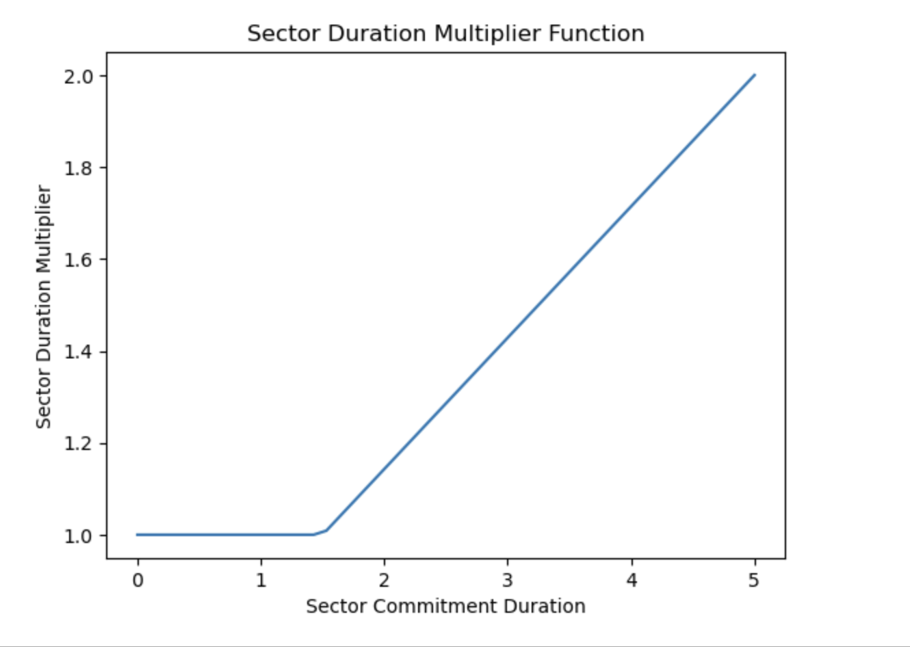

## Simple Summary
- A Sector Duration Multiplier (SDM) is introduced for all sectors, including Committed Capacity (CC) sectors and sectors containing storage deals.
- A longer sector will have a higher Quality Adjusted Power than a shorter sector, all things equal.
- The Duration Multiplier is multiplicative on the existing Quality Multiplier incentive (Filecoin Plus incentive). [Filecoin Plus](https://github.com/filecoin-project/FIPs/blob/master/FIPS/fip-0003.md) already offers up to a 10x multiplier for proving storage of data from verified clients. This FIP introduces an independent Duration Multiplier up to 4.5x. Thus, the maximum multiplier available to any sector will increase from 10x to 45x.
- Sectors with higher Quality Adjusted Power as a result of the Sector Duration Multiplier and Quality Multiplier will require higher initial pledge collateral.
- The minimum sector duration time will increase from 6 months to 1 year and the maximum sector duration will increase from 1.5 years to 5 years. The upper bound of [Deal Duration Bounds](https://github.com/filecoin-project/builtin-actors/blob/b5c101ab94f562ba43c1eca31bd1e73c6fc35794/actors/market/src/policy.rs#L33-L35) will increase to 5 years as well. 
- CEL and the community will monitor the network and look to increase the maximum sector duration in a future FIP if network conditions merit, pending community-driven support for such measures.
- The SDM policy will apply at sector commitment, extension, and replica update
- The termination fee cap will scale with the duration multiplier. 

## Problem Motivation
Currently, Storage Providers do not receive any additional compensation or incentives for committing longer term sectors (whether that be CC or storage deals) to the network. The protocol places equal value on 180 to 540 day sectors in terms of storage mining rewards. However, in making an upfront commitment to longer-term sectors, Storage Providers take on additional operational risks (more can go wrong in a longer time period), and lock rewards for longer. Furthermore, in committing longer term sectors/deals, Storage Providers demonstrate their long-term commitment to the mission and growth of the Filecoin Network, and are more aligned with client preference for persistent storage. Therefore, the added value of longer-term sector commitments, coupled with the compounded operational/liquidity risks Storage Providers incur for committing longer term sectors should be compensated for in the form of increased rewards.

From a macroeconomic perspective, earlier community [discussions](https://github.com/filecoin-project/community/discussions/572) have highlighted many challenges and economic headwinds the Filecoin network faces. Some key issues include: 
- A challenging investment environment given current global macroeconomic dynamics coupled with recent volatility in crypto markets
- The lack of incentives and ability for providing longer-term storage on the network, given that long-term network commitments are crucial to demonstrate the network’s permanence with regards to valuable data storage
- Storage Provider sustainability given the current environment, including uncertainty surrounding liquidity and future network rewards

The following aims to help better align the economic incentives of the network with longer-term storage commitments, attract capital interest to the ecosystem, and improve the network’s stability while providing Storage Provider’s with further optionality and reward potential.

## Specification

### Change to Miner Sector Info's
- Add an `last_extension_epoch` field to miner_sector_infos. This field contains the epoch a sector is extended by a Storage Provider. Upon Initial Sector Commitment, we can initialize this field such that `last_extension_epoch := activation_epoch`.

### SDM Function
The SDM should scale initial pledge and power via the SDM function specified below: 

```
fn sdm(duration_commitment: i64) -> i64 {
    if duration_commitment <= (3/2 * EPOCHS_IN_YEAR) {
        1
    } else {
        (duration_commitment - EPOCHS_IN_YEAR/2) / EPOCHS_IN_YEAR
    }
}
```
### SDM Upon Sector Onboarding 
Upon onboarding, the SDM applies from activaion epoch to expiration epoch: 

```
let duration_commitment = EPOCHS_IN_DAY * (expiration_epoch - activation_epoch)
```
### SDM Upon Sector Extension
Upon extension, SDM applies to a commitment duration between current extension epoch and new expiration epoch: 

``` 
let duration_commitment = EPOCHS_IN_DAY * (expiration_epoch - extension_epoch); 
```

The minimum sector extension time is 1 year. In the [policy actor](https://github.com/filecoin-project/builtin-actors/blob/45c56ed57190349f1856d3258af6c09a24ea1395/runtime/src/runtime/policy.rs#L358): 

```
pub const MIN_SECTOR_EXPIRATION: i64 = EPOCHS_IN_YEAR;
pub const MAX_SECTOR_EXPIRATION_EXTENSION i64 = 5 * EPOCHS_IN_YEAR;
```
Note that sector extension should not support pledge release. As such: 

```
new_pledge = max(old_pledge, new_pledge)
```

### SDM Recalculation Upon Replica Update 

In the [miner actor](https://github.com/filecoin-project/builtin-actors/blob/master/actors/miner/src/lib.rs#L1304) implementation for resnapping, `duration` is already defined as such: 
```
let duration = new_sector_info.expiration - new_sector_info.activation
```

We adjust the calculations for 
- `new_sector_info.expected_day_reward` 
- `new_sector_info.expected_storage_pledge` 

in the [miner actor](https://github.com/filecoin-project/builtin-actors/blob/master/actors/miner/src/lib.rs#L1304) to include the SDM

```
new_sector_info.expected_day_reward = expected_reward_for_power(
    &rew.this_epoch_reward_smoothed,
    &pow.quality_adj_power_smoothed,
    &qa_pow,
    fil_actors_runtime::network::EPOCHS_IN_DAY,
) * sdm(duration);
```
```
new_sector_info.expected_storage_pledge = expected_reward_for_power(
    &rew.this_epoch_reward_smoothed,
    &pow.quality_adj_power_smoothed,
    &qa_pow,
    INITIAL_PLEDGE_PROJECTION_PERIOD,
) * sdm(duration);
```
### Termination Fee Cap

The [monies actor](https://github.com/filecoin-project/builtin-actors/blob/b7ad2c55363c363f61275ca45ef255e28f305254/actors/miner/src/monies.rs) termination penalty should be changed to: 

```
let penalized_reward =  max(SP(t), BR(StartEpoch, 20d) + BR(StartEpoch, 1d) * terminationRewardFactor * min(SectorAgeInDays, 140*sdm(duration_commitment)))
```

### Sector Duration Multiplier 
The current sector quality multiplier follows from the spec [here](https://github.com/filecoin-project/specs/blob/ad8af4cd3d56890504cbfd23e5766a279cbfa014/content/systems/filecoin_mining/sector/sector-quality/_index.md). The notion of Sector Quality currently distinguishes between sectors with heuristics indicating the presence of valuable data.

Sector Quality Adjusted Power is a weighted average of the quality of its space and it is based on the size, duration and quality of its deals.

 Name                                | Description                                           |
| ----------------------------------- | ----------------------------------------------------- |
| QualityBaseMultiplier (QBM)         | Multiplier for power for storage without deals.       |
| DealWeightMultiplier (DWM)          | Multiplier for power for storage with deals.          |
| VerifiedDealWeightMultiplier (VDWM) | Multiplier for power for storage with verified deals. |

The formula for calculating Sector Quality Adjusted Power (or QAP, often referred to as power) makes use of the following factors:

- `dealSpaceTime`: sum of the `duration*size` of each deal
- `verifiedSpaceTime`: sum of the `duration*size` of each verified deal
- `baseSpaceTime` (spacetime without deals): `sectorSize*sectorDuration - dealSpaceTime - verifiedSpaceTime`

Based on these the average quality of a sector is:

$$avgQuality = \frac{baseSpaceTime \cdot QBM + dealSpaceTime \cdot DWM + verifiedSpaceTime \cdot VDWM}{sectorSize \cdot sectorDuration \cdot QBM}$$

The _Sector Quality Adjusted Power_ is:

$sectorQuality = avgQuality \cdot sectorSize$

**Proposed Protocol Change**: 

Introduce a multiplier based on sector duration
 Name                                | Description                                           |
| ----------------------------------- | ----------------------------------------------------- |
| QualityBaseMultiplier (QBM)         | Multiplier for power for storage without deals.       |
| DealWeightMultiplier (DWM)          | Multiplier for power for storage with deals.          |
| VerifiedDealWeightMultiplier (VDWM) | Multiplier for power for storage with verified deals. |
| **SectorDurationMultiplier (SDM)** | **Multiplier for power for storage based on promised sector duration** |

**This SDM function proposed is linear with slope 1**. See below for the function proposed. 


The rationale to select this linear slope 1 function is based on a principle that the selected parameters should maximize the effectiveness of the duration incentive, subject to SP’s collateral availability constraints, while taking into account micro and macroeconomic consequences with minimal added implementation complexity. The SDM function is linear with slope 1 with initial sector commitments between 1 and 1.5 years receiving a 1x Quality multiplier so as to not disadvantage SP's who had already committed sectors for 1.5 years. 

Therefore, the new suggested *Sector Quality Adjusted Power* is: 

$sectorQuality = (avgQuality \cdot sectorSize) \cdot SDM$

### Change to Minimum Sector Commitmnent
We propose a minimum sector commitment of 1 year. This is a ~180-day increase from the current minimum of 6 months. This will not change the mechanics of sector pre-commit and proving; it will just adjust the minimum sector commitment lifetime to 1-year.

### Change to Maximum Sector Commitment 
We propose a maximum sector commitment of 5 years. This is an increase from the current maximum sector commitment of 540 days. Note, the protocol currently sets a maximum sector lifetime to 5 years (i.e sectors can be extended up to 5 years). This FIP would not adjust that.

### Change to PreCommitDeposit (PCD)
With this FIP, sectors can get higher quality multipliers and receive higher expected rewards than currently possible. This has an impact on the value of the PreCommit Deposit (PCD). From the security point of view, PCD has to be large enough in order to consume the expected gain of a provider that is able to pass the PoRep phase with an invalid replica (i.e. gaining block rewards without storing). The recent FIP-0034 sets the PCD to 20 days of expected reward for a sector of quality 10 (max sector quality currently possible via FIL+ incentives). We now need to adjust this to 20 days of expected reward for a sector of quality 45 (the new max quality) to maintain the status quo about PoRep security.

### Change to Termination Fees
In the new policy the termination fee cap will scale with the duration multiplier. The rationale is to maintain the relative incentives regarding the ratio of termination fees to aggregate lifetime block rewards of a sector. 

This change shouldn’t be seen as precluding future termination fee changes. As the network incentives evolve with time, we should also expect the termination fees to be reassessed to ensure incentive alignment in the future.

## Design Rationale

### Supporting Longer-Term Commitments
The current maximum commitment of 1.5 years limits the ability for SPs to make a long-term commitment to the network (or get rewarded for it). We expect that increasing the maximum allowable commitment to 5 years, while also introducing incentives to seal sectors for longer, can increase the stability of storage and predictability of rewards for SP’s. This is further discussed in the sections below.

Note, that [FIP-0052](https://github.com/filecoin-project/FIPs/blob/master/FIPS/fip-0052.md) increases the maximum sector commitment duration from 1.5 years to 3.5 years as well, but does not introduce additional cryptoeconomic incentives for longer commitments. If this SDM proposal were to be accepted, then FIP-0052 would be withdrawn as it is a subset of the protocol changes outlined in this FIP. 

### Incentivizing Longer-Term Commitments
Longer term commitments are incentivized by a rewards multiplier. The multiplier increases the amount of FIL expected to be won per sector per unit time based on the duration the sector is committed for.

The proposed rewards multiplier is linear in duration. This means sectors receive rewards at a rate linearly proportional to duration.

Example:
- **Storage Provider A** commits sectors for 1 year that generate on aggregate 2 FIL/day on average. By the end of the commitment, Storage Provider A expects to have received 730 FIL.
- **Storage Provider** B agrees to store the same data, but makes a commitment to store it for 3 years. Since their commitment is three times as long, they receive 6 FIL/day on average. At the end of the first year of their three year commitment they are expected to have received 2,190 FIL.

The rationale is that operational burden and risk to Storage Providers increases with duration, and it is fair that they’re commensurately rewarded for this.

To maintain protocol incentives that are robust to consistent storage, the amount of collateral temporarily locked for the duration of the sector must also increase. Sector sealing gas costs do not increase with the multiplier. This means longer durations have higher capital efficiency, which further incentivizes longer commitments.

The form of the duration incentive multiplier is linear with slope 1. The motivations are that any nonlinear function results in more complexity without clear gains, and SDM’s with slope less than 1x do not sufficiently compensate for the risk incurred from longer commitments and do not provide sufficient benefits to the network.

### Refusing Shorter-Term Commitments
Currently the minimum sector duration is six months. A new minimum duration of one year is proposed. The rationale is based on three factors:
- Stability. A one year minimum smooths out locking dynamics by stretching inflow-outflow over a longer time period.
- Efficiency. Waves of expiration on a six month basis have the potential to waste resources resealing sectors at twice the rate of one year minimum sectors.
- Long-Term Mission Alignment. Filecoin has an exponential rewards emission schedule, with high rewards that have been useful to bootstrap the network. As the network matures this perspective should be refined to better incentivize Storage Providers who are aligned with the long-term goals of the network. One year is only six months longer than the current minimum duration, but it shows much stronger commitment to the principles and long-term success of the network.

Furthermore, there is empirical evidence from the duration of sectors sealed that most Storage Providers support sectors greater than one year. Increasing the minimum from six months to one year will discourage only the most short-term-aligned Storage Providers.

### Improving Stability of Rewards
A stable investing environment is needed to support long-term storage businesses. A high double-digit percentage return on pledge locked is not sufficient alone. To this end a sustained and substantial amount of locked supply is also needed.

In reality, the percentage of available supply locked has been decreasing since September 2021. While current token emission rate is exponentially decreasing with time, the percentage of available supply locked is expected to continue to decline, at least until the linear vesting schedule completes, based on current locking inflow-outflows and network transaction fees.

This environment can be improved however. Longer sectors mean collateral is locked for longer. All else equal,  this means the total amount of locked collateral is consistently higher.

### Impact on Pre-Commit Deposit
FIP-0034 sets the pre-commit deposit to a fixed value regardless of sector content. From a security point of view, PCD has to be large enough in order to cover the expected gain of a provider that is able to pass the PoRep phase with an invalid replica (i.e. gaining block rewards without storing). The recent FIP-0034 sets the PCD to 20 days of expected reward for a sector of quality 10 (max quality). We now need to increase this to 20 days of expected reward for a sector of quality 45 (the new max quality) to maintain the status quo about PoRep security.

As of December 2022, the calculations are approximately:
```
EpochReward := 97.1115 FIL
NetworkPower := 18.985 * 2^60 Bytes
CirculatingSuppply := 401.4699 * 10^6 FIL

// Sector Quality = 1
StoragePledge := 0.0088
ConsensusPledge := 0.1891 FIL
PreCommitDeposit := 45 * StoragePledge = 0.3951
InitialPledge := StoragePledge + ConsensusPledge = 0.1978

// Sector Quality = 45
StoragePledge := 0.3951
ConsensusPledge := 8.5080 FIL
PreCommitDeposit := StoragePledge = 0.3951
InitialPledge := StoragePledge + ConsensusPledge = 8.9031
```

## Backwards Compatability 
This policy would apply at Sector Extension and Replica Update for existing sectors. CEL has released public modeling and analysis [here](https://hackmd.io/uDXfe35UQuaLjED9u1fxyA) investgiating the decision to apply the policy either to just newly onboarded sectors, or to sectors upon extension. While simulations and modeling indicated that both versions of the SDM policy would be net positive for the network, the policy applying to all sectors would have stronger macroeconomic supply effects, whilst also decreasing barriers to sector commitment (pledges) supporting robust SP return on pledge profiles.

## Test Cases
N/A

## Security Considerations

### Risk of Faulty Proof-of-Repliction (PoRep)
The existing 1.5 year sector duration limit in effect provides a built-in rotation mechanism that can be used to turn over power in the event we discover a flaw in PoRep. Increasing the maximum commitment to 5 years weakens this mechanism. [FIP-0047](https://github.com/filecoin-project/FIPs/blob/e498934732765161bbfbafad2a6303dbb7152592/FIPS/fip-0047.md) sets forth a policy to be adopted in case a flaw is discovered in the theory or implementation of proof-of-replication (note, that at this time we are not aware of any PoRep issues - FIP-0047 is purely proactive in nature) The policy is that, in case of a PoRep flaw, the RefreshProofExpiration method is disallowed for sectors sealed with the vulnerable code. In order to maintain power, a provider must seal a new replacement sector before each existing sector’s ProofExpriration epoch is reached. If not replaced, a sector with a proof expiration before its commitment expiration will incur a termination fee (for example, the current sector early-termination penalty).

### Risks to Consensus
The proposed rewards multiplier increases potential risk to consensus. The main consideration is how long it would take for a colluding consortium of Storage Providers to exceed threshold values of consensus power.

Analysis indicates a malicious consortium would need consistent access to high levels of FIL+, and near-exclusive access to the maximum rewards multiplier, for a substantial period of time, for a viable attack. It is worth noting therefore, that this is the scenario outlined below is an improbable "worst-case" scenario, relying on several unlikely "worst-case" events over sustained periods of time. 

*Example:*
Assume:
The network currently has 19 EiB of quality adjusted power.
5 PiB/day onboarding, with 50% attributed to FIL+, and that this is sustained for several months.
A malicious consortium starting from zero begins to acquire 50% of Fil+ deals and commit sectors for 5 years to gain the maximum duration multiplier, and all other storage power maintains the lowest possible duration sectors of 1 year.
Then in a single day, the adversarial group is expected to gain around 0.29% of consensus power. This follows from:

```
1. advPower = advFILplusPct * FILplusMultiplier * durationMultiplier * powerOnboarding * FILplusPct
2. advPower =  0.5 * 10 * 4.5 * 5 * 0.5 = 56.25
```
where advFILplusPct is the fraction of FILplus deals available that are acquired by the adversary, FILplusMultiplier is the 10x FIL+ power multiplier, durationMultiplier is the maximum 5 year duration multiplier, powerOnboarding is the byte power onboarded, and FILplusPct is the fraction of the power that is FIL+.

```
3. honestPower = 0.5 * 10 * 1 * 5 * 0.5 + 1 * 1 * 5 * 0.5 = 15
4. advPowerDailyPctGain = advPower/(19*1024 + honestPower)
5. advPowerDailyPctGain = 0.3%
````
- If this scenario is maintained, the adversarial group is expected to exceed 33% of consensus power within 126 days, and 51% in 205 days. To do so needs 6.9 and 11.3 EiB of storage power respectively.
- On one hand it’s unlikely a single group could achieve 50% of FIL+ power consistently, and unlikely that the adversarial group exclusively takes up the longer duration sectors with enhanced power multipliers.
- A limitation is that the above calculation assumes the malicious party is starting from 0% of consensus power. If they already control 10%, time to 33% and 51% is reduced to approximately 70 and 150 days. And they have to gain 4.5 and 9.1 EiB.

The same scenario as above is shown below, except there is no duration multiplier available.  

```
1. advPower = advFILplusPct * FILplusMultiplier * powerOnboarding * FILplusPct
2. advPower =  0.5 * 10 * 5 * 0.5 = 12.5
3. honestPower = 0.5 * 10 * 1 * 5 * 0.5 + 1 * 1 * 5 * 0.5 = 15
4. advPowerDailyPctGain = advPower/(19*1024 + honestPower)
5. advPowerDailyPctGain = 0.06%
```
- If this scenario is maintained, the adversarial group is expected to exceed 33% of consensus power within 851 days, and 51% in 2046 days. To do so needs 10.4 and 25 EiB of storage power respectively.

### Rollout Shock

A risk is that the SDM slope is too steep, inadvertently restricting longer commitment. If this happens, optionality on the multiplier can be introduced in a future upgrade. CEL is committed to continually monitoring the economic health of the network, and adjusting parameter spaces as needed while including community input. We have also publicly released various analyses investigating the impact of potentially sudden changes in the network were this policy to be implemented [here](https://hackmd.io/uDXfe35UQuaLjED9u1fxyA)

## Product & Incentive Considerations
As discussed in the problem motivation section, this FIP introduces incentives to further align the cryptoeconomic schema of the Filecoin Network with intended goals of the network to provide useful and reliable storage. We introduce the idea that longer term sectors represent a long-term investment and commitment to the Filecoin ecosystem, and therefore should be rewarded proportionally with greater block reward shares.

Note, we also introduce the possibility for Storage Providers to receive additional multipliers from committing CC for longer. Even this has added value insofar as it represents a commitment to the ecosystem long term that should be rewarded.

From a product perspective, we see strong support for a network more aligned with longer-term stable storage. We recognize that this proposal may not align with a small fraction of SP’s who exclusively prefer shorter commitments to the network, but contend that from an ecosystem perspective, this policy on aggregate makes most participants better off. Note, regular deals can still be accepted for less than sector duration, so there should be minimal loss to flexibility for onboarding clients.

For smaller SP’s, introducing this policy could help improve their competitiveness and ability to capture network block rewards, Under this proposal, returns on tokens put up as collateral scale linearly for all SP’s (regardless of size), whereas only larger ones are able to take advantage of economies of scale for hardware. This proposal could benefit smaller SP’s because they can still get rewards boost/multipliers without prohibitively expensive hardware costs, and termination risks associated with FIL+ data.

## Implementation 
See Specifiation Section
