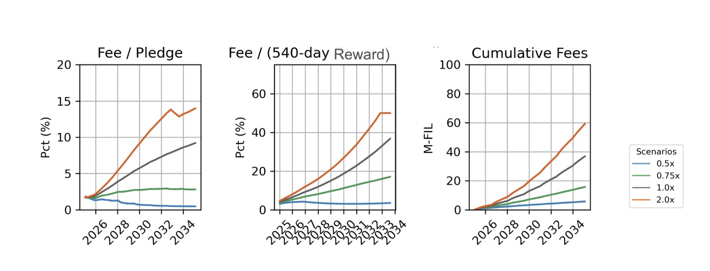

# FIP-0100: Removing Batch Balancer, Replacing It With a Per-sector Fee and Removing Gas-limited Constraints

## Simple Summary

This FIP makes three key changes to improve Filecoin's economics and scalability:

1. Removes the batch fee from PreCommit and ProveCommit operations, lowering gas costs and encouraging sector batching and proof aggregation;
2. Introduces a new daily per-sector fee based on quality-adjusted power, replacing the batch balancer with a more predictable mechanism for network value accrual;
3. Removes unnecessary protocol constraints that previously limited batch sizes.

## Abstract

This FIP addresses three interconnected challenges in Filecoin's protocol:

First, it removes the batch balancer fee that currently makes sector batching and proof aggregation cost-ineffective at normal base fee levels. This change will reduce onboarding gas usage by approximately 30% and enable Storage Providers to always use the most efficient onboarding methods. This significantly lowers the variability and unpredictability of onboarding costs by reducing base fee spikes at our current onboarding rates, while also raising both the self-imposed and the theoretical maximum onboarding rates.

Second, it introduces a new daily per-sector fee to better capture the value of Filecoin's storage-auditing service. The network provides valuable proof verification that enables storage providers to credibly sell storage to their clients. While the batch balancer attempted to capture this value through gas fees, this new mechanism provides a more direct and predictable approach. **While this will increase the total lifetime cost for most storage providers (especially those storing FIL+ verified deals and compared to when base fee remains low on average), it transforms the economics from unpredictable, spiky costs at onboarding time to a consistent, predictable daily expense proportional to the value received.** The fee is calculated once (at sector activation) based on the sector's quality-adjusted power and the circulating supply, then paid daily throughout the sector's lifetime and capped at 50% of expected daily rewards. This ensures network value accrual scales with storage demand while allowing storage providers to reliably account for these costs.

Third, this FIP removes protocol constraints on batch sizes that are no longer necessary with proper gas accounting, simplifying the protocol and removing unintentional limitations on network growth.

Together, these changes create a more efficient onboarding process and a clearer separation between execution costs (gas) and storage-auditing service value (daily sector fee), ensuring sustainable economics that align incentives for both the network and its participants.

## Change Motivation

### PreCommit batch fee removed

Due to the batch fee, currently PreCommit batching is only rational (ie, cost-effective) when the base fee exceeds 0.09 nanoFIL. Removing this fee will eliminate this obstacle, enabling more batching and therefore gas saving.

To have a rough estimate of the saving, we can compare two PreCommitSector messages posted by the same miner actor with little difference in the number of sectors when the message landed.

- [Msg 1](https://www.filutils.com/en/message/bafy2bzacebzacw3b7ymcwukk2uimahiebpke65utbfn3srgslzj5w3hh234x6): PreCommiSectorBatch2 for 1 sector : 16.7 M gas used
- [Msg 2](https://www.filutils.com/en/message/bafy2bzacebdqgivdbxzj25exae55j7vjasos45lvj4bzi6fj5oaya4rqwxrf6): PreCommitSectorBatch2 for 4 sectors): 18.6 M/ 4 = 4.6 M per sector (3.6x smaller)

### ProveCommit batch fee removed

There are two options for `ProveCommitSectors3`: (1) "simple" batching as in PreCommit (ie, one message for ≥ 2 sectors) where there is a PoRep proof for each sector in the batched message, and (2) aggregating proofs of multiple sectors and post in one message.

Batching for ProveCommit is already rational, as the batch fee applies only to aggregated proofs (opposed to PreCommit, where the batch balancer applies to batching).
On the other hand, aggregation is rational only when the base fee exceeds 0.065 nanoFIL due to the batch fee applied to aggregation. Removing this fee too will eliminate this obstacle, enabling more proof aggregation and therefore gas saving.

To have a rough estimate of the saving, we can compare these `ProveCommitSectors3` messages posted by the same miner actor with little difference in the number of sectors when the message landed[^*].

- [Msg 1](https://www.filutils.com/en/message/bafy2bzacebshpv7afwnxph6l4jnbpwpqnss3cboyfvlualfrjbox76hojjnlo): ProveCommitSectors3 for 1 sector: 267.5 M
- [Msg 2](https://www.filutils.com/en/message/bafy2bzacebd7ftq5lk4ikuif4j3xfwiabmla5bek3kuhn3k6x3obufxyzrs6y): ProveCommitSectors3 for 4 sectors, batched (no aggregation): 580 M/4 = 145 M per sector (1.85x smaller)
- [Msg 3](https://www.filutils.com/en/message/bafy2bzacedezi6lm4warrfq2n6dxvpokowzt5isacbq2kojkz462yfpfq7lxm): ProveCommitSectors3 for 4 sectors, aggregated: 517.4 M/4 = 129.3 M per sector (2x smaller).

The same logic applies to `ProveCommitSectorsNI`, where we have the same two options as in `ProveCommitSectors3`.

[^*]: A bug is currently causing single proofs (`VerifySeal`) to be charged an incorrect amount of gas units. So we added the missing units (42M per proof) to msg1 and msg2 in order to provide the future correct estimates (the bug is planned to be fixed in nv25). See [here](https://github.com/filecoin-project/FIPs/blob/master/FIPS/fip-0076.md)

### Per-sector fee added

The batch balancer mechanism had several goals and effects. Among them, two key aspects were: (1) Creating a linear cost for onboarding storage in the presence of batching/aggregation and (2) Burning tokens to balance new token supply with network burn, ensuring value distribution among FIL holders and earners.

We propose a replacement mechanism that preserves these effects while adhering to the following design principles:

 - Simplify the system to improve predictability.
 - Preserve and align network value accrual.
 - Avoid additional gas-related onboarding rate limits.
 - Enable future optimizations in the network’s execution layer.

#### Fee proposal details

We introduce a per-sector fee, whose value is proportional to a fixed fraction of the circulating supply, to the sector duration and to the sector QAP (Quality Adjusted Power). To prevent this fee from becoming a significant upfront cost that could hinder onboarding, we propose daily payments instead of an upfront fee. Moreover, as a safety measure for the high-growth scenarios, we propose capping the daily payment for each sector at a fixed percentage of the daily expected block reward for that sector.

In more detail, for any sector committed after this FIP is deployed we have:

- At ProveCommit time, we compute the per sector value as `dailyFee = k * CS(t) * sectorQAP`, where `k = 1.61817 E-25` is a system constant (a per-byte approximation of `5.56 E-15` per 32 GiB of QAP), `CS(t)` is the circulating supply value at the sector activation epoch, and `sectorQAP` is the quality adjusted power of the sector in bytes. The `dailyFee` value is stored but no payment is due at ProveCommit time.
- Then, at the end of each deadline, we compute: `dailyPayment = min (deadline_dailyFee, m * expected_day_reward)`, where `deadline_dailyFee` is the sum of `dailyFee` of all sectors in the deadline, `m = 0.5` is another system constant and `expected_day_reward` is the updated value for the daily expected block reward for all sectors in the deadline. The `dailyPayment` value is burnt. Note that only new[^1] sectors and old sectors extended or updated after this FIP is deployed count for the `deadline_dailyFee` (indeed, any other sector has no `dailyFee` defined), while all sectors count for the `expected_day_reward` value.
- If a sector is extended (via the method `ExtendSectorExpiration` or `ExtendSectorExpiration2`) or updated (via the method `ProveReplicaUpdates` or `ProveReplicaUpdates3`, "snaps"), the `dailyFee` value is updated using the new `sectorQAP` if the QAP changes (for example, when dropping claims during extension, or adding verified deals during replica updates), but the update is independent of the current CS value. That is: `new_dailyFee = old_dailyFee * new_sectorQAP/old_sectorQAP`.
- When the sector expires or gets terminated, the sector is no longer counted in the `deadline_dailyFee` value for the deadline.

[^1]: We use "old sectors" for sectors committed before this FIP is deployed, and we use "new sectors" for sectors committed after this FIP is deployed.

Moreover, any old sector will start to pay the fee when it's either extended (via the method `ExtendSectorExpiration` or `ExtendSectorExpiration2`) or updated (via the method `ProveReplicaUpdates` or `ProveReplicaUpdates3`, "snaps"). In both cases, the `dailyFee` is computed at the time of extension or update using the CS value of that epoch.

However, a 90-day grace period applies beginning from this FIP's activation date. During this fixed 90-day window, any extension operations on old sectors will not cause them to incur a fee. This timing is absolute and network-wide, it begins when the FIP activates and ends exactly 90 days later, regardless of when specific sectors were last extended. The grace period only applies to sector extensions, not sector updates (snaps). After the 90-day period expires, any subsequent extension of old sectors will begin to incur the fee as described above, even if they were previously extended during the grace period.

**Network Version Implementation**: The 90-day grace period will be implemented through a network version increment. Initially, this FIP will be activated (e.g., at network version 25), and then a subsequent lightweight upgrade (e.g., to network version 26) will occur automatically after exactly 90 days (in epochs). This second upgrade only increments the network version number without introducing new actor code. The miner actor uses its knowledge of the current network version to determine whether an old sector being extended should start incurring the fee.

**Handling Intermediate Network Versions**: If another network version upgrade becomes necessary during the 90-day grace period (for emergency fixes or scheduled upgrades), the grace period mechanism will be preserved. In such cases, a new actors bundle will be generated that simply increments the grace end period network version number accordingly, without changing the lightweight upgrade epoch. For example, if an emergency upgrade requires network version 26, the grace period end would shift to version 27 in the miner actor code, while maintaining the same 90-day timeline from the original FIP activation. This ensures the grace period behavior remains consistent regardless of any intermediate network versions that may be introduced.

**Deadline and Sector Relationship Clarification**: In Filecoin's proving system, each miner's sectors are assigned to one of 48 deadlines in the proving period. The fee cap is applied at the deadline level, not at the individual sector level. This means that all sectors within the same deadline share a collective cap of 50% of the total expected daily block rewards for all sectors in that deadline. As a result:

1. If the total `dailyFee` for all sectors in a deadline is less than 50% of the expected rewards, each sector will pay its full calculated `dailyFee`.
2. If the total `dailyFee` exceeds 50% of expected rewards, each sector's actual payment will be proportionally reduced. For example, if the total uncapped fees are twice the cap, each sector would effectively pay half of its calculated `dailyFee`.

**Real-world Example**: To illustrate the practical impact of this fee structure, consider a network with a circulating supply of 680M FIL:

* For a standard 32GiB sector (with 1x QAP):
  * `dailyFee = 1.61817e-25 * 680,000,000 * 34,359,738,368 bytes = 0.000003781 FIL = 3,781 nanoFIL per day`
  * Over a 540-day sector lifetime, this totals approximately 0.002 FIL

* For a 32GiB sector with FIL+ verified deals (with 10x QAP):
  * `dailyFee = 1.61817e-25 * 680,000,000 * (34,359,738,368 * 10) bytes = 0.00003781 FIL = 37,810 nanoFIL per day`
  * Over a 540-day sector lifetime, this totals approximately 0.02 FIL

Note that the values presented here are for illustrative purposes only, actual fees will depend on the circulating supply at the time of sector activation and the expected daily block rewards for the sector's deadline.

### Gas-limited constraints

Various protocol constraints that were previously necessary when there was no gas applied on actor computation are no longer necessary since the introduction of proper gas accounting with FVM (see [FIP-0032](./fip-0032.md)). This FIP proposes to remove the following constraints as they are no longer necessary in practice due to the gas mechanism being the primary constraint for computation:

* `PRE_COMMIT_SECTOR_BATCH_MAX_SIZE`: The maximum number of sector PreCommitments in a single batch.
* `PROVE_REPLICA_UPDATES_MAX_SIZE`: The maximum number of sector replica updates in a single batch.
* `DECLARATIONS_MAX`: Maximum number of unique "declarations" in batch operations (i.e. terminations, faults, recoveries).

In most cases, users will be limited by the gas limit rather than these constraints ([`message execution failed: exit SysErrOutOfGas`](https://github.com/filecoin-project/lotus/issues/10612)). Removing these constraints will simplify the protocol and remove any unintentional network growth constraints.

## Specification

This FIP makes three main changes to the protocol:

1. Removes the batch balancer fee mechanism from sector PreCommit and ProveCommit operations
2. Removes certain gas-limited protocol constraints that are no longer necessary
3. Introduces a new per-sector daily fee mechanism based on circulating supply and block rewards

### Removal of gas-limited constraints

The following constants and their use will be removed from the storage miner actor:
  - `PRE_COMMIT_SECTOR_BATCH_MAX_SIZE` - used by `PreCommitSectorBatch2`
  - `PROVE_REPLICA_UPDATES_MAX_SIZE` - used by both `ProveReplicaUpdates` and `ProveReplicaUpdates3`
  - `DECLARATIONS_MAX` - used by `TerminateSectors`, `DeclareFaults` and `DeclareFaultsRecovered`

### Removal of aggregate fee

Aggregate fee functionality and constants will be removed from the storage miner actor. This includes the following changes:
  - Remove the burning of `aggregate_fee` from `PreCommitSectorBatch2`.
  - Remove the burning of `aggregate_fee` from `ProveCommitAggregate`, `ProveCommitSectorsNI`, `ProveCommitSectors3`
  - Removal of `aggregate_fee` calculation methods and associated constants, including `ESTIMATED_SINGLE_PROVE_COMMIT_GAS_USAGE` and `ESTIMATED_SINGLE_PRE_COMMIT_GAS_USAGE`

### Fee implementation

The per-sector fee is calculated as a fixed fraction of the current circulating supply per byte of quality-adjusted power. This FIP targets a multiplier of `5.56e-15` for circulating supply per 32 GiB of quality-adjusted power. We obtain a per-byte multiplier from this as `5.56e-15 / 32 GiB ≈ 1.61817e-25` (i.e. rounded down slightly, for simplicity and a more direct multiplication). This value can then be multiplied by the sector's quality-adjusted power and the current circulating supply to derive the daily fee for a sector.

The following constants are introduced to calculate the daily fee:

```rust
// Fraction of circulating supply per byte of quality adjusted power that will be used to calculate
// the daily fee for new sectors.
// The target multiplier is:
//   5.56e-15 / 32GiB = 5.56e-15 / (32 * 2^30) = 5.56e-15 / 34,359,738,368 ≈ 1.61817e-25
// (i.e. slightly rounded for simplicity and a more direct multiplication).
// We implement this as 161817e-30.
pub const DAILY_FEE_CIRCULATING_SUPPLY_QAP_MULTIPLIER_NUM: u64 = 161817;
pub const DAILY_FEE_CIRCULATING_SUPPLY_QAP_MULTIPLIER_DENOM: u128 = 1_000_000_000_000_000_000_000_000_000_000; // 10^30
```

Daily fee for an amount of quality-adjusted power and a given circulating supply may be calculated as follows:

```rust
// Calculate the daily fee for a sector's quality-adjusted power based on the current circulating supply.
pub fn daily_proof_fee(
    circulating_supply: &TokenAmount,
    qa_power: &StoragePower,
) -> TokenAmount {
    let num = BigInt::from(DAILY_FEE_CIRCULATING_SUPPLY_QAP_MULTIPLIER_NUM);
    let denom = BigInt::from(DAILY_FEE_CIRCULATING_SUPPLY_QAP_MULTIPLIER_DENOM);
    TokenAmount::from_atto((num * circulating_supply.atto() * qa_power).div_floor(&denom))
}

// Adjust the daily fee based on the change in quality-adjusted power.
pub fn daily_proof_fee_adjust(
    daily_fee: &TokenAmount,
    old_qa_power: &StoragePower,
    new_qa_power: &StoragePower,
) -> TokenAmount {
    TokenAmount::from_atto((daily_fee.atto() * new_qa_power).div_floor(old_qa_power))
}
```

A daily fee value is calculated per-sector at time of sector commitment and whenever a sector's power is adjusted:

* For new sectors and pre-FIP-0100 sectors being updated, the daily fee calculation uses the circulating supply value at that epoch.
* For updated sectors (replica updates and extensions), the daily fee is adjusted proportional to the QAP change.
* For pre-FIP-0100 sectors that are updated (replica updates and extensions) for the first time after the activation of FIP-0100, the daily fee is calculated using the circulating supply value at the time of the update.
  * An exception is made for sector extensions, where a 90-day grace period applies after this FIP's activation, during which old sectors that are extended will not incur any fee. This grace period only applies to sector extensions, not sector updates. After the grace period expires, any extension of old sectors will begin to incur the fee as described above.

The fee value is stored as `daily_fee` in the `SectorOnChainInfo` and an aggregated `daily_fee` value is also stored in each `Deadline`. The fee is deducted from the miner actor's unvested rewards using the _fee debt_ mechanism, which is handled by cron at the end of each deadline.

Processing of the fee follows the same mechanism as fault fees, whereby the fee is paid first from locked future block rewards and then from the miner balance if there are not enough funds in the reward vesting schedule. Using the fault fee mechanism requires adding a `Deadline`'s total `daily_fee` value to the miner's `fee_debt` field, along with any additional penalties that may be due. An attempt is immediately made to repay this debt from the miner's future vesting rewards by reaching forward into the next epoch(s) that contain still-to-be-vested rewards and deducting the fee from those rewards. If there are not enough future rewards to cover the fee, the miner's balance is debited for the remaining amount. If there are not enough funds in the miner's balance to cover the fee, the miner is considered to be in debt and the fee is not paid.

Upon sector termination, the `daily_fee` recorded in the sector's `Deadline` is adjusted to remove the sector's fee.

Circulating supply is obtained from the existing `total_fil_circ_supply` system call which is also used for the Initial Pledge (IP) calculation. Upon payment, the estimated block reward for a whole `Deadline`s quality adjusted live power (which includes active, faulty and unproven sectors) is calculated and used to apply a maximum cap, as per the formula above. Efficient application of the cap will require also adding a new `live_power` field to the `Deadline` as a sum of all the power its partitions.

Note that because `live_power` is a sum of all deadline power and will include pre-FIP-0100 sectors without a `daily_fee` as well as new and updated sectors with a `daily_fee`, the cap will account for all sectors in the deadline, while the fee that is being capped will only be for the new and updated sectors, deriving a higher cap in the early period of activation of this FIP than would be expected once all sectors in the system have a `daily_fee` value.

Fee deduction will be handled in the existing `handle_proving_deadline()` function which is called from cron. As cron calls already supply current epoch rewards and current total network power, additional calls to the reward and power actors will not be necessary to calculate the cap 24h block reward fee cap.

The `Deadline` struct will be extended with `live_power` and `daily_fee` fields:

```rust
pub struct Deadline {
  // existing fields ...

  /// Memoized sum of all non-terminated power in partitions, including active, faulty, and
  /// unproven. Used to cap the daily fee as a proportion of expected block reward.
  pub live_power: PowerPair,

  /// Memoized sum of daily fee payable to the network for the active sectors
  /// in this deadline.
  pub daily_fee: TokenAmount,
}
```

The `SectorOnChainInfo` struct will be extended to include a new `daily_fee` field which will be used to store the daily fee for the sector. This value will be set at the time of sector activation, extension, and any adjustments to a sector's quality adjusted power. This field will be used to calculate the total value across all sectors in a `Deadline` so they can be charged as a group. `daily_fee` will be zero for sectors committed prior to activation of this FIP.

At the time of this proposal, there are approximately 650M sectors on chain. The expense of migrating and additional bytes used to store zero values for old sectors is not insignificant. Therefore it is proposed to perform a _lazy migration_ where existing `SectorOnChainInfo` objects are left alone and this new field is only added to new sectors, and sectors which are updated (for any reason). This means that reading `SectorOnChainInfo` blocks from state will support two forms: a 15 field version (old) and a 16 field version (new `daily_fee` field). The old version will instantiate with a zero value for `daily_fee` and this field will be written whenever a `SectorOnChainInfo` object is written to state, regardless of whether it contains a zero or non-zero value. i.e. reads will support 15 or 16 fields, writes will always write 16 fields.

A future migration may be proposed to unify the format, or introduce an explicit schema versioning mechanism, however this will likely be deferred until additional sector clean-up activities can take place to reduce the number of unused sectors on chain, thereby reducing the cost of migration.

```rust
pub struct SectorOnChainInfo {
  // existing fields ...

  /// The total fee payable per day for this sector. The value of this field is set at the time of
  /// sector activation, extension and whenever a sector's QAP is changed. This fee is payable for
  /// the lifetime of the sector and is aggregated in the deadline's `daily_fee` field.
  ///
  /// This field is not included in the serialised form of the struct prior to the activation of
  /// FIP-0100, and is added as the 16th element of the array after that point only for new sectors
  /// or sectors that are updated after that point. For old sectors, the value of this field will
  /// always be zero.
  #[serde(default)]
  pub daily_fee: TokenAmount,
}
```

Multiple queues are used to maintain the correct state of partitions and deadlines as sectors pass through various phases of their lifecycles. `ExpirationSet` is a fundamental type used in these queues which are indexed by epoch and track early and on-time expiration of sectors, their resultant total pledge and power adjustments. To maintain efficiency during the mutation of the partitions within each deadline, the `ExpirationSet` struct will be extended to add `fee_deduction` which will track the total delta in daily fee for each sector that is added or removed from the set.

Similar to `SectorOnChainInfo`, a _lazy migration_ strategy will be employed for `ExpirationSet` objects. The `fee_deduction` field will be added to the struct but will only be _implicitly_ zero for all existing `ExpirationSet` objects. That is, it will not be present in the serialised form of any `ExpirationSet` objects written prior to the activation of FIP-0100. The field will be written to state whenever an `ExpirationSet` object is written to state after the activation of FIP-0100, regardless of whether it contains a zero or non-zero value. This will create two serialized forms of `ExpirationSet` in the state: one with 5 fields (old) and one with 6 fields (new `fee_deduction` field).

```rust
pub struct ExpirationSet {
    /// Adjustment to the daily fee recorded for the deadline associated with this expiration set
    /// to account for expiring sectors.
    ///
    /// This field is not included in the serialised form of the struct prior to the activation of
    /// FIP-0100, and is added as the 6th element of the array after that point only for new objects
    /// or objects that are updated after that point. For old objects, the value of this field will
    /// always be zero.
    #[serde(default)]
    pub fee_deduction: TokenAmount,
}
```

**Sector commitments**: At each of `ProveCommitSectors3`, `ProveCommitAggregate` and `ProveCommitSectorsNI`:

  * The `daily_fee` for each sector is calculated based on the circulating supply at that epoch and the quality-adjusted power of the sector and recorded in the new `SectorOnChainInfo` object for the sector.
  * As sectors are assigned to deadlines, the existing `daily_fee` total recorded in that `Deadline` is updated to include the new sector's `daily_fee`.
  * As sectors are further assigned to partitions within the deadline and their expiration recorded in the partition's expiration queue, the `fee_deduction` in the `ExpirationSet` for the epoch is updated (or set) to include the new sector's `daily_fee`.

**Replica updates** (snaps): `ProveReplicaUpdates` and `ProveReplicaUpdates3` may result in a change of a sector's quality-adjusted power. Such a change will require updating the sector's `daily_fee` value but still using the circulating supply value at the time the sector was committed. Therefore the new `daily_fee` value is changed in proportion to the change in the sector's quality-adjusted power: `dailyFee = dailyFee * new_QAP/old_QAP`.

Sectors that were committed prior to the activation of this FIP, and therefore do not have a `daily_fee` value, will be updated during a replica update operation to have the `daily_fee` field and its value will be calculated according to the circulating supply at the time of the update and the new quality-adjusted power of the sector.

The `daily_fee` total in the sector's `Deadline` will also need to be updated to reflect the change in the sector's `daily_fee` and the `fee_deduction` in the `ExpirationSet` for the sector's expiry epoch will also need to be updated.

**Sector extensions**: Extensions typically don't change a sector's quality-adjusted power, only the duration of the sector. However, when claims are dropped during extension (with `ExtendSectorExpiration2`), the sector's QAP can change. When QAP changes, the sector's `daily_fee` is adjusted proportionally in the same way as with replica updates: `dailyFee = dailyFee * new_QAP/old_QAP`. This will also require updating the sector's `Deadline` total `daily_fee` value and the `fee_deduction` value in the `ExpirationSet` for the sector's expiry epoch.

Sectors that were committed prior to the activation of this FIP, and therefore do not have a `daily_fee` value, will be updated when their lifetime is extended to have the `daily_fee` field and its value will be calculated according to the circulating supply at the time of extension and the quality-adjusted power of the sector (i.e. extending an old sector that does not previously attract a daily fee will cause it to attract a daily fee). This will also require updating the sector's `Deadline` total `daily_fee` value and the `fee_deduction` value in the `ExpirationSet` for the sector's expiry epoch. Sectors with an existing `daily_fee` will not need to be updated, the existing value will be used for the extended duration.

However, there will be a 90-day grace period after this FIP's activation during which old sectors that are extended will not incur the fee. After the grace period, extensions will cause old sectors to start paying the fee. The grace period uses the network version mechanism. Here's a simplified code example showing how the implementation determines whether to apply fees to pre-FIP-0100 sectors during extension:

```rust
// When processing sector extensions:
let new_qa_power = qa_power_for_weight(
    sector_size,
    new_sector_info.expiration - new_sector_info.power_base_epoch,
    &new_sector_info.verified_deal_weight,
);

if new_sector_info.daily_fee.is_zero() {
    // This is a pre-FIP-0100 sector
    // Check network version to determine if grace period has ended
    let current_version = rt.network_version();

    // Assuming FIP-0100 activates at network version 25 and grace period ends at version 26
    // (exact versions may differ in the actual implementation)
    let FIP_0100_ACTIVATION_VERSION = NetworkVersion::new(25);
    let FIP_0100_GRACE_PERIOD_END_VERSION = NetworkVersion::new(26);

    // Only add fee if we're past the grace period
    if current_version >= FIP_0100_GRACE_PERIOD_END_VERSION {
        new_sector_info.daily_fee = daily_proof_fee(circulating_supply, &new_qa_power);
    }
} else {
    // Existing sector with a fee - adjust it if QAP has changed
    let old_qa_power = qa_power_for_sector(sector_size, sector_info);
    if old_qa_power != new_qa_power {
        // Adjust the daily_fee by the same proportion as the power changed
        new_sector_info.daily_fee =
            daily_proof_fee_adjust(&sector_info.daily_fee, &old_qa_power, &new_qa_power)
    }
}
```

**Faults**: There is no impact on a sector or deadline's `daily_fee` value. However, faults can cause changes to a partition's expiration queue to ensure proper handling of a faulty sector's lifecycle. Changes in `ExpirationSet` to move sectors between queues will also include corresponding changes to `fee_deduction` values.

**Early terminations**: both automatic and manual, will result in a reduction of a `Deadline`'s `daily_fee` value for the sectors being terminated.

| Change State | Sector's `daily_fee` | Deadline's `daily_fee` | ExpirationSet's `fee_deduction` | Additional Notes |
|-------------|---------------------|------------------------|--------------------------------|-----------------|
| **Sector commitments** | Calculate based on current circulating supply and QAP, store in `SectorOnChainInfo` | Increase by new sector's `daily_fee` | Update for the sector's expiry epoch | Applied during `ProveCommitSectors3`, `ProveCommitAggregate` and `ProveCommitSectorsNI` |
| **Replica updates** | For existing sectors: adjust proportionally to QAP change<br>For pre-FIP sectors: calculate new using current circulating supply | Update to reflect sector's new `daily_fee` | Update for the sector's expiry epoch | Applied during `ProveReplicaUpdates` and `ProveReplicaUpdates3` |
| **Sector extensions** | For existing sectors with QAP change (e.g., dropping claims): adjust proportionally to QAP change<br>For existing sectors with no QAP change: no fee change<br>For pre-FIP sectors:<br>- During 90-day grace period: remains zero<br>- After grace period: calculate new using current circulating supply | Update to reflect sector's new `daily_fee` when QAP changes<br>Update as needed for pre-FIP sectors extended after grace period | Update for both old and new expiry epochs | Applied during `ExtendSectorExpiration` and `ExtendSectorExpiration2`<br>90-day grace period applies only to extensions, not to replica updates |
| **Faults** | No change | No change | Update if sectors move between queues | No direct impact on fee calculation |
| **Early terminations** | N/A (sector removed) | Reduce by terminated sector's `daily_fee` | N/A (sector removed) | Applies to both automatic and manual terminations |

### Optimization of `VestingFunds`

The `VestingFunds` data structure, associated with the miner actor's state, is currently implemented as a single, very large array of vesting tuples: `(ChainEpoch, TokenAmount)` (almost always 360 tuples per miner actor). Each tuple specifies the amount of tokens to be unlocked at a specific epoch. An average `VestingFunds` IPLD block occupies 5.5 KiB of space.

Vesting epochs are quantized, meaning that vesting occurs at regular intervals, but not necessarily every epoch or even every deadline. Updating this data structure too often can lead to excessive amounts of state churn, taxing node operators and adding to (the already large) archival state weight. These updates occur when new vesting block rewards are added, when tokens vest and are unlocked, and when locked rewards are used to cover fee debts arising from penalties.

The introduction of a daily fee, paid using the fee debt mechanism, increases the frequency with which the `VestingFunds` data structure is mutated, causing it to be updated every deadline (48 times per day, for each miner actor with fees to deduct). Without mitigating the cost of this mutation, it is estimated that the current Filecoin state tree would add up to an additional 435 MiB of IPLD block churn per day.

To mitigate the performance impact of these frequent mutations, this FIP introduces an optimization to the storage of `VestingFunds`. The goal is to make the common operation of drawing funds from the _next_ vesting epoch more efficient, avoiding unnecessary reads and writes to the large `VestingFunds` array.

**Existing state representation**

```rust
#[derive(Serialize_tuple, Deserialize_tuple)]
pub struct State {
    // ... existing fields

    /// VestingFunds (Vesting Funds schedule for the miner).
    pub vesting_funds: Cid,

    // ... existing fields
}

/// Represents the vesting table state for the miner.
/// It is a slice of (VestingEpoch, VestingAmount).
/// The slice will always be sorted by the VestingEpoch.
#[derive(Serialize_tuple, Deserialize_tuple)]
pub struct VestingFunds {
    pub funds: Vec<VestingFund>,
}

// Represents miner funds that will vest at the given epoch.
#[derive(Serialize_tuple, Deserialize_tuple)]
pub struct VestingFund {
    pub epoch: ChainEpoch,
    pub amount: TokenAmount,
}
```

**New state representation**

```rust
#[derive(Serialize_tuple, Deserialize_tuple)]
pub struct State {
    // ... existing fields

    /// VestingFunds (Vesting Funds schedule for the miner).
    pub vesting_funds: Option<VestingFunds>,

    // ... existing fields
}

/// Represents the vesting table state for the miner. It's composed of a `head` (stored inline) and
/// a tail (referenced by CID).
#[derive(Serialize_tuple, Deserialize_tuple)]
struct VestingFunds {
    // The "next" batch of vesting funds.
    head: VestingFund,
    // The rest of the vesting funds, if any.
    tail: Cid, // Vec<VestingFund>
}

// Represents miner funds that will vest at the given epoch.
#[derive(Serialize_tuple, Deserialize_tuple)]
pub struct VestingFund {
    pub epoch: ChainEpoch,
    pub amount: TokenAmount,
}
```

The new algorithm for managing VestingFunds operates as follows:

  * The `vesting_funds` field in a miner actor can be `null`. This indicates that there are no remaining funds to vest. If `vesting_funds` is `null`, any attempt to draw from unvested funds or to unlock locked vested funds will yield no tokens. This field will be `null` for all new miners and for miners with no remaining unvested tokens. It's important to note that it is possible to have unlocked, but not unvested, tokens in `VestingFunds`. These tokens are typically unlocked during mutation of `VestingFunds`, such as during balance withdrawal attempts.
  * The vesting of new rewards will continue to follow the existing schedule, spread across 180 days, with vesting occurring once per day. The vesting schedule is quantized to a precision of 12 hours, so vesting may occur twice per day for a miner, depending on when rewards are received.
  * The *next* batch of funds to vest is always stored directly within the miner actor's state, in the first element of the `vesting_funds` field, as a `(ChainEpoch, TokenAmount)` tuple. This is referred to as the *"head"*.
  * All subsequent batches of funds to vest are stored in a separate block, as a list of `(ChainEpoch, TokenAmount)` tuples. This is referred to as the *"tail"*. The "tail" is referenced by a CID.
  * During unlocking, if the epoch specified in the "head" has passed, the funds in the "head" are moved to the miner's unlocked balance. The first block in the "tail" is then removed and promoted to become the new "head". This process requires modifying both the miner's root state block and the `VestingFunds` "tail" block.
  * When extracting funds to cover fee debt (penalties or the new daily fee), the system first attempts to draw the required funds solely from the "head". If the "head" contains sufficient funds, only the miner's root state block needs to be updated. If the "head" does not contain enough funds, it is emptied, and the "tail" is then depleted until the required amount is obtained.
  * The "head" tuple may represent a zero value if fee debt reduces the balance to zero. This situation will be resolved either during normal vesting or during future fee extraction.

### Migration

At activation of this FIP, a new schema for the `Deadline` block type will be introduced, adding two new fields: `live_power: PowerPair` and `daily_fee: TokenAmount`. A migration will be performed on all deadlines, across all miner actors. As the majority of deadlines referenced on chain are _the_ empty `Deadline` block, a CID for this singleton block may be used to speed up migration where the CID for the previous form's `Deadline` block is encountered. All `daily_fee` values will be set to zero at migration and the `live_power` will be calculated as a sum of the `live_power` in each of the `Partition`s assigned to the `Deadline`.

No migration is necessary for `SectorOnChainInfo` or `ExpirationSet` as the lazy migration strategy is employed.

The miner actor state root block for all miners will be migrated to accommodate the new `VestingFunds` structure. Where a miner has an empty existing `VestingFunds` list, the `vesting_funds` field will be set to `null`. Otherwise, the `vesting_funds` field will be updated to a new format `VestingFunds` object, with the `head` field set to the first element of the existing `VestingFunds` list and the `tail` field set to a CID referencing the remaining elements of the list (which may be a zero-element block if there are no funds beyond the head). It is possible that the new `head` will represent an already-vested epoch, however this will be resolved during the next update to the `VestingFunds` structure by the miner actor.

### Special handling for Calibration network

In order to properly test the implementation of this FIP, a long-standing problem with circulating supply calculation on Calibnet will need to be addressed. Circulating supply is calculated using an estimation method each epoch and supplied to the FVM, it uses these inputs (from the time of writing):

| Metric               | Mainnet (FIL) | Calibnet (FIL) |
|----------------------|--------------:|---------------:|
| `FilVested`          |   484,847,134 |    323,483,605 |
| `FilMined`           |   365,928,138 |     68,672,646 |
| `FilBurnt`           |    40,327,377 |     32,117,860 |
| `FilLocked`          |   140,975,297 |      3,893,484 |
| `InitialFilReserved` |   300,000,000 |    300,000,000 |
| `FilReserveBalance`  |   282,933,381 |    869,278,271 |

The amount of reserved funds disbursed from f090 (`FilReserveDisbursed`) is then calculated as:

```math
FilReserveDisbursed = InitialFilReserved - FilReserveBalance
```

For Mainnet:
```math
FilReserveDisbursed = 300,000,000 - 282,933,381 = 17,066,619
```

For Calibnet:
```math
FilReserveDisbursed = 300,000,000 - 869,278,271 = -569,278,271
```

Circulating supply (`CS`) is then calculated as:

```math
CS = \max(0, FilVested + FilMined + FilReserveDisbursed - FilBurnt - FilLocked)
```

For Mainnet:
```math
CS = \max(0, 484,847,134 + 365,928,138 + 17,066,619 - 40,327,377 - 140,975,297) = 686,539,216
```

For Calibnet:
```math
CS = \max(0, 323,483,605 + 68,672,646 + (-569,278,271) - 32,117,860 - 3,893,484) = 0
```

Calibnet currently executes with a circulating supply of `0` each epoch, regardless of token movements.

Because this FIP uses a fixed portion of current circulating supply to calculate the fee, Calibnet fees will always be `0`, which makes proper testing of the new functionality in live network conditions impossible.

To address this problem, this FIP will also adjust network parameters for Calibnet to ensure that the circulating supply is a reasonable and dynamic positive number. The core problem is the initial allocation of reserve funds which appears to have been set to 900M FIL. This was likely set to ensure a total supply of 2B FIL. Unfortunately, implementations use the same `InitialFilReserved` value as mainnet, 300M FIL.

The goal of Calibnet is to provide an approximation of Mainnet for testing purposes, currently the circulating supply calculation calculation makes that impossible. By setting the `InitialFilReserved` value to 900M FIL, the circulating supply calculation will become accurate for that network, but still be nearly 400M FIL lower than Mainnet. This FIP proposes to artificially inflate the circulating supply to more closely match the current mainnet conditions and be a more useful model for testing: using a value of 1,200M for `InitialFilReserved` will result in a circulating supply of 695.8M FIL, which is close to the current mainnet value.

Filecoin node implementations compatible with Calibnet will be required to set their `InitialFilReserved` for Calibnet (only) to `1,200,000,000` FIL (whole) **from the activation epoch of this FIP** (i.e. a value of `300,000,000` FIL must be used for epochs up until then, including when re-executing older tipsets). This will result in a more useful circulating supply calculation value starting from the activation epoch of this FIP:

| Metric                | Mainnet (FIL) | Calibnet (FIL) |
|-----------------------|--------------:|---------------:|
| `InitialFilReserved`  |   300,000,000 | 1,200,000,000  |
| `FilReserveDisbursed` |    17,066,619 |   330,721,729  |
| `FilCirculating`      |   686,539,216 |   686,866,636  |

## Design Rationale

We aimed for a design that is simple to understand and model, and relatively simple to implement. With this in mind, we explored the following fee structures:

- **Upfront Payment vs. Ongoing Payment**: The first offers better predictability, while the second reduces the risk of creating an entry barrier and a disincentive for sectors with longer durations. With this FIP, we chose a hybrid approach that captures the benefits of both by computing the fee value upfront for predictability, but allowing it to be paid daily over sector lifetime instead of as a lump sum upfront. Moreover, the daily payment option allows us to easily implement a security measure by capping the daily value at a fixed fraction of the per-sector block reward. See [here](https://github.com/filecoin-project/FIPs/discussions/1105#discussioncomment-12195305) for more details.

- **Flat Fee vs. Dynamic Fee**: A fixed per-sector fee provides predictability and consistency, while a fluctuating fee based on network congestion, onboarding rate, or other variables better captures value when the network is actively providing a service. We chose a model where the fee is a fixed fraction of a quantity that adjusts to economic conditions. We evaluated the following economic indicators for determining the per-sector fee: Initial Pledge (IP), per-sector Block Reward (BR) and Circulating Supply (CS).
  - The IP-based fee was discarded to avoid complex system dependencies, as changes to IP in future FIPs could unintentionally impact the per-sector fee.
  - The BR-based fee was discarded because the fee-to-reward ratio did not adjust properly to network growth, leading to high fees even when onboarding demand was low. See [here](../resources/fip-0100/fip0100Appendix.md) for more details.
  - CS was ultimately chosen because it normalizes fees relative to the Filecoin economy, ensuring both adaptability and predictability.

We reached this conclusion through simulation-based analysis, modeling the impact of fees under different network conditions. Specifically, we evaluated multiple input trajectories: 0.5×, 0.75×, 1×, and 2× the current onboarding, renewal, and FIL+ rates. Since both renewals and FIL+ are near 100%, we capped them at their current maximum (see Fig. 1).
<div align="center">
  
  <p><em>Fig 1: Network state evolution for each input trajectory.</em></p>
</div>

For each trajectory, we analyzed mainly 3 metrics over time:
1. Fee / Pledge, per unit of Quality Adjusted Power (QAP);
2. Fee / 540-day of BlockReward, per unit of QAP;
3. Cumulative onboarding fees that would be collected.

Fig. 2 presents these results for the CS-based fee, incorporating a cap at 50% of `expected_day_reward` as a safety measure in high-growth scenarios[^2]. See [here](../resources/fip-0100/fip0100Appendix.md) for more details. Notably, Fig. 2 confirms that the CS-based fee proposed in this FIP offers the following key advantages:
- **Stable Economic Reference**: A fixed percentage of CS functions like a fixed USD fee if market cap remains stable, keeping costs predictable;
- **Adapts to Market Conditions**: If Filecoin’s valuation rises, fees increase in FIL terms, scaling with the economy. If the market stagnates, fees stay economically consistent.
<div align="center">
    
    <p><em>Figure 2: CS-based fee evolution as a function of various network metrics. Here we considered a daily payment that is a fixed % of CS-based and capped at 50% of `expected_day_reward` as a safety measure in high-growth scenarios.</em></p>
</div>

[^2]: The simulation applies the cap at the sector level, while implementation applies the cap at the partition level as explained in the Spec section.

## Backwards Compatibility

This FIP modifies actor behavior and will require a new Filecoin network version.

## Test Cases

### builtin-actors

Many of the test scenarios outlined below already exist within the test suite for builtin-actors. Ensuring that all of the various cases, particularly edge-cases, are covered will be important to ensure that the new fee mechanism is correctly implemented and behaves as expected. In addition, any existing test scenarios that test sector lifecycles should be updated to include invariants that check the new fee mechanism: that it is correctly calculated, tallied in the partition, remains correct over time, is correctly deducted in `handle_proving_deadline()`, is correctly capped and is correctly adjusted for terminations.

* Test that the batch balancer fee is removed from `PreCommitSectorBatch2` and `ProveCommitAggregate`, `ProveCommitSectorsNI`, `ProveCommitSectors3`
* Test that the gas-limited constraints are removed from the protocol
* Test that the per-sector fee is correctly calculated and added to the respective partition's `daily_fee` value when using `ProveCommitAggregate`, `ProveCommitSectorsNI`, `ProveCommitSectors3`
  * Tests should cover different batching variations
* Test that `ProveReplicaUpdates` and `ProveReplicaUpdates3` do not have an impact on the fee mechanism
* Test that the per-sector fee is correctly charged at the end of each deadline for all sectors in the active, faulty, and recovered states
  * Tests should cover different batching variations
* Test that manual early terminations correctly adjust the deadline's `daily_fee`
* Test that automatic early terminations correctly adjust the deadline's `daily_fee`
* Test that sector expiration correctly adjusts the deadline's `daily_fee`
* Test that the fee is correctly capped at the expected daily block reward at the time it is paid

### Calibration network

Once Calibnet is upgraded, functional tests should be performed that cover:

* Ensure that the circulating supply is a reasonable and dynamic positive number
* Committing new sectors with `PreCommitSectorBatch2` and `ProveCommitAggregate`, `ProveCommitSectors3` (and `ProveCommitSectorsNI` if possible) and:
  * observing that the batch balancer fee is not applied
  * observing deadline state to ensure that the new fee mechanism is correctly implemented and behaves as expected
* Observing that the per-sector fee is correctly charged at the end of each deadline for all sectors in the active, faulty, and recovered states
* Observing that manual early terminations correctly adjust the deadline's `daily_fee` value

## Security Considerations

This FIP does not affect underlying proofs or protocol security.

## Incentive Considerations

Filecoin’s network revenue model is currently tied to the gas usage, and the most amount of gas is used by storage onboarding methods. This creates an incentive misalignment, where economic considerations lead to an incentive to not optimize the gas usage of onboarding methods, as this could hurt overall network revenue.

The Batch Balancer mechanism exemplifies this concept: batching and aggregating abilities were introduced to increase gas efficiency of onboarding methods, but the batch balancer mechanism restricted use of these abilities to when the network demand was high, to protect Filecoin’s economic interests.

This FIP fixes this incentive misalignment by disconnecting the network revenue from gas usage. The removal of the batch balancer allows for aggregation to occur at any level of demand regardless of network utilization rate (such as current levels of demand). We expect this to lead to a reduction of about ~30% in per-sector onboarding gas. This would in turn result in a drop in base fee, and therefore a drop in gas-based network revenue.

The explicit per-sector fee introduced by this FIP allows us to remove the batch balancer, and support other future gas usage optimizations, without adding macroeconomic risk.

The removal of batch balancer and associated reduction in gas fees are up-front improvements to SP costs designed to unblock and support faster data onboarding. This up-front cost-reduction is balanced by the per-sector fee that is charged gradually over the sector lifetime, starting at a small fraction of daily block rewards and adjusting dynamically based on network economic growth rate.


## Product Considerations
From a product perspective, this FIP is expected to:
- Decouple gas fees (blockspace costs) from service fees (storage-auditing costs): This separation creates a more resilient system, reducing sensitivity to base fee spikes and ensuring predictable and fair costs for SPs.
- Simplify cost analysis and calculations for SPs: The network will provide a smoother user experience by clearly distinguishing between congestion control (managed via base fees) and payments for services unrelated to congestion.
- Capture value for the storage-auditing service: By introducing a per-sector fee burn, the network can proportionally capture value based on storage demand.
- Ensure economic stability amid future optimizations: Improvements in proof mechanisms or onboarding throughput will no longer risk destabilizing the network’s economic alignment. This ensures the Filecoin protocol can lower costs for SPs while still capturing value for the network.
- Remove gas-limited constraints: Eliminating these unnecessary constraints simplifies the protocol and allows gas mechanisms to serve as the primary network constraint, making the system more adaptive and flexible to changing conditions.

## Implementation

1. [FIP-0100 builtin-actors feature branch](https://github.com/filecoin-project/builtin-actors/pull/1630)
   * [Remove the batch balancer fee mechanism from sector PreCommit and ProveCommit operations](https://github.com/filecoin-project/builtin-actors/pull/1646)
   * [Remove gas-limited protocol constraints that are no longer necessary](https://github.com/filecoin-project/builtin-actors/pull/1586)
   * [Adjustments to fee multiplier and legacy extensions grace period](https://github.com/filecoin-project/builtin-actors/pull/1649)
2. [Fix `VerifySeal` gas bug](https://github.com/filecoin-project/ref-fvm/pull/2103)
3. [Fix circulating supply calculation on Calibnet](https://github.com/filecoin-project/lotus/pull/12938)

## Governance

This FIP's behavior and impact on the network will be monitored by an ad-hoc **FIP-100 Committee**, whose membership and structure will be defined by the Filecoin Foundation no later than the FIP's activation on Mainnet. The committee will provide a quarterly report to the Filecoin Core Developers, summarising their understanding of the FIP's effect on the network, and making suggestions for improvements, modifications, or subsequent draft FIPs for further consideration.

## Copyright

Copyright and related rights waived via [CC0](https://creativecommons.org/publicdomain/zero/1.0/).
