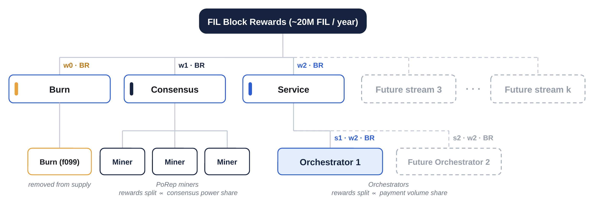
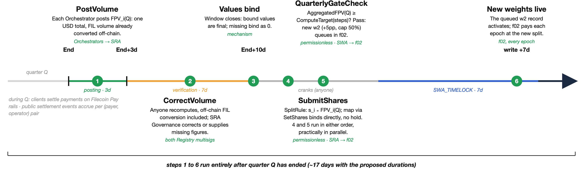
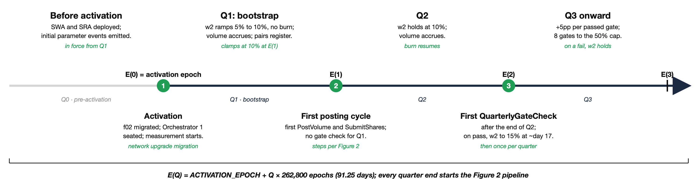

# FIP-0118: (Solstice) Deprecate Fil+ and Fund Services via Block-Reward Split

## Simple Summary

This FIP deprecates the Filecoin Plus (Fil+) datacap minting and
allocation system and replaces it with a two-part mechanism:

  - **PoRep sector quality no longer depends on content at L1.** Every
    new sector onboarded from the activation epoch automatically
    receives 10× QAP over its lifetime, realized immediately at
    onboarding regardless of content. Provisions are also made for
    upgrading existing sectors to 10× QAP. The initial pledge
    mechanism is unchanged.

  - **The block reward is split into streams.** At each block-reward
    issuance the minted reward is divided into named streams:

      - **Service stream** pays out to registered Service
        Orchestrators proportional to their on-chain service volume.
        The *Service Rewards Actor* (SRA), a new governed contract,
        holds and regulates the registry of Service Orchestrators.

      - **Consensus stream** pays the winning miner
        in the leader election mechanism, as today.
        
      - **Burn stream** pays to the burn actor.


The division among the streams happens according to **weights**: w0 for
the burn stream, w1 for the consensus stream, and w2 for the service
stream. These weights are set through another new governed contract,
the *Stream Weights Actor* (SWA), which at the time this FIP is accepted
and shipped has the following definition for the existing weights:

  - **w2** follows a volume-gated step-up: it starts at 5% and (after a
    bootstrap quarter) programmatically rises 5 percentage points per
    quarter, but only if the quarterly aggregated Filecoin Pay Volume
    (AggregatedFPV(Q), i.e., the sum of deal payments settled through
    Filecoin Pay over each registered Orchestrator's (payer, operator)
    pairs during quarter Q; see Section 2) is greater than or equal to
    a predefined USD-denominated target (Section 3.1.1). If this
    condition fails, w2 stays constant.
    
  - **w1** follows a published linear ramp down from 95% to 50% over ~9
    quarters.

  - **w0** is set as the remainder (i.e., `w0 = 1 − w2 − w1`) and is
    burned at each epoch, providing deflationary discipline whenever
    the service economy has not yet proven the volume to justify a
    larger portion.




*Figure 1: the two-level split. f02 divides each block reward among the streams by that epoch’s weights; each stream then pays its recipients by its own rule. Dashed elements (future streams, future Orchestrators) can be added later (Sections 2.4 and 3.2). The ~20M FIL / year issuance figure is indicative.*

## Abstract

The current incentive system (Fil+) successfully created network
capacity but did not fully support service creation and real demand from
paying customers bringing value into the Filecoin ecosystem. Emerging
initiatives such as the services in the recently launched Filecoin
Onchain Cloud (FOC) act on this and expand Filecoin's demand fit, but
cannot be supported by the current incentive system. We therefore
propose a change to the block reward and sector valuation mechanism to
support the network's evolution from a storage-capacity onboarding phase
to a service-oriented economy. Two main changes:

1.  **Deprecate datacap minting and the Fil+ allocation system.** All
    sectors onboarded from the activation epoch automatically gain 10×
    QAP for the sector lifetime, realized immediately at onboarding
    regardless of content. Provisions are also made for upgrading
    existing sectors to 10× QAP. The initial pledge formula is
    unchanged.

2.  **Split the block reward into weighted streams.** At each
    issuance, the built-in L1 Reward Actor (f02) divides the full block
    reward BR by weight:

      - `w2 * BR` to the *Service Orchestrator wallets* (service
        stream), accrued in f02 and withdrawn via a permissionless
        `Claim` (Section 2.4),
        
      - `w1 * BR` to the winning miner (consensus stream),

      - the residual `w0 * BR`, with `w0 = 1 − w2 − w1`, to the burn
        actor.

The weights are per-epoch values that f02 computes from cached, in-state
scheduler parameters and applies at each block-reward issuance. BR is
the newly minted block reward only: gas rewards remain paid in full to
the winning miner, and penalties are assessed as today (Section 2.4).
The split is unconditional and applies to all new block rewards.

The **Stream Weights Actor (SWA)** is the new governed contract that
computes all of the weight-schedule parameters and can update them over
time. Each update writes the new parameters into the L1 Reward Actor
(f02) and is subject to the activation timelock mechanism (see Section
4). The SWA can also add new streams, subject to the L1-enforced
constraint that the sum of all non-burn weights is at most 1. At
the time this FIP ships, the weight schedules for the existing
streams are as follows. The weight w1 ramps down from 95% to 50% over
roughly 9 quarters. During the first quarter (the bootstrap phase),
`w2 = 1 − w1` so no w0 share is scheduled and w2 reaches 10% by the
end of the quarter. From Q2 onward, w2 steps up by 5 percentage
points per quarter, never exceeding the ceiling `1 − w1`, and only
when on-chain aggregated Filecoin Pay Volume (FPV) clears the current
gate's target. The SWA is governed by **SWA Governance** (see Section
4).

The **Service Rewards Actor (SRA)** is the new governed contract
that computes how the service stream is divided among Service
Orchestrators: it holds the Orchestrator registry and, each quarter,
computes each Orchestrator's share of the stream. It is not on the value
path and holds no balance. A *Service Orchestrator* is a registered
party (represented on-chain by a wallet address in the registry) tasked
with turning the service stream into real, paying storage demand, for
example by funding client acquisition, integrations, migrations, and
service infrastructure; what it does with the funds is operational and
lies outside the protocol. Once the SRA writes the wallet-to-share map
into f02, f02 credits each registered Orchestrator wallet its share of
every block reward. In **Phase 1** (this FIP), the registry begins with
a single Orchestrator address and relies on the governance tier
responsible for the SRA (i.e., **SRA Governance**) to add or remove
Orchestrators (see Sections 3 and 4). Each Orchestrator is bound in the
registry to the (payer, operator) pairs in Filecoin Pay whose settled
volume counts toward it; bindings are unique (a pair belongs to at most
one Orchestrator), declared by the Orchestrator, and verified by the SRA
Governance. Incentive alignment comes from the system-level volume gate:
the service weight w2 rises only when on-chain volume settled through
Filecoin Pay clears the target. Accountability is layered on top: posted
volume is recomputable by anyone from public settlement events, so a
misreported figure is detectable and correctable, while distinguishing
genuine demand from self-dealing is an off-chain judgment assigned to
SRA Governance, which can remove an Orchestrator (Section
4.2). **Phase 2** (future) opens registration permissionlessly, enabled
by standardized on-chain attribution: service contracts expose the
Orchestrator binding through a standard metadata interface, to be
specified in a future FRC (see Sections 3.2 and 4.2).

## Change Motivation

Filecoin Plus was designed to direct a fraction of block rewards toward
storage service, and in particular toward storage in PoRep sectors of
genuinely useful data. At a high level, Fil+ and datacap are a
mechanism to implicitly create a dynamic split of the block reward
(storage mining allocation) between consensus incentives and service
incentives based on market forces (i.e., driven by the demand from
clients).

In practice, its fundamental limitation (the impossibility of
programmatically detecting "*useful data*") forced the system to rely
on an extensive human-review pipeline: root key holders, allocators,
datacap minting, compliance checks, and ongoing governance. This
dependency creates several problems: it slows down the onboarding
process for new clients, increases governance overhead, and makes the
system vulnerable to gaming, where high Fil+ activity does not correlate
with a high volume of legitimate data in deals (i.e., fake client demand).
See Discussion
[#1176](https://github.com/filecoin-project/FIPs/discussions/1176).
Therefore, today the implicit block reward split via datacap causes
substantial network resources to be spent on sectors delivering limited
ongoing client value.

This proposal resolves that tension by **shifting the signal** from
upfront data and demand classification to service delivery demonstrated
through on-chain payments. Rather than trying to predict which
data/service is 'real' or 'valuable', the Service Rewards Actor monitors
total payment volume (as a proxy for value created by the network) and
allocates a fraction of block rewards to the Service Orchestrator wallet
addresses. Any gap is burned. Over time the proportion of block reward
allocated to the Service Orchestrator will grow, but only as the network
clears defined levels of economic activity demonstrating growth in
demand.

This initiative also represents a significant opportunity to **simplify
the L1** protocol: the new system will result in a simpler, more predictable
L1 and tokenomics. By decoupling consensus and service economics, we get
a system where PoRep can exist for consensus security and services can
use whatever proving system the market demands rather than requiring
PoRep as the only pathway to block reward-linked service provision.

#### Could we just remove Fil+ and let the market work?

Removing Fil+ would support more onboarding and allow the block reward
to function as an indirect subsidy for service provision (e.g., an SP can
offer lower prices because they earn from mining). However, this action
would eliminate a crucial **protocol-level mechanism for encouraging the
transition to a service-oriented economy**. While one might argue that
genuine paying clients negate the need for this support, the reality is
that current *client payments are often too small compared to the cost
gap of storing real data* versus engaging in pure mining activities.
Without an incentive explicitly dedicated to service, SPs would
naturally prioritize pure consensus mining without providing
value-creating services. Therefore, reserving a portion of the block
reward for services is not merely an economic lever; it is a way to
define the **network's identity**. Filecoin's fundamental mission is to
be a storage service network, differentiating it from a generic network
that simply uses storage. Achieving this mission will ultimately benefit
all participants.

The replacement mechanism designed here (i.e., a single issuance
divided by governed weights into competing destinations), with some
weights adjusted by a measured signal, *is strongly inspired by
the subnet model pioneered by Bittensor and similar subnet-based
incentive networks* (e.g. BitRobot), where a fixed emission is split
across subnets by governed weights and redistributed according to a
measured contribution. We acknowledge that conceptual inspiration
explicitly. As in those systems, the weights are not static: they can
adjust over time in response to measured signals (here, the volume
gate on w2), letting the network learn the right division of issuance
rather than fixing it upfront.


We do **not** adopt the word “subnet.” In Filecoin, “subnet” already has
an established and different meaning: an IPC (InterPlanetary Consensus)
subnet, a Layer-2 / child network with its own consensus. Reusing the
term for “a named share of the block reward” would collide with that
meaning and mislead readers into expecting a separate consensus network,
sequencing, or settlement layer. None of that is involved here.

We therefore use “**stream**”: each stream is a named, weighted portion
of every block reward at issuance, defined by its recipients (who it
pays) and its weight (how large the portion is). The naming avoids a
term already taken in this ecosystem while keeping the design’s lineage
explicit.


#### Why a continuous ramp down for w1 (consensus reward stream weight)?

w1 is the price the network pays for its L1: consensus security,
blockspace, settlement, the execution layer that everything else
(including Filecoin Pay) runs on. The schedule reflects the fact that
the L1 needs to be funded indefinitely, but its value does not scale
with what is spent on it, so w1 ramps down to a 50% floor rather than to
zero. Security must be sufficient to protect what the chain settles and
to make attacks prohibitively expensive; beyond sufficiency, each
marginal FIL spent on consensus buys little additional security and no
additional demand. Spending nearly all issuance on consensus was the
right call during bootstrapping, when the reward had to build capacity
and security from zero. That phase is complete: raw power today far
exceeds any realistic attack budget, and the binding constraint on
Filecoin's future is now demand for paid services. The ramp therefore
reallocates spend from where marginal returns are exhausted to where the
network is actually constrained: proven service demand. And where demand
is not yet proven, the freed portion is burned, reducing dilution for all
participants rather than overpaying for security the network already has
in excess.
Why a scheduled decline rather than a one-time cut to 50%? Because the
safe level of consensus spend is uncertain and path-dependent: sector
economics amortize over multi-year lifetimes and power responds to
reward changes with a lag, so a single large cut risks an abrupt drop in
power and security margin. A predictable ramp lets the security budget
shrink at a pace the SP economy can absorb, and gives service builders a
credible trajectory to invest against rather than a promise of future
governance votes. Note that `1 − w1` is a ceiling, not a transfer: w2 only
steps up as volume targets are cleared, and the gap is burned.

#### Why the volume gate and burn mechanism?

The consensus weight w1 determines how much leaves consensus (i.e.,
`1 − w1`), while the service weight w2 and the volume gate govern how
much actually funds services.

  - **Don’t spend without proof**. The service weight (w2) can
    only step up when on-chain Filecoin Pay volume clears a verifiable
    target. If volume falls short, w2 stays unchanged and the
    registered Orchestrator addresses continue receiving at the
    previously proven rate.

  - **Burn what isn’t allocated.** The gap between what leaves
    consensus (`1 − w1`) and what is actually allocated (w2) is burned
    as `w0 = 1 − w2 − w1`. Why burn rather than leaving it in the
    consensus portion? Because continuing to reduce the consensus weight
    has meaningful benefits for the broader Filecoin economy, both
    through deflationary pressure and as a signal to attract serious
    service providers.

## Specification

### 1. Datacap Deprecation

**Deprecation principle.** After the upgrade epoch, the miner actor
never calls the verified registry (f06) or DataCap (f07) actors: every
QAP decision is computed from state already recorded on the sector.
Datacap is deprecated in full at the upgrade epoch: no minting, no new
allocations, no claims, no claim-term extensions. Disabling these
pathways at once is preferred over a wind-down because new sectors and
SnapDeals receive 10× QAP by default, so legacy datacap pathways add
complexity without utility.

This FIP supersedes the parts of [FIP-0045](./fip-0045.md) that make
quality-adjusted power depend on verified allocations and claims, and
the parts of [FIP-0084](./fip-0084.md) that give
`verified_allocation_key` on a piece manifest any effect. The field
remains on the wire and is accepted, but is ignored: quality-adjusted
power derives from sector state, not from allocations. Claim terms no
longer constrain sector expiration.

**1.1 Transition rules (at the upgrade epoch).**

  - No new datacap is minted; all minting and allocation methods are
    disabled.

  - Existing minted but unused datacap balances become inert: they can
    no longer be converted into allocations, and pending (unclaimed)
    allocations can no longer be claimed.

  - Existing sectors keep their current QAP; there is no retroactive
    change to power.

  - Existing claims become historical records: the miner actor no
    longer reads or updates them.

**1.2 New sectors, existing sectors and SnapDeals.**

  - All new sectors get 10× QAP by default; onboarding does not
    consult the verified registry.

  - `FULL_QA_POWER` on `SectorOnChainInfo` affects only QAP. When set,
    it grants `qa_power_max` regardless of content. Every onboarding
    path, SnapDeals, and `UpgradeSectorQuality` set it. Unflagged
    sectors retain legacy weight-derived QAP.

  - SnapDeals (`ProveReplicaUpdate3`) remain available: snapping data
    into CC sectors will grant 10× QAP automatically without Datacap.
    No datacap is minted, allocated, or consumed on this path. The
    update recomputes the initial-pledge requirement only when it
    raises the sector's QAP; when the new requirement exceeds the
    sector's recorded pledge, the positive difference must be locked
    before the update succeeds. A snap onto a sector already at 10×
    raises no QAP, so its recorded pledge is unchanged.

  - A committed-capacity sector predating this FIP sits at 1×, carrying
    no `FULL_QA_POWER` and no recorded weight regardless of when it was
    sealed. SnapDeals raises it to 10× once the update proof verifies,
    under the pledge rule above and independently of
    `UpgradeSectorQuality`.

  - `UpgradeSectorQuality` (method 37) is a batch method that upgrades
    existing sectors to 10× QAP under the same pledge rule. Any sector
    below 10× is eligible, including partially verified sectors; the
    upgrade tops the sector up to 10× QAP and its pledge up to the
    matching level. Each declaration may carry an optional new
    expiration, so a sector can be extended in the same call; without
    it, only the upgrade is applied.
    The method returns nothing; absent `new_expiration` is `null`.

    ```rust
    struct UpgradeSectorQualityParams { upgrades: Vec<UpgradeSectorQuality> }

    struct UpgradeSectorQuality {
        deadline: u64,
        partition: u64,
        sectors: BitField,
        new_expiration: Option<ChainEpoch>,
    }
    ```

  - The pledge is raised at most once, at the first upgrade, in either
    order of `UpgradeSectorQuality` and SnapDeals. A sector already at
    10× is not upgraded and its pledge is not raised; this is not a
    batch failure, so repeated calls lock nothing even if the pledge
    requirement has risen since. Such a sector is still extended if its
    declaration carries a new expiration, exactly as
    `ExtendSectorExpiration2` would.

  - Fee debt must clear from unlocked balance in the same message before
    a miner is eligible to use this method. Otherwise the whole call
    aborts.

  - The batch is atomic: an invalid declaration aborts the whole call
    and no declaration takes effect.

  - The daily fee follows the rule SnapDeals and extensions already
    share: the recorded fee scales in proportion to the power change,
    and upgrading a pre-FIP-0100 sector with no recorded fee turns zero
    into a fresh fee at the full 10× level.

  - Transitional: no post-upgrade path creates a sector below 10×, so
    once the legacy cohort expires the method can be retired. That cohort
    is bounded by the five-year seal-proof lifetime and the 1,278-day
    extension cap.

  - Expected behavior: most empty legacy CC sectors will be upgraded
    to 10×. CC sectors currently hold ~208 PiB of raw power (data as
    of 2026-07-04; source: filecoindataportal.xyz daily network
    metrics). If every 1× byte were snapped or extended to 10×,
    network QAP would gain approximately 9 × 208 = 1,872 PiB. That is,
    it would rise from \~14,760 PiB to \~16,632 PiB, a one-time increase
    of approximately 12.7%. For scale, the network is currently losing
    20 to 37 PiB of QAP per day net (trailing 30-day and 7-day
    averages), so the full bump equals roughly 2 to 3 months of the
    current net QAP decline, spread over time.

**1.3 Extensions: carry forward the recorded ratio**

  - `ExtendSectorExpiration2` no longer consults the verified registry:
    no `claim_space_by_sector` lookups, claim-term updates, or
    `term_max` checks. Datacap holdings are irrelevant, so extensions
    remain available to every sector after the cut-off without a forced
    retire-or-reseal decision.

  - `ExtendSectorExpiration2` currently extends sectors without
    recalculating initial pledge. Callers can submit or batch it without
    accounting for a pledge delta. Changing it to grant 10× would
    preserve wire compatibility but break that behavioral contract.
    Leaving pledge unchanged would fail to enforce the new collateral
    requirement; recalculating it could lock funds or reject calls that
    previously succeeded. This FIP therefore preserves it: extension
    carries the existing multiplier and pledge forward.
    `UpgradeSectorQuality` is the explicit opt-in to 10× and pledge
    recalculation.

  - Rule: carry forward the verified ratio already recorded on the
    sector. Compute
    `verified_space = verified_deal_weight / current_duration`, then
    set new `verified_deal_weight = verified_space × new_duration`.

  - Effect: extension does not change QAP for any sector, of any vintage.
    Before FIP-0045, verified weight could decay when deal terms ended;
    content no longer determines power, so that decay is removed. An
    unflagged legacy sector keeps its recorded multiplier, while a sector
    carrying `FULL_QA_POWER` remains at 10× independently of its weights.

  - `SIMPLE_QA_POWER` is no longer branched on. It remains set on new
    sectors and persisted on existing ones, but no code path reads it.

**1.4 Weight accounting cleanup.**

  - `deal_weight` is set to zero() going forward. For sectors without
    `FULL_QA_POWER`, only `verified_deal_weight` contributes to QAP;
    flagged sectors receive 10× QAP independently of both weights.

  - Refactor `DataActivationOutput` and `ReplicaUpdateActivatedData`
    around a single space notion (`verified_space` and
    `unverified_space` collapse into one size); consumers of these
    outputs are refactored accordingly.

  - The wider `deal_weight` vs `verified_deal_weight` redundancy
    cleanup is desirable but out of scope for this FIP.

**1.5 Actor changes and state migration.**

  - Every state-mutating method on the DataCap and Verified Registry
    actors rejects with `USR_FORBIDDEN`. Read methods continue to serve
    the frozen state.

  - DataCap: `Mint`, `Destroy`, `Transfer`, `TransferFrom`, `Burn`,
    `BurnFrom`, `IncreaseAllowance`, `DecreaseAllowance`, and
    `RevokeAllowance` reject. `Name`, `Symbol`, `Granularity`,
    `TotalSupply`, `Balance`, and `Allowance` continue to serve.

  - Verified Registry: `AddVerifier`, `RemoveVerifier`,
    `AddVerifiedClient`, `RemoveVerifiedClientDataCap`,
    `RemoveExpiredAllocations`, `ClaimAllocations`, `ExtendClaimTerms`,
    `RemoveExpiredClaims`, and the universal receiver hook reject.
    `GetClaims` continues to serve. Test-only Allocation creation is
    removed.

  - No Verified Registry actor event is emitted after the upgrade,
    because every path that emitted one now rejects.

  - An in-flight message gets no special treatment at the upgrade
    epoch: it executes under the rules of the epoch that includes it,
    whenever it was signed. The rejected DataCap and Verified
    Registry methods above reject it like any post-upgrade call. A
    direct call to one of them is a standalone message, so its
    failure is contained to that message; a caller that wraps such a
    write in a larger call sees the same rejection on the inner send.

  - No miner or market actor call fails because of the deprecation:
    the pathways from those actors into f06 and f07 become no-ops,
    not rejections. A message in flight across the boundary executes
    normally; allocation and claim references in its parameters are
    accepted and ignored (`verified_allocation_key` on a piece
    manifest, Section 1; claim declarations in
    `ExtendSectorExpiration2`, Section 1.3), and the call proceeds
    without the datacap effect it had before the upgrade.
    `DealProposal.verified_deal` is likewise ignored; it stays in state
    and `GetDealVerified` still returns it.

  - Migration (verified registry): none. Root key, verifiers and
    pending allocations remain in the frozen state as-is; every write
    method rejects, so the retained entries are inert.

  - Migration (market): remove `pending_deal_allocation_ids` from actor
    state, discarding entries for deals awaiting activation. Nothing
    reads them once the verified registry leaves the activation path.

  - `PreCommitSectorBatch2` keeps its `deal_ids` field for wire
    compatibility but rejects a non-empty value. [FIP-0084](./fip-0084.md)
    and [FIP-0101](./fip-0101.md) removed the last methods able to prove
    such a pre-commit; [FIP-0076](./fip-0076.md) anticipated removing the
    field then. Pre-commit no longer consults the market.

  - RKH: remove the signers of the f080 multisig in migration.

  - The miner actor treats a sector as containing data when either
    `deal_weight` or `verified_deal_weight` is non-zero. These fields
    continue to record actual piece data, not the 10× QAP entitlement,
    so the same test remains valid for termination and SnapDeals and no
    new data-presence signal is required.

**1.6 Others.**

  - Actor removal: once no live path touches them, a later network
    upgrade can delete the verified registry (f06), DataCap (f07), and
    RKH (f080) actors entirely.

  - Termination methods: no changes required.

### 2. Block-Reward Split

#### 2.1 Architecture overview

The two-level split is performed by the f02 built-in actor and
parameterized by **two governed contracts off the consensus path**. This
separates the **split among streams** ("weights") from the **split among
Orchestrators within the service stream** ("shares") (see Figure 1).

1.  **Reward actor (f02): the thin splitter (L1, built-in).** It holds
    an ordered list of stream records, each holding a *Weight* (the
    portion of the block reward the stream receives) and a
    *Distribution* (the stream's recipients). The split logic is fixed
    and simply iterates over whatever the list currently contains, so
    a new stream needs no new code to be paid. Adding a future stream
    is an on-chain list write rather than a network upgrade. By
    governance convention it still requires an accepted FIP. We begin
    with two stream records, Consensus and Service; Burn is the
    residual, computed each block rather than stored. At each
    block-reward issuance, f02 reads its own state, pays the winning
    miner, accrues the service portion for its wallets to withdraw
    via `Claim` (Section 2.4), and burns the remainder.

2.  **Stream Weights Actor (SWA): the split AMONG streams.** It
    registers or removes streams and sets each stream's *Weight record*.
    Each stream's designated writer sets the wallets and shares within
    that stream. f02 itself enforces the hard guardrails (`Σ_i w_i = 1`,
    caps on the number of streams and recipients, and an activation
    timelock).

3.  **Service Rewards Actor (SRA): the split AMONG Orchestrators.** It
    computes the Orchestrator *Shares* `s_i` and holds the registry (which
    client payers, scoped by operator, are attributed to which
    Orchestrator). Each quarter it computes the Orchestrator shares from
    verifiable volume and writes the wallet-to-share map into f02; it
    never receives or holds value.

#### 2.2 Quarterly cycle

Quarters are consecutive `EPOCHS_PER_QUARTER`-epoch windows counted from
the activation epoch, both fixed at SRA deployment (initial values,
Section 3.2).



*Figure 2: one quarter, end to end. Quarter Q ends at epoch `E(Q) = ACTIVATION_EPOCH + Q * EPOCHS_PER_QUARTER`; the figure's numbered steps 1 to 6 all run after E. Durations shown (3-day posting, 7-day verification) are the initial mainnet values, fixed at SRA deployment (Section 3.2); `SWA_TIMELOCK` is 7 days (Section 2.4). `QuarterlyGateCheck` (4) and `SubmitShares` (5) are independent and can run in either order. FIL-to-USD conversion (Section 2.3) happens off-chain, before posting.*

Once per quarter, off the per-epoch path:

1.  **Volume reporting**. An off-chain indexer computes `FPV_i(Q)` (see
    definition below) from public Filecoin Pay settlement events,
    grouped by the (payer, operator) pair and summed over each
    Orchestrator's registered pairs, and denominated in USD
    throughout: admitted-stablecoin settlements (USDFC and bridged dollars admitted by SRA Governance, Section 3.2) count at face value,
    and FIL-denominated settlements are converted to USD by the same
    indexer, off-chain, applying the fixed FIL pricing rule of Section
    2.3 (qualifying fee-auction prints).
    `FPV_i(Q)` is therefore a single USD-denominated figure. Each
    Orchestrator verifies its own figure and posts it to the SRA via
    `PostVolume`. The posted value is accepted optimistically: because
    the pricing rule is fixed and every input it consumes (settlements
    and fee-auction claims) is a public on-chain event, the entire
    figure remains deterministically recomputable by anyone, exactly
    as if the conversion still ran on-chain, so a misreport is
    detectable by any observer. A posted value binds only
    at the close of the verification window (mechanics below): a wrong
    value is corrected before it binds via `CorrectVolume`, and SRA
    Governance may remove the Orchestrator that posted it
    (Section 4). The SRA stores each Orchestrator's bound value; the
    aggregated value is their sum,
    `AggregatedFPV(Q) = Σ_i FPV_i(Q)`.

2.  **Verification window mechanics.**

    1.  Let quarter Q end at epoch E. Posting: each Orchestrator posts
        `FPV_i(Q)` to the SRA during the posting period (E, E +
        `POST_PERIOD`].

    2.  Verification: the verification window is a fixed phase of the
        quarter timeline, (E + `POST_PERIOD`, E + `POST_PERIOD` +
        `VERIFICATION_WINDOW`], and opens when the posting period
        ends, whether or not values were posted; both durations are
        fixed at SRA deployment (initial values, Section 3.2). Their
        sum is strictly less than `EPOCHS_PER_QUARTER`, so quarter Q's
        verification window closes before quarter Q+1's posting period
        opens and the per-quarter timelines never overlap; the SRA
        rejects deployment parameters that violate this bound. A
        deployment tuned for test networks (shorter quarters or
        windows) must keep the same bound. During the window every
        posted value
        is public and recomputable by anyone; a mismatch or a missing
        value is flagged in the [governance
        repository](https://github.com/filecoin-project/solstice-governance/),
        and SRA Governance corrects a wrong value or supplies the
        recomputed
        figure for an Orchestrator that did not post, both via
        `CorrectVolume`.

    3.  Binding: whatever each value is when the window closes binds,
        and bound values are final for the quarter. A value neither
        posted nor supplied binds as 0, so a non-poster cannot block
        the quarter. SRA Governance is responsible for supplying the
        publicly recomputable value before the window closes; if it
        does not, the zero value safely depresses the gate.

    4.  `SubmitShares` and `QuarterlyGateCheck` become callable only
        after the window closes and read only bound values, with
        `AggregatedFPV(Q)` the sum of bound values. There is no
        retroactive clawback: a misreport discovered after binding is
        grounds for audit or removal (Section 4). Its share-map
        effect is bounded to that quarter. A gate it wrongly passes is a
        standing w2 step, reversible only by a FIP-backed discretionary
        write with the matching `steps` adjustment (Sections 3.1.1 and
        4.2).

    5.  Determinism: `FPV_i(Q)` is fully determined by (i) settlement
        events from admitted Filecoin Pay contracts: stablecoin
        settlements whose settlement epoch falls in quarter Q, and
        FIL settlements whose pricing print clears in quarter Q (the
        FIL pricing rule, Section 2.3), (ii) each rail's operator as
        fixed at rail creation, (iii) the registry binding in force
        at each settlement's epoch (the application rules below),
        (iv) gross settled value in the
        settlement asset: admitted stablecoin amounts at face USD
        value, FIL amounts in attoFIL, (v) the set of Filecoin Pay
        contract addresses admitted by SRA Governance effective for
        quarter Q, and (vi) the qualifying prints of quarter Q,
        themselves public fee-auction claim events on the same
        admitted contracts.
        Every input is an event at or before quarter Q's last epoch,
        and posting opens only after that epoch, so nothing done
        after a quarter closes changes its measurement.
        **Application rules.** An Orchestrator claims a payer by
        binding the (payer, operator) pair to itself
        (`RegisterPairs`, Section 3.2); the pair's settlements then
        count toward its `FPV_i(Q)` (Section 2.3). A registration
        applies from its call epoch and also covers the pair's
        unbound past inside the same quarter, back to the later of
        the quarter's first epoch and the epoch the pair last became
        unbound, so a payer's settlements count from the quarter's
        start however long its Orchestrator takes to register the
        pair. A registration made
        less than `REGISTRATION_CUTOFF` before a quarter boundary
        applies from that boundary and covers nothing of the ending
        quarter, so no claim can reach a quarter that closes before
        governance had the full cutoff to contest it (Section 3.2).
        A reassignment applies per its `inherit` argument (Section
        3.2); a release by removal applies at the release epoch. No
        binding applies before its Orchestrator's admission does
        (Section 3.2); the admitted lists and the pricing parameters
        keep the next-quarter rule, so no quarter already being
        measured changes scope under the Orchestrators (Section
        3.2). A verifier reconstructs the binding timeline from the
        registry events every change emits.
        The FIL component is converted to USD
        off-chain, by the same indexer and at the same point it
        computes the rest of `FPV_i(Q)` (step 1 above), applying the
        qualifying prints of (vi). The conversion is a fixed algorithm
        over public inputs, so where it executes does not change what
        it produces: it is equally recomputable by anyone. This
        paragraph is the normative algorithm; a versioned reference
        implementation of the indexer is maintained in the governance
        repository.

3.  **Read state.** Every bound `FPV_i(Q)` is already USD-denominated:
    the FIL contribution was converted off-chain, by the Orchestrator's
    indexer, before it was ever posted (step 1). There is no separate
    on-chain conversion pass. Once quarter Q's verification window
    closes, the SRA's read view exposes `AggregatedFPV(Q)` in USD
    directly from the bound values. The SWA reads this figure from SRA
    state; it never sees raw FIL amounts and performs no conversion of
    its own. Because the gate comparison and `SplitRule` both read the
    same bound values, the execution order of `QuarterlyGateCheck` and
    `SubmitShares` cannot produce diverging numbers.

4.  **Weights and shares updates.** `QuarterlyGateCheck` compares the
    USD-denominated `AggregatedFPV(Q)` against the current gate's fixed
    USD target, indexed by gates passed rather than by the quarter
    number (Section 3.1.1). If it passes, the SWA raises w2 via
    `StepWeightRecords` (Section 2.4.9), the uncancellable gate write.
    `SplitRule` sets each Orchestrator's
    share in proportion to its USD-denominated `FPV_i(Q)`, using the
    same bound values as the gate, and the SRA writes the
    wallet-to-share map into f02 via `SetShares`, which binds
    immediately (Section 2.4.4). Orchestrators removed before
    the close of the posting period are excluded from both
    computations: they are omitted from the submitted share map
    (shares in the map must be positive, Section 2.4.4) and their FPV
    does not enter `AggregatedFPV(Q)` (Section 3.2).
    This rule covers every removal: `RemoveOrchestrator` is not
    callable while an ended quarter awaits its share map (Section
    3.2), so no removal can bind between the close of the posting
    period and `SubmitShares`.

    Quarter 1 runs this full pipeline with one exception: no gate
    check. Posting, verification, binding and `SubmitShares()` proceed
    as in any other quarter, and the first quarter's posting is
    required even though it gates nothing: the Orchestrator posts on
    chain and the bound values set the shares. Only `QuarterlyGateCheck`
    is skipped, because the bootstrap ramp performs the 5% to 10% move
    ungated (Section 3.1.1).

    Quarter 1's registry inputs need no special rule. The SWA and SRA
    are deployed before activation (Backwards Compatibility). The
    Orchestrator seated at activation is fixed by the activation
    migration (Section 2.4.10), not admitted through
    `AddOrchestrator`, and counts as admitted from quarter 1's first
    epoch, so it registers pairs and posts volume in quarter 1 like
    any admitted Orchestrator. SRA Governance installs the rest of
    the initial state (the admitted lists, the pricing parameters,
    `REGISTRATION_CUTOFF`) through the ordinary methods before the
    activation epoch, each emitting its event; a change binding
    before the activation epoch applies from quarter 1's first
    epoch. Client pairs need no pre-activation install: a
    registration during quarter 1 covers the pair's unbound past back
    to the activation epoch, the same rule as any quarter (the
    application rules above).



*Figure 4: launch sequence, from pre-activation (Q0, informal) to the first gate check after Q2. Each quarter end starts the Figure 2 pipeline.*

#### 2.3 FPV definitions

  - **Per-Orchestrator Filecoin Pay Volume (quarterly):** `FPV_i(Q)` is
    the volume settled on Filecoin Pay rails whose (payer, operator)
    pair is in Orchestrator i’s registered set. The atom is the rail,
    and each rail carries exactly one (payer, operator) pair. In other
    words:

      - **`FPV_i(Q)`** = gross value settled over Filecoin Pay rails in
        quarter Q, scoped to the Orchestrator’s registered (payer,
        operator) pairs:

          - `Σ total_settled_amount` over `RailSettled` events, **plus**

          - `Σ (net_payee_amount + operator_commission + network_fee)`
            over one-time-payment events (gross
            **reconstructed**, since the one-time-payment table stores
            no gross field), within Q's block window.

          - "In quarter Q" is asset-dependent: a stablecoin
            settlement belongs to Q when its settlement epoch falls
            in Q; a FIL settlement belongs to Q when its pricing
            print clears in Q (the FIL pricing rule below), which is
            always strictly after the settlement in execution order
            (*Print ordering* below).

          - Attribution is keyed on the (payer, operator) pair;
            residual collisions (two Orchestrators, same client, same
            operator) are excluded by the contract (see Section 3.2).
            A settlement counts for the Orchestrator whose binding
            covers its epoch (the application rules, Section 2.2), so
            a quarter's attribution is fixed the moment the quarter
            closes.
            Indeed, the SRA enforces that each (payer, operator) pair
            is bound to at most one Orchestrator, so a registration
            that duplicates an existing binding reverts. Verification
            that a declared payer genuinely belongs to an Orchestrator
            is offchain dispute-driven: declarations are accepted by
            default; because duplicate bindings revert, a false claim
            surfaces exactly when the legitimate Orchestrator attempts
            to register the same pair, and SRA Governance resolves the
            contested binding, requesting evidence of the client
            relationship up to a signed client attestation.
            Anti-self-dealing checks on the self-declared lists remain
            an SRA Governance audit duty (Section 4.2).

  - **One total by construction.** The per-Orchestrator value
    `FPV_i(Q)` is the atom. The aggregated value is defined as their
    sum, `AggregatedFPV(Q) = Σ_i FPV_i(Q)`. The SWA’s gate reads
    exactly this sum and never independently re-measures global
    on-chain volume, so the aggregated value used by the gate and the
    aggregated value computed by the SRA are the same object and cannot
    diverge.

  - **FIL pricing rule.** FIL-denominated volume is priced without
    any third-party oracle, using Filecoin Pay's own fee auctions as
    the price source. Filecoin Pay accumulates its network fees in
    the tokens rails settle in; the non-FIL fees are periodically
    claimed by keepers who pay FIL (which is burned) for the
    accumulated tokens. Each such claim of an admitted stablecoin is
    an on-chain market print: a lot of $Y face value claimed for X
    FIL implies a price of Y/X USD per FIL. Note this is a price
    *reading* only: FIL settlements themselves never go through an
    auction, and their fee burn is unchanged. Each Orchestrator's
    indexer applies this rule off-chain, when it computes `FPV_i(Q)`
    (Section 2.2); the rule is fixed and every input is a public
    on-chain event, so its output is exactly reproducible by anyone
    regardless of who computes it.

      - *Qualifying print.* A fee-auction claim, on an admitted
        Filecoin Pay contract, of an admitted stablecoin, whose lot
        face value is at least `MIN_LOT` and whose implied rate
        deviates from the last qualifying print (for the first
        prints, from the seed reference, *Band seeding* below) by no
        more than `PRICE_BAND`. Lots below `MIN_LOT`, or priced
        outside the band, still auction and burn normally; they just
        do not price. `MIN_LOT` exists because the competitive-bidding
        defense fails on dust lots: nobody races to claim a
        sub-gas-cost lot, so its Dutch price can decay far past fair
        value and mint an artificially high FIL/USD print;
        `PRICE_BAND` catches the same failure mode on a larger lot in
        a thin auction.

      - *The rule.* Each FIL settlement is converted at the implied
        rate of the first qualifying print strictly after it in
        execution order (*Print ordering* below), and is attributed
        to the quarter in which that print clears. Equivalently: each
        qualifying print prices the FIL volume of the period ending
        at it. "Strictly after" is load-bearing for the security
        argument: the pricing print always executes after the
        settlement, so the rate applied to a settlement is never
        known when transacting; under an "at or after" reading, a
        print and a settlement bundled into the same epoch could be
        priced at a rate known when transacting.

      - *Print ordering.* The rule needs a total order over prints
        and settlements in three places: which print prices pending
        volume (first qualifying print strictly after), which print
        is the band reference (last qualifying print), and which
        prints form the seed window (*Band seeding* below). Events
        are ordered by (epoch, canonical message execution order
        within the tipset, order of the call within the message's
        execution trace). The first two components are
        protocol-defined; the third disambiguates one transaction
        making several claims or settlements, for example through a
        multicall. Two prints in the same epoch are therefore never
        ambiguous, and every verifier reproduces the same order and
        the same totals.

      - *Band seeding.* The band check compares against the last
        qualifying print, so it cannot apply to the first print:
        there is no reference yet, and anchoring the band on a
        single first print is fragile (an off-market first print
        would fix a reference that later, correct prints cannot
        satisfy, and the reference could never update, because
        updating requires a print to qualify). Instead, no FIL
        volume is priced until five fee-auction claims have met
        every qualifying condition except the band check; the
        initial band reference is the median of those five implied
        rates, taken as the middle rate pair under
        cross-multiplication ordering (*Conversion arithmetic*
        below), not as a decimal median. From the sixth print on,
        the rule applies exactly as written above. The seed prints
        themselves price no volume: FIL volume settled during the
        seed window waits, per the roll-forward rule, for the first
        qualifying print after the seed, and as always can only be
        under-counted, never over-counted.

      - *Roll-forward, no fallback needed.* The FIL volume settled
        after a quarter's last qualifying print is priced by, and
        attributed to, the next quarter's first print: nothing is
        zeroed, nothing needs correcting mid-window, and every
        settlement counts exactly once. During a period with no qualifying prints, pending FIL volume simply waits for the next print; if qualifying prints stop entirely, it stays uncounted. The rule
        can only under-count, never over-count.

      - *Parameters.* `PRICE_BAND` (maximum deviation from the last
        qualifying print's implied rate for a print to itself
        qualify; the thin-auction guard) and the two `MIN_LOT`
        parameters `MIN_LOT_FLOOR` and `MIN_LOT_ALPHA` (next bullet).
        The SRA neither stores nor reads these values. SRA Governance
        sets them through a parameter write, under the same change
        lifecycle as the admitted lists (Section 3.2), whose only
        effect is to emit an event recording the new values; the
        event history is the single public, timestamped record of the
        parameters, and it fixes the off-chain algorithm every
        indexer, and every verifier, must apply. A parameter write
        applies from the next quarter boundary, the same rule as the
        admitted lists (Section 3.2), so no quarter already being
        measured changes under the Orchestrators: the values in
        force for quarter Q are those of the most recent parameter
        event before Q's first epoch. Keeping no on-chain state
        reduces friction and
        removes any dispute about what a contract read; enforcement
        is the verification window, where any observer recomputes the
        posted totals under the parameters in force (Section 2.2).
        Initial values are installed by the pre-activation parameter
        write (Section 2.2) and listed in the recap table at the end
        of this section. There is no cap on how many
        qualifying prints a quarter may use, and so no merging step:
        bounding and merging pricing periods only mattered when each
        period's print data had to be submitted and iterated
        on-chain; an off-chain indexer simply prices every FIL
        settlement at its own qualifying print.

      - *Minimum lot.* `MIN_LOT` is not a constant: a threshold that
        prevents manipulation at scale would reject every print in
        today's small auctions, so it scales with realized volume:

        `MIN_LOT(Q) = max(MIN_LOT_FLOOR, floor(MIN_LOT_ALPHA * BoundVolume(Q-1) / N(Q-1)))`

        where `BoundVolume(Q-1)` is the previous quarter's aggregate
        bound volume (final, on-chain) and `N(Q-1)` is the number of
        fee-auction claims that actually cleared on admitted Filecoin
        Pay contracts in that quarter.
        `BoundVolume(Q-1) / N(Q-1)` is bound volume per cleared
        claim: a scale reference that grows with realized volume,
        not the realized average lot. The auctions clear only the
        fees accumulated on non-FIL settlements (FIL pricing rule
        above), so actual lots are far smaller than the reference;
        `MIN_LOT_ALPHA` sets how far below it the threshold sits,
        never below `MIN_LOT_FLOOR`.
        `MIN_LOT_ALPHA` is a rational; the parameter event carries it
        as a numerator and a denominator. Every multiplication in the
        rule is taken first, in arbitrary-precision integers, and the
        one division floors, so no intermediate is fractional. The
        floor lowers the threshold by less than one atto-USD, the
        permissive direction, ~1e-18 of a dollar-scale threshold. In
        the first quarter there is no bound previous quarter, so
        `MIN_LOT(1) = MIN_LOT_FLOOR`; a later quarter whose
        predecessor cleared no fee-auction claim falls back the same
        way: `N(Q-1) = 0` gives no reference, and `MIN_LOT(Q) =
        MIN_LOT_FLOOR`.
        `MIN_LOT(Q)` is evaluated off-chain from the two governance
        parameters and public on-chain data; it is not stored
        anywhere. Because the threshold inherits from
        `BoundVolume(Q-1)`, a mispriced quarter propagates into the
        next quarter's threshold; `MIN_LOT_FLOOR` bounds this from
        below, and retuning the two parameters is the correction
        path.

      - *Conversion arithmetic.* Four constraints make the rule
        bit-exact across independent implementations. (i) Units: lot
        face value in atto-USD (the admitted stablecoin's amount
        normalized to 18 decimals), claim and settlement amounts in
        attoFIL, and the posted `FPV_i(Q)` total in atto-USD.
        (ii) The implied rate is never computed as a number: it
        stays the integer pair `(lotUsd, claimFil)`, and the
        `PRICE_BAND` check and any comparison of rates (including
        the seed median) are done by cross-multiplication.
        (iii) There is exactly one rounding step, once per pricing
        period: `usd = floor(period's total attoFIL * lotUsd /
        claimFil)`; aggregate first, divide once, round down.
        Flooring is consistent with the rule's stated direction
        (under-count, never over-count), and flooring per period
        matches "each qualifying print prices the period ending at
        it". (iv) All of the above is arbitrary-precision integer
        arithmetic; floating-point arithmetic is forbidden anywhere
        in the rule, as the cheapest way to lose bit-exactness
        across languages.

  - **Filecoin Pay contract versions.** "Filecoin Pay" refers to the
    set of Filecoin Pay contract addresses admitted by SRA Governance
    (the same mechanism used for the stablecoin whitelist, Section
    3.2). `FPV_i(Q)` counts only settlement events emitted by admitted
    addresses. As new Filecoin Pay versions are deployed, SRA
    Governance updates the admitted list; no protocol change is
    required. A list update applies from the next quarter boundary
    (Section 3.2), so within any one quarter both admitted lists are
    constant, which is what lets the determinism clause treat them
    as fixed "for the whole quarter".

Recap of the values the off-chain measurement depends on:

| Value | Role | Kind | Source | Initial (mainnet) | Changes? | Edge cases |
| --- | --- | --- | --- | --- | --- | --- |
| `PRICE_BAND` | Thin-auction guard: maximum deviation of a print's rate from the band reference | Governance parameter | Parameter events | 30% | Next quarter boundary | The first prints have no reference: *Band seeding* above |
| `MIN_LOT(Q)` | Dust-lot guard: minimum lot face value for a print to qualify | Derived each quarter, off-chain; stored nowhere | `max(MIN_LOT_FLOOR, floor(MIN_LOT_ALPHA * BoundVolume(Q-1) / N(Q-1)))` | Derived | Recomputed each quarter; not directly settable | Q = 1 or `N(Q-1) = 0`: equals `MIN_LOT_FLOOR` |
| `MIN_LOT_FLOOR` | Input to `MIN_LOT(Q)` | Governance parameter (atto-USD) | Parameter events | $0.50 (5 * 10^17 atto-USD) | Next quarter boundary | None |
| `MIN_LOT_ALPHA` | Input to `MIN_LOT(Q)` | Governance parameter (rational: numerator and denominator) | Parameter events | 1/400 | Next quarter boundary | Retuned when needed |
| `BoundVolume(Q-1)` | Input to `MIN_LOT(Q)` | Measured (atto-USD) | SRA state: sum of Q-1's bound FPV values | Measured | No: immutable once bound | Missing for Q = 1 |
| `N(Q-1)` | Input to `MIN_LOT(Q)` | Measured (count) | Fee-auction claims cleared on admitted Filecoin Pay contracts in Q-1 | Measured | No: immutable history | May be zero |
| Admitted lists | Scope prints and FPV: a print is a claim on an admitted contract, of an admitted stablecoin | Governance parameter, event-only | `SetAdmittedLists` events | Installed pre-activation (Section 2.2) | Next quarter boundary | None |
| Band reference | The rate the band is measured around | Derived per print | The last qualifying print's `(lotUsd, claimFil)` pair | Seeded | At each qualifying print | Seeded by the five-print median (*Band seeding* above) |
| `REGISTRATION_CUTOFF` | Late-claim guard: a registration in the last cutoff of a quarter applies from the boundary (Section 2.2) | Governance parameter | Parameter events | 20,160 epochs (7 days) | Next quarter boundary | None |


*Figure 3: FPV has one conversion point: each Orchestrator's indexer, off chain, before `PostVolume`. On chain, USD only.*

#### 2.4 L1 actor changes (f02)

f02 becomes the stream engine. Every block it evaluates the weight
records held in its own state, pays the winning miner the consensus
portion, accrues the service stream's portion, and burns the exact
residual; SWA writes queue inside f02 under a timelock and apply when
due. Settlement of `EXPLICIT` streams is pull, not push: f02 accrues
each stream's portion per block and recipients withdraw it with an
explicit message, the permissionless `Claim` method. Value leaves f02 in
exactly three ways: the consensus payment inside `AwardBlockReward`, the
burn send to f099, and `Claim`.

Pull settlement is chosen over per-epoch push for three reasons.
Churn: f02's state is rewritten every block, and push puts per-recipient
state writes on that path forever, where accrual is one integer
increment in a block already being rewritten. Observability: per-stream
accrual and per-wallet entitlements are a state read at any epoch, and
every payout is an ordinary message with the transfer in its receipt,
where push buries transfers in implicit executions that need a replay
to see. Failure modes: the consensus path performs no send that can
fail, and a failed `Claim` reverts and leaves the entitlement in place,
so no failed-send rule is needed. The cost is that someone must send a
message and pay gas to be paid; `Claim` is permissionless and funds can
only go to the wallets the share map names, so a keeper can settle on
a recipient's behalf.

##### 2.4.1 Streams, weights and distributions

1)  **Stream**: a named, weighted portion of the block reward:
    Stream = { id, `WeightRecord`, Distribution }.

    1.  **id**: assigned by the SWA at `RegisterStream` and opaque to
        f02, which enforces uniqueness across the live streams, the
        tombstones (Section 2.4.6) and any pending `RegisterStream`
        write, checked at queue time. The SWA keeps the id-to-purpose
        mapping. The migration pins consensus = 1 and service = 2,
        matching the w1/w2 subscripts; 0 is reserved (could be used
        to signify the burn stream).

    2.  **Weight record**: the bundle of scheduler parameters for one
        stream weight, { `v_start`, slope, `t_start`, floor, cap }.
        Written only by the SWA (see the methods below).

        1.  **`v_start`**: the weight at `t_start`, within the clamp
            band. A ramp that begins moving later is expressed with a
            future `t_start` (evaluation before `t_start` clamps at
            the band edge), not with an out-of-band anchor.

        2.  **slope**: the weight's change per epoch over this segment;
            negative for a declining ramp (w1), positive for a rising
            ramp (w2 during the Q1 bootstrap), and 0 for a weight held
            flat over the segment (w2 from Q2 onward, between gate
            steps)

        3.  **`t_start`**: the epoch the segment starts from

        4.  **floor / cap**: clamp bounds

    3.  **Distribution**: the stream's recipients and how the stream
        is split among them. There are two possible values. `IMPLICIT`:
        nothing stored; f02 resolves the recipient from protocol
        state. The consensus stream is `IMPLICIT`, its recipient being
        the block winner chosen by leader election each epoch.
        `EXPLICIT`: the stream's stored recipient state, updated only by
        the stream's designated **writer** (the SRA for the service
        stream; never a payee). An `EXPLICIT` distribution holds the
        writer's address and three wallet-keyed tables:

        1.  **shares**: the stored wallet-to-share map, f099 rows
            removed, written via `SetShares`;

        2.  **payable**: per-wallet amounts carried over from closed
            periods, not yet claimed;

        3.  **`claimed_period`**: per-wallet amounts already claimed
            against the current period's accrual.

        A future stream paying any fixed set of wallets needs no
        separate form: it is the plain `EXPLICIT` case.

Weight and Distribution are orthogonal: a stream picks each
independently, so registering a new stream means giving it a Weight
and a Distribution and, when `EXPLICIT`, naming its single writer. f02
is not involved in calculating the stream's share distribution. The
writer contract computes the shares off the per-epoch path and pushes
the map through `SetShares`; f02 applies that map when dividing the
stream. f02 stores only the writer's address and the current map,
never the rules. For the service stream, `SplitRule` over FPV volumes
lives inside the SRA contract and governance process, leaving f02
agnostic.

2)  **Stream list**: the ordered list of Stream records f02 holds in
    state. Stream membership changes only through the SWA
    (`RegisterStream` / `RemoveStream`); within a stream, the `EXPLICIT`
    tables change through its designated writer (`SetShares`) and
    through `Claim`.

3)  **`ComputeWeight`**: f02 evaluates each weight with one function
    implementing a clamped linear segment. Because each weight is a
    deterministic function of the epoch, f02 keeps advancing with no
    SWA input: a deadlocked, compromised or abandoned SWA stalls
    future schedule changes, never the split itself.

```
WeightRecord = { v_start, slope, t_start, floor, cap }   // one record per stream

func clamp(x, lo, hi) -> Fraction:
    return max(lo, min(hi, x))

func ComputeWeight(w WeightRecord, e Epoch) -> Fraction:
    return clamp(w.v_start + w.slope * (e - w.t_start), w.floor, w.cap)

// per-epoch weights, all evaluated by the same function:
w1(e) = ComputeWeight(W_consensus, e)  // linear: slope < 0, floor = W1_FLOOR, cap = W1_START
w2(e) = ComputeWeight(W_service, e)    // Q1: linear bootstrap record mirroring w1's ramp;
                                       // Q2 onward: constant record stepped by the gate
w0(e) = 1 - Σ_{i>=1} ComputeWeight(W_i, e)  // residual over all streams; never stored
```

4)  **Fixed point**: `v_start`, `floor`, `cap`, and shares are fractions,
    stored as u64 fixed point with `DENOM = 10^18`; `slope` is signed
    i64 fixed point so a weight can decline. At that scale the
    percentages in this FIP are exact integers, and wire shares sum to
    one under the exact check `Σ shares == DENOM`; admission leaves
    `stored_share_total <= DENOM` (Section 2.4.4). The
    weight-times-reward multiply promotes to a big integer and divides
    with floor. Slope quantization over the 9-quarter ramp is ~1e-10 of
    a percentage point at this scale, and the clamp endpoints are
    stored exact, so w1 comes to rest at exactly its 50% floor. Token
    amounts are attoFIL big integers.

##### 2.4.2 State

The pre-upgrade f02 state is an 11-field tuple; this migration produces
the 15-field tuple below. Per-block counters, accruals, and epochs remain
inline. Stream configuration, recipient accounting, tombstones, and the
queue live behind one CID, read every award for weights and liabilities
but rewritten only by stream mutations or a due transition.

| Field | Change |
|---|---|
| `total_minted_reward` (position 9) | Renamed from `total_storage_power_reward`, position kept. Accrues the full block reward, all streams (Section 2.5). |
| `simple_total`, `baseline_total` (positions 10, 11) | Deleted: retired to the code constants below, as the existing state comment anticipates ("can be moved from state back into a code constant in a subsequent upgrade"). |
| `total_burn_minted` | New counter: cumulative award burn, including the w0 residual and f099 share-map remainder. |
| `total_explicit_minted` | New counter: cumulative `EXPLICIT` accrual after the f099 remainder is removed. |
| `accrued[id]` | New, one per `EXPLICIT` stream: the current period's accrual after the f099 remainder is removed. |
| `swa_timelock_epochs` | New: the SWA timelock in epochs (`SWA_TIMELOCK`), set per network by the migration and never written afterwards. Mainnet: 20,160 epochs (7 days); test networks may set it shorter. |
| `swa_actor` | New: the SWA address in ID form, set by the activation migration, with no setter. |
| `streams_root` | New CID: the stream list, the tombstones and the pending-write queue. |

The retired fields become the code constants
`SIMPLE_TOTAL` = 330,000,000 FIL and
`BASELINE_TOTAL` = 768,335,872,210,768,889,362,796,814 attoFIL. The
nominal allocations are 330M and 770M FIL, the simple and baseline
shares of the storage-mining allocation, and the genesis constants
in the reward actor still say so; the actors-v2 migration then wrote
an adjusted `baseline_total` into state to keep minting continuous
across its baseline-function fix, and it is that adjusted value, not
the nominal 770M, that has governed mainnet minting since. This FIP
canonicalizes mainnet's value across all networks rather than
carrying either field forward, so a network whose stored value
differs (calibnet) adopts the mainnet constant at the upgrade. Both
constants are exactly what mainnet f02 state holds at positions 10
and 11 today: anyone with a node can confirm them by reading the
reward actor state at any pre-upgrade epoch, and the Test Cases
section requires the functional check that reward computation is
unchanged by the substitution.

Encoding follows Filecoin's canonical IPLD conventions:

  - each Rust struct below is a DAG-CBOR tuple, encoded as an array in
    field order; logical maps use ordered entry arrays, not CBOR maps;
  - `TokenAmount`, `Spacetime`, and other big integers are byte strings:
    one sign byte (`00` non-negative, `01` negative), then big-endian
    magnitude, empty for zero; `FilterEstimate` is a pair of such integers;
  - `Address` is Filecoin address bytes in ID form: protocol byte `00`,
    then the LEB128 actor ID; stored addresses are normalized to this form;
  - `Option<T>` is null or `T`; `PendingWriteOp` is its displayed unsigned
    integer discriminant; `RawBytes` is a CBOR byte string wrapping a
    separately encoded operation payload tuple;
  - `accrued`, `streams`, and `tombstones` have unique ascending stream
    IDs; recipient tables have unique ascending recipient IDs; and
    `pending_writes` is ordered by effective epoch, preserving admission
    order at equal epochs.

```rust
struct State {
    cumsum_baseline: Spacetime,             //  1
    cumsum_realized: Spacetime,             //  2
    effective_network_time: ChainEpoch,     //  3
    effective_baseline_power: StoragePower, //  4
    this_epoch_reward: TokenAmount,         //  5
    this_epoch_reward_smoothed: FilterEstimate, // 6
    this_epoch_baseline_power: StoragePower, // 7
    epoch: ChainEpoch,                      //  8
    total_minted_reward: TokenAmount,       //  9 renamed
    total_burn_minted: TokenAmount,         // 10 new
    total_explicit_minted: TokenAmount,     // 11 new
    accrued: Vec<StreamAccrual>,            // 12 new
    swa_timelock_epochs: ChainEpoch,        // 13 new; migration-set only
    swa_actor: Address,                     // 14 new; migration-set only
    streams_root: Cid,                      // 15 new
}

struct StreamAccrual { id: u64, amount: TokenAmount }

// The block streams_root links to:
struct StreamsState {
    streams: Vec<Stream>,
    tombstones: Vec<Tombstone>,
    pending_writes: Vec<PendingWrite>,
}

struct Stream {
    id: u64,
    weight: WeightRecord,
    distribution: Option<ExplicitDistribution>,
}

struct WeightRecord {
    v_start: u64,
    slope: i64,
    t_start: ChainEpoch,
    floor: u64,
    cap: u64,
}

struct ExplicitDistribution {
    writer: Address,
    shares: Vec<RecipientShare>, // f099 stripped; sum <= DENOM
    payable: Vec<RecipientAmount>,
    claimed_period: Vec<RecipientAmount>,
}

struct RecipientShare  { recipient: Address, share: u64 }
struct RecipientAmount { recipient: Address, amount: TokenAmount }

struct Tombstone { id: u64, payable: Vec<RecipientAmount> }

struct PendingWrite {
    id: Option<u64>,                        // None for schedule-wide ops
    op: PendingWriteOp,
    payload: RawBytes, // operation tuple wrapped as a CBOR byte string
    effective_epoch: ChainEpoch,
}

enum PendingWriteOp { // encoded as the displayed integer
    SetWeightRecords = 0,   // payload: [ [ [id, WeightRecord], .. ] ]
    StepWeightRecords = 1,  // payload as SetWeightRecords; uncancellable
    RegisterStream = 2,     // payload: [WeightRecord, Option<DistributionInit>]
    RemoveStream = 3,       // payload: [] (empty tuple)
    SetDistribution = 4,    // payload: [ Address ]
}
```

A pending write is a deferred method call, executed verbatim at
`effective_epoch` (Section 2.4.7). Each `EXPLICIT` stream owns its own
recipient tables, so the same wallet may appear in more than one
stream without collision, and a `Claim` rewrites only its own stream's
rows.

##### 2.4.3 The award path

Only `AwardBlockReward`'s internals change; its number, signature and
callers do not.

```
AwardBlockReward(miner, penalty, gas_reward, win_count):
    require balance >= gas_reward
    load the streams block            // absent block or store error aborts
    computed_BR = this_epoch_reward * win_count / 5
    if the block is undecodable, or its stream, tombstone or queue
       structure is invalid:
        no_award()
    if current explicit liability is uncomputable:
        award_without_service()
    projection = project valid due writes and cancellation-stranded drops
    fold_dust = projection's fold dust
    liability =
        Σ projected live (accrued - Σ claimed_period + Σ payable)
        + Σ projected tombstone payable
    if liability is uncomputable:
        award_without_service()
    if balance <= gas_reward + liability + fold_dust:
        no_award()
    BR = min(computed_BR, balance - gas_reward - liability - fold_dust)
    evaluated = ComputeWeight for every active stream
    if any record violates 0 <= floor <= v_start <= cap <= DENOM
       or Σ evaluated > DENOM:
        no_award()
    commit projection
    miner_reward = 0
    allocated = 0
    burn = 0
    for each active stream s:                     // in list order
        portion = floor(evaluated[s] * BR / DENOM)
        allocated += portion
        if s.distribution is IMPLICIT:
            miner_reward += portion
        else:
            share_total = Σ s.distribution.shares // stored; f099 absent
            accrue = floor(portion * share_total / DENOM)
            accrued[s.id] += accrue
            total_explicit_minted += accrue
            burn += portion - accrue
    burn += BR - allocated
    send(f099, burn + fold_dust); total_burn_minted += burn
    total_minted_reward += BR
    pay miner_reward + gas_reward to winning miner; penalties as today

no_award():
    pay gas_reward and apply penalty as today; return without state change

award_without_service():          // stored state, never the projection
    ceiling = min(STORAGE_MINING_ALLOCATION - total_minted_reward,
                  balance - gas_reward)
    evaluated = ComputeWeight for every active stream
    if ceiling <= 0
       or any record violates 0 <= floor <= v_start <= cap <= DENOM
       or Σ evaluated > DENOM:
        no_award()
    BR = min(computed_BR, ceiling)
    miner_reward = Σ over IMPLICIT s of floor(evaluated[s] * BR / DENOM)
    burn = BR - miner_reward
    send(f099, burn); total_burn_minted += burn
    total_minted_reward += BR
    pay miner_reward + gas_reward to winning miner; penalties as today
```

Due writes and drops are projected, not committed: the projection commits
only once its liability is computable, the reserve check passes and the
weights validate.

`no_award` mints nothing: the block reward is not issued at all, no
counter moves, the miner receives only the fresh gas reward, the penalty
applies as today, and the next award retries from stored state.

`award_without_service` is the response when the weights are sound but
the accounting rows are not. The miner receives the real `IMPLICIT` share
of a reserve-independent ceiling, the remainder burns, nothing accrues to
`EXPLICIT` streams, and only `total_minted_reward` and `total_burn_minted`
move. `STORAGE_MINING_ALLOCATION` is the nominal storage-mining
allocation of 1,100,000,000 FIL credited to f02 at genesis, and it
substitutes for the liability that cannot be computed: for any history,
`balance - gas_reward - liability` is `STORAGE_MINING_ALLOCATION -
total_minted_reward` plus whatever f02 holds above its genesis credit, so
the ceiling never exceeds what the exact reserve check would allow.
That margin is zero by construction, which makes it a requirement: f02's
genesis credit MUST be at least `STORAGE_MINING_ALLOCATION`.

A block missing from the store, or a store error, aborts. The award never
aborts on a deterministic state fault, since every node reads the same
bytes and reaches the same verdict; a node-local fault carries no such
guarantee, and degrading on one would let two nodes commit different
states from the same input.

Clients MUST deposit each block's message tips into f02 before invoking
`AwardBlockReward` for that block and MUST pass exactly their sum as
`gas_reward`. Thus `gas_reward` is fresh balance: a reserve shortfall
proves the pre-tip balance was already underfunded, and returning those
tips cannot consume previously sound reserve. `balance < gas_reward`
is an invariant failure.

After projection commits, its fold dust is no longer owed to recipients
but has not yet been burned, so it is excluded from `BR` and sent to
f099 with the residual. Burning the exact residual conserves `BR`
atto-exactly despite per-stream floors. Gas rewards and existing
miner-send failure handling are unchanged; the allocation path calls
no FEVM contract or recipient.

##### 2.4.4 SetShares and the period fold

A **period** in f02 is the interval between two `SetShares` calls on a
stream: f02 knows nothing of quarters and imposes no cadence, so the
writer may call `SetShares` at any time. The quarterly rhythm is SRA
discipline: under this FIP the SRA reaches `SetShares` from three
places: `SubmitShares`, once per quarter after the verification
window, and the immediate map pushes of `RemoveOrchestrator` (the
removed entry repointed to `f099`) and `ReplaceWallet` (Section 3.2).
Admission takes payment effect only at a later `SubmitShares`, never
through a mid-quarter push. Installing a new map first
closes the current period under the old one, and that fold is what
makes immediate binding safe: earnings materialize under the shares
in force while they accrued, so a share change is strictly
prospective.

```
SetShares(id, new_map):     // designated writer only; never queued
    require caller == the stream's designated writer
    require Σ new_map wire shares == DENOM, every share positive
    reject a repeated recipient, except f099, which may appear more
        than once
    resolve each recipient to an ID address, rejecting on failure
    strip f099 rows from new_map
    pool = accrued[id]
    share_total = Σ OLD map shares              // stored; f099 absent
    for each (wallet, share) in the OLD map:
        earned = floor(share * pool / share_total)
        payable[wallet] += earned - claimed_period[wallet]
    residue = pool - Σ earned               // rounding dust only
    send(f099, residue)                     // burned; neither counter moves
    accrued[id] = 0; clear claimed_period
    install new_map
```

A wallet dropped from the new map keeps its payable balance until it
claims. The residue is rounding dust only: the fold divides by the sum
of the very shares it pays. It burns without touching either counter
because `total_explicit_minted` counted the pool at accrual. On the
normal award path, fold dust makes f099's receipt exceed the amount
added to `total_burn_minted`.
`SetShares` rejects any recipient that does not resolve to the ID of an
existing actor, so every payout wallet must exist on-chain before the SRA
names it; `RegisterStream` and `SetDistribution` require the same of writers.

##### 2.4.5 Claim

`Claim(id, wallets[]) -> amounts[]` is permissionless and batched. Each
wallet's entitlement is its live portion of the current period,
`floor(share * accrued[id] / stored_share_total)` minus what it has
already claimed this period, plus its payable balance from closed
periods; zero stored shares give no live entitlement. For a tombstoned
id, the payable balance alone applies. f02 records the claim
(bumping `claimed_period`, deleting the payable row), sends the wallet
its entitlement, and emits `claim-payout` (Section 2.4.9).
Zero-entitlement entries (unknown
wallets, duplicates within a batch) transfer nothing and return 0 at
their position, and an unknown id, including a tombstone that has
drained and deleted, returns all zeros the same way; an all-zero
batch is a benign no-op, so keepers get idempotent re-runs for free.
Claims work mid-period, and funds can only go to the wallets the
share map (or tombstone) names, so a third party settling on a
recipient's behalf changes who pays the gas, not where the money
goes.

##### 2.4.6 Stream lifecycle: removal, re-pointing, tombstones

`RemoveStream` and `SetDistribution` first settle the current period
exactly as `SetShares` does. Earned-but-unclaimed balances remain
`payable` on a map or writer change and move to a tombstone for the
stream id on removal. `Claim` pays and deletes rows; a drained tombstone
deletes.

Surviving balances are capped at `2 * MAX_RECIPIENTS = 128` payable rows
per live stream and `MAX_TOMBSTONE_ROWS = 256` rows across tombstones.
`SetShares` rejects a fold whose resulting `payable` table exceeds the
per-stream cap. A hostile designated writer can therefore fill only its
own stream's table; a global cap would let one stream block another's
`SetShares`. Because `Claim` is permissionless and accepts
`MAX_RECIPIENTS` wallets, a blocked writer can drain one full share map's
stale rows in one call and retry. `RemoveStream` admission
requires existing tombstone payable rows plus one
`max(MAX_RECIPIENTS, |payable ∪ shares|)` reservation for each pending
removal, including the candidate, to be at most `MAX_TOMBSTONE_ROWS`.
For each removal, `|payable ∪ shares|` counts the distinct recipient IDs
in that target stream's two tables; an ID present in both counts once. Any
`SetShares` while a removal is pending recomputes every reservation from
the post-fold `payable ∪ shares` and rejects the change if the aggregate
exceeds the cap. Removal revalidates at application. A removed
stream's weight reverts to the burn residual until reallocated. Id
non-reuse after the tombstone is gone is SWA discipline (f02 still rejects any
duplicate it can see); violating it risks event-history ambiguity
only, a deleted tombstone having zero payable by definition.
`SetDistribution` changes only the writer: the share map stands until
the new writer replaces it via `SetShares`, so payments continue across
the transition, and converting a stream to `IMPLICIT` is not permitted.

##### 2.4.7 The pending-write queue and the timelock

Every SWA write queues in f02 and applies only after the timelock:
`SWA_TIMELOCK`, stored per network as `swa_timelock_epochs` (7 days on
mainnet). This is the L1 enforcement of the Section 4 objection window
and binds even if the SWA itself is compromised or maliciously
upgraded. `SetShares` and `Claim` never queue.

Three epochs describe an entry. The queue epoch is the epoch of the
SWA's call. The effective epoch is when the entry becomes due: queue
epoch plus `swa_timelock_epochs`, except for `RegisterStream`, whose
caller-supplied `activation_epoch` is its effective epoch, rejected if
below that same floor. The apply epoch is the first epoch at or after
the effective epoch at which `AwardBlockReward` or any mutating method
runs. Each reads the ordered queue head directly and applies due entries
in effective-epoch order, ties broken by queue position, so no message
executes against stale configuration.
No entry's timing depends on any other entry. The objection window is
`[queue epoch, effective epoch)`: `CancelPending` acts only inside it,
and being itself a mutating method, a due entry applies before a
same-epoch cancel.

The queue holds captured calls: each queued call is one entry,
validated, applied, and canceled as a whole. Per-stream operations
(`RegisterStream`, `RemoveStream`, `SetDistribution`) key their slot by
(id, op); schedule-wide operations (`SetWeightRecords`,
`StepWeightRecords`) key by op alone, the whole batch one entry.
Queueing into an occupied slot is rejected, so revising a pending
write is cancel plus requeue, restarting the timelock; no path changes
a pending payload while keeping its effective epoch. Actor events make
each entry's admission and disposition observable (Section 2.4.9).

Cancellability is a static per-operation rule: `CancelPending(id, op)`
deletes any pending slot except a `StepWeightRecords` slot, the gate
write (Section 3.1.1). `StepWeightRecords` is therefore uncancellable:
this prevents a governance multisig (Section 4.2) from retracting a gate
write the SWA has successfully queued; it does not require the SWA to
make that write. The id is null for
schedule-wide operations, and a mismatched id/op pair is rejected.
Canceling an empty slot is a benign no-op, since both governance
multisigs may relay the same objection; it emits no event.
Cancellation does not re-validate the remaining queue: a cancel can
strand a pending write that depended on the canceled entry, which is
handled at application (Section 2.4.8).

##### 2.4.8 Schedule validation

A queued write is validated at queue time against the state as it
will be when it applies, that is, with the already-queued writes
executed: two writes each valid against today's records can sum past
1 together, so the projected schedule is the only sound base. The
projection applies earlier entries in order, dropping any invalidated
by cancellation, and the new write must leave the schedule valid from
its effective epoch onward without relying on any later-queued entry;
an applied configuration therefore never depends on a pending one,
and cancellation can only strand pending writes, never invalidate
installed state. Admission also rejects a call that would strand a
currently valid queued entry: pending writes are invalidated only by
cancellation, never by a later admission. The
checks: per record, `0 <= floor <= v_start <= cap <= 1`; and the
projected weights
must satisfy `Σ_{i>=1} w_i(e) <= 1` at every epoch, so the burn
residual w0 stays non-negative. Each weight is a clamped linear
function of the epoch (`ComputeWeight`), so the sum is piecewise
linear: between breakpoints it is a straight line, and a line at or
below 1 at both ends stays at or below 1 in between. `Σ <= 1`
therefore need only hold at:

  - each record's `t_start`, where its segment begins;

  - each epoch where a ramping weight meets a clamp and goes flat:
    `e = t_start + (floor − v_start)/slope` and
    `e = t_start + (cap − v_start)/slope`, for `slope ≠ 0`;

  - one point past the last of these, where every weight has gone
    flat and the sum no longer changes.

A write that fails any check is rejected at queue time.

Queue-time validation guards admission; it cannot guard against
cancellation. A cancel can invalidate an admitted write that depended
on the canceled entry: a weight increase that needed a canceled
decrease's headroom, or a write targeting a stream whose registration
was canceled. A well-formed due write that fails validation at
application is discarded, with an event, and processing continues;
the award path never fails on a queued write. A discarded
`StepWeightRecords` self-heals:
gate writes are absolute levels derived from the SWA's step counter
(Section 3.1.1), so the next passing gate restores the full correct
level, w2 sitting one level low until then. The final step is the
exception: `steps` is terminal, no later gate exists, and repair is
a discretionary write (the counter already correct, no `steps`
adjustment needed). The SWA
should still pre-validate before submitting, and the queued records
are public during the objection window so anyone can recompute the
breakpoints, but f02's queue-time check is authoritative for
admission.

Otherwise structurally well-formed persisted state may contain invalid
weight records or a schedule whose evaluated weights exceed `DENOM`
only after a faulty migration, implementation defect, or state
corruption. Neither case halts block production or settlement. Claims,
cancellation, and `SetShares` remain available; due writes apply only
when their result passes full validation. Every write due before a repair
is discarded in effective-epoch order. New writes are rejected except a
timelocked `SetWeightRecords` batch whose projected application restores
valid records and a valid future schedule without stranding an admitted
write. Awards pay nothing until that repair lands (Section 2.4.3).

Repairability stops at decodability. Undecodable state cannot be
repaired in band at all, because every explicit method aborts at load
before it can propose anything; only a network upgrade carrying a
migration recovers it.

Inconsistent accounting aborts `Claim`, `SetShares`, and governance
mutations; `AwardBlockReward` instead degrades as Section 2.4.3
specifies. These are fail-closed responses to inconsistent or corrupted
state, not alternative allocation modes.

##### 2.4.9 Methods and bounds

All new methods are FRC-0042 exported, since their callers are
contracts. Existing methods keep their numbers and signatures.

| Method | Caller | Binding |
|---|---|---|
| `SetWeightRecords(records)` | SWA | queued |
| `StepWeightRecords(records)` | SWA (gate path) | queued; uncancellable |
| `RegisterStream(id, weight_record, distribution, activation_epoch)` | SWA | queued |
| `RemoveStream(id)` | SWA | queued |
| `SetDistribution(id, writer)` | SWA | queued |
| `CancelPending(id, op)` | SWA | immediate |
| `SetShares(id, map)` | the stream's designated writer | immediate |
| `Claim(id, wallets[])` | anyone | immediate |

SWA caller checks compare the caller's f0 ID address exactly with
`swa_actor`; Init assigns actor IDs per network, so no portable code
constant exists and the deployed address is migration configuration.
There is no setter: replacing the authorized SWA address still requires
a FIP and network upgrade. Code at that identity may be upgraded under
Section 4 without changing the address or f02 state; f02 assumes nothing
about SWA code beyond the `swa_actor` identity. The SRA needs no
equivalent root field because each stream names its designated writer.

`SetWeightRecords` and `StepWeightRecords` are payload-identical; they are
separate methods so that cancellability is a static per-operation rule.
The SWA's gate path (`QuarterlyGateCheck`) calls `StepWeightRecords` and
its discretionary relays (Section 3.1) call the rest; this division is
contract behavior, not an assertion f02 has to trust.

`RegisterStream` validates that the resulting stream count does not
exceed `MAX_STREAMS`, the recipient count within `MAX_RECIPIENTS`,
`activation_epoch >= current_epoch + swa_timelock_epochs`, and the
distribution is one of the two supported forms; the stream pays
nothing until its `activation_epoch`.

Parameter and return values are tuples under Section 2.4.2. Registration
accepts `DistributionInit`; f02 constructs empty accounting tables when
the write applies. `SetShares` checks `MAX_RECIPIENTS` and authorizes its
writer before resolving recipients; `Claim` checks `MAX_RECIPIENTS`
before resolving wallets. Share maps are admitted identically wherever
supplied (Section 2.4.4): validated on the wire, then stripped of f099,
which is never a stored recipient.
All write methods return nothing.

```rust
struct DistributionInit {
    writer: Address,
    shares: Vec<RecipientShare>,
}

struct WeightRecordUpdate { id: u64, weight: WeightRecord }
struct SetWeightRecordsParams { updates: Vec<WeightRecordUpdate> }
type StepWeightRecordsParams = SetWeightRecordsParams;

struct RegisterStreamParams {
    id: u64,
    weight: WeightRecord,
    distribution: Option<DistributionInit>,
    activation_epoch: ChainEpoch,
}

struct RemoveStreamParams { id: u64 }
struct SetDistributionParams { id: u64, writer: Address }
struct SetSharesParams { id: u64, shares: Vec<RecipientShare> }
struct CancelPendingParams { id: Option<u64>, op: PendingWriteOp }
struct ClaimParams { id: u64, wallets: Vec<Address> }
struct ClaimReturn { amounts: Vec<TokenAmount> }
```

`CancelPending` must match the queue's `(id, op)` key; `Claim` resolves
wallets to ID form and returns zero for an unresolvable wallet.

**Actor events.** Values use DAG-CBOR codec `0x51`. `$type`, `op`,
`stream-id`, and `recipient` are indexed by key and value; other fields
are indexed by key only.

| `$type` | Emission | Additional fields |
|---|---|---|
| `write-queued` | pending write admitted | `op`, `effective-epoch`, optional `stream-id`, captured `payload` bytes |
| `write-applied` | due write committed | `op`, scheduled `effective-epoch`, optional `stream-id` |
| `write-cancelled` | pending write removed | `op`, scheduled `effective-epoch`, optional `stream-id` |
| `write-dropped` | due write discarded after its result fails full validation | `op`, scheduled `effective-epoch`, optional `stream-id` |
| `claim-payout` | non-zero claim transfer committed | `stream-id`, recipient Actor ID, chain-bigint `amount` |

`write-queued` is the proposal publication record, so it carries the
captured payload needed to evaluate the write during its objection
window. The three terminal write events identify that immutable
proposal by queue slot (`op`, optional `stream-id`) and scheduled
`effective-epoch` without repeating its payload; chain order
disambiguates cancellation and requeue of the same slot.

Schedule-wide events omit `stream-id`. Applied events precede dropped
events, both in queue order, followed by a newly queued or cancelled
event; claim events follow request order. Reverted calls emit no event;
event construction or emission failure aborts an explicit call.

`write-applied` and `write-dropped` construction and emission during
implicit `AwardBlockReward` are best-effort: failure does not alter the
state transition or award. These events are not chain-visible today, as
with miner-actor events from implicit paths. Activating FIP-0107 would
make their receipts and event roots chain-reachable; until then the
outcomes require replay or state comparison.

**`MAX_STREAMS = 8`, `MAX_RECIPIENTS = 64`,
`MAX_TOMBSTONE_ROWS = 256`,
`MAX_PENDING_WRITES = 26`.** `MAX_STREAMS`
includes Consensus. `MAX_RECIPIENTS` bounds each share map and
`Claim.wallets`; `MAX_TOMBSTONE_ROWS` caps payable rows across all
tombstones. The imposed queue bound, sized for all per-stream operations
across a full stream table plus two schedule-wide slots, is enforced as a
cap by an explicit length check rather than derived from slot space.

These bounds limit configured award and mutation work. Payable rows drain
through `Claim`. At the tombstone cap, operators remove until reserved
capacity is full, drain rows through permissionless `Claim`, then continue.
The shared cap also couples governance tiers: each pending removal reserves
at least 64 rows, so at most four can be in flight. The lower-tier SRA
writer can reduce that concurrency by growing recipient unions but cannot
block removals, which serialize under the drainage cadence above. Raising
a limit requires a future FIP and network upgrade that also reshapes the
affected structures for the new scale.

##### 2.4.10 Migration

The state migration bootstraps the two initial streams as
clamped-linear records with `t_start` = `ACTIVATION_EPOCH`:

```
w1 (consensus, id 1, IMPLICIT):  { v_start: 0.95, slope: -0.45/(9 * EPOCHS_PER_QUARTER), floor: 0.50, cap: 0.95 }
w2 (service,   id 2, EXPLICIT):  { v_start: 0.05, slope: +0.45/(9 * EPOCHS_PER_QUARTER), floor: 0.05, cap: W2_BASE }
```

The slopes cancel over Q1 so the weights schedule no w0 share during
bootstrap; the independent per-stream flooring can still leave an atto
of rounding residual per block, burned under the exact-residual rule.
w2 hits its cap exactly at the Q1 boundary, exiting the bootstrap ramp
with no scheduled write needed (Section 3.1.1). The service stream
starts with the single-Orchestrator share map (one wallet, `share = 1`)
and the SRA as designated writer. The migration also renames position
9, drops positions 10 and 11 (their values continue as the code
constants of Section 2.4.2 on every network), zeroes the new counters,
and sets `swa_timelock_epochs` and `swa_actor`: the only place either is
ever written. It resolves `swa_actor`, every bootstrap writer and every
recipient to ID form before persistence.

#### 2.5 Supply accounting

Circulating supply is consensus-relevant (`FilMined` feeds the initial
pledge input) and Lotus, Forest and Venus each compute it
independently, so its inputs should not change. The split changes who
receives issuance, not how much, so the total keeps its slot:

  - **`total_minted_reward`** (position 9, renamed from
    `total_storage_power_reward`) accrues the full block reward, all
    streams. The rename is source-level only: tuple serialization is
    positional, so nothing changes on the wire for state readers.
    **`FilMined` keeps reading position 9 unchanged**: no
    implementation changes its circulating-supply logic.

  - **`total_burn_minted`** and **`total_explicit_minted`** are stored
    counters, otherwise hard to recover independently: each needs the
    full weight and reward history. Fold dust is attributed to
    explicit-stream issuance, not w0 (Section 2.4.4), keeping the
    residual exact.

  - What miners have received is the derived residual
    `M = total_minted_reward − total_burn_minted − total_explicit_minted`;
    it is not stored. Tools that treated
    position 9 as miner income must move to this residual (see
    Backwards Compatibility).

  - Minting is counted at accrual: each award adds
    `BR = miner + explicit + burn` exactly and bumps the three totals by
    their parts, so the decomposition holds by construction. The burn
    is minted and sent to f099: counted in `FilMined`, captured by
    `FilBurnt`, net zero on circulating supply.

The claim state carries no supply duty: the counters account for FIL
ever minted, while the claim state accounts only for the slice still
inside f02. At every epoch f02's balance covers
`Σ (accrued − Σ claimed_period + Σ payable)` over streams and
tombstones. Its terms are period-scoped but the invariant is not; the
fold just moves value between terms.


### 3. Two new contracts

Two FEVM contracts, the SWA and the SRA, parameterize f02. Neither is on
the value path: the consensus payment and the burn run inside f02's
award path, and Orchestrator funds accrue in f02 until withdrawn via
`Claim` (Section 2.4.5). Neither contract ever receives or holds value;
the SWA only sets weight records and the SRA only computes shares, and
both simply write them to f02.

Sections 3 and 4 specify governed FEVM contract behavior, not consensus
rules. Both contracts are upgradeable under Section 4 without a network
upgrade; consensus enforcement remains in the miner actor and f02.

#### 3.1 Stream Weights Actor (SWA): the split among streams

The SWA is the actor that sets and updates the weight records. In
particular

  - It is governed by SWA Governance (Section 4): two multisig
    accounts held by independent entities (the SWA multisigs, Section
    4.2), with every discretionary write requiring the approval of
    both and either alone able to cancel a pending write;

  - It contains the code for executing the **gate mechanism** (see
    section 3.1.1) for the weight w2;

  - It is the only contract allowed to call f02’s methods
    `RegisterStream`, `RemoveStream`, `SetWeightRecords`,
    `StepWeightRecords`, `SetDistribution`, and `CancelPending`;

  - **State.** The SWA stores:

    | SWA state | Changes via | Initial (mainnet) |
    |---|---|---|
    | `steps`, the count of gate steps executed | `QuarterlyGateCheck` on a passed gate; `SetGateParams` | 0 |
    | `last_checked_quarter`, the last quarter consumed by a check (the sequential once-per-quarter latch) | `QuarterlyGateCheck`, pass or fail | 1 (Q1 is the ungated bootstrap quarter) |
    | `VOL_TARGET_ENTRY`, the escalation map's entry target | `SetGateParams` | 3,500 USD |
    | `VOL_TARGET_RATIO`, the per-step escalation | `SetGateParams` | 2.7 |
    | The two SWA multisig addresses | `ReplaceOwner` | Fixed with the activation parameters (TODO) |
    | The wired addresses: f02 and the SRA, read for `AggregatedFPV` | SWA code upgrade | f02; the SRA address fixed with the activation parameters (TODO) |

    The gate parameters govern how the next service weight record is
    computed once per quarter (Section 3.1.1); the Weight records
    themselves live in f02 (Section 2.4); the SWA only writes them.
    Quarter numbering and window state are the SRA's (Section 3.1.1);
    the SWA keeps no copy of the quarter boundaries and asks the SRA
    whether a quarter's volumes are bound. The step counter is
    authoritative for gate position: it indexes the escalation map
    directly and determines the next w2 level.
    Pending f02 writes are queued and held in f02
    (`SWA_TIMELOCK`, Section 2.4); changes to the SWA’s own state and
    code (gate parameters, upgrades) are held by a SWA-internal
    timelock of the same duration, cancellable by either multisig;
    cooperative rotation (`ReplaceOwner`, below) binds at once. Its
    methods:

      - **Discretionary relays.** Each requires the approval of both
        SWA multisigs and relays the f02 method of the same name
        (Section 2.4.9), where the write queues for `SWA_TIMELOCK`;
        per Section 4.4 the submission must be backed by a published
        and accepted FIP. The relays:

          - **`RegisterStream(id, record, activation_epoch)`** or
            **`RegisterStream(id, record, writer, shares,
            activation_epoch)`.** Registers a stream, without or with
            an initial distribution (Section 2.4.9).

          - **`RemoveStream(id)`.** Removes a stream.

          - **`SetWeightRecords(updates)`.** Rewrites Weight records.

          - **`SetDistribution(id, writer)`.** Re-points a stream's
            designated writer.

      - **`CancelPending(id, op)` / `CancelPendingWeight(op)`.**
        Callable by either SWA multisig alone. Both relay
        f02.`CancelPending` (Section 2.4.7), the first naming a
        per-stream operation by its id, the second the schedule-wide
        `SetWeightRecords` slot, which has none; a cancellation can
        only preserve the status quo and grants no new power, since
        either multisig could have withheld approval.

      - **`QuarterlyGateCheck()`.** The mechanism entry point;
        permissionless. Operates on the next unchecked quarter,
        `Q = last_checked_quarter + 1` (the sequential latch, Section
        3.1.1), and is callable only once quarter Q's verification
        window has closed, so `AggregatedFPV(Q)` is bound (the posting
        period always closes first, Section 2.2). Runs the gate rule of
        Section 3.1.1 and, when the gate passes, writes the new w2
        Weight record to f02 via `StepWeightRecords`, the uncancellable
        gate write (Section 2.4.7). The specified contract submits only
        the value it computes.

      - **`SetGateParams(params)`.** Discretionary; requires the
        approval of both SWA multisigs and a published FIP. Updates the
        gate parameters, the step counter `steps` included; held in
        the SWA-internal timelock and cancellable by either multisig. The
        gate rule itself is code and cannot be changed by a parameter
        write.

      - **`ReplaceOwner(prev_owner, new_owner)`.** Both SWA multisigs,
        so it cannot be used by one multisig against the other. Binds
        at once and emits an event; the signers publish its rationale
        like any other governance act. This is the cooperative
        rotation path, mirroring the SRA's (Section 3.2); replacing a
        multisig against its will is a Section 4.3 action from the
        level above, a network upgrade.

##### 3.1.1 The volume gate mechanism

The service weight w2 is the fraction of block reward actually allocated to the
Service Orchestrators. It is a step function that can only increase at
quarter boundaries, and only if on-chain Filecoin Pay Volume clears a
target. The weight w2 evolves differently in Q1 (bootstrap) vs.
Q2 onward:

**Bootstrap record (Q1).** The state migration installs the service
stream’s initial record (Section 2.4.10):

```
W_service = { v_start: 0.05, slope: -slope_w1, t_start: ACTIVATION_EPOCH, floor: 0.05, cap: W2_BASE }
```

Because the slope is defined as the exact negative of w1’s,
`w2(e) = 1 − w1(e)` at every epoch of Q1: the service stream absorbs
the full ceiling; no w0 share is scheduled during the bootstrap
quarter.

**Steady state (Q2 onward).** The ramp rate is 5pp per quarter, so w2
reaches `W2_BASE` (10%) exactly at the Q1 boundary, where the
record clamps at its cap. No end-of-quarter write is needed to exit the
bootstrap: the clamp does it. The move from 5% to `W2_BASE` is therefore
ungated: no gate check runs for Q1 (`last_checked_quarter` initializes
to 1), and the first `QuarterlyGateCheck` evaluates quarter 2's bound
volume, after Q2's verification window has closed.
From then on, w2 is a step function: when a
gate passes, `QuarterlyGateCheck` replaces the record with a constant
one at the new level,
`{ v_start: new_w2, slope: 0, floor = cap = new_w2 }`, via
`StepWeightRecords` under `SWA_TIMELOCK`; when a gate fails, the
record is untouched and w2 holds. Scheduled burn resumes
automatically from the Q1 boundary: w1 keeps ramping down while w2
holds at its gate-set level, and the residual is burned.

**`QuarterlyGateCheck`**, callable once per quarter, in quarter order,
the first check evaluating quarter 2:

```
// SWA state: steps = gate steps executed so far, indexing the target
// escalation map directly; last_checked_quarter = the last quarter consumed
// by a check, initialized to 1 (the ungated bootstrap quarter).
func QuarterlyGateCheck():
    // Sequential once-per-quarter latch: quarters are checked in
    // order and each quarter's bound volume is evaluated exactly once
    Q = last_checked_quarter + 1
    require verification window for Q has closed  // AggregatedFPV(Q) is bound
    require steps < (W2_CAP - W2_BASE) / W2_STEP  // 8 gates; done once w2 rests at W2_CAP

    // 1. Read aggregated volume for the quarter just ended, posted to the SRA
    //    (see FPV definitions in Section 2)
    measured = AggregatedFPV(Q)

    // 2. Compute the volume target from the step counter
    target = ComputeTarget(steps)  // escalation map defined by (entry, ratio), see below

    // 3. Gate decision
    if measured >= target:
        steps += 1
        new_w2 = W2_BASE + steps * W2_STEP  // always on the 5pp grid
        f02.StepWeightRecords({ w2: { v_start: new_w2, slope: 0, floor: new_w2, cap: new_w2 } })
        // uncancellable (Section 2.4.7); f02 re-derives w0
    // else: gate fails; steps, and so the target, are unchanged
    last_checked_quarter = Q  // pass or fail, quarter Q is consumed
```

**One gate at a time.** A quarter's bound volume clears at most one
gate. When a gate fails, `steps` holds, so w2 and the target both hold;
the ceiling `1 − w1` keeps ramping away and the widening residual is
burned. There is no catch-up: no later quarter can clear more than its
own single gate, and the only way forward is passing the
still-standing gate with a later quarter's volume, one step per
quarter. The latch makes replay-based catch-up impossible: a passed
quarter cannot be re-checked, so its volume can never be run against
the next target for a second step.

**Late cranks self-heal.** Nothing requires the check for quarter Q to
run during quarter Q+1. If nobody invokes it until later, it still
evaluates quarter Q's bound volume, and the check for quarter Q+1
becomes callable immediately after. Two steps landing in quick
succession this way is each gate being cleared by its own quarter's
volume, not catch-up: the latch counts quarters checked, not calendar
time.

**Gate write rejection.** If f02's queue-time schedule validation
(Section 2.4.8) rejects the gate write, the whole `QuarterlyGateCheck`
call reverts, `steps` and `last_checked_quarter` do not advance, and
the gate is re-attemptable in a later quarter (on this FIP's schedule
the rejection can occur only after a discretionary change to w1's
schedule, applied or pending). w2 takes values only on the 5pp grid
`W2_BASE + steps * W2_STEP`; partial steps do not exist.

**The counter is the authority.** Gate position lives in `steps`; the
w2 record is derived from it as `W2_BASE + steps * W2_STEP`. Any
discretionary write that changes the w2 record MUST be accompanied,
in the same governance action, by the matching `steps` adjustment via
`SetGateParams`, and the two changes MUST take effect at the same
epoch (the SWA schedules the `SetGateParams` application to the f02
write's effective epoch). Record and counter otherwise diverge: a
lowered record with a stale counter makes the next passing gate skip
levels, and a gate check firing between two unaligned effective
epochs acts on a mismatched pair. The terminal check reads the
counter, so it is not permanent: lowering `steps` through
`SetGateParams` reopens the gate.

**`SetGateParams` bounds and timing.** Two validation rules keep a
retune coherent with the latch. First, the written `steps` MUST
satisfy `0 <= steps <= (W2_CAP - W2_BASE) / W2_STEP` (the gate
count), so the counter can never index past the escalation map;
`steps` at the gate count is valid and means w2 rests at `W2_CAP`.
Second, the write's effective epoch MUST be later than the epoch at
which the last `QuarterlyGateCheck` executed. New parameters bind
from their effective epoch onward: a gate check reads the parameters
in force at the epoch it executes, so a retune whose effective epoch
falls after one check and at or before the next applies to that next
check, and no executed check is ever retroactively reinterpreted.

**Quarter boundaries.** The SRA is the sole authority on quarter
numbering and window state; the SWA holds no boundary state and does
no window arithmetic. `QuarterlyGateCheck` operates on
`Q = last_checked_quarter + 1` and is callable once the SRA reports
quarter Q's volumes bound (verification window closed, values final);
the check then reads `AggregatedFPV(Q)` from the same contract, so the
volume and its finality come from one place. The boundaries
themselves are as defined in Section 2.2: consecutive
`EPOCHS_PER_QUARTER`-epoch windows counted from the activation epoch,
maintained in the SRA.

**`ComputeTarget` (volume target).** The gate compares USD-denominated
volume directly against the escalation map defined by
(`VOL_TARGET_ENTRY`, `VOL_TARGET_RATIO`):
**`AggregatedFPV(Q) ≥ ComputeTarget(steps)`**, where `steps` counts
the gate step-ups already executed.
It sets how much on-chain volume the service economy must generate to
unlock the next w2 step-up. The ladder is step-indexed, not
time-indexed: the target depends only on how many gates have passed,
never on which quarter it is, so a missed gate leaves the next
quarter's target exactly where it was, and the target escalates by
`VOL_TARGET_RATIO` only when a gate passes.

```
W2_STEP    = 0.05  // quarterly increment (5pp) when volume targets are cleared
W2_BASE    = 0.10  // base of the gate ladder (10%), reached at the end of the Q1 bootstrap
W2_CAP     = 0.50  // terminal service allocation ceiling (50%), equivalent to 1 - W1_FLOOR

VOL_TARGET_ENTRY = 3_500  // USD. First gate (10% -> 15%); calibrated to current
                          // Filecoin Pay actuals, at FIL = $1
VOL_TARGET_RATIO = 2.7    // per-step escalation; back-loads the volume requirement

// Back-loaded escalation: every 5pp step demands 2.7x the previous target;
// preserves a low entry barrier while tightening the terminal requirement.
// The map evaluates, exactly, to (USD, gates 10->15 through 45->50):
//   3500, 9450, 25515, 68890.5, 186004.35, 502211.745,
//   1355971.7115, 3661123.62105
// Parameters fixed at FIP time.

func ComputeTarget(steps) -> USD:
    // steps is within [0, 7] here: 8 gates, guarded by the terminal
    // check in QuarterlyGateCheck
    return VOL_TARGET_ENTRY * VOL_TARGET_RATIO ^ steps
```

**Precision.** `ComputeTarget` is exact arithmetic: no rounding or
flooring appears in the gate rule, and the values listed above are
the targets to full precision. For this FIP's parameters, exact
arithmetic and 18-decimal fixed-point arithmetic coincide: `2.7` is
exactly representable in 18 decimals, and `2.7^steps` for
`steps <= 7` carries at most 7 decimal places (`2.7^7 =
1046.0353203`), so every intermediate of a square-and-multiply
fixed-point exponentiation also fits within 18 decimals and its
per-step floors never discard anything. An implementation computing
in 18-decimal fixed point therefore reproduces these values exactly,
and two conforming implementations cannot disagree on whether
`AggregatedFPV(Q) >= ComputeTarget(steps)`. This coincidence is a
property of the parameters, not of the formula: a `SetGateParams`
retune that sets a ratio with more decimal places, or enough steps
that `ratio^steps` exceeds 18 decimal places, MUST state in its
accompanying FIP the exponentiation and rounding rule that defines
the new map.

#### 3.2 Service Rewards Actor (SRA): the service stream

The SRA is the governed contract that computes how the service stream is
divided among Orchestrators. In particular,

  - It is governed by SRA Governance (Section 4): two multisig
    accounts held by independent entities (the Registry multisigs),
    with every registry change requiring the approval of both, and
    none requiring a FIP (Section 4.2). Each registry change binds at
    once and emits an event, and the signers publish its rationale in
    the governance repository. Two guarantees stand behind every
    change: the event makes it auditable by anyone from the moment it
    binds, and signers who misuse a power or dodge the transparency
    duty are replaced from the level above (Section 4.3). The SRA
    code upgrade alone waits in a public queue before binding
    (Section 4.2).

  - **State.** The SRA stores:

    | SRA state | Changes via | Initial (mainnet) |
    |---|---|---|
    | The registry: the `(payer, operator)` to Orchestrator bindings and each Orchestrator's payout wallet | `RegisterPairs`, `ReassignBinding`, `AddOrchestrator`, `RemoveOrchestrator`, `ReplaceWallet` | The initial Orchestrator, seated by the activation migration; no bindings |
    | The posted volumes `FPV_i(Q)` with their verification-window state | `PostVolume`, `CorrectVolume` | Empty |
    | The last quarter whose share map was submitted | `SubmitShares` | None |
    | The two Registry multisig addresses | `ReplaceOwner` | Fixed with the activation parameters (TODO) |
    | `ACTIVATION_EPOCH` | SRA code upgrade | Fixed with the activation parameters (TODO) |
    | `EPOCHS_PER_QUARTER` | SRA code upgrade | 262,800 epochs (91.25 days at 30-second epochs) |
    | `POST_PERIOD` | SRA code upgrade | 8,640 epochs (3 days) |
    | `VERIFICATION_WINDOW` | SRA code upgrade | 20,160 epochs (7 days) |
    | `SRA_UPGRADE_HOLD` | SRA code upgrade | 20,160 epochs (7 days) |

    The SRA computes every quarter and window boundary from the four
    deployment-fixed timing values, so changing any deployment-fixed
    value is an SRA code upgrade, never a registry write;
    `SRA_UPGRADE_HOLD` matches `SWA_TIMELOCK` (Section 2.4), so an
    SRA code upgrade waits under the same objection window as an SWA
    write. The SWA reads quarter and window state from the SRA
    alongside `AggregatedFPV` (Section 3.1.1). The
    admitted-stablecoin whitelist, the admitted Filecoin Pay
    contract addresses, the FIL pricing parameters (`MIN_LOT_FLOOR`,
    `MIN_LOT_ALPHA`, `PRICE_BAND`, Section 2.3) and
    `REGISTRATION_CUTOFF` (Section 2.2) are updated by SRA
    Governance like any registry change, applying from the next
    quarter boundary (Section 2.3), but are not stored: each write
    only emits an event carrying the complete new values, the
    authoritative record, since they parameterize the off-chain
    measurement, not an on-chain computation. Read-only views expose
    the registry, the bound volumes, and `AggregatedFPV(Q)` in USD
    (the sum of each Orchestrator's bound, already USD-denominated
    `FPV_i(Q)`, Sections 2.2 and 2.3), which the SWA’s gate reads.

  - **Removal semantics.** The registry knows two states, admitted
    and removed, and `RemoveOrchestrator` is the
    single sanction. A removal burns future income, not the money
    already accrued: from the epoch it binds, the Orchestrator's map
    entry is repointed to `f099` (Section 2.4.4), so its slice burns
    until the next `SubmitShares` installs a fresh map. Everything
    earned before the removal stays claimable by the removed
    Orchestrator, in the worst case close to a quarter of its own
    income; this cannot be tightened, because `Claim` is
    permissionless and instant and a removal is public, so whoever
    expects to be removed claims first (see Security
    Considerations). A removal also releases the Orchestrator’s
    bindings: its pairs return to unclaimed and become claimable via
    `RegisterPairs`; a re-registration covers the pair's unbound past
    back to the release epoch only, never the span the removed
    Orchestrator served (Section 2.2), and the released book is
    expected to be raced for (*Claim racing*, Security
    Considerations). The
    removal criteria, the evidence standard,
    and the escalation policy live in the governance repository
    (Section 4.4).

  - Its methods:

      - **`RegisterPairs(pairs)`.** Callable by an admitted
        Orchestrator, for itself. Declarations are accepted by
        default; the call reverts if any pair is already bound to
        an admitted Orchestrator (the uniqueness invariant, Section
        2.3).
        A registration binds at once and applies from the call epoch,
        covering the pair's unbound past inside the quarter (the
        application rules, Section 2.2), so a client's volume counts
        from its first settlement of the quarter and registration lag
        loses nothing. A registration made less than
        `REGISTRATION_CUTOFF` before a quarter boundary applies from
        that boundary instead, so a claim near the close leaves
        governance at least the full cutoff to contest it before any
        quarter it covers is measured. The cutoff parameterizes the
        off-chain measurement, not the contract, like the pricing
        parameters, and SRA Governance sets it through the same
        parameter write (`SetPricingParams`, below), with the same
        event record and next-quarter application (Section 2.3); the
        pre-activation write installs the initial value, listed in
        the recap table (Sections 2.2 and 2.3).

      - **`PostVolume(Q, fpv)`.** Callable by an admitted
        Orchestrator, only during the posting period and at most once
        per quarter.
        Posts its quarterly figure `FPV_i(Q)` as a single
        USD-denominated total: admitted-stablecoin volume at face
        value plus FIL-denominated volume, already converted to USD
        off-chain by the Orchestrator's indexer at the qualifying
        fee-auction prints, per the fixed FIL pricing rule (Section
        2.3). The call carries only that total; no pricing periods,
        attoFIL amounts, or print references are submitted. Everything
        the rule consumes is a public on-chain event, so the total
        remains deterministically recomputable by anyone from public
        settlement, fee-auction and registry events; the value binds
        only after the verification window
        (Section 2.2), during which SRA Governance can correct a
        misreport, a wrong FIL-to-USD conversion included.

      - **`CorrectVolume(orch, Q, value)`.** Callable only by both
        Registry multisigs jointly, and only during the verification
        window. Replaces a posted value with the recomputed figure, or
        supplies the recomputed figure for an Orchestrator that did
        not post. The verification window bounds corrections
        (Section 2.2); a contested correction is appealed through the
        dispute process, and the appeal outcome can only affect later
        quarters.

      - **`SubmitShares()`.** Permissionless. Operates on the latest
        quarter whose volumes are bound, so an older quarter's
        shares can never overwrite a newer quarter's; if submissions
        lag by more than a quarter, the skipped quarters' maps are
        superseded and are never submitted late. Reverts when that
        quarter's map has already been submitted. Computes each
        Orchestrator’s share via `SplitRule` over the bound USD values
        (Section 2.2) and writes the
        wallet-to-share map into f02 via `SetShares`. Orchestrators
        removed before the close of the posting period are excluded:
        omitted from the submitted map, with their FPV not entering
        `AggregatedFPV(Q)`. Any `f099` entry created by a removal
        (Section 2.4.4) is dropped when the new map is computed, so
        this call is the only moment the survivors gain from a
        removal.
        If eligible FPV for that quarter sums to zero, `SubmitShares` is
        a benign no-op: `SplitRule` is not evaluated, the existing share
        map stands, including the burn share an earlier removal created,
        and the quarter still counts as submitted (so it cannot be
        resubmitted, and the `RemoveOrchestrator` guard lifts).
        With nobody contributing eligible volume,
        changing the map is a governance act through removal,
        re-pointing, or a weight change (Sections 3.1 and 4.2), never an
        automatic one.
        Like the SWA’s crank, it can submit only the value it computes,
        and it is not held (Section 4.3).

      - **`AddOrchestrator(orch, wallet)`.** Both Registry multisigs.
        Binds at once, and the admission applies from the next
        quarter boundary: the Orchestrator may register pairs
        immediately, but no binding applies before its admission does
        (Section 2.2). Payment therefore lags
        measurement by construction: an Orchestrator admitted in
        quarter Q posts its first volume for quarter Q+1 and enters
        the share map installed about ten days into Q+2, when that
        quarter's `SubmitShares` runs.

      - **`RemoveOrchestrator(orch)`.** Both Registry multisigs.
        Callable only while no ended quarter awaits its share map:
        from the end of a quarter until that quarter's `SubmitShares`
        has run (the posting period, the verification window, and any
        crank delay after them), the call reverts. A removal therefore
        always binds before the close of the posting period of the
        next quarter to settle, so the exclusion rule of Section 2.2
        covers every removal and a removed Orchestrator never enters
        a map submitted after the removal binds. The guard
        cannot block a removal for long: `SubmitShares` is
        permissionless, so the Registry multisigs clear it themselves by
        cranking `SubmitShares` first and removing in the next
        message; the cost is that a misreporter caught during
        verification keeps its standing map entry, and so its income,
        for exactly that interval (see Security Considerations).
        Applies the removal semantics above through an immediate map
        push: the Orchestrator's entry is repointed to `f099` and
        every other share is left untouched. Removals within one
        period need no merging, because f099 may appear more than
        once in a map (Section 2.4.4). Redistribution to the
        survivors is triggered only at the next `SubmitShares`, so
        nobody gains at the moment a removal binds.

      - **`ReplaceWallet(old, new)`.** Both Registry
        multisigs, on a public request from the Orchestrator recorded in
        the governance repository. Swaps the payout wallet through
        an immediate map push. A replace is strictly prospective:
        the Orchestrator identity does not move, and accrued
        balances stay where they accrued. The protections are the
        public request and the remedy of Section 4.3. A replace
        done by mistake is corrected by another `ReplaceWallet`.

      - **`ReassignBinding(pair, orch, inherit)`.** Both Registry
        multisigs. Moves a pair; `inherit` states the scope of the
        off-chain resolution the call executes and is carried in the
        event, so every verifier applies the same scope. With
        `inherit = false`, the default for a client that changes
        Orchestrator, the new binding applies from the execution
        epoch, so the previous holder keeps every settlement of the
        span it served. With `inherit = true`, for a claim
        adjudicated wrongful, the reassignment adopts the displaced
        registration's call epoch: the new binding's application is
        computed from that epoch under the application rules of
        Section 2.2 (back-cover, the cutoff, the new holder's own
        admission), so the rightful holder gets exactly the span it
        would have had by registering then, a span the wrongful
        claim left dark included, and the wrongful claimant keeps
        nothing. `inherit` is honored only when the displaced
        binding's application epoch falls in the current quarter or
        later; a binding that already applied in an earlier quarter
        moves prospectively, from the execution epoch, whatever the
        argument says, so an established Orchestrator can never lose
        a span it already served. A closed quarter is out of reach
        either way (Section 2.2). Which disputes warrant
        `inherit = true` is governance-repo guidance, like the
        removal criteria (Section 4.4).

      - **`SetAdmittedLists(stablecoins, filecoin_pay_contracts)`.**
        Both Registry multisigs. Binds at once but applies from the next
        quarter boundary, so no quarter already being measured
        changes under the Orchestrators (Section 2.3). Stores
        nothing: the call's only effect is the event, which carries
        both full lists and replaces both entirely, so the latest
        event is the whole allowlist.

      - **`SetPricingParams(min_lot_floor, min_lot_alpha,
        price_band, registration_cutoff)`.** Both Registry
        multisigs. Stores nothing: the call's only effect is the
        parameter event (Section 2.3), and the new values apply from
        the next quarter boundary, the same rule as the admitted
        lists. The event carries all four values, so the most recent
        event before a quarter's first epoch states the full set in
        force.

      - **`ReplaceOwner(prev_owner, new_owner)`.** Both Registry
        multisigs, so it cannot be used by one multisig against the
        other.
        Binds at once and emits an event; the signers publish its
        rationale like any other governance act. This is the
        cooperative rotation path; replacing signers against their
        will is a Section 4.3 action from the level above.

### 4. Governance

Sections 2 and 3 define the contracts and the mechanism. This section
defines who operates them and through what process. This FIP fixes the
rules; a public governance repository, created at activation and
iterated by pull request, outlines day-to-day operations.

#### 4.1 Trust model

The governed surface follows a two-contract architecture with one tier
per contract, including narrower powers and a lighter process at each
step down. SWA Governance governs the split among streams. Changing that
split changes network economics, so every discretionary SWA write
requires a published and accepted FIP. SRA Governance governs the
Orchestrator registry and the split within the service stream. Registry
changes alter who participates within fixed rules (analogous to a new
miner joining the consensus stream), so they need no FIP. Contract code
is the exception on both sides: upgrading either contract requires a
published and accepted FIP, but no network upgrade.

The system is secured by transparency plus a replaceable tier, with a
queue where the stakes require one. Changes that alter network
economics, every discretionary SWA write and the code upgrades on both
sides, wait in a public queue before they take effect and can be
canceled during the wait. Registry changes bind at once; their
protection is that each one is public on chain the moment it binds
and the signers publish its rationale in the governance repository. A
governance tier that fails, misuses a power, or dodges the
transparency duty is replaced from the level above.
Everything else is mechanism-executed: the w1 ramp, the volume gate, and
the quarterly share recompute run permissionlessly and can emit only
what the code computes (Sections 2 and 3). Neither governed contract
touches value: both only write parameters into f02, and there is no
balance to drain or redirect.

#### 4.2 Governance tiers and powers

Each tier is managed via **governance multisigs**: multisig accounts
held by independent entities, one per entity per tier (the two SWA
multisigs, the two Registry multisigs), so approvals cannot be
confused across surfaces. Two entities is the target state at
activation: the approval rule lives in the contracts, so a later FIP
and contract upgrade can extend the roster without a network upgrade.
The contracts identify each governance multisig by its address; how it
is implemented internally (wallet product, threshold, keys, custody,
rotation) is that entity's affair, and no specific multisig
implementation (e.g., Safe{Wallet}) is required.

The two multisigs for each contract hold its upgrade authority. Both
multisigs approve every discretionary action at both tiers. At the SWA
tier the change is additionally held before it binds and either
multisig alone can cancel it during the hold; a cancellation can only
preserve the status quo, so it grants no new power; cooperative
multisig rotation (`ReplaceOwner`, Sections 3.1 and 3.2) binds at
once at both tiers. At the SRA tier
registry actions bind at once, each with an on-chain event and a
published rationale; there is no pending queue and no cancellation
path (Section 3.2). A code
upgrade at either tier additionally requires a published and accepted
FIP and is held before it binds, but needs no network upgrade; the
pending upgrade and its execution MUST be observable on chain. The
SWA's holds are enforced by f02 (`SWA_TIMELOCK`, Section 4.3); the
SRA's upgrade hold (`SRA_UPGRADE_HOLD`) is the one hold the SRA
itself keeps, and its duration is SRA state, fixed at deployment
(Section 3.2).

**SWA Governance** discretionary powers, each requiring a published and
accepted FIP (except the last):

  - add a stream (`RegisterStream`) or remove one (`RemoveStream`); a
    removed stream's weight reverts to the burn residual, so removal
    creates no free value;

  - alter a stream: rewrite its Weight record (`SetWeightRecords`) or
    re-route its Distribution;

  - tune the gate parameters (`SetGateParams`);

  - upgrade the SWA's code;

  - cooperatively rotate an SWA multisig (`ReplaceOwner`), binding at
    once; the one power here needing no FIP.

**SRA Governance** discretionary powers, none requiring a per-change FIP
(except the last):

  - admit or remove an Orchestrator; replace an Orchestrator's payout
    wallet on its public request; cooperatively rotate a
    Registry multisig (`ReplaceOwner`);

  - reassign contested (payer, operator) bindings;

  - correct or supply posted volumes during the verification window
    (`CorrectVolume`, Section 2.2);

  - audit Orchestrators on an exception basis;

  - maintain the admitted lists that scope FPV: the stablecoin
    whitelist and the admitted Filecoin Pay contract addresses
    (Section 2.3);

  - the FIL pricing parameters (`MIN_LOT_FLOOR`, `MIN_LOT_ALPHA`,
    `PRICE_BAND`, Section 2.3) and `REGISTRATION_CUTOFF` (Section
    2.2);
    the prints themselves come from the admitted Filecoin Pay
    contracts' fee auctions, so the print source is already governed
    by the admitted lists;

  - upgrade the SRA's code, the one registry change that requires a
    FIP.

Admission criteria, the removal criteria and evidence standard, the
escalation policy, the dispute procedure, the audit playbook,
and the quarterly verification duty live in the governance repository.

**Service Orchestrator Quarterly Report.** Each Service Orchestrator shall share a
Service Orchestrator Quarterly Report using the Service Orchestrator Quarterly Report Template.
The template, required disclosures, and filing cadence are defined in the
[governance repository](https://github.com/filecoin-project/solstice-governance/).
Failure to file is a removal trigger and forfeits re-admission for the
following quarter. 

**Initial Disclosure of Orchestrator Seated at Activation.** The Orchestrator
seated at activation is fixed by the activation migration (Section 2.4.10), not
by `AddOrchestrator(orch, wallet)`. To carry the same public scrutiny an `AddOrchestrator(orch, wallet)` call would, the
Orchestrator shall publish a disclosure on activation, following the
requirements in the governance repository set for any other Orchestrator.

**Service Orchestrators** are not considered a governance tier. An
Orchestrator's only protocol interaction is receiving rewards and
conducting measurement: it registers its (payer, operator) pairs
(Section 3.2), receives its share from f02, and posts its own volume
figure, which anyone can recompute and which binds only after
verification (Section 2.2). No address in the registry may participate
in either contract governance tier, as a governance multisig or as a
key holder within one: a party that set weights could raise its own
share, and one that ran the registry could admit itself or block
competitors.

#### 4.3 The change lifecycle

Discretionary changes follow two paths. Every discretionary SWA write
is published and held, and either multisig can cancel during the hold;
there is no exemption by category at that tier, so reducing a weight to
zero is held exactly like removing a stream. SRA registry writes bind
at once: their protection is the published rationale plus the
replaceability of the tier (Sections 3.2 and 4.1), and the one
held SRA action is the code upgrade, held for `SRA_UPGRADE_HOLD`
(Section 3.2).
Mechanism-executed updates cannot be canceled: the gate's quarterly w2
write queues in f02 under `SWA_TIMELOCK` for visibility, but it arrives
through its own method, `StepWeightRecords`, the one operation
`CancelPending` refuses (Section 2.4.7), while the SRA's quarterly share
map is never queued and binds directly via `SetShares` (Section 3.2).
`CorrectVolume` (Section 3.2) is bounded by the verification window,
part of the measurement cycle: a
correction binds when the window closes and has
no separate cancellation path; a contested correction is appealed
through the dispute process, and the appeal outcome affects only later
quarters.

The 7-day delay on SWA writes (the objection window) is enforced at L1:
f02 itself holds every SWA write for `SWA_TIMELOCK` (7 days, Section 2.4)
before applying it, so even a compromised multisig or a maliciously
upgraded SWA cannot make a change bind early. For a compliant
discretionary write, the accepted FIP has already carried the
substance through Last Call; the
hold reviews execution rather than substance. During the hold anyone can
verify that the queued write matches the accepted FIP, and either
multisig cancels on a mismatch, a missing FIP, or new information that
surfaced after acceptance.

A governance tier that can no longer act, or that misuses its powers,
is replaced from one level
above, always under a published FIP: a deadlocked or rogue SRA
Governance is
bypassed by a SWA write re-pointing the service stream's writer to a
redeployed SRA, with registry state reconstructible from public data;
while that FIP runs, the incumbent SRA keeps control of the service
stream flow, the loss rate this remedy accepts (see Security
Considerations); a
deadlocked SWA Governance requires a network upgrade migrating the SWA
address in f02. The compromise and rotation playbook is maintained in
the governance repository.

At activation the registry holds one Orchestrator. The registry evolves
over two phases: during Phase 1, further Orchestrators are admitted at
SRA Governance's discretion under the (payer, operator) uniqueness rule,
a registry change requiring no FIP. Phase 2 makes admission
permissionless, enabled by a standard attribution interface to be
specified in a future FIP; as an SRA code change, that transition
requires a FIP.

#### 4.4 The FIP / governance repository boundary

This FIP is accompanied by a public governance repository, created at
activation and administered in the open via pull requests. The boundary
is fixed: this FIP defines what is enforced, and the repository holds
how it is operated.

Fixed by this FIP, changeable only by another FIP: the two governance
tiers and their powers; the two-multisig rule; the per-change FIP
requirement on discretionary SWA writes; the mechanism/discretionary
distinction; the (payer, operator) uniqueness invariant (Section 2.3);
the L1 conditions enforced in f02 (Section 2.4); and the backstops for
replacing a governance tier that can no longer act. The upgrade properties
in Section 4.2 are fixed; the contract-level implementation mechanism is
not. f02 enforces its conditions on every SWA write regardless of what the
contracts become.

Summary of change process requirements at each level:

| **Change**                                                                      | **Process**                                          |
| ------------------------------------------------------------------------------- | ---------------------------------------------------- |
| f02 code or its invariants; replacing the SWA address                           | FIP and network upgrade                              |
| Streams, weights, distributions, gate parameters, SWA or SRA code               | FIP, both multisigs, on-chain hold; no network upgrade |
| Registry membership, wallet replacement, bindings, cooperative multisig rotation | Both multisigs, binds at once, published rationale, no FIP |
| Volume corrections                                                              | Both multisigs, bind at window close (Section 4.3), published rationale, no FIP |
| Gate step, quarterly shares, volume posting, pair registration                  | Mechanism-executed or permissionless, window-bounded |
| Repository content (rosters, criteria, playbooks, indexer, etc.)                | Pull request                                         |

## Design Rationale

### Alternative Approaches Considered

The design focused on finding a simpler, more effective replacement for
datacap as the mechanism that splits storage-mining block rewards into a
consensus component and a service component.

#### Question 1: Should the split be opt-in or universal?

Datacap is historically opt-in, nominally client-demand driven. We
evaluated preserving opt-in vs. a universal split:

  - **Option A, opt-in fee:** an SP pays an optional fee, proportional
    to per-sector block reward, to earn enhanced QAP (and a small
    market advantage); the fee funds the FEVM actor. Advantage: a
    dynamic split that grows with SP willingness to participate, a
    market-responsive feedback loop. Disadvantages (decisive):
    implementation complexity (fee-paying sectors must be tracked and
    the flag used in market incentive logic), reduced flexibility, and
    fund-size uncertainty.

  - **Option B, block-reward split (this FIP):** a governed fraction
    of every block reward is automatically diverted to services.
    Simpler, universally applicable across proving systems, and
    cleanly decouples consensus economics from service economics.
    Trade-off: a more static split that does not self-adjust to market
    activity, accepted for the gains in simplicity, predictability,
    and implementability.

#### Question 2: Should the split apply to all sectors or only new ones?

  - **New sectors only:** given the low onboarding rate, this requires
    differentiating sectors at minting time, adds complexity, and
    produces a very slow ramp-up, deemed insufficient given the need
    for visible directional change quickly.

  - **All sectors (chosen):** faster to take effect, simpler to
    implement, and produces an immediate, predictable subsidy inflow.
    The fairness concern for existing CC sectors is limited, CC
    sectors are <15% of the network, and SnapDeals remains a
    transition path.

#### Question 3: Why not the f090 mining reserve?

f090 is intended for “growth of the Filecoin economy” and is technically
available, but it is finite and non-renewable; once depleted, the
service economy would need another source anyway. A block-reward split
is sustainable and tied directly to issuance: as long as the network
mints, services are funded. It also avoids the governance overhead of
unlocking reserve draws and does not expand total issuance. The split
addresses the incentive problem at the existing issuance layer: the
mining allocation was always implicitly meant to fund both consensus
security and storage utility; this FIP makes that explicit.

#### Question 4: Why not a per-deal sales commission instead of a BR split?

Commission/rebate models work once a strong customer pipeline exists,
but they are reactive, rewarding deals after the fact. Filecoin still
needs proactive funding to bootstrap demand (client acquisition, POCs,
migrations, infrastructure that precedes deal flow). A commission model
also partially reinvents datacap (a voucher/token attached to the sales
pipeline), reintroducing complexity. Once the pipeline is
self-sustaining, moving toward commission/rebate mechanisms is the
intended direction (see Phase 2 of the SRA registry, Section 3.2).

#### Question 5: Parameterizing f02 from two off-path contracts

The split is executed entirely by the f02 built-in actor, which stores
the stream weights and the Orchestrator wallet-to-share map in its own
state and, each epoch, reads only that local state. It makes no FEVM
call on the consensus path. The two governed contracts sit off the
consensus path and only *write into* f02: the Stream Weights Actor pushes
weights via `SetWeightRecords` and the SRA pushes the share map via
`SetShares`, once per quarter. We chose this write-in topology, rather
than routing the service stream through the SRA or having f02 read from
the contracts at runtime, for two reasons.

  - First, *non-custody*: value never leaves f02, so neither governed
    contract ever receives or holds reward in flight, which keeps the
    consensus-critical payout free of external execution and avoids
    the legal and tax exposure of a custodial intermediary.

  - Second, *liveness independence*: f02 depends only on its own
    cached state, so a contract that is down, buggy, or compromised
    cannot stall block-reward distribution. Instead, f02 simply
    continues to split on the records it holds.

#### Question 6: Why not just a multisig of multisigs?

An obvious simpler alternative: a single multisig as a governed
contract's owner, itself a 2-of-2 whose two signers are the two
entities' own multisigs, every level an off-the-shelf product (e.g.,
Safe{Wallet}). Ordinary multisig co-signing already solves "two
parties must agree", so why give the contracts their own approval
logic at all? This does not fit, for two reasons.

  - First, *co-signing and objection are different problems*: nesting
    multisigs solves only the first. A multisig, nested or not,
    executes as soon as its threshold is met; there is no notion of a
    pending, published, still-reversible state afterward. With only
    two parties, that matters: if a bad write gets both signatures,
    because one signer is compromised, coerced, or simply wrong,
    undoing it requires assembling the same two-party consent that
    produced it in the first place. A corrective write and the
    mistake it corrects need identical authority, so "just get both
    to sign again" is no safeguard against the case where one of the
    two is the problem. What is needed instead is a hold after
    approval during which either party, alone, can cancel, with no
    need to persuade the other. The hold also makes that veto
    realistic rather than lucky: the pending write is public for its
    full duration, so discovery of a bad write does not depend on the
    deceived signer noticing its own error; anyone watching the queue
    can raise the alarm inside the window. That is a distinct
    capability from
    threshold is composed; the hold and the unilateral veto have to
    be written as their own logic somewhere, whether a module of the
    owner multisig (multisig products offer timelock and veto
    modules), a wrapper contract, or (what this FIP does) the
    governed contracts tracking the two multisig addresses directly
    and granting either one a standing cancel right on any pending
    discretionary write (Sections 4.2 and 4.3). The choice among
    those hosts is secondary: each is FEVM code the same two parties
    can change, so none supplies the survivability that only f02
    enforcement provides (below), and each still leaves that
    enforcement to be built. The governed contracts themselves are
    the smallest audit surface and the only host fully specified by
    this FIP rather than by a third-party module ecosystem with
    limited Filecoin deployment.

  - Second, *lifetime and upgradeability*: the SWA and SRA are
    long-lived and upgradeable, making continuous
    (weekly-to-quarterly) writes for the life of the protocol.
    Wherever the hold-and-veto logic lives, if it lives entirely
    inside upgradeable FEVM code, whether the governed contract or a
    module wrapping it, it is only as trustworthy as that code's
    current version: a captured or maliciously upgraded SWA or SRA
    could rewrite or bypass its own safeguard. This is why
    `SWA_TIMELOCK` is additionally enforced at f02 (Section 4.3): the
    built-in actor is not upgradeable via a contract-level code
    change, so the 7-day delay survives even a fully compromised
    governance contract, not just a compromised signer. What survives
    is the delay, not the veto: f02 accepts `CancelPending` only from
    the SWA itself, so against a compromised contract the window buys
    detection and network-upgrade response time (Security
    Considerations), not a surviving unilateral cancel.

How each governance multisig is implemented internally, including
whether it is itself a nested multisig, is unaffected by any of this
(Section 4.2): reusing an existing multisig product for co-signing was
never in question, and each entity is free to do so. What a bare
multisig-of-multisigs does not provide, at any nesting depth, is the
post-approval hold with unilateral cancellation, the per-write
cancellability distinction between discretionary and
mechanism-executed writes (Section 4.3), or enforcement that survives
a compromised governance contract.

The same reasoning is why this FIP does not reuse
[FRC-0099](../FRCs/frc-0099.md)'s
[`F3Parameters`](https://github.com/filecoin-project/f3-activation-contract/blob/master/contracts/F3Parameters.sol)
pattern (a single multisig-owned `Ownable` contract, used for
one-time F3 activation parameters): that multisig is 3-of-3 across
three independent implementations, so no single signer's error is
ever sufficient to produce a bad write, and the contract is immutable
and self-disabling, so there is no long-lived, upgradeable governance
surface to protect. Neither property holds for the SWA and SRA.

### Parameter Choices and Calibration

  - **Starting w1 = 95% (ceiling `1 − w1` = 5%).** We start small. At a
    5% non-consensus ceiling, the daily cost to an SP mining blocks
    (\~0.00175 FIL for 10 TiB) is less than buying datacap at 5
    FIL/TiB amortized over 5 years (\~0.0025 FIL/day).

  - **w1 floor = 50%.** Half of block rewards always paid to
    consensus, ambitious enough to signal long-term commitment,
    conservative enough to guarantee consensus-security funding.

  - **Ramp duration = 9 quarters (~2.25 years).** Enough time for the
    service economy to prove itself through the gate before the
    ceiling reaches meaningful levels. By Q4 the ceiling ≈ 25%; by
    then the gate can have passed at most twice (the first measured
    quarter is Q2, and its step binds during Q3), so w2 tracking the
    ceiling by Q4 means no gate has failed, a natural check.

  - **Step size = 5pp per gate pass.** Matches the quarterly ceiling
    increment (~5pp). If every gate passes, w2 tracks the ceiling
    with at most a one-quarter lag; if a gate fails, the gap (and
    burn) grows by a further 5pp that quarter.

  - **Burn is not a failure signal.** A gap is open even when every
    gate passes: w1 ramps down continuously, while w2 steps up only
    once per quarter, about 17 days after the measured quarter closes
    (posting, verification window, timelock). On the all-pass path
    the burn weight w0 therefore oscillates every quarter, from about
    0.94% of the block reward just after a step to about 5.93% just
    before the next one, falling back at each step and growing again
    as the ceiling ramps. A failed gate adds 5pp to this baseline.
    Burn reaches zero only in the terminal state, when w1 = 50% and
    w2 = 50%.

  - **Target volume escalation map ($3.5K entry, ×2.7 per step).** At the
    first gate (w2 = 10%) the target is $3,500, calibrated to current
    Filecoin Pay values; each 5pp step multiplies the target by 2.7,
    reaching ~$3.66M at the final gate (45% → 50%). The map is
    fixed in code and stablecoin-anchored: stablecoin volume counts at
    face, FIL volume converted off-chain at the fee-auction prints
    (the FIL pricing rule, Section 2.3). Retuning it is a
    `SetGateParams` write, which
    requires a published FIP but no network upgrade.

#### Why 10× to New Sectors

Currently ~83% of sectors have datacap (10× power). Giving 10× to all
new sectors is the smoothest transition to a world where, at L1, every
sector counts equally for block reward. Alternatives:

1.  Give 1× to new sectors and wait for existing 10× sectors to expire
    (no extensions). Slow and unfair to new sectors, in practice
    nobody would onboard.

2.  Give 1× to new sectors and collapse QAP by reassigning 1× to all
    existing 10× sectors. Similar power outcome, but a harder hit on
    SPs with unknown side effects on pledge and circulating supply
    (e.g. locked tokens when QAP is forcibly reduced), riskier to
    implement.

3.  Daybreak proposal (Discussion #1238): a linearly decreasing
    multiplier. Similar to (2), with the downside of reducing total
    locked FIL in the short/medium term.

#### Why the Gate Is a Fixed, Back-Loaded USD Escalation Map

The escalation is back-loaded for two convergent reasons. Feasibility: the
service economy starts from near-zero settled volume, so the first gates
must be clearable by a handful of early clients (the $3.5K entry), or
the mechanism dies at cold start. Fairness: each step hands the service
stream a larger share of block reward, so the proof of demand required
should grow with what is being unlocked; the final step to 50% demands
~$3.66M of real quarterly volume.

A single exponential is the simplest curve that spans the required
range: from a clearable entry gate to a terminal gate roughly 1,000×
larger, eight steps force a per-step ratio around 2.7. The eight numbers
are grounded in today’s actuals rather than projections: the entry
target sits at current Filecoin Pay quarterly volume, and the top anchor
matches the evolve-plus estimate (~$3.6M) of what a mature service
economy should clear before taking half the ceiling.

The target is denominated in USD, so the target side is
price-independent and oracle-free. On the measurement side, stablecoin
settlements count at face value and FIL settlements are included,
converted off-chain, by the reporting Orchestrator's indexer, at
Filecoin Pay's own fee-auction prints (the FIL pricing rule, Section
2.3), so no external price feed exists anywhere in the pipeline: the
rule is fixed and every input is a public on-chain event, so moving
the arithmetic off-chain does not introduce one. The manipulation
analysis of the prints is in Security Considerations; the short
version is that a settlement is always priced by a print that clears
after it, over-pricing a print is open arbitrage against the
manipulator, and a missing print can only under-count.

## Backwards Compatibility

This FIP is intentionally backwards incompatible and requires a
coordinated network upgrade. A node that does not implement the new
actor bundle and state migration will diverge from the network at the
activation epoch.

Existing sectors retain their QAP at migration, and existing claims
remain as historical records. Datacap can no longer be used to create
or claim new allocations, and callers of the disabled verified-registry
and DataCap methods must handle their post-upgrade failure behavior,
including for messages already in flight at the activation epoch
(Section 1.5).
Client software and operational tooling should deprecate these write
paths while retaining historical read support until the actors are
removed by a later FIP.

New sectors receive 10× QAP regardless of content, changing the QAP and
pledge inputs expected by sealing pipelines, pledge estimators and SP
operations software. These consumers must select pre- or post-upgrade
behavior according to the network version. Existing
`ExtendSectorExpiration2` callers retain
their collateral contract: ordinary extension does not recompute or lock
additional initial pledge. Existing sectors receive 10× only through the
explicit upgrade paths in Section 1.2; tooling must deliberately select
and support `UpgradeSectorQuality` before extension can implicate
additional miner funds.

The f02 state schema, method surface and payout accounting change.
Lotus, Forest, Venus and downstream state decoders must decode the new
state consistently and preserve circulating-supply accounting.
Position 9 of the f02 state keeps the grand minted total under a new
name, so `FilMined` readers are unchanged; anything that treated it as
miner-only income must derive the miner total as the stored total
minus the burn and explicit-stream counters (Section 2.5).
Explorers and profitability tools that currently treat the full block
reward as miner income must apply the consensus weight w1 after
activation. The SWA and SRA contracts must be deployed and their
addresses included in the migration configuration before activation.

## Test Cases

The implementation test suite MUST cover at least:

  - migration of existing verified-registry, DataCap, RKH, miner,
    market and reward-actor state, including empty and populated
    structures;

  - exact reproduction of `this_epoch_reward` across consecutive
    epochs with the canonical `SIMPLE_TOTAL` and `BASELINE_TOTAL` code
    constants in place of the retired state fields, validated against
    pre-upgrade mainnet state;

  - unchanged QAP for existing sectors at migration, 10× QAP and
    corresponding pledge for newly onboarded sectors, and each
    explicit legacy-sector upgrade path;

  - post-upgrade rejection of disabled DataCap and verified-registry
    operations, plus the specified treatment of pending allocations,
    existing claims and in-flight activation messages;

  - `ComputeWeight` clamping and rounding, the Q1 w1/w2 bootstrap,
    gate pass and failure transitions, the sequential gate latch
    (quarter ordering, late cranks, and atomic revert on f02 rejection),
    exact-residual burn, atto-exact reward conservation, unchanged gas
    and penalty treatment, no reward minted and no counter moved when a
    weight record is malformed or evaluated weights exceed `DENOM`, and
    timelocked repair of both;

  - authorization, slot occupancy, projected-schedule validation, queue
    ordering, activation and exact-slot cancellation, dependent-write
    dropping, refusal to cancel `StepWeightRecords`, and all five event
    types, including explicit failure rollback and implicit best effort;

  - stream registration and distribution changes, share-map validation
    and immediate binding, payable-cap rejection and claim relief, period
    folds and dust, positional claims and send rollback, full explicit-stream
    decommissioning, removal around pending gate writes, repeated awards with
    no explicit stream, consensus-stream removal, and f02 accepting stream-ID reuse only
    after its tombstone drains (avoiding reuse even then is SWA
    discipline, Section 2.4.6);
    

  - monotone issuance counters, the derived explicit-stream reserve,
    unchanged `FilMined`, reserve-shortfall awards that return only
    `gas_reward` with the existing penalty and change no state,
    accounting-failure awards that pay the `IMPLICIT` share of the
    allocation ceiling and burn the remainder without accruing, an
    exhausted ceiling, and an aborting store fault;

  - SWA and SRA upgrade authorization, hold, cancellation and on-chain
    observability, plus f02's identity-only authorization across an SWA
    upgrade; FPV calculation for admitted stablecoin and FIL settlements,
    pricing-print boundaries, the binding application rules
    (registration back-cover, the registration cutoff, both `inherit`
    scopes, the admission lag), reporting and correction windows, missing
    reports, removed Orchestrators (immediate burn, `f099`
    accumulation, exclusion from the quarter), `RemoveOrchestrator`
    reverting while an ended quarter awaits its share map and
    succeeding once that quarter is submitted, including via the
    zero-FPV no-op, and identical inputs to `QuarterlyGateCheck` and
    `SubmitShares`; and

  - cross-implementation vectors for the f02 state schema, exported
    methods, migration and circulating-supply result.

Initial actor and integration tests for datacap deprecation are included
in [builtin-actors PR #1760](https://github.com/filecoin-project/builtin-actors/pull/1760).
Contract, reward-actor and calibnet test work is tracked in the
[Solstice project](https://github.com/orgs/filecoin-project/projects/143).

## Security Considerations

This proposal does not change Filecoin's consensus algorithm or
cryptographic security: leader election, Expected Consensus, the power
table, proofs and finality are untouched. It does change the
consensus-critical reward actor and the consensus reward budget. The
initial schedule ramps w1 from 95% down to 50%, so direct block reward
to miners falls by a bounded, pre-announced amount under that schedule.
The risks below are therefore the economic and governance risks created
by that reduction and by the two new governed surfaces, rather than
changes to leader election or finality.

  - **Governance over consensus.** SWA Governance can rewrite the
    consensus weight schedule, so the main risk is a captured tier. Its
    authority covers SWA contract code and parameters, but not consensus
    validation: changing f02, the miner actor, or their invariants requires
    a FIP and network upgrade. The SWA holds no balance. Every compliant
    discretionary write and code upgrade needs a published, accepted FIP;
    both multisigs must approve, either alone can cancel during the
    hold, and the upgrade is observable on chain. f02 enforces its
    own validation and 7-day hold even under a maliciously upgraded
    SWA. A captured or
    upgraded SWA can suppress a future gate step by omitting the call;
    uncancellability only prevents a multisig from retracting a gate
    write
    already queued. It still cannot make an invalid write pass f02 or
    make a queued write bind early. With both multisigs captured, a
    hostile valid write remains visibly queued for the full timelock;
    the backstop is an emergency network upgrade within `SWA_TIMELOCK`
    (Section 4.3).

  - **Governance over the registry (SRA capture).** A captured SRA
    Governance could admit a bogus Orchestrator, misattribute (payer,
    operator) pairs, or remove a competitor, burning its share for the
    rest of the period, but its blast radius at f02
    is limited regardless of SRA code: as the designated writer it can
    set only shares validated to sum to one (Section 2.4), custodies no
    balance, and at worst misallocates one period of the service stream
    among Orchestrators, which is recomputable and correctable from public
    events. Misattribution is further
    constrained in-contract: (payer, operator) bindings are unique, so
    redirecting another Orchestrator’s volume requires an explicit
    registry change, public on chain the moment it binds, with its
    rationale published in the governance repository, prospective for
    any binding older than its current quarter (`inherit`, Section
    3.2), and never reaching an already-posted quarter (Section 2.2). One
    indirect path is not bounded by share validation alone: the gate
    reads `AggregatedFPV` from SRA state, so a compromised SRA could
    report inflated volume to force a w2 step-up. That step is still
    bounded (one `W2_STEP` per quarter under the gate latch, with
    f02's queue-time validation keeping the weights within `Σ ≤ 1`,
    Sections 2.4.8 and 3.1.1), held by `SWA_TIMELOCK`, visible during
    that hold, and uncancellable (Section 4.3); the posted
    FPV is itself held by the verification window and correctable
    against recomputation (Section 2.2). Unlike the share misallocation,
    which is confined to one quarter, a wrongly executed step is
    standing: the gate only moves w2 up, so reversing it takes a
    discretionary, FIP-backed SWA write lowering the w2 record,
    paired in the same governance action with the matching `steps`
    adjustment via `SetGateParams`, taking effect at the same epoch
    (Section 3.1.1), so the counter keeps its authority over gate
    position (Section 4.2).

  - **Claim racing.** Registration is permissionless for admitted
    Orchestrators and a first claim covers the pair's unbound past
    (Section 2.2), so racing to claim new payers is expected. A
    wrongful claim moves share weight between Orchestrators; it
    cannot mint volume, so `AggregatedFPV` never reads high because
    of one. It can read low: a claim that binds without applying yet
    (the cutoff, or an admission that has not applied) leaves the
    pair's interim settlements unattributed rather than moved, and
    `inherit = true` recovers exactly that span for the rightful
    holder by adopting the claim's call epoch (Section 3.2). The
    remedies are layered: `ReassignBinding` with `inherit = true`
    strips a wrongful claimant of the whole claimed span while the
    quarter runs, `REGISTRATION_CUTOFF` keeps a late claim from
    reaching a quarter that closes before governance can contest it,
    and a pattern of wrongful claims is removal ground, which
    excludes the Orchestrator's entire FPV from the quarter (Section
    2.2). Two operational notes: a removal releases the removed
    book, claimable back to the release epoch, so expect racing
    after every removal and correct wrongful grabs by reassignment;
    and a new operator address (a service contract redeployment)
    creates new, unbound pairs, so registering them promptly is an
    operational duty, with back-cover absorbing the lag inside the
    quarter. What leaks is bounded: a wrongful claim resolved only
    after its quarter closed keeps that quarter's span, and the
    resolution, like an appeal, applies prospectively.

  - **Removal is not clawback; a hostile replace is rate-limited, not
    prevented.** A removal burns future income only: everything
    accrued before it binds stays claimable by the removed
    Orchestrator, because `Claim` is permissionless and instant and a
    removal is public, so whoever expects to be removed claims first.
    Orchestrators should claim often to limit their own exposure;
    this protects honest ones, and is not a control against a
    fraudster.
    The guard on `RemoveOrchestrator` (Section 3.2) adds a bounded
    delay: a misreport surfaces during posting or verification, when
    removal is not yet callable, so the offender keeps earning under
    the standing map until the quarter's `SubmitShares` has run and
    the removal lands, at most the posting period plus the
    verification window plus the crank delay. On the other side,
    `ReplaceWallet` is the one
    profitable capture: if both Registry multisigs go rogue, it can
    redirect any Orchestrator's flow, in the worst case all of them,
    to attacker wallets (a malicious removal burns; a malicious
    replace pays). Accrued balances are safe, a replace being
    prospective, and a replace without the required public request is
    hostile on sight. The remedy is a FIP plus the SWA re-pointing
    the service stream's writer to a new SRA (Section 4.3), so the
    loss is the captured flow until that write binds. A hold would
    not have prevented this, only delayed it: the cancel rights
    during the hold would belong to the same captured multisigs.

  - **Sustainability of consensus mining.** The initial ceiling (1 −
    w1 = 5%) is not expected to materially threaten L1-PoRep SP
    profitability, and the continuous ramp provides predictability. At
    higher ceilings the burn maintains discipline: unproven funds burn
    rather than accumulate, and the consensus-portion reduction is
    predictable and can be halted if governance is needed.

  - **Baseline minting coupling.** The split sets each stream's portion
    of the block reward, but the total minting rate itself is not
    stream-neutral: through baseline minting, per-epoch issuance
    depends on raw-byte network power, which is sustained almost
    entirely by the consensus stream. Consensus income (`w1·BR`)
    therefore depends only on activity in its own stream, while the
    service stream’s income (`w2·BR`) also depends on consensus power
    staying near the baseline. At the parameters in this FIP the
    coupling is benign: w1 never falls below its 50% floor and network
    power is not expected to decline materially. It becomes relevant
    only if a future change lowers w1 far enough for power to shrink
    toward the baseline, which would slow issuance for every stream,
    including the service stream. We flag this as known debt rather
    than a design change: any future FIP that substantially reduces w1
    should revisit baseline minting alongside it.

  - **Volume-gate manipulation.** Detection and enforcement are
    a governance duty, not an automatic property of the chain. Because
    FPV is recomputable from public settlement events, anomalies are
    visible to anyone, but distinguishing genuine demand from circular
    payments between colluding parties is an off-chain judgment, so
    SRA Governance is responsible for auditing Orchestrators and
    acting through removal on its findings (Section 4.2).
    That audit is exception-based, triggered by anomalies in the
    public data or by reports from the community rather than a
    pre-clearance review of individual deals, so it does not rebuild
    the Fil+ pipeline this proposal deprecates.

  - **FPV reporting: liveness and verification.** The gate’s integrity
    rests on at least one honest party recomputing FPV from public
    settlement events and on SRA Governance correcting a false posting
    inside the verification window, before the value binds (Section
    2.2). If no figure is posted or supplied via `CorrectVolume`, values
    bind as zero, the gate cannot pass and w2 holds, the safe direction;
    if a false figure is posted and the verification duty fails, w2 can
    step up wrongly, and the step is standing until a FIP-backed SWA
    write reverses it (see the SRA-capture bullet). This is why the
    quarterly recomputation is an explicit SRA Governance duty rather
    than a best-effort community task, and why a misreport remains
    detectable afterwards: FPV is recomputable by anyone, so an
    unnoticed error is detected at the latest by the next quarter’s
    recomputation and answered through audit or removal, since
    bound values are final (Section 2.2).

  - **FIL pricing manipulation.** FIL-denominated volume is priced by
    Filecoin Pay's own fee-auction prints rather than an external
    feed (Section 2.3). The conversion is applied off-chain, by each
    Orchestrator's indexer, before posting, rather than by an on-chain
    method, but the rule is fixed and every input it consumes is a
    public on-chain event, so there is still no oracle operator to
    compromise and no staleness failure mode: anyone can recompute the
    same total the indexer should have produced. The residual risk is
    manipulation of the prints themselves, and it is bounded on four
    sides. Ordering: a settlement is priced by the first qualifying
    print that clears after it, so the applied rate never exists at
    transaction time, and over-crediting requires FIL to rise after
    transacting, a speculative forward price risk rather than the
    riskless backward-looking arbitrage a trailing average would
    offer. Asymmetry: a print moves upward (the direction that
    inflates FIL volume credit) only if the lot clears at too few
    FIL, which is open arbitrage that any competing bidder profitably
    corrects, while pushing it downward costs real FIL that is burned
    and lowers the manipulator's own credit. Blast radius: each print
    prices only the period ending at it, so sustaining an
    over-pricing means winning every print, quarter after quarter,
    against open competition. Guards: `MIN_LOT` excludes dust lots,
    where bidding competition is not economical and the Dutch decay
    could otherwise be ridden to an off-market print; `PRICE_BAND`
    excludes a print too far from the last qualifying one from
    qualifying at all, the same thin-auction guard applied to a
    larger lot; and the resulting total, though computed off-chain,
    binds through the same verification window as the rest of FPV,
    publicly recomputable and correctable before binding (Section
    2.2). In the degenerate case where no qualifying prints clear,
    pending FIL volume stays uncounted: the rule can only under-count,
    never over-count.

  - **Consensus-path safety of the split.** The per-block split makes no
    FEVM or recipient call. Queue admission rejects a projected epoch
    with `Σ w_i > 1`, and cancellation-stranded writes drop before
    allocation. An otherwise well-formed persisted violation mints no
    reward at all and permits a validating timelocked repair, so no
    party gains by inducing one. Otherwise each allocation is floored
    and the exact residual burns, conserving `BR` atto-exactly.
    `MAX_STREAMS` bounds allocation work, `MAX_RECIPIENTS` bounds each
    share map, and Section 2.4.6 bounds surviving balances. The low-balance
    cap derives outstanding liability from the stream block already
    decoded for weights; those balances drain through permissionless
    claims. Recipient sends occur only in
    `Claim`, where failure reverts the call without stalling an award.

  - **Compromised Orchestrator wallet.** An Orchestrator address holds
    no authority over weights or other participants' shares;
    misreports and bogus registrations are windowed and
    dispute-correctable. A key compromise cannot redirect the split.
    The Orchestrator's exit is `ReplaceWallet` (Section 3.2): a
    public request executed by both Registry multisigs through an
    immediate map push, so
    the compromised wallet stops earning the moment the push binds.
    What it accrued and claimed before that is lost to whoever holds
    the key; frequent claiming bounds that exposure.

## Incentive Considerations

**Client incentives:** clients gain access to subsidized, verifiable,
real-time deal infrastructure without waiting for datacap allocation.

**SP incentives:** all PoRep SPs see their direct block-reward income
reduced by the non-consensus portion (`1 − w1`). SPs who serve
clients may offset this through deal payments; SPs who do not serve
clients bear a permanent reduction, which is the intended outcome.

  - **A) Consensus-focused SPs (no client services):** direct effect,
    block reward decreases by `1 − w1`; offset, reduced pressure to
    “pretend” to be a service provider and less
    governance/externality burden from Fil+ gaming and review;
    long-term, the model stays valid but contributes a predictable
    portion toward the service economy that underpins Filecoin's
    legitimacy.

  - **B) On-chain storage-service SPs (PoRep-based):** direct effect,
    block rewards decrease by `1 − w1`; compensating opportunity,
    increased client-paid flows supported by the service stream;
    long-term, if Filecoin succeeds as a service economy, these SPs can
    earn more than the reduction via client payments.

  - **C) Retrieval / warm / hot-storage SPs (PDP / FWSS):** direct
    effect, service incentives expand initial demand covering the cost
    of new infra; long-term, aligns incentives with services clients
    actually buy at higher prices.

**Orchestrator incentives:** funding grows only when volume gates pass,
a strong incentive to produce results; the phased transition preserves
competitive pressure.

**Token-holder incentives:** the burn creates deflationary pressure
whenever the service economy underperforms.

**Pledge and locked capital**: the initial pledge formula is unchanged;
only its input changes. New sectors onboard at 10× QAP, so pledge per
raw byte scales up accordingly, as does expected reward: return on
pledge is roughly preserved, and lifting a legacy sector (snap or
`UpgradeSectorQuality`) simply requires the matching top-up. Each
lift locks additional FIL, so aggregate locked supply rises with the QAP
bump, and per-sector economics converge to today's verified-sector
levels, already the norm for ~83% of the network.

## Product Considerations

Service-incentive allocation is a tool to stimulate demand and support
network-aligned activity. For SPs, the long-term case rests on a simple
observation: returns depend not only on block rewards but on whether
Filecoin becomes a durable service economy with repeatable demand and
credible client-facing products. No single SP can efficiently fund the
go-to-market layer, product pathways, and service infrastructure the
network needs, a collective-action problem the service budget solves at
the protocol level.

This FIP also removes the largest operational drag of the current
system. Fil+ created capacity but came with unpredictable datacap
access, continuous governance overhead, and reputational risk. Under
this proposal, SPs who want to earn from services have a clear,
measurable path: participate, meet service requirements, earn from real
client demand. SPs who prefer consensus security keep mining, a valid
mode. Sector onboarding is no longer blocked by human datacap
gatekeeping; participation in the service stream remains governed during
Phase 1. Finally, by decoupling service incentives from datacap and from
any single proof system, the market layer can support PoRep, PDP, or
whatever proving system clients demand, reducing the risk that SP
investments become stranded on a single incentive path.

## Implementation

Implementation is tracked on the
[Solstice project board](https://github.com/orgs/filecoin-project/projects/143),
which spans all affected repositories:

  - **FEVM contracts and tools:** the
    [Solstice repository](https://github.com/filecoin-project/solstice)
    is the home of the SWA and SRA contracts and their shared
    two-party governance library.
  - **Built-in actors:** miner-actor changes (DataCap/verified-registry
    disconnect, 10× QAP, `UpgradeSectorQuality`) and reward-actor (f02)
    changes in
    [builtin-actors](https://github.com/filecoin-project/builtin-actors).
  - **Node implementations and shared types:** updates to
    go-state-types, Lotus, Forest, Venus and SP tooling.

## TODO

The following items must be resolved before activation:

  - confirm the in-flight allocation handling in builtin-actors PR #1760 is fully reflected in Section 1.5;

  - fix the activation parameters, deployed SWA and SRA addresses,
    governance participants and initial Orchestrator;

  - complete the governance repository, reference FPV implementation,
    contract audit plan and calibnet test plan;

  - identify and add the affected Filecoin specification section IDs
    to the FIP preamble; and

  - complete the built-in actor, contract, migration and
    cross-implementation tests listed above.

## Copyright

Copyright and related rights waived via [CC0](https://creativecommons.org/publicdomain/zero/1.0/).
