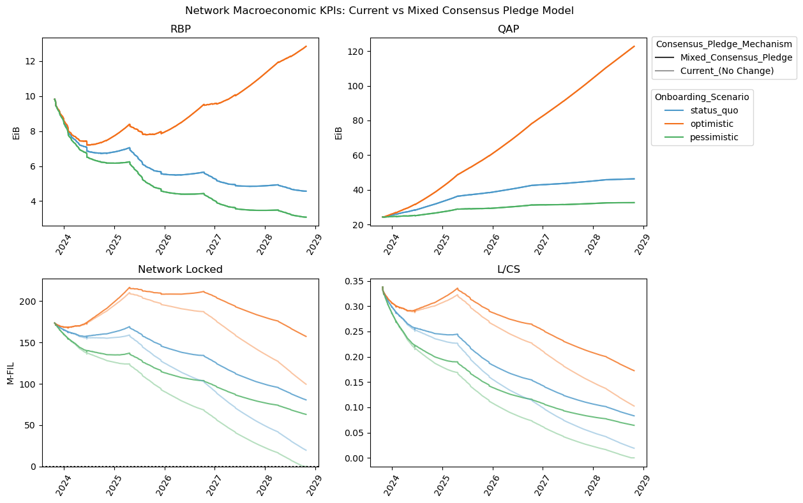

## Simple Summary
Factor the sector initial consensus pledge calculation into "simple" and "baseline" components,
following the factoring of block reward emissions.
This preserves a non-zero lower bound for the initial pledge as the baseline function grows exponentially.

## Abstract

The exponential baseline function in the denominator of the sector initial consensus pledge function eventually 
drives sector pledge requirements and total network collateral to zero, 
unless the network maintains an exponential rate of growth indefinitely. 
Tending toward zero network collateral would undermine both network consensus security and
circulating supply stability and hence SP operational returns. 
Decreasing pledge requirements with slow growth is a desirable property, but decreasing all the way to zero is not.

This proposal splits the sector initial consensus pledge function into two parts, following the two part minting model.
A “simple” 30% of the pledge requirement is independent of the baseline function, 
while “baseline” 70% retains the current calculation.
This results in sector initial consensus pledge requirements falling towards 30% of prior amounts,
instead of toward zero.

## Change Motivation
This sector initial pledge is intended to “incentivize the fulfillment of a sector's promised lifetime 
and provide sufficient network consensus security”.
It is divided into two parts:
- Storage pledge: provides collateral for some amount of potential penalties;
  depends only on share of projected block rewards and so decreases over time with the block reward decay.
- Consensus pledge: provides incentive alignment and consensus security;
  depends on share of circulating supply and the baseline function.

The consensus pledge makes up 95% of the sector initial pledge requirement today.
The network target is for approximately 30% of the circulating token supply to be locked in pledges,
apportioned by share of network QAP.

The per-sector value is calculated as
```
SectorInitialConsensusPledge = PledgeLockTarget * SectorQAP / max(NetworkBaseline, NetworkQAP)

PledgeLockTarget = 0.3 * CirculatingSupply
```
where `CirculatingSupply` is the minted+vested token supply less the amount locked in initial pledge, vesting rewards etc,
and `NetworkBaseline` is the baseline function that is an exponential, doubling every year.

The presence of the network baseline in the denominator is intended to reduce initial pledge requirements when
the network's QAP growth is slower than the baseline function,
thus increasing the potential returns to onboarding more QAP.
This reduction in pledge requirements is a desirable property.

However, because the network baseline function is an exponential, it eventually dominates the calculation.
As the denominator, it drives consensus pledge requirements (and thus total collateral locked on the network) to zero,
unless network QAP follows a similar or faster exponential.
Having no pledge collateral (or only the minimal level that would remain as sector storage pledge) 
securing the network is clearly not an outcome that was intended 
nor a property that is compatible with a secure network or stable token supply.
This situation would likely:
1. severely undermine network consensus security, which depends in large part on the economic stake of participants;
2. significantly expand the token circulating supply, impacting the exchange rate,
   storage provider operational returns, and token-holder behaviour.

In summary, the sector initial pledge construction has a desirable property of exponentially decreasing
as network QAP lags behind the baseline function,
but an undesirable property of tending network collateral to zero as the baseline function grows.
This proposal aims to maintain the desirable property of exponential pledge decrease but introduces
a reasonable lower bound on network collateral.

## Specification
Factor the per-sector initial consensus pledge into two parts: a 70% share which divides by the baseline function like today,
and a smaller 30% "simple" share which does not divide by the baseline function.

```
SectorInitialConsensusPledge = PledgeLockTarget * (0.3 * SectorSimpleShare + 0.7 * SectorBaselineShare) 

SectorSimpleShare = SectorQAP / NetworkQAP
SectorBaselineShare = SectorQAP / max(NetworkBaseline, NetworkQAP)
PledgeLockTarget = 0.3 * CirculatingSupply
```

Note that the implemented calculation should be re-arranged to defer division until the final operations,
to avoid loss of precision in rounding.

The practical effect of this is that the sector initial pledge calculation will not tend to zero
as the network baseline grows, 
but toward the SectorSimpleShare (30% of the pre-baseline-crossing total).
When/if the baseline function exceeds network QAP, the per-sector initial pledge value will still decrease exponentially,
but to this floor rather than toward zero.

## Design Rationale

The baseline function primarily exists to mediate the minting of rewards.
It sets a target for network power, and mints more block rewards as the target is approached.
If the baseline function exceeds the raw byte power, those rewards are deferred into the future to incentivize future growth.
The minting function splits the total block reward allocation 30/70 into "simple" and “baseline” minting,
where baseline minting is that part that depends on network growth.

This 30/70 split seems to have been forgotten in the pledge calculation.
A 30% floor provides a reasonable minimum level of minting despite an exponential halving due to baseline function growth.
Similarly, a 30% floor can provide a reasonable minimum level of initial consensus pledge.
The parameter value of 30% is motivated by matching the split in the minting function.

This reformulation will have no effect while network QAP exceeds the baseline.
When the baseline function exceeds and grows faster than QAP, initial pledge requirements will still decrease exponentially.
This preserves the desired property of rapidly improving per-sector returns and incentivizing more QAP growth.
However, instead of pledge requirements going to zero, they will approach a floor
at 30% of the counterfactual value they might have if the baseline function had not grown.
This mitigates the undesirable property of undermining network security and token supply stability.

### Alternatives
An alternative mitigation to these risks could be to change the baseline function structure or parameters
to reduce its exponential growth.
A change to the baseline function, while simple on the surface, has much larger and more difficult to predict impacts.
Adjusting the parameters of the baseline function would set a precedent for continuous future adjustments 
as technological progress and economic dynamics change.
Such constant economic adjustments are detrimental to both SP and token holders' ability to forecast their businesses.

## Backwards Compatibility

This proposal changes the calculation of the sector initial pledge,
which as implemented in the built-in actors forms part of the consensus rules.
It thus requires a network upgrade to take effect.

This proposal does not change any exported APIs or state schemas.

Parties that compute initial pledge requirements outside of the blockchain evaluation would need to update their calculations.
The results of those calculations will only differ from current state when the baseline function exceeds network QAP.

## Test Cases

To be provided with implementation.

## Security Considerations

One of the primary motivations for this proposal is to maintain that part of consensus security that is supported by pledge amounts.
Without this or a similar proposal, the consensus security provided by total network collateral will be eroded to near-zero 
unless the network’s QAP growth maintains an exponential increase.
Projections based on historical onboarding rate and SP behaviour suggest the network locked token amount would fall
to near zero over 4 to 5 years (or longer if onboarding rate continually increases).
The practical security value of locked tokens would deteriorate faster if an expanding supply also caused exchange rate deterioration.

This proposal introduces a floor to per-sector initial pledge requirements.
This in turn provides support for the network’s total locked token amount, 
and the ratio of locked tokens to the circulating supply.
This support is still far below current levels of locking, but high enough to provide more meaningful security.
Projections for this proposal indicate locked amounts falling toward one third of current values over 
the same 4 to 5 year period under moderate assumptions, and maintaining current values under optimistic growth assumptions.
The practical security value of this locking would be supported by a stable or improving exchange rate.



_Onboarding scenarios for the above Figure are based on historical onboarding trends over a 60-day lookback period.
The pessimistic and status_quo onboarding rates are 3.5 PiB/day and 5 PiB/day respectively.
The optimistic onboarding rate is initially 5.8 PiB/day, ramping up to 17 PiB/day over the 5 year simulation duration. 
For all scenarios, the Fil-Plus Rate and Renewal Rate are 91% and 52% respectively._

Note that per-sector pledge requirements will also tend toward zero even if the network does experience exponential growth in QAP,
because each sector’s share of pledge falls exponentially. 
However this situation implies a stable level of network total collateral as well as 
increasing hardware commitments, improving security. 
There are, however, many practical barriers to sustaining exponential growth, including in the Filecoin protocol design itself.
Sustained exponential growth requires continual technological improvements to secure exponentially more storage
with a constrained L1 consensus throughput.

The loss of some security is a tradeoff against decreasing pledge requirements to improve incentives for onboarding and growth.
The current protocol trades all pledge security for incentives;
this proposal preserves approximately one third of the security value under conservative growth assumptions.

## Incentive Considerations

The sector initial consensus pledge formula is designed to reduce pledge requirements 
when network QAP lags behind the exponentially growing baseline function.
This proposal preserves that general property, but moderates it so that consensus pledge requirements do not fall toward zero,
but a higher floor value.

With this proposal, initial pledge requirements still fall exponentially: quickly to start,
and then more slowly in absolute terms over time.
At current onboarding rates, the difference between locked token amounts with or without this proposal is
negligible over the first year, and increases over subsequent years until the “without” counterfactual reaches zero.
In the event that network growth does not increase, 
this proposal results in a higher eventual initial pledge requirement than the current protocol.
This means the raw FIL-on-FIL ROI incentive is bounded, rather than growing indefinitely.

For an incremental sector, the per-sector initial pledge value depends also on the network total QAP,
which determines the share of power the new sector represents.
A high network growth rate reduces per-sector initial pledge requirements (and also share of rewards) 
while also supporting the total locked amount. 
A low network growth rate requires each sector to take more of the pledge total (and also greater share of rewards).


The impact on sector ROI incentives of this proposal depends on SPs’ collective response to an incremental reduction in pledge requirements.
- If SPs respond strongly and network growth accelerates to keep pace with the baseline, 
  this proposal will have little to no impact on pledge or ROI (orange lines). 
  The difference between the status quo and proposed pledge calculation will be small.
  This proposal only matters if network growth lags, and only makes a difference in that case, too.
- If SPs do not respond strongly enough and network growth continues to lag, this proposal will have a larger impact
  by limiting the decrease in pledge (blue and green lines).

This is ultimately a trade-off between individual incentives, and network security and economic health.

### Activation timing
This proposal may be activated either before or after the baseline function has already crossed above network QAP.
So long as the duration between the crossing and this change activation is relatively short (a few months), 
the difference between the pledge requirements before or after the change will be small,
and the impact on consensus security negligible.

A delayed activation would lead to pledge requirements falling slightly faster than if the change were activated sooner.
The expectation of a subsequent increase in pledge requirements would create some incentive to onboard QAP sooner rather than later,
which would in turn push network QAP up closer to the baseline function and thus counteract the divergence.
In the short term, the incentives created by an expected small increase in pledge requirements are self-limiting.

## Product Considerations

A reduction in pledge requirements will improve FIL ROIs and may thus encourage more supply of storage for clients, at lower prices.
This proposal limits that reduction so that network pledge cannot fall to zero,
in order to preserve network economic security and more stable token exchange rates.

Both security and economic stability are also critical product features, though easily taken for granted.
This proposal limits reductions in pledge requirements in order to conserve these supporting attributes.
On-chain data indicates that a vast majority of deals are priced at zero in any case,
so the supply of storage is more than adequate to demand.

## Implementation

To be provided.

## TODO

- Implementation

## Copyright
Copyright and related rights waived via [CC0](https://creativecommons.org/publicdomain/zero/1.0/).
