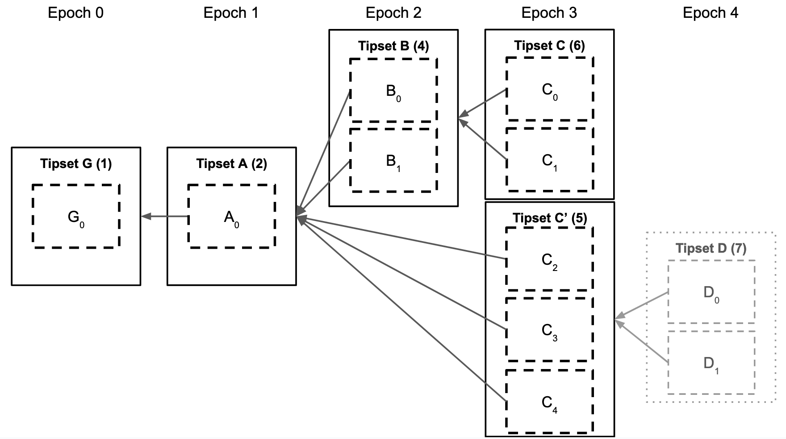
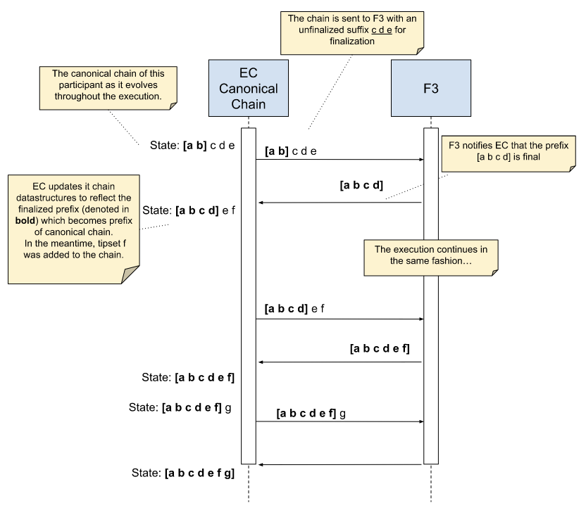
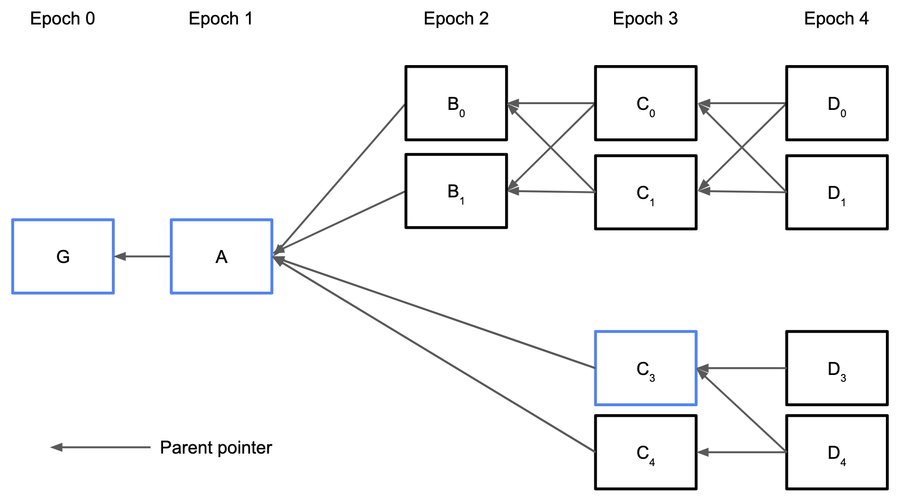

# Fast Finality in Filecoin

## Simple Summary

Filecoin clients currently consider blocks irreversible after 900 epochs, hindering applications requiring low latency. This FIP specifies Fast Finality in Filecoin (F3), extending the protocol with a new component that reduces finalization time from 7.5 hours to tens of seconds.


## Abstract

The current Filecoin consensus mechanism only provides probabilistic finality. To simplify client implementations and provide some form of determinism, the protocol also includes a soft finality threshold, whereby miners at round $N$ reject all blocks that fork off before $N-900$. This finalization delay of 900 epochs (7.5 hours) hinders user experience and limits applications built on Filecoin.

We specify a mechanism for fast finality with the F3 component. F3 is expected to finalize tipsets within tens of seconds during regular network operation, compared to the current 900-epoch finalization delay. It does so by leveraging GossiPBFT, an optimally resilient partially synchronous BFT consensus protocol, which runs in parallel with the current protocol, taking EC tipsets as input and providing finalized prefixes as output. The fork choice rule of EC is modified to ensure it never selects a chain other than the F3-finalized chain.


## Change Motivation

* The long time to finality on Filecoin mainnet restricts or severely affects applications built on Filecoin (e.g., IPC, Axelar, Wormhole, Glif, …).
* Even though applications on Filecoin can set a lower finalization time than the built-in 900 epochs, delayed finalization for important transactions will require tens of minutes with a longest-chain protocol like Filecoin's Expected Consensus (EC).
* Long finalization times also affect exchanges, by imposing a long confirmation period (often more than 1 hour) for users managing their FIL assets, and bridges, which face extended wait times for asset transfers.
* Bridging to other systems is not currently fast, safe, and verifiable.


## Specification


### Background

[Expected Consensus (EC)](https://spec.filecoin.io/algorithms/expected_consensus/) is the current mechanism by which participants in the Filecoin network reach an agreement on tipsets. A tipset is a set of blocks with the same epoch and the same set of parents. EC is a longest-chain protocol (more accurately, a heaviest-chain protocol) in which each participant independently builds the chain as it receives blocks from the network. Time is divided into slots of 30 seconds, called _epochs_. In each epoch, the protocol elects a set of network participants (i.e., storage providers) to become block proposers. Each proposer can construct a new block and broadcast it to the network. On reception, each participant appends the block to its local view of the blockchain. Each tipset has a _weight_ corresponding to the total number of blocks in the path between the genesis and the tipset (the actual weight function is slightly more complex in reality, but this approximation is sufficient for this document). An example blockchain data structure is shown below, indicating the weight of each tipset in parentheses.



Two or more tipsets of the same epoch with different parent tipsets (like tipsets $C$ and $C'$ above) form a _fork_ in the chain. Forks are resolved using a _fork choice rule_, a deterministic algorithm that, given a blockchain data structure, returns the heaviest tipset, called the _head_. We refer to the path from genesis to the head as the _canonical chain_. Participants may have different views of the blockchain, resulting in other canonical chains. For example, if a participant $p_1$ is not (yet) aware of tipset $D$, it would consider $C$ the heaviest tipset with the canonical chain $[G A B C]$. Another participant $p_2$ aware of tipset $D$ will consider $[G A C' D]$ to be the canonical chain. Once $p_1$ becomes aware of tipset $D$, it will update its canonical chain to $[G A C' D]$ - this is called _reorganization_. We say a tipset is _finalized_ when a reorganization involving that tipset is impossible, i.e., when a different path that does not contain the tipset cannot become the canonical chain.

In EC and, generally, longest-chain protocols, the probability of a path from some tipset $h$ to the genesis tipset becoming finalized increases with the number of descendant tipsets of $h$. This happens because the weight of the heaviest chain increases the fastest, as the tipsets with the most new blocks are appended to it (assuming that honest participants form a majority). In the particular case of EC, in each epoch, most created blocks are expected to come from honest participants and thus extend the heaviest chain. Consequently, it becomes progressively harder for a different path to overcome that weight. Over time, the probability of a tipset never undergoing a reorganization becomes high enough that the tipset is considered final for all practical purposes. In the Filecoin network, a tipset that is part of the heaviest chain is considered final after 900 epochs (or, equivalently, 7.5 hours) from its proposal.


### F3 Overview and Interaction with EC

We propose implementing fast finality in Filecoin by introducing an F3 component, which works alongside EC in Filecoin client nodes (participants).

The participants in F3 are the storage providers (SPs) of the Filecoin network. The participation of each SP is weighted according to its quality-adjusted power (QAP), which is a function of the storage power that the SP has committed to the network. This information is maintained in a built-in actor called the _power actor_ (f04). Only SPs that hold more than the threshold of power to participate in EC can participate in F3.

In short, each participant $p$ in the Filecoin network (i.e., a storage provider with power) runs F3 in a loop and feeds its input from EC. F3 returns a finalized prefix chain to EC, which updates the canonical chain to extend this F3-finalized prefix. More precisely, in each loop iteration $i$ (corresponding to the i-th instance of F3):

- **EC/F3 interface:** Participant $p$ feeds its current canonical chain $canonical$ and its previously F3-finalized chain, which we call the $baseChain$, to F3. The $baseChain$ defines the power table and seeds randomness used to configure the F3 instance, while $p$'s current canonical chain is the chain $p$ proposes to be finalized. Periodically, $p$ also feeds to F3 tipset updates from EC that extend $p$'s canonical chain as EC delivers these tipsets.
- **F3 consensus:** F3 establishes network-wide consensus on finalized tipsets and produces a _Proof of Finality (PoF)_ for a tipset finalized in instance $i$, $t_i$. Every _PoF_ output by F3 is signed by ≥ ⅔ of the total QAP, i.e., a super-majority of the power table vouching that honest participants with more than ⅓ QAP consider tipset $t_i$ final.
- **EC:** Participant $p$ updates its local EC chain and commits not to reorganize the finalized tipset $t_i$, i.e., the tipset must stay in $p$'s EC canonical chain for good. Apart from this change, EC continues operating as it currently does. In particular, EC still does a 900-epoch lookback for its power table and continues operating “normally” if F3 assumptions are violated and F3 halts, with the combined EC/F3 protocol favoring availability over consistency (in CAP theorem parlance).
- **F3 synchronization:** Participants disseminate information about finalized tipset $t_i$ and its proof $PoF_i$ to all other participants, light clients, and smart contracts. The main goal of F3 synchronization is to allow an external party (or a lagging F3 participant) to fetch a sequence of messages that prove the finality of some recent final tipset. The sequence demonstrates a chain of eligible participants deciding on a final tipset and, thus, the eligible power table for the next round. Verifying the finality of a tipset from genesis does not require validating the EC chain.



### F3 Adversarial Model

Honest participants follow the protocol at all times. Byzantine participants deviate arbitrarily from the protocol. Rational participants deviate from the protocol to pursue a greater (expected) pay-off according to their utility function. We consider a Byzantine adversary able to control and orchestrate up to less than ⅓ QAP.

We further adapt our protocols to align the actions of honest and rational participants by ensuring that rational participants never contribute to finalizing a chain they do not locally possess. Without this, If a participant $p$ were to finalize a chain it didn't have, then $p$ would not be able to mine in EC until it retrieved the required blocks and thus, in the meantime, could not obtain the cryptoeconomic rewards that EC offers. To this end, F3 provides _EC incentive compatibility_.

F3 and its implementation GossiPBFT provide additional robustness for strong adversaries that control more than ⅓ QAP, such as:

* Censorship resistance against a coalition of rational participants trying to leak power, without providing firm guarantees.
* Resilience to long-range attacks by an adversary controlling up to less than ⅔ QAP of any old power table.


### Best-effort Broadcast and Gossipsub

F3 uses GossipSub (like Filecoin EC) to disseminate protocol messages, implementing a broadcast channel among participants. We assume and model GossipSub to satisfy the following properties of the _best-effort broadcast primitive_ (denoted _BEBroadcast_ hereafter):

* If $p$ and $p'$ are honest, then every message broadcast by $p$ is eventually delivered by $p'$.
* No message with sender $p$ is delivered unless it was previously broadcast by $p$.


### Partially Synchronous Model and Δ-Synchrony

We say the system is $\Delta$-_synchronous_ if the combined computation and communication delay between any two honest participants is smaller than $\Delta$. We assume that, under $\Delta$-synchrony, any message broadcast by an honest participant is delivered by every honest participant within a time bound of $\Delta$.

In practice, if GossipSub is used for _BEBroadcast_, $\Delta$ is effectively the assumed upper bound on GossipSub latency (e.g., a few seconds).

For termination, we assume a classical partially synchronous model with an unknown bound on communication delays among non-Byzantine participants.


### Properties of F3

F3 is not identical to classical consensus, however similar to it. In a nutshell, the reasons why EC and Filecoin should not rely on classical consensus properties (implemented by existing off-the-shelf BFT consensus protocol) for fast finality are twofold: EC incentive compatibility and resilience to Filecoin power leakage attacks in case of a strong adversary. 

With this in mind, the F3 component interface and properties are given below.

> **Interface and properties of F3 at participant p:**
>
> `F3.invoke (int i, chain canonical, chain baseChain)` **returns** (we say finalizes) `(int i, chain h, proof_of_finality PoF)`
>
> **Properties:**
>
> **Agreement.** If two honest participants finalize $(i,h,\ast)$ and $(i,h',\ast)$, then $h = h'$.
>
> **Validity.** If an honest participant finalizes $(i,h,\ast)$, then $h$ is a prefix of the canonical input chain of some honest participant $p'$ in instance $i$.
>
> **Proof of Finality.** If an honest participant finalizes $(i,h,PoF)$, then $PoF$ is signed by ⅔ QAP majority corresponding to the $\texttt{PowerTable}(baseChain)'$ input in instance $i$ of some honest participant $p'$.
>
> **Progress.** If the system is $\Delta$-synchronous, i.e.,
> * All honest participants can communicate within a known time bound $\Delta$, and
> * no honest participants invokes $\texttt{F3}(i, \ast, \ast)$ later than $\Delta$ after another participant invokes $\texttt{F3}(i, \ast, \ast)$,
>
> Let c be the heaviest common prefix of the inputs of all honest participants in instance $i$. Then, if an honest participant finalizes $(i,c',\ast)$, $c$ is a prefix of $c'$ with probability > 0.5.
>
> **Termination.** If the system is $\Delta$-synchronous, every call to F3 eventually returns with probability 1.
>
> **EC Incentive compatibility.** An honest participant never contributes to gathering ⅔ QAP (super-majority) of votes for a chain $c$ which its local EC instance did not already deliver unless it already observes evidence of such a super-majority for chain $c$.
>
> `F3.ECupdate (int i, chain c)`: Participant $p$ updates F3 instance $i$ with chain $c$, which its EC instance locally delivered (relevant to EC incentive compatibility)

We later show the specific estimate chosen for $\Delta$ to optimize termination (See [here](#Synchronization-of-Participants-in-the-Current-Instance)).


### Consensus Interface

The GossiPBFT consensus protocol is the main dependency of the F3. We will treat GossiPBFT as a black box here and defer the explanation of its internals to the [respective section](#GossiPBFT-Consensus) of this FIP. For now, it suffices to say that it is a Byzantine fault-tolerant consensus protocol that provides the typical properties of (1) agreement (no two honest participants decide differently), (2) validity (the decided value must pass a validity predicate), and (3) termination (every honest participant eventually decides).

We denote the invocation of a consensus instance from a participant as follows:

```
GossiPBFT(i, proposal, participants) → decision, PoF
```

A participant that invokes the $\texttt{GossiPBFT()}$ function starts a consensus instance identified by the sequence number $i$ and with an input value $proposal$. The $participants$ parameter is composed of the SPs that participate in this instance along with their respective individual weights (i.e., quality-adjusted power). The next section explains how the $participants$ are obtained from the power table. The invocation eventually returns a $decision$ value and a proof of finality $PoF$ that proves $decision$ is indeed the output of this consensus instance. In any invocation from F3, $decision$ is a finalized chain prefix in the form of a tipset. $PoF$ can be verified by using the $\texttt{Verify}()$ function that we explain below:

```
Verify(PoF, decision, participants) → boolean
```

This function uses the $PoF$ to verify that $decision$ was the output of some instance of consensus executed among the $participants$.


### Power Table and Consensus Participants

The _power table_ in the power actor maintains, among other things, the quality-adjusted power of each SP. Each tipset $t$ in the chain corresponds to a particular version of the power table denoted $\texttt{PowerTable}(t)$ that results from executing all messages in the chain from genesis to $t$. The participants of an instance of GossiPBFT are determined by the power table resulting from the tipset finalized by the previous instance. More rigorously, the input parameter $participants$ of an instance $i$ is obtained from $\texttt{PowerTable}(decision_{i-1})$, where $decision_{i-1}$ is the tipset output by instance $i-1$. If $i$ is the first consensus instance, $decision_{i-1}$ is the genesis tipset.

We assume that $\texttt{PowerTable}(t)$ ignores any unnecessary data in the power table and returns the set consisting of each participant's identity and weight.


### F3 Pseudocode

We now present the pseudocode of the F3 algorithm:

```
// finalizedTipsets is a list of records with tipset and PoF fields representing
// all finalized tipsets with their respective proof of finality.

// It is initialized with the genesis tipset by definition, which needs no proof.
finalizedTipsets[0].tipset ← genesis
finalizedTipsets[0].PoF ← nil

i ← 1
while True:
participants ← PowerTable(finalizedTipsets[i-1].tipset)
proposal ← ChainHead()
finalizedTipset, PoF ← GossiPBFT(i, proposal, participants)
  finalizedTipsets[i].tipset ← finalizedTipset
  finalizedTipsets[i].PoF ← PoF
  i ← i + 1
```

Each participant keeps track of the finalized tipsets and respective proofs of finality in a data structure named $finalizedTipsets$. It contains one $finalizedTipsets[i]$ entry per consensus instance where $finalizedTipsets[i].tipset$ and $finalizedTipsets[i].PoF$ denote, respectively, the tipset and PoF output by consensus instance $i$. A participant considers a tipset finalized if it is included in $finalizedTipsets$ or is an ancestor of some tipset included in $finalizedTipsets$.

The algorithm starts by initializing $finalizedTipsets[0]$ with the genesis tipset. This tipset is pre-defined as finalized and does not require a PoF. Then, in each iteration $i$ of the loop, it takes the following steps:

1. Obtain the set of participants of instance $i$ from the power table determined by the previously finalized tipset.
2. Call the $\texttt{ChainHead}()$ function that returns the head tipset of the locally observed chain constructed by EC and sets the $proposal$ variable to the returned value. We assume that such a function is available to the finalizer.
3. Execute the instance $i$ of GossiPBFT consensus.
4. Add the returned tipset from the consensus execution to the $finalizedTipsets$ list.

To prevent useless instances of GossiPBFT deciding on the same $baseChain$ because of the lack of a new epoch that provides a new proposal, we make the $\texttt{ChainHead}()$ function blocking in that it does not return a proposal unless (i) the drand epoch value for the epoch immediately following the latest finalized tipset is received and (ii) the current chain head is different from the chain head of the finalized chain.


### Changes to EC: Fork Choice Rule

EC needs to be modified to accommodate the finalization of tipsets by F3. **This is the only change to EC this FIP introduces.**

The current EC fork-choice rule selects, from all the known tipsets, the tipset backed by the most weight. As the F3 component finalizes tipsets, the fork-choice rule must ensure that the heaviest finalized chain is always a prefix of the heaviest chain, preventing reorganizations of the already finalized chain.

We achieve this by adjusting the definition of weight for a finalized prefix: the heaviest finalized chain is the one that **matches exactly the tipsets finalized by F3**, in that a tipset $t'$ that is a superset of finalized tipset $t$ in the same epoch is not heavier than $t$ itself, despite it being backed by more EC power.

This redefinition of the heaviest chain is consistent with the abstract notion of the heaviest chain being backed by the most power because a finalized tipset has been backed by a super-majority of participants in GossiPBFT. In contrast, any non-finalized block in the same epoch is only backed in that epoch by the EC proposer.

We illustrate the updated rule in the following figure, where blocks in blue are finalized blocks, and all blocks are assumed to be proposed by a proposer holding only one EC ticket (the weight of a chain is the number of blocks):



The current EC fork-choice rule would select the tipset $\lbrace D_0, D_1\rbrace$ as the head of the heaviest chain. However, the heaviest finalized tipset is $\lbrace C_3\rbrace$, which is not an ancestor of $\lbrace D_0, D_1\rbrace$. Therefore, the new fork choice rule selects $\lbrace D_3\rbrace$ as the head of the heaviest chain. The reason why $D_4$ is not selected is that its parent tipset does not exactly match the finalized tipset $\lbrace C_3\rbrace$, but a superset of it, i.e. $\lbrace C_3, C_4\rbrace$.


### Bootstrapping

Integrating F3 into Filecoin follows the usual path for Filecoin upgrades. One epoch, $upgradeEpoch$, will be defined as the target epoch upon which participants upgrade Filecoin. Then, every participant starts the first instance with the tipset at the $upgradeEpoch$ minus the 900-epoch lookback as the head tipset of the first $baseChain$, which is assumed by design to be common to all participants.


### GossiPBFT Consensus

This section provides the specification of GossiPBFT, the consensus protocol that is iteratively instantiated by the F3 loop and returns a decision (in the form of an F3-finalized chain) and a PoF per instance.

GossiPBFT is a Byzantine fault-tolerant consensus protocol that is resilient optimal, i.e., it tolerates up to less than ⅓ QAP being controlled by a Byzantine adversary. Each instance of the protocol has a known set of participants. Each participant inputs a proposal value, and the protocol outputs one of the input values as the final decision value. We emphasize _final_ because, unlike a longest-chain protocol, the output of GossiPBFT is permanent.

GossiPBFT was designed with the Filecoin network in mind and presents a set of features that make it desirable in that context:

* Participants can have different weights, which aligns with how storage providers have different amounts of storage committed to the network. A participant's weight in executing the protocol is proportional to their share of QAP.
* The protocol has optimal resilience, i.e., it tolerates a Byzantine adversary controlling up to less than ⅓ QAP.
* Unlike PBFT, HotStuff, Tendermint, and many other protocols in this space, GossiPBFT is a leaderless protocol. This property makes it resistant to denial of service attacks because no designated participant represents the weakest link.
* Low latency. During periods of synchrony and honest proposers, GossiPBFT will finish in three communication steps. We expect this to happen within tens of seconds.
* GossiPBFT has been tailored with Filecoin and open blockchains in mind, with strong resilience against censorship attacks and incentive compatibility for rational participants.
* GossiPBFT is tailored to using a broadcast communication primitive, GossipSub, which Filecoin already uses.
* GossipPBFT internal invariants, on which the protocol correctness is based, are very similar to those of the seminal PBFT protocol, making protocol correctness easier to establish.


#### Message format, signatures, and equivocation

Messages include the following fields: $\langle Sender, Signature, MsgType, Value, Instance, [Round, Evidence, Ticket] \rangle$. As $Round$, $Evidence$, and $Ticket$ are fields that not all message types require, when not required by a message type, their default value is used (i.e. $0$, $\texttt{AggregatedEvidence}(0, [] ECTipset \lbrace\rbrace, 0, 0, [] byte \lbrace\rbrace, [] byte \lbrace\rbrace)$, and $[] byte \lbrace\rbrace$, respectively). We refer to a _field_ of message $m$, with $m.field$:

```
type GossiPBFTMessage struct {
  // ID of the sender/signer of this message (a miner actor)
  Sender ActorID
  // BLS Signature
  Signature []bytes
  // Enumeration of QUALITY, PREPARE, COMMIT, CONVERGE, DECIDE
  MsgType int
  // Chain of tipsets proposed/voted for finalization in this instance.
  // Non-empty: the first entry is the base tipset finalized in instance-1
  Value []ECTipset
  // GossiPBFT instance number
  Instance int
  // GossiPBFT round for this message
  Round int
  // Aggregated GossiPBFTMessages that justify this message
  Evidence AggregatedEvidence
  // GossiPBFT ticket (only for CONVERGE)
  Ticket []byte
}

type ECTipset struct {
  Epoch int
  Tipset CID // Or TipsetKey (concat of block header CIDs)
  Weight BigInt
  PowerTable CID // CID of a PowerTable
}

// Table of nodes with power >0 and their public keys.
// This is expected to be calculated from the EC chain state and provided to GossiPBFT.
// In descending order to provide unique representation.
type PowerTable {
  Entries []PowerTableEntry
}

type PowerTableEntry {
  ParticipantID ActorID
  Power BigInt
  Key BLSPublicKey
}

// Aggregated list of GossiPBFT messages with the same instance, round and value. Used as evidence for justification of messages
type AggregatedEvidence {
  // Enumeration of QUALITY, PREPARE, COMMIT, CONVERGE, DECIDE
  MsgType int
  // Chain of tipsets proposed/voted for finalisation in this instance.
  // Non-empty: the first entry is the base tipset finalised in instance-1
  Value []ECTipset
  // GossiPBFT instance number
  Instance int
  // GossiPBFT round
  Round int
  // Indexes in the base power table of the signers (bitset)
  Signers []bytes
  // BLS aggregate signature of signers
  Signature []bytes
}

```

All messages broadcast by a participant have their participant ID in the sender field and contain a digital signature by that participant $(m.Signature)$ over $(Instance || MsgType || Value || Round)$. The protocol assumes aggregatable signatures (e.g., BLS, Schnorr), resilient to [rogue public key attacks](https://crypto.stanford.edu/~dabo/pubs/papers/BLSmultisig.html) (see [Boneh, Drijvers, and Neven](https://eprint.iacr.org/2018/483.pdf) construction).

The receiver of a message only considers messages with valid signatures and discards all other messages as invalid. We sometimes omit the sender IDs and signatures in further descriptions for better readability.

Two (or more) messages $m1$ and $m2$ are called _equivocating messages_ if $m1.Sender=m2.Sender \land m1.Instance=m2.Instance \land m1.Value ≠ m2.Value \land m1.MsgType=m2.MsgType \land \texttt(if applicable)\ m1.Round=m2.Round$. We call $m1.Sender$ an _equivocating sender_.

A set of messages $M$ that does not contain equivocating messages is called _clean_. Participants discard all equivocating messages when forming clean sets.


#### Predicates and functions used in the protocol

* `Power(p | P) ∈ [0, 1]`
    * Returns the relative QAP of participant $p$ (or set of participants $p$) in EC, defined by the power table corresponding to $baseChain$. The returned value is a fraction of the total QAP of all participants in the power table.
* `isPrefix(a,b)`
    * Returns $True$ if $a$ is a prefix of $b$. (Each chain is also a prefix of itself.)
* `StrongQuorum(prefix,M)`
    * Where $M$ is a clean set of messages of the same type and the same round.
    * Let $p$ be the set of participants who are senders of messages in $M$ such that their message contains a value with $prefix$ as a prefix. More precisely:
      ```
      Let P={p : ∃ m∈ M: m.sender=p AND isPrefix(prefix,m.value)}
      ```
      then the predicate returns $True$ iff $\texttt{Power}(P)>2/3$
* `HasStrongQuorumValue(M)`
    * Where $M$ is a clean set of messages of the same type and the same round
    * The predicate returns $True$ iff there is a value $v$, such that there is a set $p$ of participants who are senders of messages in $M$ such that their message value is exactly $v$ and $\texttt{Power}(P)>2/3$. More precisely:
      ```
      HasStrongQuorumValue(M) = ∃ v: Power({p : ∃ m∈ M: m.sender=p AND m.value=v})>2/3
      ```
* `StrongQuorumValue(M)`
    * Returns $v$ if $\texttt{HasStrongQuorumValue}(M)$ holds, $nil$ otherwise.
* `HasWeakQuorumValue(M)`
    * Where $M$ is a clean set of messages of the same type and the same round
    * The predicate returns True iff there is a value $v$, such that there is a set $p$ of participants who are senders of messages in $M$ such that their message value is exactly $v$ and $\texttt{Power}(P)>1/3$. More precisely:
      ```
      HasWeakQuorumValue(M) = ∃ v: Power({p : ∃ m∈ M: m.sender=p AND m.value=v})>1/3
      ```
* `WeakQuorumValue(M)`
    * Returns $v$ if $\texttt{HasWeakQuorumValue}(M)$ holds, $nil$ otherwise.
* `LowestTicketProposal(M)`
    * Let $M$ be a clean set of CONVERGE messages for the same round.
    * If $M = ∅$, the predicate returns $baseChain$.
    * If $M \ne ∅$, the predicate returns $m.value$, such that $m$ is the message in $M$ with the lowest ticket ($m.ticket$).
* `Aggregate(M)`
    * Where $M$ is a clean set of messages of the same type $T$, round $r$, and instance $i$, with $v=\texttt{StrongQuorumValue}(M)≠nil$.
      ```
      Let M' ← {m ∈ M : m.value = StrongQuorumValue(M)}
      ```
    * Returns a tuple $\langle participants, aggSig \rangle$ where $participants$ are all participants such that $m.sender ∈ M'$ (in some compact/compressed representation, i.e. a bitmask with optional run-length encoding) and $aggSig$ is an aggregate signature (BLS) across all of those participants on $(m.i||m.T||m.r||m.v)$ for some $m ∈ M'$.


#### GossiPBFT pseudocode (main algorithm)

We illustrate the pseudocode for GossiPBFT below, consisting of 3 steps per round (QUALITY/CONVERGE, PREPARE, COMMIT) and an additional step outside the round loop (DECIDE). The $Sender$, $Signature$, and $Instance$ fields are omitted from messages for better readability. See also the simplified [PlusCal/TLA+ specification](https://github.com/filecoin-project/tla-f3).

```
F3(inputChain, baseChain) returns (chain, PoF):

1:    round ← 0;
2:    decideSent ← False;
3:    proposal ← inputChain;  \* holds what the participant locally believes should be a decision
4:    timeout ← 2*Δ
5:    ECCompatibleChains ← all prefixes of proposal, not lighter than baseChain
6:    value ← proposal \* used to communicate the voted value to others (proposal or 丄)
7:    evidence ← nil   \* used to communicate optional evidence for the voted value

8:    while (not decideSent)  {
9:      if (round = 0)
10:       BEBroadcast <QUALITY, value>; trigger (timeout)
11:       collect a clean set M of valid QUALITY messages
          until StrongQuorum(proposal, M) OR timeout expires
12:       let C={prefix : IsPrefix(prefix,proposal) and StrongQuorum(prefix,M)}
13:       if (C = ∅)
14:         proposal ← baseChain \* no proposals of high-enough quality
15:       else
16:         proposal ← heaviest prefix ∈ C \* this becomes baseChain or sth heavier
17:       value ← proposal

18:     if (round > 0)     \* CONVERGE
19:       ticket ← VRF(Randomness(baseChain) || round)
20:       value ← proposal \* set local proposal as value in CONVERGE message
21:       BEBroadcast <CONVERGE, value, round, evidence, ticket>; trigger(timeout)
22:       collect a clean set M of valid CONVERGE msgs from this round
          until timeout expires
23:       value ← LowestTicketProposal(M)  \* leader election
24:       if value ∈ ECCompatibleChains   \* see also lines 54-57
25:         proposal ← value \* we sway proposal if the value is EC compatible
26:       else
27:         value ← 丄 \* vote for not deciding in this round

28:     BEBroadcast <PREPARE, value, round>; trigger(timeout)
29:     collect a clean set M of valid <PREPARE, proposal, round> msgs \* match PREPARE value against local proposal
        until Power(M) > ⅔ OR timeout expires
30:     if (Power(M)>⅔)  \* strong quorum of PREPAREs for local proposal
31:       value ← proposal \* vote for deciding proposal (COMMIT)
32:       evidence ← Aggregate(M) \* strong quorum of PREPAREs is evidence
33:     else
34:       value ← 丄 \* vote for not deciding in this round
35:       evidence ← nil

36:     BEBroadcast <COMMIT, value, evidence, round>; trigger(timeout)
37:     collect a clean set M of valid COMMIT messages from this round
        until (HasStrongQuorumValue(M) AND StrongQuorumValue(M) ≠ 丄)
          OR (timeout expires AND Power(M)>2/3)
38:     if (HasStrongQuorumValue(M) AND StrongQuorumValue(M) ≠ 丄)    \* decide
39:       BEBroadcast <DECIDE, StrongQuorumValue(M)>
40:       decideSent ← True
40:     if (∃ m ∈ M: m.value ≠ 丄) \* m.value was possibly decided by others
41:       proposal ← m.value; \* sway local proposal to possibly decided value
42:       evidence ← m.evidence \* strong PREPARE quorum is inherited evidence
43:     else \* no participant decided in this round
44:       evidence ← Aggregate(M) \* strong quorum of COMMITs for 丄 is evidence
45:     round ← round + 1;
46:     timeout ← updateTimeout(timeout, round)
47:   }  \*end while

48:   collect a clean set M of DECIDE messages
      until (HasStrongQuorumValue(M)) \* Collect a strong quorum of decide outside the round loop
49:   return (StrongQuorumValue(M), Aggregate(M))

50:   upon reception of clean set M of DECIDE messages such that HasWeakQuorumValue(M) and not decideSent
51:     decideSent ← True
52:     BEBroadcast <DECIDE, WeakQuorumValue(M)
53:     go to line 48.
```

Also, concurrently, we expect that the participant feeds to GossiPBFT chains that are incentive-compatible with EC. To this end, GossiPBFT has a separate invocation called $\texttt{ECUpdate}()$, which is called by an external process at a participant once EC delivers a $chain$ such that $inputChain$ is a prefix of $chain$ (i.e., EC at a participant delivers an extension of $inputChain$). This part is critical to ensuring the progress property in conjunction with lines 24-25.

```
ECupdate(chain):

54:   If (IsPrefix(proposal, chain))  \* sanity check
55:     ECCompatibleChains ← ECCompatibleChains ∪ all prefixes of chain, not lighter than baseChain
```

#### Valid messages and evidence

The $\texttt{Valid}()$ predicate (referred to in lines 11, 22, 29, 37, and 48) is defined below.

```
Valid(m):                                   | For a message m to be valid,

If m is not properly signed:                | m must be properly signed.
  return False
If m.step = QUALITY AND                     | A QUALITY message must
  NOT IsPrefix(baseChain, m.proposal)       | contain a proposal prefixed
    return False                            | with baseChain.
If m.step = CONVERGE AND                    | A CONVERGE message
  (m.ticket does not pass VRF validation    | must have a valid VRF ticket
    OR m.round = 0)                         | and round > 0.
      return False
If m.step ∈ {CONVERGE, COMMIT} AND          | CONVERGE, COMMIT
  NOT ValidEvidence(m)                      | must contain valid evidence.
    return False
return True
```

The $\texttt{ValidEvidence}()$ predicate is defined below. Note that QUALITY, PREPARE and DECIDE messages do not need evidence. In fact, DECIDE does not need any protocol-specific validation, since a weak quorum of DECIDE with the same value is required to trigger any  execution of the protocol.

```
ValidEvidence(m):

(m = <CONVERGE, value, round, evidence, ticket>         | valid CONVERGE
AND (∃ M: Power(M)>⅔ AND m.evidence=Aggregate(M)        | evidence is a strong quorum
  AND ((∀ m' ∈ M: m'.step = COMMIT AND m'.value = 丄)   | of COMMIT msgs for 丄
    OR (∀ m' ∈ M: m'.step = PREPARE AND                 | or PREPARE msgs for
      m'.value = m.value))                              | CONVERGE value
  AND (∀ m' ∈ M: m'.round = m.round-1)))                 | from previous round


OR (m = <COMMIT, value, round, evidence>                | valid COMMIT
  AND (∃ M: Power(M)>⅔ AND m.evidence=Aggregate(M)      | evidence is a strong quorum
    AND ∀ m' ∈ M: m'.step = PREPARE                     | of PREPARE messages
      AND ∀ m' ∈ M: m'.round = m.round                  | from the same round
        AND ∀ m' ∈ M: m'.value = m.value)               | for the same value, or
    OR (m.value = 丄))                                  | COMMIT is for 丄 with
                                                        | no evidence
```

### Evidence verification complexity
Note that during the validation of each CONVERGE and COMMIT message, two signatures need to be verified: (1) the signature of the message contents, produced by the sender of the message (first check above) and (2) the aggregate signature in $m.evidence$ ($\texttt{ValidEvidence}(m)$ above). The former can be verified using the sender's public key (stored in the power table). The latter, being an aggregated signature, requires aggregating public keys of all the participants whose signatures it combines. Notice that the evidence of each message can be signed by a different set of participants, which requires aggregating a linear number of public BLS keys (in system size) per evidence verification.

However, a participant only needs to verify the evidence once for each *unique* message (in terms of (step, round, value)) received. Moreover, verification can further be reduced to those messages a participant uses to make progress (such as advancing to the next step or deciding), ignoring the rest as they are not needed for progress. This reduces the number of evidence verifications in each step to at most one.

#### Randomness

An instance of GossiPBFT requires a seed σ that must be common among all participants due to the dependency on a VRF in the CONVERGE step. As only one random seed is required per GossiPBFT instance, and there is only one GossiPBFT instance per epoch (see below), the random seed for GossiPBFT can be sourced from drand's output for that epoch in EC.


### Synchronization of Participants in the Current Instance

GossiPBFT ensures termination provided that (i) all participants start the instance at most $\Delta$ apart, and (ii) the estimate on Δ is large enough for $\Delta$-synchrony in some round (either because of the real network delay recovering from asynchrony or because of the estimate increasing).

[Given prior tests performed on GossipSub](https://research.protocol.ai/publications/gossipsub-v1.1-evaluation-report/vyzovitis2020.pdf) (see also [here](https://gist.github.com/jsoares/9ce4c0ba6ebcfd2afa8f8993890e2d98)), we expect that almost all participants will reach sent messages within $Δ=3s$, with a huge majority receiving them even after $Δ=2s$. However, if several participants start the instance $Δ + ε$ after some other participants, termination is not guaranteed for the selected timeouts of $2*Δ$. Thus, we do not rely on an explicit synchrony bound for correctness. Instead, we (i) use drand as a beacon to synchronize participants within an instance and (ii) increase the estimate of Δ locally within an instance as rounds progress without decision.

The synchronization of participants is performed in the call to updateTimeout(timeout, round) (line 46), and works as follows:

* Participants start an instance with $Δ=2s$.
* If the first and second rounds fail to reach termination, participants start the 3rd round with $Δ=3s$.
* If 5 rounds fail to reach termination (rounds from 0 to 4), participants wait to receive the next drand epoch value to start round 5. This ensures that a potential ε delay between when participants started the instance is not carried over beyond round 4.
* If round 5 fails to reach a decision, participants set exponential timeout increase $Δ= 1.3*Δ$ for every failed round. This ensures termination even if the real network delay increases arbitrarily.

Additionally, as an optimization, participants could continue to the subsequent step once the execution of the current step has been determined, without waiting for the timeout. For example, if a participant receives QUALITY messages from all participants, it can proceed to the next step without waiting for the timeout. More generally, if the remaining valid messages to be received cannot change the execution of the step, regardless of the values contained in the messages, then a participant should continue to the next step.


### Synchronization of Participants across Instances

The $finalizedTipsets$ data structure is disseminated among the participants and other observers of the Filecoin network in the same manner as the chain itself. In particular, newly joined and temporarily disconnected participants and observers wishing to download and verify the chain can obtain the $finalizedTipsets$ data from other participants or observers.

To verify a finality decision, assuming prior knowledge of an already-final base, a client needs:

* The power table entries from the base
* A set of signed DECIDE messages for that base that agree on the same value, from distinct senders comprising more than ⅔ QAP in the base
* The public keys for those signers

A finality certificate brings them together.

```
type FinalityCertificate struct {
  // Instance, Value as for GossiPBFTMessage (DECIDE)
  Instance int
  Value []ECTipset
  // Indexes in the base power table of the certifiers (bitset)
  Signers []bytes
  // Aggregated signature of the certifiers
  Signature []bytes
  // Changes to the base power table implied by the certified tipset
  PowerTableDelta []PowerTableDelta
}

type PowerTableDelta struct {
  // Participant with changed power
  ParticipantID ActorID
  // Change in power from base (signed)
  PowerDelta BigInt
  // New signing key if relevant (else empty)
  SigningKey Key
}
```

A finality certificate is analogous to a full block in the EC block exchange protocol.


#### Exchange protocol

Like with EC block exchange, participants follow **a simple request/response protocol to provide a contiguous sequence of finality certificates**. Note that the sequence of certificates is traversed backward, matching block exchange. A finality certificate contains the tipset and the PoF of the tipset ($Signature$). PoFs may vary across participants, but all PoFs must be for the same tipset at the same instance number $i$.

```
type Request struct {
  // Highest GossiPBFT instance number, to fetch first.
  LastInstance int
  // Number of certificates to fetch backward from LastInstance, inclusive.
  Length int
}

type Response struct {
  // OK, or some error code
  Status int
  // Sequence of certificates, in reverse order, beginning last requested.
  Certificates []FinalityCertificate
}
```


#### Certificate verification

The client's algorithm to verify a finality certificate is roughly:

* Check that the instance number and base tipset follow from the previous certificate
* Load the power and public key for each sender from the base power table
* Verify that the sum of the power of signers exceeds ⅔ of the total power in the table
* Compute the _GossiPBFTMessage_ corresponding to a DECIDE by each sender
* Verify the BLS aggregate signature against the list of messages and keys

Further, a client prepares to verify the next finality certificate by:

* Recoding the decided tipset as the new base
* Applying power table deltas to the base power table

Certificate verification must bottom out in some genesis certificate, which is assumed to be trusted and does not need to be verified. The introduction of the F3 protocol will require such genesis to bootstrap the protocol, and this genesis state is also needed to root a certificate chain.


#### Power table deltas

**A verifier needs each signer's power and public key** (GossiPBFT also needs these for its execution). These are provided by the power table associated with each finalized tipset.

Assuming some genesis tipset with a known power table, a _GossiPBFTMessage_ can provide a commitment to (CID of) the resulting power table but doesn't provide the actual entries. A finality certificate includes these as a delta from the previous power table. A verifier can compute the power table for the subsequent certificate by applying these deltas to its base power table.

Note the power table deltas don't need to be signed. All DECIDE messages include a commitment to the CID of the resulting power table. Hence, a verifier only needs to confirm that the power table CID as a result of their computation matches that committed to by the signed messages. A finality certificate with incorrect power table deltas cannot be used as a base to verify subsequent instances.


#### Verification by Filecoin node (“fast catch-up”)

A new Filecoin validating node can listen to GossiPBFT gossip to learn about the current instance number. They can then issue exchange requests to other nodes to fetch (in parallel) the complete sequence of finality certificates back to their genesis. **These certificates can be verified without reference to the EC chain.**

At the same time, the node can sync the headers (and only the headers) of the EC chain and fetch a snapshot of the state at or before the last finalized epoch. They can then verify that:

* The EC block headers are correctly computed from their ancestors (except for the state root).
* The snapshot state root CID matches that in the block headers.
* The block headers are final.

This produces a fully trusted chain sync without revalidating the EC chain (which takes days) or fetching the message history. Today, many nodes simply trust that the snapshot they obtain is on the “right” chain; **this fast catch-up is, therefore, both faster and more secure (no eclipse) than revalidating the EC chain.**


#### Verification by light client

A light client can also verify the most recent finalized tipset without validating the EC chain execution. They can fetch just one epoch of block headers and a subset of the state tree to verify some specific state or produce a valid transaction against that state.


#### Verification by smart contract

The finality certificates can be submitted (in order) to a smart contract. The smart contract must maintain the power table of the last finalized tipset in its state.

A smart contract will never accept a finality certificate earlier than those it has already validated. It will be safe from long-range attacks as long as it is kept reasonably up-to-date with finality decisions as F3 progresses. Like a new client, a new smart contract must be carefully initialized to ensure it follows the right certificate chain.

Only one such smart contract is needed on a single blockchain execution environment, which can provide the resulting final tipset information to others.


## Design Rationale

Many possibilities were considered for faster finality. We justify the architecture of F3 as the best candidate to achieve fast finality in Filecoin by comparing it with other options:

* _Improvements to Filecoin's EC_: Longest chain protocols rely on the increasing probability over time that some state is consistent across all participants. In all existing implementations of longest-chain protocols, finalization thus incurs at least tens of minutes.
* _Best-effort finality gadgets_: Ethereum's approach to faster finality involves the introduction of a novel finality gadget. However, this finality gadget requires at least two epochs for finalization, translating to at least more than 30 seconds in Filecoin. In contrast, GossiPBFT can achieve sub-epoch finalization and is only limited by the network speed. Moreover, Ethereum's protocol is yet to be proven correct. In fact, multiple attacks have been described in the literature that show how an adversary can keep the system from ever finalizing blocks, even after fixes.
* _Sub-sample voting_: Avalanche's sub-sample voting copes with arbitrarily large groups of participants by repeatedly sub-sampling constant-size subsets. Unfortunately, Avalanche's strong network assumptions make the protocol vulnerable to an adversary exploiting network delays. Moreover, Avalanche ensures correctness against an adversary controlling at most ⅕ of participants, versus ⅓ targeted by GossiPBFT. Even when GossiPBFT becomes amenable to committees, for reasonable committees of 600 participants, GossiPBFT already tolerates Avalanche's ⅕ of total participants with significantly weaker network assumptions.
* _Replacing EC with BFT_: Replacing EC with a BFT protocol (like GossiPBFT) would imply a huge code refactoring, leading to more bugs and significantly more time to develop and productionize the Filecoin upgrade. Furthermore, the combination of EC and F3 is more redundant, ensuring that the system continues operating in the unlikely case that F3 halts.


## Backwards Compatibility

The implementation of F3 involves three main tasks:

1. Implementing GossiPBFT in a modular way (no changes to existing codebase).
2. Re-formulating the fork-choice rule to the heaviest suffix of the heaviest finalized chain.
3. Implementating the F3 component, which reads the EC chain and marks blocks as final locally.

Because of changes to the EC fork choice rule, this FIP requires a network upgrade to take effect.


## Test Cases

1. Unit tests
2. Test propagation times during network load to set an estimate on $\Delta$
   1. 3.5k participants sending messages of size >120B over GossipSub (and measure time to receive first, a strong quorum, and all messages).
   2. Same test but for DECIDE messages (which include the passive nodes, not just participants, in the corresponding GossipSub topic).
3. Protocol-specific tests:
   - Correctness tests (synchrony is assumed for tests unless stated otherwise):
     * Best case: all participants start with the same input.
       - Expected Behavior (EB): all participants decide in round 1.
     * No synchrony: all participants start with the same input but there is no synchrony at first (less than ⅔ QAP receive the QUALITY messages on time from the rest). Synchrony is restored only after QUALITY finishes.
       - EB: all participants decide $baseChain$.
     * No quality: participants holding <⅔ QAP start GossiPBFT with a chain $c$ and the rest with a chain $c'$, such that $c$ and $c'$ only share $baseChain$ as prefix.
       - EB: all participants decide $baseChain$.
     * Prefix quality: participants holding <⅔ QAP start GossiPBFT with a chain $c$ and the rest with a chain $c'$, such that $c$ and $c'$ share some prefix $c''$ that extends $baseChain$.
       - EB: all participants decide $c''$.
     *  <a id="three-partitions">Decision of different participants in different rounds</a>: three different partitions, $P$, $Q$, $T$ start with different input chains $c$, $c'$, $c''$, such that $c$ is a prefix of $c'$, and $c'$ of $c''$, respectively, (they strictly extend each other, none being baseChain). QAP of $Q$ >½, while that of $P$ and $T$ are equally split. There is no synchrony between $p$ and $T$ until the beginning of the second round.
       - EB: The first round results in participants in $P$ voting for $c$, the rest voting for $c'$ and deciding $c'$. At the start of the second round, once synchrony is restored, $P$ also decides $c'$.
     * Membership-change:
       - New participants (>⅓ QAP) join the power table and catch up to the latest instance.
         - EB: Successful catch-up to the currently executed instance and decision in this instance.
       - New participants (much less than ⅓ QAP) join the power table and catch up to the latest instance
         - EB: Successful catch-up to currently executed instance and decision in it. Make sure new participants catch up timely with the rest (as progress will happen while they catch up).
     * Significant network delays:
       - Participants holding ½ QAP start the instance 10 seconds after the other half.
         - EB: After round 5, participants are synchronized by drand and decide in this round.
       - All messages are delayed by 10 seconds.
         - EB: After some round >5, participants can decide.
     * Tests on message validity:
       - Invalid messages should be discarded; this includes:
         * Old/decided instance
         * Invalid ticket
         * Invalid signature
           - Also: signature by a non-participant according to the corresponding power table.
         * Invalid evidence
           - Evidence containing invalid signature
           - Evidence for a different message
           - Evidence insufficient by QAP according to the corresponding power table.
         * Invalid value
           - Value not extending the corresponding baseChain
           - Value not being acceptable (after QUALITY step)
   - Tests under faults:
     * Crashing:
       - <⅓ QAP does not send any message from the beginning; the rest share the same input.
         - EB: the common input is decided in the first round.
       - \>⅔ QAP send QUALITY messages for some chain $c$, while the rest for some chain $c'$ ($c$ and $c'$ only share $baseChain$ as common prefix). After sending QUALITY messages, participants that sent $c$ and that hold <⅓ QAP crash.
         - EB: $c$ is decided (participants that sent $c'$ swayed to $c$) in the first round.
       - Same setup as the test with [three different partitions](#three-partitions), but participants holding less than ⅓ QAP in Q crash after sending QUALITY. One more participant (still in total <⅓ QAP), holding the lowest ticket, crashes in the second round right after sending its CONVERGE.
         - EB: the chain voted by the crashed participant (i.e., $c'$) is decided.
     * Crash-recovery:
       - Repeat tests and their EB when, at a given moment, all participants crash and recover (can be done on smaller scales)
         - Make tests for crashes at different points of the protocol through fuzzing
     * Equivocating:
       - Three partitions, $F$ holding <⅓ QAP, $P$ and $Q$ holding the rest of QAP (with $P$ holding more QAP than $Q$). Participants in $P$ do not receive messages from $Q$ timely, and vice versa, in the first round. Participants in $F$ send QUALITY for $c$ to $P$ and QUALITY for $c'$ to _P'_. They do the same with PREPARE, PROPOSE, COMMIT. Synchrony is restored in round 2.
         - EB: in the first round, participants in $P$ decide $c$. Participants in $Q$ go to round 2, where they also decide $c$. Participants in $F$ are detected as equivocating by $p$ and $Q$ eventually.
       - Same setup as the test with [three different partitions](#three-partitions), but participants holding just less than ⅓ QAP in $Q$ equivocate after sending QUALITY by sending PREPARE and PROPOSE for $c$ to $P$ and for $c'$ to honest participants in $Q$ and $T$.
         - EB: honest participants in $Q$ and $T$ decide $c'$ in the first round. Once synchrony is restored in the second round, participants in $P$ decide $c'$ too (perhaps subject to the lower ticket being held by non-Byzantine).
       - Flooding messages for future instances/rounds
         - Participants holding <⅓ QAP keep sending QUALITY and PREPARE messages for future rounds/instances (as they do not require evidence), intending to flood memory.
           - EB: the system can handle buffering a large load of future messages.
       - Participants proposing chains that do not extend base chain (EB for all these is that these messages are discarded as the value is invalid):
         - Superset (chain proposed includes the $baseChain$ head tipset but not exactly the head tipset)
         - Subset (chain proposed contains a tipset included by the $baseChain$ head tipset but not exactly the head tipset)
         - Disjoint tipset
   - Non-liveness of GossiPBFT for 900 epochs or more. The setup for this is >⅓ QAP crash.
     - Expected behavior:
       - EC finalizes tipsets
       - Honest participants do not participate anymore to finalize anything  (handbrake)
4. Integration tests:
   - Test 0th instance: all participants start by assuming $baseChain$ is epoch number ($upgradeEpoch$ minus 900).
     - EB: F3 successfully bootstraps with a decision.
     - Test under Byzantine behavior (<⅓ QAP) and network delays.
   - Test upgrade: same as above, but perform a test in calibration (or simulated upgrade), not in isolation (as above).
   - F3 decides a chain in an instance that is not extended by the current EC chain
     - EB: All participants change their heaviest chain to extend the new finalized head tipset.
5. Performance tests (realistic but different geographical and weight distributions and number of participants):
   - Latency
   - Throughput
   - Practical limit on participation


## Security Considerations

The modifications proposed in this FIP have far-reaching implications for the security of the system. This FIP changes Filecoin at a fundamental level: from considering tipsets as final after some time to finalizing them after a quorum of participants reach an agreement. We list here the security considerations this modification entails.

* **Censorship.** F3 and GossiPBFT are designed with censorship resistance in mind. The updated fork choice rule means that an adversary controlling at least more than ⅓ QAP can try to perform a censorship attack if honest participants start an instance of GossiPBFT proposing at least two distinct inputs. While this attack is theoretically possible, it is notably hard to perform on F3 given the QUALITY step of GossiPBFT and other mitigation strategies specifically put in place to protect against this. We strongly believe that, even against a majority adversary, the mitigations designed will prevent such an attack.
* **Liveness.** Implementing F3 introduces the risk that an adversary controlling at least ⅓ QAP prevents termination of a GossiPBFT instance. In that case, the F3 component would halt, not finalizing any tipset anymore. At the same time, EC would still operate, outputting tipsets and considering them final after 900 epochs. The liveness of the system is thus not affected by attacks on the liveness of F3.
* **Safety.** Implementing F3 ensures the safety of finalized outputs during regular or even congested networks against a Byzantine adversary controlling less than ⅓ QAP. For stronger adversaries, F3 provides mitigations to prevent censorship attacks, as outlined above. If deemed necessary, the punishment and recovery from coalitions in the event of an attempted attack on safety can be explored in future FIPs. Note that safety is already significantly improved by F3 compared to the status quo: F3 provides safety of finalized outputs two orders of magnitude faster than the current estimate of 900 epochs during regular network operation.
* **Denial-of-service (DoS).** The implementation of the F3 preserves resistance against DoS attacks currently ensured by Filecoin, thanks to the fully leaderless nature of GossiPBFT and to the use of a VRF to self-assign tickets during the CONVERGE step.
* **Committees.** This FIP proposes to have all participants run all instances of GossiPBFT. While this ensures optimal resilience against a Byzantine adversary, it can render the system unusable if the number of participants grows too large. While we are still evaluating the maximum practical number of participants in F3, it is expected to be at least one order of magnitude greater than the current number of participants in Filecoin. This introduces an attack vector: if the scalability limit is 100,000 participants, a participant holding as little as 3% of the current QAP can perform a Sybil attack to render the system unusable, with the minimum QAP required per identity. As a result, the implementation should favor the messages of the more powerful participants if the number of participants grows too large. Given that favoring more powerful participants discriminates against the rest, affecting decentralization, amending F3 to use committees in the event of the number of participants exceeding the practical limit will be the topic of a future FIP, as well as the analysis of optimized message aggregation in the presence of self-selected committees.


## Incentive Considerations

Participating in GossiPBFT only entails verifying $O(n)$ and generating $O(1)$ signatures per participant. If not enough participants follow the protocol, the liveness of F3 will be affected. This means that the service offered is affected, but also that participants do not receive rewards from block proposals for the period in which they do not participate. Consequently, we do not believe additional incentives for participation are necessary, as the modifications in this FIP significantly improve the system and the additional computational and communication costs do not substantially alter the cost structure of running a Filecoin node.

Furthermore, incentivizing all messages and verification thereof is impossible: this would require consensus on which messages have been sent (which would entail even more messages, these new ones unverified). Nevertheless, subsequent FIPs can provide more incentives, such as rewarding participants whose signatures are listed in agreed-upon PoFs or slash/denylist participants who sign equivocating messages.


## Product Considerations

1. Applications built on FVM and IPC do not need to wait for 900 epochs and can instead benefit from fast finalization times within the order of tens of seconds.
2. Other applications built on Filecoin (e.g., Glif, Axelar, Wormhole, exchanges) can also provide fast finality and low latency without compromising security.
3. Safe, verifiable, fast bridging to other networks becomes possible.


## Implementation

We refer to the stand-alone implementation in a simulated environment in the [go-f3](https://github.com/filecoin-project/go-f3) repository. Work is ongoing on a reference lotus implementation (to be provided soon).


## TODO

- [ ] Complete benchmarking around message complexity and computational/networking requirements.
- [ ] Decide between implicit and explicit evidence, taking into account benchmark results.
- [ ] Finalize and incorporate the WIP [finality exchange protocol](https://docs.google.com/document/d/10i9tFremOSrZou9oO5A5wvu1uOy1lvFKbv8IsvoglR0/edit#heading=h.g8nngox3auow).
- [ ] Update and move proofs of correctness and other supplemental documentation into `resources`


## Copyright

Copyright and related rights waived via [CC0](https://creativecommons.org/publicdomain/zero/1.0/).
