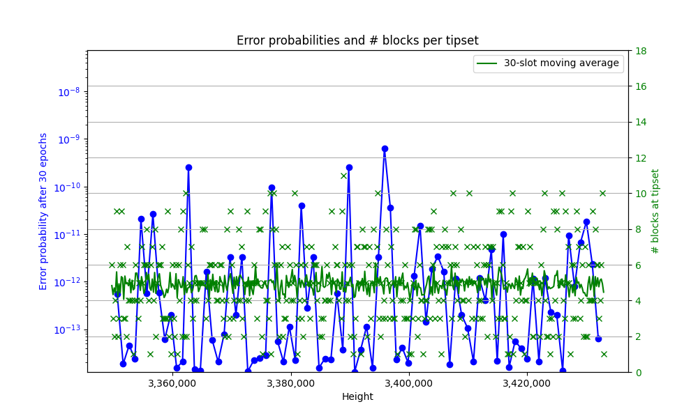
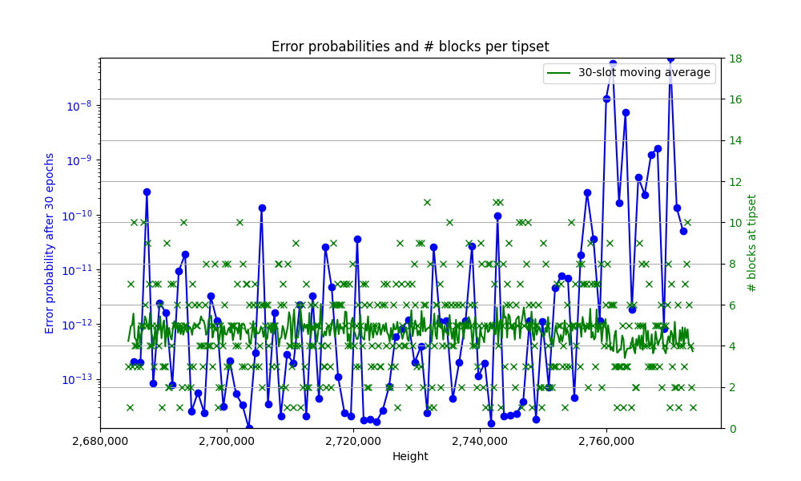

# FRC-XXXX: A Finality Calculator for Filecoin

## Simple Summary
<!--"If you can't explain it simply, you don't understand it well enough." Provide a simplified and layman-accessible explanation of the FIP.-->
Filecoin's Expected Consensus (EC) comes with probabilistic finality and a 900-epoch soft finality threshold. While network participants (e.g. exchanges, L2 operators, application developers) use different confirmation thresholds, they pessimistically wait between 100-900 epochs before considering a transaction final, leading to delays in the order of hours. Instead of naively counting the number of epochs, we propose a finality calculator that considers what takes place during those epochs and, under expected operating conditions, can attain the same level of certainty in fewer epochs. For example, consider two cases: in case A, the chain grew by 5 blocks per epoch over the last 50 epochs; in case B, the chain grew by a mere 2 blocks per epoch over the same 50 epochs. The probability of a chain reconfiguration longer than 50 epochs is much smaller in case A than in case B, allowing us to make a faster finality determination.

## Abstract
<!--A short (~200 words) description of the technical issue being addressed.-->
We embark on an analysis of Filecoin's finality, i.e., the probabilistic guarantees that a given tipset will always be in the canonical chain. The analysis involves distributed computing and stochastic arguments and provides upper bounds for the error probabilities, i.e., the probability that a reorg would override a given tipset. We use a dynamic evaluation that considers the chain's specific observed history. Unlike a static analysis that considers the worst-case conditions, we consider the worst-case conditions in the (unknown) future but do not consider the worst-case past. Instead, we use the observed chain to reason about the (known) past. 

The result is an algorithm that provides an upper bound on the error probabilities given a specific chain history. Several key applications of Filecoin currently use a 900-epoch (7.5 hours) settlement period to provide an intended finality guarantee of $2^{-30}$. Our analysis shows that, in real operating conditions, the same error probability  $2^{-30}$ can be achieved in ~30 epochs (15 minutes) -- a x30 improvement. This algorithm is practical and can be implemented by clients or off-chain applications without requiring any changes to the protocol.

## Change Motivation
<!--The motivation is critical for FIPs that want to change the Filecoin protocol. It should clearly explain why the existing protocol specification is inadequate to address the problem that the FIP solves. FIP submissions without sufficient motivation may be rejected outright.-->
The motivation for this proposal is twofold: 
- To provide theoretical finality guarantees grounded on clear formal arguments. 
- To reduce the delays experienced by Filecoin users.  

F3 will also address these points (with even faster finality). Nevertheless, this work does not conflict with F3 and independently provides several benefits:
1. It requires no change to client code and, therefore, no agreement process. Instead, it is a simple algorithm that any node can run separately from the "mining process". The algorithm takes as input the observed history of the chain and outputs a measure of safety.
2. It does not change the incentive considerations of Filecoin, which remains a longest-chain blockchain, similar to Bitcoin and Ethereum. Since no extra work is mandatory, the algorithm's execution (or no execution) does not affect the safety of Filecoin.
3. It is an algorithm and not a protocol. Its execution is local, and the result does not depend on other nodes executing the algorithm. For the same reason, it requires no additional communication and is infinitely scalable.
4. In case F3 halts and the network falls back on EC finality, it can reduce the degradation experienced by users.

Notably, (1) implies that our proposal can be an interim solution for Filecoin until F3 goes live on the network.

## Specification
<!--The technical specification should describe the syntax and semantics of any new feature. The specification should be detailed enough to allow competing, interoperable implementations for any current Filecoin implementations. -->
The analysis detailing how we bound the finality of a given input can be found [here](https://docs.google.com/document/d/1QpIpOLaabvieTrbgXzOSg3p1Z5SbNInGNqzBNFrCgXQ/edit#heading=h.c5olklehxrdn). Here, we will present the resulting mechanism with a practitioner focus.

In summary, we consider an observed addition of $k$ blocks on top of the target tipset produced at epoch $s$. We then look at:

1. Distant past: potential adversarial lead at epoch $s$, with respect to the local heaviest chain
2. Recent past: blocks produced by the adversary between epoch $s$ and the current epoch $c$
3. Future: potential lead created by the adversary after current epoch $c$, with respect to blocks produced by honest validators slowed by the adversary

We use the data from the three stages to determine the probability that the adversary will overtake the observed chain.

### Stage 1

```python
# Initialize an array to store Pr(Lf=k)
pr_Lf = [0] * (max_k_L + 1)

# Calculate Pr(Lf=k) for each value of k
for k in range(0, max_k_L + 1):
    sum_expected_adversarial_blocks_i = 0
    sum_chain_blocks_i = 0

    # Calculate Pr(Lf_i = k_i) for each epoch i, starting from epoch `s` under evaluation
    # and walking backwards to the last final tipset
    for i in range(target_epoch, current_epoch - 900, -1):
        sum_expected_adversarial_blocks_i += rate_malicious_blocks
        sum_chain_blocks_i -= chain[i - 1]
        # Poisson(k=k, lambda=sum_expected_adversarial_blocks_i, location=sum_chain_blocks_i)
        pr_Lf_i = ss.poisson.pmf(k, sum_expected_adversarial_blocks_i, sum_chain_blocks_i)
        # Take Pr(Lf=k) as the maximum over all i
        pr_Lf[k] = max(pr_Lf[k], pr_Lf_i)
    
    # Break if pr_Lf[k] becomes negligible
    if k > 1 and pr_Lf[k] < negligible_threshold and pr_Lf[k] < pr_Lf[k-1]:
        pr_Lf = pr_Lf[:(max_k_L:=k)+1]
        break

# As the adversarial lead is never negative, the missing probability is added to k=0
pr_Lf[0] += 1 - sum(pr_Lf)
```

### Stage 2

```python
# Initialize an array to store Pr(Bf=k)
pr_Bf = [0] * (max_k_B + 1)

# Calculate Pr(Bf=k) for each value of k
for k in range(0, max_k_B + 1):
    # Poisson(k=k, lambda=sum_expected_adversarial_blocks, location=0)
    pr_Bf[k] = ss.poisson.pmf(k, (current_epoch - target_epoch + 1) * rate_malicious_blocks, 0)

    # Break if pr_Bf[k] becomes negligible
    if k > 1 and pr_Bf[k] < negligible_threshold and pr_Bf[k] < pr_Bf[k-1]:
        pr_Bf = pr_Bf[:(max_k_B:=k)+1]
        break
```

### Stage 3

```python
# Calculate the probability Pr(H>0)
# Poisson (k=0, lambda=rate_honest_blocks, location=0)
Pr_H_gt_0 = 1 - ss.poisson.pmf(0, rate_honest_blocks, 0)

# Calculate E[Z]
exp_Z = 0.0
for k in range(0, (int) (4 * blocks_per_epoch)):  # Range stems from the distribution's moments
    # Poisson(k=k, lambda=rate_adv_blocks, location=0)
    pmf = ss.poisson.pmf(k, rate_malicious_blocks, 0)
    exp_Z += ((rate_honest_blocks + k) / (2 ** k)) * pmf

# Lower bound on the growth rate of the public chain
rate_public_chain = Pr_H_gt_0 * exp_Z

# Initialize an array to store Pr(Mf=k)
pr_Mf = [0] * (max_k_M + 1)

# Calculate Pr(Mf = k) for each value of k
for k in range(0, max_k_M + 1):
    # Calculate Pr(Mf_i = k) for each i and find the maximum
    for i in range(max_i_M, 0, -1):
        lambda_B_i = i * rate_malicious_blocks
        lambda_Z_i = i * rate_public_chain
        # Skellam(k=k, mu1=lambda_b_i, mu2=lambda_Z_i)
        prob_Mf_i = ss.skellam.pmf(k, lambda_B_i, lambda_Z_i)

        # Break if prob_Mf_i becomes negligible
        if prob_Mf_i < negligible_threshold and prob_Mf_i < pr_Mf[k]:
            break # Note: to be checked, but breaking here didn't change output in simulation

        # Take Pr(Mf=k) as the maximum over all i
        pr_Mf[k] = max(pr_Mf[k], prob_Mf_i)

    # Break if pr_Mf[k] becomes negligible
    if k > 1 and pr_Mf[k] < negligible_threshold and pr_Mf[k] < pr_Mf[k-1]:
        pr_Mf = pr_Mf[:(max_k_M:=k)+1]
        break

# pr_Mf[0] collects the probability of the adversary never catching up in the future.
pr_Mf[0] += 1 - sum(pr_Mf)
```

### Final calculation

```python
# Max k for which to calculate Pr(BAD)
# The sum of each max_k provides a strict upper bound, but one could pick a fraction.
max_k = max_k_L + max_k_B + max_k_M 

# Calculate cumulative sums for Lf, Bf, and Mf
cumsum_Lf = np.cumsum(pr_Lf)
cumsum_Bf = np.cumsum(pr_Bf)
cumsum_Mf = np.cumsum(pr_Mf)

# The observed chain has added weight equal to number of blocks since added
k = sum(chain[target_epoch:current_epoch])

# Calculate pr_error[k] for the observed added weight
# Performs a convolution over the step probability vectors
sum_Lf_ge_k = cumsum_Lf[-1]
if k > 0:
    sum_Lf_ge_k -= cumsum_Lf[min(k - 1, max_k_L)] 
double_sum = 0.0

for l in range(0, k):
    sum_Bf_ge_k_min_l = cumsum_Bf[-1] 
    if k - l - 1 > 0:  
        sum_Bf_ge_k_min_l -= cumsum_Bf[min(k - l - 1, max_k_B)]
    double_sum += pr_Lf[min(l, max_k_L)] * sum_Bf_ge_k_min_l

    for b in range(0, k - l):
        sum_Mf_ge_k_min_l_min_b = cumsum_Mf[-1] 
        if k - l - b - 1 > 0:
            sum_Mf_ge_k_min_l_min_b -= cumsum_Mf[min(k - l - b - 1, max_k_M)]
        double_sum += pr_Lf[min(l, max_k_L)] * pr_Bf[min(b, max_k_B)] * sum_Mf_ge_k_min_l_min_b

pr_error = sum_Lf_ge_k + double_sum

# Get the probability of the adversary overtaking the observed weight
# The conservative upper may exceed 1 in limit cases, so we cap the output.
return min(pr_error, 1.0)
```


## Backwards Compatibility
<!--All FIPs that introduce backwards incompatibilities must include a section describing these incompatibilities and their severity. The FIP must explain how the author proposes to deal with these incompatibilities. FIP submissions without a sufficient backwards compatibility treatise may be rejected outright.-->
There are no backward compatibility issues, as this FRC provides a recommendation to clients/applications with no change to the existing consensus mechanism or protocol. 

## Test Cases
<!--Test cases for an implementation are mandatory for FIPs affecting consensus changes. Other FIPs can choose to include links to test cases if applicable.-->
We have run our algorithm on past chain data from the Filecoin mainnet. The periods analyzed are heights 3,356,200 to 3,356,700, a typical healthy state, and heights 2,764,600 to 2,766,000, a less healthy period for Filecoin. The figures below show the results of quantifying the finality of tipsets after a 30-epoch delay. The potential adversarial power we considered is 30%. We note that one may choose other questions to analyze, such as when a specific tipset reaches a given finality threshold.

The figure below shows the results of applying the analysis to a typical healthy chain period, when tipsets are almost full (5 blocks) on average. On the $x$-axis we have the epoch numbers. We have a double $y$-axis: on the right axis, we have the number of blocks in tipsets (plotted in green, with the moving average in red), and on the left axis we have the error probabilities after 30 epochs (plotted in blue). It is mostly below $10^{-10}$, implying that a reorg of this tipset is a "once in 10,000 years" event. It is clear how a higher number of blocks per epoch typically results in better finality measurement (smaller error probability).



The figure below shows the results of applying the analysis on a period when the Filecoin blockchain was less healthy (around the end of March 2023). The tipsets show, on average, fewer blocks than expected --- often falling to below 4 blocks per tipset when averaged over 30 epochs. As expected, the finality measurement is worse than in the typical "good case"; that is, the error probabilities are higher by several orders of magnitude at times.


## Security Considerations
<!--All FIPs must contain a section that discusses the security implications/considerations relevant to the proposed change. Include information that might be important for security discussions, surfaces risks and can be used throughout the life cycle of the proposal. E.g. include security-relevant design decisions, concerns, important discussions, implementation-specific guidance and pitfalls, an outline of threats and risks and how they are being addressed. FIP submissions missing the "Security Considerations" section will be rejected. A FIP cannot proceed to status "Final" without a Security Considerations discussion deemed sufficient by the reviewers.-->
* From the network perspective, the proposed algorithm provides more transparency on the security guarantees Filecoin provides without impacting them. 
* From the client/user perspective, accepting a transaction as final after fewer epochs, while *prima facie* more risky, only equalizes the security level provided across different network conditions.
* It is possible to misuse the algorithm and accept an error probability that is too high while attempting to over-optimize for latency. This is akin to picking an insufficient number of epochs in the current paradigm, with the key difference that the error probability can be easily interpreted, whereas the impact of the number of epochs is opaque.

## Incentive Considerations
<!--All FIPs must contain a section that discusses the incentive implications/considerations relative to the proposed change. Include information that might be important for incentive discussion. A discussion on how the proposed change will incentivize reliable and useful storage is required. FIP submissions missing the "Incentive Considerations" section will be rejected. An FIP cannot proceed to status "Final" without a Incentive Considerations discussion deemed sufficient by the reviewers.-->
There are no substantive incentive considerations. 

## Product Considerations
<!--All FIPs must contain a section that discusses the product implications/considerations relative to the proposed change. Include information that might be important for product discussion. A discussion on how the proposed change will enable better storage-related goods and services to be developed on Filecoin. FIP submissions missing the "Product Considerations" section will be rejected. An FIP cannot proceed to status "Final" without a Product Considerations discussion deemed sufficient by the reviewers.-->
* Applications built on FVM (e.g., IPC) do not need to wait for 900 epochs and can benefit from faster finalization times, further tuned to their requirements.
* Other users of Filecoin (e.g., exchanges) can provide faster finality (e.g. on withdrawals) without compromising security.

## Implementation
<!--The implementations must be completed before any core FIP is given status "Final", but it need not be completed before the FIP is accepted. While there is merit to the approach of reaching consensus on the specification and rationale before writing code, the principle of "rough consensus and running code" is still useful when it comes to resolving many discussions of API details.-->
A Python prototype is available [here](https://github.com/consensus-shipyard/ec-finality-calculator). This implementation tries to translate the specification with minimal changes rather than optimize for performance. As an application-side optimization with no interoperability requirement, implementers in different clients and languages may freely diverge from the prototype. 

## TODO
<!--A section that lists any unresolved issues or tasks that are part of the FIP proposal. Examples of these include performing benchmarking to know gas fees, validate claims made in the FIP once the final implementation is ready, etc. A FIP can only move to a "Last Call" status once all these items have been resolved.-->
N/A

   
## Copyright
Copyright and related rights waived via [CC0](https://creativecommons.org/publicdomain/zero/1.0/).